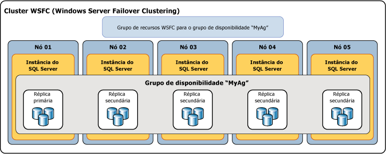

# Visão geral de Grupos de Disponibilidade AlwaysOn (SQL Server)
[!INCLUDE[appliesto-ss-xxxx-xxxx-xxx-md](../../../includes/appliesto-ss-xxxx-xxxx-xxx-md.md)]

 > Para obter o conteúdo relacionado a versões anteriores do SQL Server, consulte [Visão geral dos Grupos de Disponibilidade AlwaysOn (SQL Server)](https://msdn.microsoft.com/en-US/library/ff877884(SQL.120).aspx).

 Este tópico apresenta os conceitos do [!INCLUDE[ssHADR](../../../includes/sshadr-md.md)] que são centrais para configurar e gerenciar um ou mais grupos de disponibilidade no [!INCLUDE[ssCurrent](../../../includes/sscurrent-md.md)]. Para obter um resumo dos benefícios oferecidos pelos grupos de disponibilidade e uma visão geral da terminologia do [!INCLUDE[ssHADR](../../../includes/sshadr-md.md)], consulte [Grupos de Disponibilidade AlwaysOn &#40;SQL Server&#41;](../../../database-engine/availability-groups/windows/always-on-availability-groups-sql-server.md).  
  
 Um *grupo de disponibilidade* dá suporte a um ambiente replicado para um conjunto discreto de bancos de dados de usuário, conhecidos como *bancos de dados de disponibilidade*. Crie um grupo de disponibilidade para HA (alta disponibilidade) ou escala de leitura. Um grupo de disponibilidade HA é um grupo de bancos de dados que fazem failover juntos. Um grupo de disponibilidade de escala de leitura é um grupo de bancos de dados que são copiados para outras instâncias do SQL Server para carga de trabalho somente leitura. Um grupo de disponibilidade dá suporte a um conjunto de bancos de dados primários e de um a oito conjuntos de bancos de dados secundários correspondentes. Os bancos de dados secundários *não* são backups. Continue para fazer backup dos bancos de dados e de seus logs de transações regularmente.  
  
> [!TIP]  
>  Você pode criar qualquer tipo de backup de um banco de dados primário. Como alternativa, você pode criar backups de log e backups completos somente cópia dos bancos de dados secundários. Para obter mais informações, consulte [Secundárias ativas: backup em réplicas secundárias &#40;Grupos de Disponibilidade AlwaysOn&#41;](../../../database-engine/availability-groups/windows/active-secondaries-backup-on-secondary-replicas-always-on-availability-groups.md).   

 Cada conjunto de bancos de dados de disponibilidade é hospedado por uma *réplica de disponibilidade*. Existem dois tipos de réplicas de disponibilidade: uma *réplica primária*única. que hospeda os bancos de dados primários, e de uma a oito *réplicas secundárias*, cada uma hospedando um conjunto de bancos de dados secundários e atuando como destinos de failover em potencial para o grupo de disponibilidade. Um grupo de disponibilidade faz failover no nível de uma réplica de disponibilidade. Uma réplica de disponibilidade fornece redundância apenas no nível do banco de dados para o conjunto de bancos de dados em um grupo de disponibilidade. Os failovers não são provocados por problemas de banco de dados, como um banco de dados que se torna suspeito devido à perda de um arquivo de dados ou à corrupção de um log de transações.  
  
 A réplica primária torna os bancos de dados primários disponíveis para conexões de leitura-gravação de clientes. A réplica primária envia registros de log de transações de cada banco de dados primário para todos os bancos de dados secundários. Esse processo – conhecido como *sincronização de dados* – ocorre no nível do banco de dados. Cada réplica secundária armazena em cache os registros do log de transações (*intensifica* o log) e os aplica a seu banco de dados secundário correspondente. A sincronização de dados ocorre entre o banco de dados primário e cada banco de dados secundário conectado, independentemente de outros bancos de dados. Assim, um banco de dados secundário pode ser suspenso ou falhar sem que isso afete outros bancos de dados secundários, e um banco de dados primário pode ser suspenso ou falhar sem que isso afete outros bancos de dados primários.  
  
 Opcionalmente, você pode configurar uma ou mais réplicas secundárias para dar suporte a acesso somente leitura a bancos de dados secundários, e pode configurar qualquer réplica secundária para permitir backups em bancos de dados secundários.  

 O SQL Server 2017 introduziu duas arquiteturas diferentes para grupos de disponibilidade. Os *grupos de disponibilidade AlwaysOn* fornecem alta disponibilidade, recuperação de desastre e balanceamento de escala de leitura. Esses grupos de disponibilidade exigem um gerenciador de cluster. No Windows, o clustering de failover fornece o gerenciador de cluster. No Linux, você pode usar o Pacemaker. A outra arquitetura é um *grupo de disponibilidade de escala de leitura*. Um grupo de disponibilidade de escala de leitura fornece réplicas para cargas de trabalho somente leitura, mas não para alta disponibilidade. Em um grupo de disponibilidade de escala de leitura, não há nenhum gerenciador de cluster. 
 
 A implantação do [!INCLUDE[ssHADR](../../../includes/sshadr-md.md)] para HA no Windows exige um WSFC (Cluster de Failover do Windows Server). Cada réplica de disponibilidade de determinado grupo de disponibilidade deve residir em um nó diferente do mesmo WSFC. A única exceção é que, embora tenha sido migrado para outro cluster WSFC, um grupo de disponibilidade pode temporariamente abranger dois clusters. 

 >[!NOTE]
 >Para obter informações sobre grupos de disponibilidade no Linux, consulte [Grupo de disponibilidade AlwaysOn para o SQL Server no Linux ](../../../linux/sql-server-linux-availability-group-overview.md). 

 Em uma configuração de HA, uma função de cluster é criada para cada grupo de disponibilidade criado. O cluster WSFC monitora essa função para avaliar a integridade da réplica primária. O quorum para o [!INCLUDE[ssHADR](../../../includes/sshadr-md.md)] é baseado em todos os nós no cluster WSFC independentemente de se um determinado nó de cluster hospeda qualquer réplica de disponibilidade. Ao contrário do espelhamento do banco de dados, não há nenhuma função de testemunha no [!INCLUDE[ssHADR](../../../includes/sshadr-md.md)].  
  
> [!NOTE]  
>  Para obter informações sobre a relação dos componentes do SQL Server Always On com o cluster WSFC, consulte [Clustering de Failover do Windows Server &#40;WSFC&#41; com SQL Server](../../../sql-server/failover-clusters/windows/windows-server-failover-clustering-wsfc-with-sql-server.md).  
  
 A ilustração a seguir mostra um grupo de disponibilidade que contém uma réplica primária e quatro réplicas secundárias. Até oito réplicas secundárias têm suporte, incluindo uma réplica primária e duas réplicas secundárias de confirmação síncrona.  
  
   
  
##   Availability Databases  
 Para adicionar um banco de dados a um grupo de disponibilidade, o banco de dados deve estar online, banco de dados de leitura/gravação que existe na instância do servidor que hospeda a réplica primária. Quando você adiciona um banco de dados, ele se une ao grupo de disponibilidade como um banco de dados primário, permanecendo disponível a clientes. Não existe nenhum banco de dados secundário correspondente até que os backups do novo banco de dados primário sejam restaurados na instância do servidor que hospeda a réplica secundária (usando RESTORE WITH NORECOVERY). O novo banco de dados secundário estará no estado RESTORING até que seja unido ao grupo de disponibilidade. Para obter mais informações, veja [Iniciar movimentação de dados em um banco de dados secundário &#40;SQL Server&#41;](../../../database-engine/availability-groups/windows/start-data-movement-on-an-always-on-secondary-database-sql-server.md).  
  
 A junção coloca o banco de dados secundário no estado ONLINE e inicia sincronização de dados com o banco de dados primário correspondente. *Sincronização de dados* é o processo pelo qual as alterações em um banco de dados primário são reproduzidas em um banco de dados secundário. A sincronização de dados envolve o envio pelo banco de dados primário dos registros do log de transações ao banco de dados secundário.  
  
> [!IMPORTANT]  
>  Um banco de dados de disponibilidade muitas vezes é chamado de *réplica de banco de dados* no [!INCLUDE[tsql](../../../includes/tsql-md.md)], no PowerShell e em nomes do SMO (SQL Server Management Objects). Por exemplo, o termo "réplica de banco de dados" é usado nos nomes das exibições de gerenciamento dinâmico AlwaysOn que retornam informações sobre bancos de dados de disponibilidade:  **sys.dm_hadr_database_replica_states** e **sys.dm_hadr_database_replica_cluster_states**. Porém, nos Manuais Online do SQL Server, o termo "réplica" normalmente refere-se a réplicas de disponibilidade. Por exemplo, "réplica primária" e "réplica secundária" sempre referem-se a réplicas de disponibilidade.  
  
##   Réplicas de Disponibilidade  
 Cada grupo de disponibilidade define um conjunto de dois ou mais parceiros de failover conhecidos como réplicas de disponibilidade. As*réplicas de disponibilidade* são componentes do grupo de disponibilidade. Cada réplica de disponibilidade hospeda uma cópia dos bancos de dados de disponibilidade no grupo de disponibilidade. Para um determinado grupo de disponibilidade, as réplicas de disponibilidade devem ser hospedadas por instâncias separadas do [!INCLUDE[ssNoVersion](../../../includes/ssnoversion-md.md)] que residem em nós diferentes de um cluster WSFC. Cada uma dessas instâncias de servidor deve estar habilitada para AlwaysOn.  
  
 Uma determinada instância pode hospedar apenas uma réplica de disponibilidade por grupo de disponibilidade. No entanto, cada instância pode ser usada para muitos grupos de disponibilidade. Uma determinada instância pode ser uma instância autônoma ou uma FCI (instância de cluster de failover) do [!INCLUDE[ssNoVersion](../../../includes/ssnoversion-md.md)] . Se você precisar de redundância em nível de servidor, use instâncias de cluster de failover.  
  
 Cada réplica de disponibilidade recebe uma função inicial, a *função primária* ou a *função secundária*, que são herdadas pelos bancos de dados de disponibilidade daquela réplica. A função de uma determinada réplica determina se ela hospeda bancos de dados de leitura/gravação ou bancos de dados somente leitura. Uma réplica, conhecida como a *réplica primária*, recebe a função primária e hospeda bancos de dados de leitura/gravação, que são conhecidos como *bancos de dados primários*. Pelo menos uma outra réplica, conhecida como uma *réplica secundária*, recebe a função secundária. Uma réplica secundária hospeda bancos de dados somente leitura, conhecidos como bancos de dados secundários.  
  
> [!NOTE]  
>  Quando a função de uma réplica de disponibilidade está indeterminada, como durante um failover, seus bancos de dados estão temporariamente em um estado NOT SYNCHRONIZING. A função dos bancos de dados é definida como RESOLVING até que a função da réplica de disponibilidade tenha sido resolvida. Se uma réplica de disponibilidade for resolvida para a função primária, seus bancos de dados se tornarão os bancos de dados primários. Se uma réplica de disponibilidade for resolvida para a função secundária, seus bancos de dados se tornarão os bancos de dados secundários.  
  
##   Modos de disponibilidade  
 O modo de disponibilidade é uma propriedade de cada réplica de disponibilidade. O modo de disponibilidade determina se a réplica primária espera para confirmar transações em um banco de dados até que uma determinada réplica secundária tenha gravado os registros do log de transações em disco (protegido o log). [!INCLUDE[ssHADR](../../../includes/sshadr-md.md)] dá suporte a dois modos de disponibilidade —*modo de confirmação assíncrona* e *modo de confirmação síncrona*.  
  
-   **Asynchronous-commit mode**  
  
     Uma réplica de disponibilidade que usa esse modo de disponibilidade é conhecida como uma*réplica da confirmação assíncrona*. No modo de confirmação assíncrona, a réplica primária confirma as transações sem esperar a confirmação de que uma réplica secundária de confirmação assíncrona protegeu o log. O modo de confirmação assíncrona minimiza a latência de transações nos bancos de dados secundários, mas permite que elas atrasem os bancos de dados primários, possibilitando a perda de dados.  
  
-   **Synchronous-commit mode**  
  
     Uma réplica de disponibilidade que usa esse modo de disponibilidade é conhecida como uma *réplica de confirmação síncrona*. No modo de confirmação síncrona, antes de confirmar transações, uma réplica primária de confirmação síncrona espera que uma réplica secundária de confirmação síncrona confirme que concluiu a proteção do log. O modo de confirmação síncrona garante que, quando um determinado banco de dados secundário é sincronizado com o banco de dados primário, as transações confirmadas sejam totalmente protegidas. Essa proteção ocorre às custas de latência de transação aumentada.  
  
 Para obter mais informações, consulte [Modos de disponibilidade &#40;Grupos de disponibilidade AlwaysOn&#41;](../../../database-engine/availability-groups/windows/availability-modes-always-on-availability-groups.md).  
  
##   Tipos de failover  
 Dentro do contexto de uma sessão entre a réplica primária e uma réplica secundária, as funções primárias e secundárias são potencialmente permutáveis em um processo conhecido como *failover*. Durante um failover, a réplica secundária de destino faz a transição para a função primária, tornando-se a nova réplica primária. A nova réplica primária coloca seus bancos de dados online como os bancos de dados primários, e os aplicativos cliente podem conectar-se a eles. Quando a réplica primária antiga está disponível, ela faz a transição para a função secundária, tornando-se uma réplica secundária. Os bancos de dados primários anteriores se tornam bancos de dados secundários e a sincronização de dados é retomada.  
  
 Existem três formulários de failover — automático, manual e forçado (com possível perda de dados). O formulário ou formulários de failover com suporte de uma determinada réplica secundária dependem de seu modo de disponibilidade, e, para o modo de confirmação síncrona, no modo de failover na réplica primária e na réplica secundária de destino, da seguinte forma.  
  
-   O modo de confirmação síncrona dá suporte a dois formulários de failover —*failover manual planejado* e *failover automático*, se a réplica secundária de destino estiver sincronizada atualmente com o avt1. O suporte para esses formulários de failover depende da configuração da *propriedade de modo de failover* nos parceiros de failover. Se o modo de failover for definido como "manual" na réplica primária ou secundária, apenas o failover manual terá suporte para aquela réplica secundária. Se o modo de failover for definido como "automático" nas réplicas primária e secundária, failover automático e manual terão suporte naquela réplica secundária.  
  
    -   **Failover manual planejado** (sem perda de dados)  
  
         Um failover manual ocorre depois que um administrador de banco de dados emite um comando de failover e faz com que uma réplica secundária sincronizada faça a transição para a função primária (com proteção de dados garantida) e a réplica primária faça a transição para a função secundária. Um failover manual exige que a réplica primária e a réplica secundária de destino estejam executando sob o modo de confirmação síncrona, e a réplica secundária já deve estar sincronizada.  
  
    -   **Failover automático** (sem perda de dados)  
  
         Um failover automático ocorre em resposta a uma falha que faz com que uma réplica secundária sincronizada faça a transição para a função primária (com proteção de dados garantida). Quando a réplica primária antiga se torna disponível, ela faz a transição para a função secundária. O failover automático exige que a réplica primária e a réplica secundária de destino estejam executando sob o modo de confirmação síncrona com o modo de failover definido como "Automático". Além disso, a réplica secundária já deve estar sincronizada, ter quorum de WSFC e atender às condições especificadas pela [política de failover flexível](../../../database-engine/availability-groups/windows/flexible-automatic-failover-policy-availability-group.md)do grupo de disponibilidade.  
  
        > [!IMPORTANT]  
        >  As FCIs (Instâncias de cluster de failover) do SQL Server não dão suporte ao failover automático por grupos de disponibilidade, de modo que qualquer réplica de disponibilidade que esteja hospedado por um FCI só pode ser configurada para failover manual.  
  
    > [!NOTE]  
    >  Observe que, se você emitir um comando de failover forçado em uma réplica secundária sincronizada, a réplica secundária se comportará da mesma maneira que um failover manual planejado.  
  
-   No modo de confirmação assíncrona, a única forma de failover é o failover manual forçado (com possível perda de dados), geralmente conhecido como *failover forçado*. O failover forçado é considerado uma forma de failover manual porque ele só pode ser iniciado manualmente. O failover forçado é uma opção de recuperação de desastres. Trata-se da única forma de failover possível quando a réplica secundária de destino não está sincronizada com a réplica primária.  
  
 Para obter mais informações, consulte [Failover e modos de failover &#40;grupos de disponibilidade AlwaysOn&#41;](../../../database-engine/availability-groups/windows/failover-and-failover-modes-always-on-availability-groups.md).  
  
##   Conexões cliente  
 Você pode fornecer conectividade de cliente à réplica primária de um determinado grupo de disponibilidade criando um ouvinte de grupo de disponibilidade. Um *ouvinte de grupo de disponibilidade* fornece um conjunto de recursos que é conectado a um determinado grupo de disponibilidade para direcionar conexões de cliente à réplica de disponibilidade apropriada.  
  
 Um ouvinte de grupo de disponibilidade é associado a um nome DNS exclusivo, que serve como um VNN (nome de rede virtual), um ou mais VIPs (endereços IP virtuais) e um número de porta TCP. Para obter mais informações, consulte [Ouvintes do grupo de disponibilidade, conectividade de cliente e failover de aplicativo &#40;SQL Server&#41;](../../../database-engine/availability-groups/windows/listeners-client-connectivity-application-failover.md).  
  
> [!TIP]  
>  Se um grupo de disponibilidade possuir apenas duas réplicas de disponibilidade e não estiver configurado para permitir acesso de leitura à réplica secundária, os clientes poderão se conectar à réplica usando uma [cadeia de conexão do espelhamento do banco de dados](../../../database-engine/database-mirroring/connect-clients-to-a-database-mirroring-session-sql-server.md). Essa abordagem pode ser temporariamente útil depois que você migrar um banco de dados do espelhamento de banco de dados para o [!INCLUDE[ssHADR](../../../includes/sshadr-md.md)]. Antes de adicionar mais réplicas secundárias, você precisará criar um ouvinte de grupo de disponibilidade para o grupo de disponibilidade e atualizar seus aplicativos para usarem o nome da rede do ouvinte.  
  
##   Réplicas secundárias ativas  
 [!INCLUDE[ssHADR](../../../includes/sshadr-md.md)] oferece suporte a réplicas secundárias ativas. Os recursos secundários ativos incluem suporte para:  
  
-   **Executando operações de backup em réplicas secundárias**  
  
     As réplicas secundárias dão suporte à execução de backups de log e [somente cópia](../../../database-engine/availability-groups/windows/active-secondaries-backup-on-secondary-replicas-always-on-availability-groups.md) de um banco de dados completo, arquivo ou grupo de arquivos. Você pode configurar o grupo de disponibilidade para especificar a preferência de onde os backups devem ser executados. É importante compreender que a preferência não é imposta pelo SQL Server e, portanto, não tem nenhum impacto em backups ad hoc. A interpretação dessa preferência depende da lógica, se houver, que você usa para o script de seus trabalhos de backup para cada um dos bancos de dados em um determinado grupo de disponibilidade. Para uma réplica de disponibilidade individual, você pode especificar suas prioridades para executar backups nesta réplica em relação às outras réplicas no mesmo grupo de disponibilidade. Para obter mais informações, consulte [Secundárias ativas: backup em réplicas secundárias &#40;Grupos de Disponibilidade AlwaysOn&#41;](../../../database-engine/availability-groups/windows/active-secondaries-backup-on-secondary-replicas-always-on-availability-groups.md).  
  
-   **O acesso somente leitura a uma ou mais réplicas secundárias (réplicas secundárias legíveis)**  
  
     Todas as réplicas de disponibilidade podem ser configuradas para permitir acesso somente leitura a seus bancos de dados locais ao executar a função secundária embora algumas operações não tenham suporte completo. Além disso, se você quiser impedir que cargas de trabalho somente leitura sejam executadas na réplica primária, poderá configurar as réplicas para permitir acesso somente de leitura/gravação ao serem executados sob a função primária. Para obter mais informações, consulte [Secundárias ativas: réplicas secundárias legíveis &#40;Grupos de Disponibilidade AlwaysOn&#41;](../../../database-engine/availability-groups/windows/active-secondaries-readable-secondary-replicas-always-on-availability-groups.md).  
  
     Se um grupo de disponibilidade tiver um ouvinte de grupo de disponibilidade e uma ou mais réplicas secundárias legíveis no momento, o [!INCLUDE[ssNoVersion](../../../includes/ssnoversion-md.md)] poderá rotear solicitações de conexão da intenção de leitura para um deles (*roteamento somente leitura*). Para obter mais informações, consulte [Ouvintes do grupo de disponibilidade, conectividade de cliente e failover de aplicativo &#40;SQL Server&#41;](../../../database-engine/availability-groups/windows/listeners-client-connectivity-application-failover.md).  
  
##   Período de tempo limite da sessão  
 O período de tempo limite da sessão é uma propriedade de réplica de disponibilidade que determina por quanto tempo a conexão com outra réplica de disponibilidade poderá permanecer inativa antes do fechamento da conexão. As réplicas primárias e secundárias executam ping uma da outra para sinalizar que ainda estão ativas. A recepção de um ping de outra réplica durante o período de tempo limite indica que a conexão ainda está aberta e que as instâncias do servidor estão se comunicando. Durante o recebimento de um ping, uma réplica de disponibilidade redefine seu contador de tempo limite de sessão nessa conexão.  
  
 O período de tempo limite da sessão impede qualquer réplica de esperar indefinidamente para receber um ping de outra réplica. Se nenhum ping for recebido da outra réplica dentro do período de tempo limite da sessão, ocorrerá o tempo limite da réplica. Sua conexão é fechada e a réplica de tempo limite entra no estado DISCONNECTED. Até mesmo se uma réplica desconectada estiver configurada para o modo de confirmação assíncrona, as transações não esperarão que a réplica se reconecte e seja sincronizada novamente.  
  
 O período de tempo limite da sessão padrão para cada réplica de disponibilidade é 10 segundos. Esse valor pode ser configurado pelo usuário com um mínimo de 5 segundos. Em geral, recomendamos que você mantenha o tempo limite em 10 segundos ou mais. Definir o valor como menos de 10 segundos cria a possibilidade de um sistema extremamente carregado declarando uma falsa falha.  
  
> [!NOTE]  
>  Na resolução da função, o período de tempo limite da sessão não se aplica, pois o ping não ocorre.  
  
##   Reparo automático de página  
 Cada réplica de disponibilidade tenta recuperar-se automaticamente de páginas corrompidas em um banco de dados local resolvendo determinados tipos de erros que impedem a leitura de uma página de dados. Se uma réplica secundária não puder ler uma página, a réplica solicitará uma cópia atualizada da página da réplica primária. Se a réplica primária não puder ler uma página, a réplica transmitirá uma solicitação de uma cópia atualizada para todas as réplicas secundárias e obterá a página da primeira a responder. Se essa solicitação tiver êxito, a página ilegível será substituída pela cópia. Isso normalmente resolve o erro.  
  
 Para obter mais informações, veja [Reparo automático de página &#40;Grupos de disponibilidade: espelhamento de banco de dados&#41;](../../../sql-server/failover-clusters/automatic-page-repair-availability-groups-database-mirroring.md).  
  
##   Tarefas relacionadas  
  
-   [Introdução aos Grupos de Disponibilidade AlwaysOn &#40;SQL Server&#41;](../../../database-engine/availability-groups/windows/getting-started-with-always-on-availability-groups-sql-server.md)  
  
##   Conteúdo relacionado  
  
-   **Blogs:**  
  
     [Série de aprendizado do AlwaysOn – HADRON: uso do pool de trabalho para bancos de dados habilitados para HADRON](http://blogs.msdn.com/b/psssql/archive/2012/05/17/Always%20On-hadron-learning-series-worker-pool-usage-for-hadron-enabled-databases.aspx)  
  
     [Blogs da equipe do AlwaysOn do SQL Server: o blog oficial da equipe do AlwaysOn do SQL Server](https://blogs.msdn.microsoft.com/sqlalwayson/)  
  
     [Blogs dos engenheiros do CSS SQL Server](http://blogs.msdn.com/b/psssql/)  
  
-   **Vídeos:**  
  
     [Microsoft SQL Server codinome “Denali” Série AlwaysOn, Parte 1: Introduzindo a próxima geração de solução de alta disponibilidade](http://channel9.msdn.com/Events/TechEd/NorthAmerica/2011/DBI302)  
  
     [Microsoft SQL Server codinome “Denali” Série AlwaysOn, Parte 2: Criando uma solução de alta disponibilidade de missão crítica usando AlwaysOn](http://channel9.msdn.com/Events/TechEd/NorthAmerica/2011/DBI404)  
  
-   **Whitepapers:**  
  
     [Guia de soluções AlwaysOn do Microsoft SQL Server para alta disponibilidade e recuperação de desastre](http://go.microsoft.com/fwlink/?LinkId=227600)  
  
     [White papers da Microsoft para SQL Server 2012](http://msdn.microsoft.com/library/hh403491.aspx)  
  
     [White papers da equipe de consultoria do cliente do SQL Server](http://sqlcat.com/)  
  
## Consulte Também  
 [Modos de disponibilidade &#40;Grupos de disponibilidade AlwaysOn&#41;](../../../database-engine/availability-groups/windows/availability-modes-always-on-availability-groups.md)   
 [Failover e modos de failover &#40;Grupos de Disponibilidade AlwaysOn&#41;](../../../database-engine/availability-groups/windows/failover-and-failover-modes-always-on-availability-groups.md)   
 [Visão geral de instruções Transact-SQL para Grupos de Disponibilidade AlwaysOn &#40;SQL Server&#41;](../../../database-engine/availability-groups/windows/transact-sql-statements-for-always-on-availability-groups.md)   
 [Visão geral de cmdlets do PowerShell para Grupos de Disponibilidade AlwaysOn &#40;SQL Server&#41;](../../../database-engine/availability-groups/windows/overview-of-powershell-cmdlets-for-always-on-availability-groups-sql-server.md)   
 [Suporte de alta disponibilidade para bancos de dados OLTP in-memory](../../../relational-databases/in-memory-oltp/high-availability-support-for-in-memory-oltp-databases.md)   
 [Pré-requisitos, restrições e recomendações para grupos de disponibilidade AlwaysOn &#40;SQL Server&#41;](../../../database-engine/availability-groups/windows/prereqs-restrictions-recommendations-always-on-availability.md)   
 [Criação e configuração de grupos de disponibilidade &#40;SQL Server&#41;](../../../database-engine/availability-groups/windows/creation-and-configuration-of-availability-groups-sql-server.md)   
 [Secundárias ativas: réplicas secundárias legíveis &#40;Grupos de Disponibilidade AlwaysOn&#41;](../../../database-engine/availability-groups/windows/active-secondaries-readable-secondary-replicas-always-on-availability-groups.md)   
 [Secundárias ativas: backup em réplicas secundárias &#40;Grupos de Disponibilidade AlwaysOn&#41;](../../../database-engine/availability-groups/windows/active-secondaries-backup-on-secondary-replicas-always-on-availability-groups.md)   
 [Ouvintes do grupo de disponibilidade, conectividade de cliente e failover de aplicativo &#40;SQL Server&#41;](../../../database-engine/availability-groups/windows/listeners-client-connectivity-application-failover.md)  
  
   
