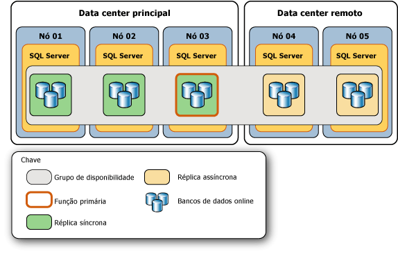
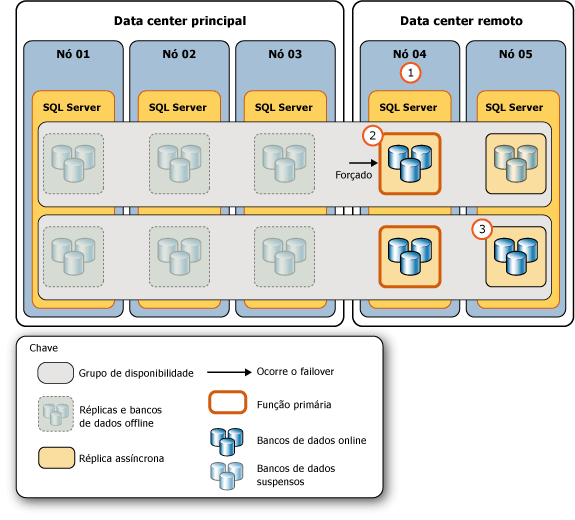
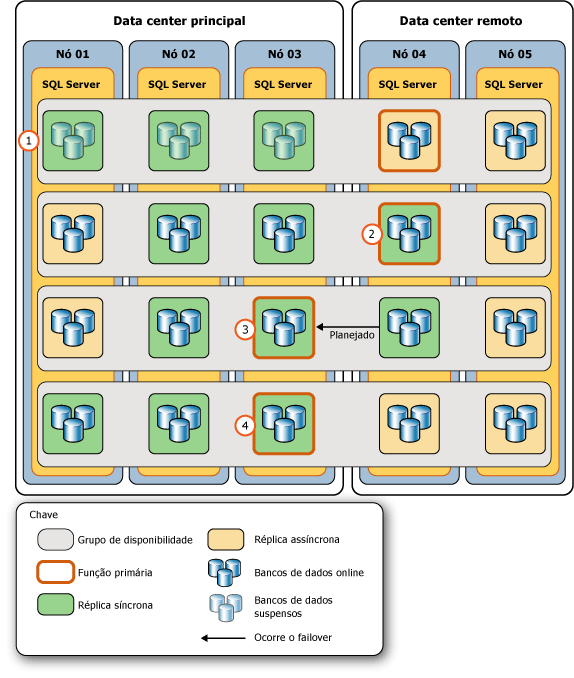

# <a name="perform-a-forced-manual-failover-of-an-availability-group-sql-server"></a>Executar um failover manual forçado de um grupo de disponibilidade (SQL Server)
[!INCLUDE[appliesto-ss-xxxx-xxxx-xxx-md](../../../includes/appliesto-ss-xxxx-xxxx-xxx-md.md)]
  Este tópico descreve como executar um failover forçado (com possível perda de dados) em um grupo de disponibilidade AlwaysOn usando o [!INCLUDE[ssManStudioFull](../../../includes/ssmanstudiofull-md.md)], o [!INCLUDE[tsql](../../../includes/tsql-md.md)]ou o PowerShell no [!INCLUDE[ssCurrent](../../../includes/sscurrent-md.md)]. Um failover forçado é uma forma de failover manual cujo objetivo é estritamente a recuperação de desastres, quando um [failover manual planejado](../../../database-engine/availability-groups/windows/perform-a-planned-manual-failover-of-an-availability-group-sql-server.md) não é possível. Se você forçar o failover em uma réplica secundária não sincronizada, talvez ocorra alguma perda de dados. Portanto, recomendamos veementemente que você só force o failover se for necessário restaurar o serviço imediatamente para o grupo de disponibilidade e se estiver disposto a correr o risco de perder dados.  
  
 Após um failover forçado, o destino de failover no qual o grupo de disponibilidade falhou se torna a nova réplica primária. Os bancos de dados secundários nas réplicas secundárias remanescentes são suspensos e devem ser retomados manualmente. Quando a antiga réplica primária ficar disponível, ela fará a transição para a função secundária, fazendo com que os antigos bancos de dados primários se tornem bancos de dados secundários e passem para o estado SUSPENDED. Antes de retomar um banco de dados secundário específico, você poderá recuperar dados dele que foram perdidos. Entretanto, observe que o truncamento do log de transações será atrasado em um determinado banco de dados primário enquanto qualquer um de seus bancos de dados secundários esteja suspenso.  
  
> [!IMPORTANT]  
>  A sincronização de dados com o banco de dados primário não ocorrerá até o banco de dados secundário for retomado. Para obter informações sobre a retomada de um banco de dados secundário, consulte [Acompanhamento: tarefas essenciais depois de um failover forçado](#FollowUp) posteriormente neste artigo.  
  
 A execução de um failover forçado é necessária nas seguintes situações de emergência:  
  
-   Depois de forçar o quórum no cluster WSFC (*quórum forçado*), é necessário forçar o failover em cada grupo de disponibilidade (com possível perda de dados). É necessário forçar o failover porque o estado real dos valores do cluster WSFC pode ter sido perdido. Porém, é possível evitar a perda de dados, caso você possa forçar o failover na instância de servidor que estava hospedando a réplica que era a réplica primária antes de forçar o quorum ou em uma réplica secundária que foi sincronizada antes de forçar o quorum. Para obter mais informações, consulte [Possíveis maneiras de evitar perda de dados após quorum forçado](#WaysToAvoidDataLoss)mais adiante neste tópico.  
  
    > [!IMPORTANT]  
    >  Se o quorum for recuperado naturalmente em vez de ser forçado, as réplicas de disponibilidade passarão pelo processo de recuperação normal. Se a réplica primária ainda não estiver disponível após o quorum ser recuperado, será possível executar um failover manual planejado em uma réplica secundária sincronizada.  
  
     Para obter mais informações sobre como forçar o quórum, consulte [Recuperação de desastres do WSFC por meio de quorum forçado &#40;SQL Server&#41;](../../../sql-server/failover-clusters/windows/wsfc-disaster-recovery-through-forced-quorum-sql-server.md). Para obter informações sobre por que é necessário forçar um failover após forçar o quórum, consulte [Failover e modos de failover &#40;grupos de disponibilidade AlwaysOn&#41;](../../../database-engine/availability-groups/windows/failover-and-failover-modes-always-on-availability-groups.md).  
  
-   Se a réplica primária ficar indisponível enquanto o cluster WSFC tiver um quorum íntegro, você poderá forçar o failover (com possível perda de dados) em qualquer réplica cuja função esteja no estado SECONDARY ou RESOLVING. Se possível, force o failover em uma réplica secundária de confirmação síncrona que foi sincronizada quando a réplica primária foi perdida.  
  
    > [!TIP]  
    >  Quando o cluster WSFC tiver um quorum íntegro, se você emitir um comando para forçar o failover em uma réplica secundária sincronizada, a réplica executará, na verdade, um failover manual planejado.  
  
> [!NOTE]  
>  Para obter mais informações sobre os pré-requisitos e as recomendações para forçar failover e para obter um cenário de exemplo que usa um failover forçado para se recuperar de uma falha catastrófica, consulte [Cenário de exemplo: usando um failover forçado para recuperar-se de uma falha catastrófica](../../../database-engine/availability-groups/windows/perform-a-forced-manual-failover-of-an-availability-group-sql-server.md#ExampleRecoveryFromCatastrophy), mais adiante nesse tópico.  
  
-   **Antes de começar:**  
  
     [Limitações e restrições](#Restrictions)  
  
     [Pré-requisitos](#Prerequisites)  
  
     [Recomendações](#Recommendations)  
  
     [Possíveis maneiras de evitar perda de dados após quorum forçado](#WaysToAvoidDataLoss)  
  
     [Segurança](#Security)  
  
-   **Para forçar o failover (com possível perda de dados) usando:**  
  
     [SQL Server Management Studio](#SSMSProcedure)  
  
     [Transact-SQL](#TsqlProcedure)  
  
     [PowerShell](#PowerShellProcedure)  
  
-   **Acompanhamento:** [tarefas essenciais depois de um failover forçado](#FollowUp)  
  
-   **Cenário de exemplo** [usando um failover forçado para recuperar-se de uma falha catastrófica](#ExampleRecoveryFromCatastrophy)  
  
-   [Tarefas relacionadas](#RelatedTasks)  
  
-   [Conteúdo relacionado](#RelatedContent)  
  
##  <a name="BeforeYouBegin"></a> Antes de começar  
  
###  <a name="Restrictions"></a> Limitações e restrições  
  
-   A única vez que você não pode executar um failover forçado é quando o cluster WSFC (Windows Server Failover Clustering) não tem quorum.  
  
-   A perda de dados é possível durante o failover forçado de um grupo de disponibilidade. Além disso, se a réplica primária estiver em execução quando você iniciar um failover forçado, os clientes ainda poderão ser conectados a bancos de dados primários antigos. Portanto, é altamente recomendável forçar failover apenas se a réplica primária não estiver mais em execução e se você estiver disposto a arriscar a perda de dados para restaurar o acesso aos bancos de dados no grupo de disponibilidade.  
  
-   Quando um banco de dados secundário estiver no estado REVERTING ou INITIALIZING, o failover forçado causará uma falha na inicialização do banco de dados como um banco de dados primário. Se o banco de dados estiver no estado INITIALIZING, você precisará aplicar os registros de log ausentes de um backup de banco de dados ou restaurar completamente o banco de dados a partir do zero. Se o banco de dados estiver no estado REVERTING, você precisará restaurar completamente o banco de dados dos backups.  
  
-   Um comando de failover é retornado assim que o destino de failover aceita o comando. No entanto, a recuperação de banco de dados ocorre de forma assíncrona depois que o grupo de disponibilidade terminar o failover.  
  
-   A consistência do banco de dados entre bancos de dados dentro do grupo de disponibilidade pode não ser mantida no failover.  
  
    > [!NOTE]  
    >  O suporte a transações distribuídas e bancos de dados varia de acordo com o SQL Server e versões do sistema operacional. Para obter mais informações, consulte [Transações entre bancos de dados e transações distribuídas para espelhamento de banco de dados e grupos de disponibilidade AlwaysOn &#40;SQL Server&#41;](../../../database-engine/availability-groups/windows/transactions-always-on-availability-and-database-mirroring.md).  
  
###  <a name="Prerequisites"></a> Pré-requisitos  
  
-   O cluster WSFC tem quorum. Se o cluster não tiver quórum, consulte [Recuperação de desastres do WSFC por meio de quorum forçado &#40;SQL Server&#41;](../../../sql-server/failover-clusters/windows/wsfc-disaster-recovery-through-forced-quorum-sql-server.md).  
  
-   É necessário poder se conectar a uma instância de servidor que hospede uma réplica cuja função esteja no estado SECONDARY ou RESOLVING.  
  
###  <a name="Recommendations"></a> Recomendações  
  
-   Não force o failover enquanto a réplica primária ainda estiver em execução.  
  
-   Se possível, force o failover somente em um destino de failover cujos bancos de dados secundários estejam no estado NOT SYNCHRONIZED, SYNCHRONIZED ou SYNCHRONIZING. Para obter informações sobre as implicações de forçar o failover quando um banco de dados secundário está no estado INTIAILIZGING ou REVERTING, consulte [Limitações e restrições](#Restrictions)anteriormente neste tópico.  
  
-   Normalmente, a latência de um determinado banco de dados secundário, relativo ao banco de dados primário, deve ser semelhante em réplicas secundárias de confirmação assíncrona diferentes. Porém, ao forçar failover, a perda de dados pode ser uma preocupação significativa. Portanto, dedique um tempo para determinar a latência relativa das cópias dos bancos de dados em diferentes réplicas secundárias. Para determinar qual cópia de um determinado banco de dados secundário tem a menor latência, compare os LSNs de fim de log delas. Um LSN de fim de log mais alto indica menos latência.  
  
    > [!TIP]  
    >  Para comparar LSNs de fim de log, conecte-se a cada réplica secundária online, uma de cada vez, e consulte [sys.dm_hadr_database_replica_states](../../../relational-databases/system-dynamic-management-views/sys-dm-hadr-database-replica-states-transact-sql.md) para obter o valor **end_of_log_lsn** de cada banco de dados secundário local. Em seguida, compare os LSNs de fim de log das diferentes cópias de cada banco de dados. Observe que bancos de dados diferentes podem ter seus LSNs mais altos em réplicas secundárias diferentes. Neste caso, o destino de failover mais apropriado depende da importância relativa que você coloca nos dados nos bancos de dados diferentes. Ou seja, para qual desses bancos de dados você mais desejaria minimizar a possível perda de dados?  
  
-   Se os clientes puderem conectar-se ao original primário, um failover forçado apresentará certo risco de comportamento de divisão de dados. Antes de forçar um failover, é altamente recomendável evitar que os clientes acessem a réplica primária original. Caso contrário, depois que o failover for forçado, os bancos de dados primários originais e o bancos de dados primários atuais poderão ser atualizados independentemente uns dos outros.  
  
###  <a name="WaysToAvoidDataLoss"></a> Possíveis maneiras de evitar perda de dados após quorum forçado  
 Em algumas condições de falha depois que o quorum é perdido, é possível evitar a perda de dados, como a seguir:  
  
-   **Se a réplica primária original ficar online**  
  
     Se o quorum for perdido e a ação de forçar o quorum WSFC restaurar o nó de cluster que hospeda a réplica primária de um grupo de disponibilidade, você poderá impedir a perda de dados para esse grupo de disponibilidade. Conecte-se à réplica primária e execute um failover forçado (FAILOVER_ALLOW_DATA_LOSS). Isso coloca a réplica primária novamente online. Como o failover forçado é executado na réplica primária original, não há perda de dados.  
  
-   **Se uma réplica secundária de confirmação síncrona sincronizada ficar online**  
  
     Se o quorum for perdido e a ação de forçar o quorum WSFC restaurar um nó de cluster que hospeda uma réplica secundária sincronizada de um grupo de disponibilidade, você deverá ser capaz de impedir a perda de dados para esse grupo de disponibilidade. Se o nó restaurado estava ativo no momento em que o quórum foi perdido, você pode determinar se a perda de dados pode ocorrer em determinado banco de dados consultando a coluna **is_failover_ready** da exibição de gerenciamento dinâmico [sys.dm_hadr_database_replica_cluster_states](../../../relational-databases/system-dynamic-management-views/sys-dm-hadr-database-replica-cluster-states-transact-sql.md) . Por exemplo, para uma instância de servidor nomeada `sql108w2k8r22`, emita a seguinte consulta:  
  
    ```  
    SELECT * FROM sys.dm_hadr_database_replica_cluster_states  
       WHERE replica_id=(SELECT replica_id FROM sys.availability_replicas   
          WHERE replica_server_name ='sql108w2k8r22')  
    ```  
  
    > [!CAUTION]  
    >  Se o nó restaurado não estava ativo no momento em que o quórum foi perdido, **is_failover_ready** talvez não reflita o estado real do cluster no momento em que a réplica primária ficou offline. Portanto, o valor **is_failover_ready** é adequado apenas para o nó do host no momento da falha. Para obter informações, consulte “Por que o failover forçado é necessário após um quórum forçado” em [Failover e modos de failover &#40;grupos de disponibilidade AlwaysOn&#41;](../../../database-engine/availability-groups/windows/failover-and-failover-modes-always-on-availability-groups.md).  
  
     Se **is_failover_ready** = 1, o banco de dados será marcado como sincronizado no cluster e estará pronto para um failover. Se **is_failover_ready** = 1 em cada banco de dados em determinada réplica secundária, você poderá executar um failover forçado (FORCE_FAILOVER_ALLOW_DATA_LOSS), sem perda de dados, nessa réplica secundária. A réplica secundária sincronizada entra online na função primária, ou seja, como a nova réplica primária, com todos os dados intactos.  
  
     Se **is_failover_ready** = 0, o banco de dados não será marcado como sincronizado no cluster e *não* estará pronto para um failover manual planejado. Se você forçar o failover na réplica secundária do host, os dados serão perdidos nesse banco de dados.  
  
    > [!NOTE]  
    >  Quando você forçar o failover em uma réplica secundária, a quantidade de perda de dados dependerá de quanto é o atraso do destino de failover subjacente à réplica primária. Infelizmente, quando o cluster WSFC não tem quorum ou o quorum foi forçado, não é possível avaliar a quantidade da potencial perda de dados. Entretanto, observe que, quando o cluster WSFC recuperar um quorum íntegro, será possível começar a controlar a potencial perda de dados. Para obter mais informações, consulte “Controlando a potencial perda de dados” em [Failover e modos de failover &#40;grupos de disponibilidade AlwaysOn&#41;](../../../database-engine/availability-groups/windows/failover-and-failover-modes-always-on-availability-groups.md).  
  
###  <a name="Security"></a> Segurança  
  
####  <a name="Permissions"></a> Permissões  
 Requer a permissão ALTER AVAILABILITY GROUP no grupo de disponibilidade, a permissão CONTROL AVAILABILITY GROUP, a permissão ALTER ANY AVAILABILITY GROUP ou a permissão CONTROL SERVER.  
  
##  <a name="SSMSProcedure"></a> Usando o SQL Server Management Studio  
 **Para forçar o failover (com possível perda de dados)**  
  
1.  No Pesquisador de Objetos, conecte-se a uma instância de servidor que hospede uma réplica cuja função esteja no estado SECONDARY ou RESOLVING no grupo de disponibilidade que precisa sofrer failover e expanda a árvore de servidores.  
  
2.  Expanda os nós **Alta Disponibilidade AlwaysOn** e **Grupos de Disponibilidade**.  
  
3.  Clique com o botão direito do mouse no grupo de disponibilidade do qual fazer failover e selecione o comando **Failover** .  
  
4.  Isso inicia o Assistente de Grupo de Disponibilidade de Failover. Para obter mais informações, consulte [Usar o Assistente de Grupo de Disponibilidade de Failover &#40;SQL Server Management Studio&#41;](../../../database-engine/availability-groups/windows/use-the-fail-over-availability-group-wizard-sql-server-management-studio.md).  
  
5.  Depois de forçar um failover do grupo de disponibilidade, conclua as etapas de acompanhamento necessárias. Para obter mais informações, consulte [Acompanhamento: tarefas essenciais depois de um failover forçado](#FollowUp), mais adiante neste tópico.  
  
##  <a name="TsqlProcedure"></a> Usando o Transact-SQL  
 **Para forçar o failover (com possível perda de dados)**  
  
1.  Conecte-se a uma instância de servidor que hospede uma réplica cuja função esteja no estado SECONDARY ou RESOLVING no grupo de disponibilidade que precisa passar por failover.  
  
2.  Use a instrução [ALTER AVAILABILITY GROUP](../../../t-sql/statements/alter-availability-group-transact-sql.md) , da seguinte maneira:  
  
     ALTER AVAILABILITY GROUP *group_name* FORCE_FAILOVER_ALLOW_DATA_LOSS  
  
     em que *group_name* é o nome do grupo de disponibilidade.  
  
     O exemplo a seguir força o grupo de disponibilidade `AccountsAG` a fazer failover na réplica secundária local.  
  
    ```  
    ALTER AVAILABILITY GROUP AccountsAG FORCE_FAILOVER_ALLOW_DATA_LOSS;  
    ```  
  
3.  Depois de forçar um failover do grupo de disponibilidade, conclua as etapas de acompanhamento necessárias. Para obter mais informações, consulte [Acompanhamento: tarefas essenciais depois de um failover forçado](#FollowUp), mais adiante neste tópico.  
  
##  <a name="PowerShellProcedure"></a> Usando o PowerShell  
 **Para forçar o failover (com possível perda de dados)**  
  
1.  Altere o diretório (**cd**) para uma instância de servidor que hospede uma réplica cuja função esteja no estado SECONDARY ou RESOLVING no grupo de disponibilidade que precisa passar por failover.  
  
2.  Use o cmdlet **Switch-SqlAvailabilityGroup** com o parâmetro **AllowDataLoss** de uma das seguintes formas:  
  
    -   **-AllowDataLoss**  
  
         Por padrão, o parâmetro **-AllowDataLoss** faz com que o **Switch-SqlAvailabilityGroup** avise a você que o failover forçado pode resultar na perda de transações não confirmadas e solicite uma confirmação. Para continuar, insira **Y**. Para cancelar a operação, insira **N**.  
  
         O exemplo a seguir executa um failover forçado (com possível perda de dados) do grupo de disponibilidade `MyAg` na réplica secundária na instância de servidor denominada `SecondaryServer\InstanceName`. Você será solicitado a confirmar essa operação.  
  
        ```  
        Switch-SqlAvailabilityGroup `  
           -Path SQLSERVER:\Sql\SecondaryServer\InstanceName\AvailabilityGroups\MyAg `  
           -AllowDataLoss  
        ```  
  
    -   **-AllowDataLoss-Force**  
  
         Para iniciar um failover forçado sem confirmação, especifique os parâmetros **-AllowDataLoss** e **-Force** . Isso será útil se você desejar incluir o comando em um script e executá-lo sem interação do usuário.  No entanto, use a opção **-Force** com cuidado, pois um failover forçado pode resultar na perda de dados dos bancos de dados que participam do grupo de disponibilidade.  
  
         O exemplo a seguir executa um failover forçado (com possível perda de dados) do grupo de disponibilidade `MyAg` na instância de servidor denominada `SecondaryServer\InstanceName`. A opção **-Force** suprime a confirmação dessa operação.  
  
        ```  
        Switch-SqlAvailabilityGroup `  
           -Path SQLSERVER:\Sql\SecondaryServer\InstanceName\AvailabilityGroups\MyAg `  
           -AllowDataLoss -Force  
        ```  
  
    > [!NOTE]  
    >  Para exibir a sintaxe de um cmdlet, use o cmdlet **Get-Help** no ambiente do [!INCLUDE[ssNoVersion](../../../includes/ssnoversion-md.md)] PowerShell. Para obter mais informações, consulte [Get Help SQL Server PowerShell](../../../relational-databases/scripting/get-help-sql-server-powershell.md).  
  
3.  Depois de forçar um failover do grupo de disponibilidade, conclua as etapas de acompanhamento necessárias. Para obter mais informações, consulte [Acompanhamento: tarefas essenciais depois de um failover forçado](#FollowUp), mais adiante neste tópico.  
  
 **Para configurar e usar o provedor do SQL Server PowerShell**  
  
-   [Provedor do SQL Server PowerShell](../../../relational-databases/scripting/sql-server-powershell-provider.md)  
  
##  <a name="FollowUp"></a> Acompanhamento: tarefas essenciais depois de um failover forçado  
  
1.  Depois de um failover forçado, a réplica secundária na qual foi feito o failover se torna a nova réplica primária. No entanto, para tornar essa réplica de disponibilidade acessível aos clientes, você pode precisar reconfigurar o quorum WSFC ou ajustar a configuração do modo de disponibilidade do grupo de disponibilidade, da seguinte maneira:  
  
    -   **Se o failover foi feito fora do [!INCLUDE[ssFosAuto](../../../includes/ssfosauto-md.md)]:**  ajuste os votos de quórum WSFC para refletir a configuração do novo grupo de disponibilidade. Se o nó WSFC, que hospeda a réplica secundária de destino, não tiver um voto de quorum WSFC, você poderá precisar forçar o quorum WSFC.  
  
        > [!NOTE]  
        >  Um [!INCLUDE[ssFosAuto](../../../includes/ssfosauto-md.md)] existirá apenas se duas réplicas de disponibilidade (inclusive a réplica primária anterior) estiverem configuradas para modo de confirmação síncrona com failover automático.  
  
         **Para ajustar votos de quorum**  
  
        -   [Exibir configurações de NodeWeight de quorum do cluster](../../../sql-server/failover-clusters/windows/view-cluster-quorum-nodeweight-settings.md)  
  
        -   [Definir configurações de NodeWeight de quorum do cluster](../../../sql-server/failover-clusters/windows/configure-cluster-quorum-nodeweight-settings.md)  
  
        -   [Forçar um cluster WSFC para iniciar sem um quorum](../../../sql-server/failover-clusters/windows/force-a-wsfc-cluster-to-start-without-a-quorum.md)  
  
    -   **Se você fez failover fora do [!INCLUDE[ssFosSync](../../../includes/ssfossync-md.md)]:** será recomendável considerar o ajuste do modo de disponibilidade e do modo de failover na nova réplica primária e nas réplicas secundárias restantes para refletir a confirmação síncrona desejada e a configuração de failover automático.  
  
        > [!NOTE]  
        >  Um [!INCLUDE[ssFosSync](../../../includes/ssfossync-md.md)] existirá somente se a réplica primária atual for configurada para modo de confirmação síncrona.  
  
         **Para alterar o modo de disponibilidade e o modo de failover**  
  
        -   [Alterar o modo de disponibilidade de uma réplica de disponibilidade &#40;SQL Server&#41;](../../../database-engine/availability-groups/windows/change-the-availability-mode-of-an-availability-replica-sql-server.md)  
  
        -   [Alterar o modo de failover de uma réplica de disponibilidade &#40;SQL Server&#41;](../../../database-engine/availability-groups/windows/change-the-failover-mode-of-an-availability-replica-sql-server.md)  
  
2.  Depois de um failover forçado, todos os bancos de dados secundários são suspensos. Isso inclui os antigos bancos de dados primários, depois que a antiga réplica primária ficar online novamente e descobrir que agora ela é uma réplica secundária. É necessário retomar manualmente cada banco de dados suspenso individualmente em cada réplica secundária.  
  
     Quando um banco de dados secundário é retomado, ele inicia a sincronização de dados com o banco de dados primário correspondente. O banco de dados secundário reverte os registros de log que nunca foram confirmados no novo banco de dados primário. Portanto, se você estiver preocupado com a possível perda de dados nos bancos de dados primários após o failover, tente criar um instantâneo do banco de dados nos bancos de dados suspensos em um dos bancos de dados secundários de confirmação síncrona.  
  
    > [!IMPORTANT]  
    >  O truncamento do log de transações será atrasado em um banco de dados primário enquanto qualquer um de seus bancos de dados secundários estiver suspenso. Além disso, a integridade da sincronização de uma réplica secundária de confirmação síncrona não poderá fazer a transição para HEALTHY enquanto qualquer banco de dados local permanecer suspenso.  
  
     **Para criar um instantâneo do banco de dados**  
  
    -   [Criar um instantâneo de banco de dados &#40;Transact-SQL&#41;](../../../relational-databases/databases/create-a-database-snapshot-transact-sql.md)  
  
     **Para retomar um banco de dados de disponibilidade**  
  
    -   [Retomar um banco de dados de disponibilidade &#40;SQL Server&#41;](../../../database-engine/availability-groups/windows/resume-an-availability-database-sql-server.md)  
  
    > [!CAUTION]  
    >  Antes de tentar um failover do grupo novamente, depois de retomar todos os bancos de dados secundários, espere que todos os bancos de dados secundários no próximo destino de failover entrem no estado SYNCHRONIZING. Se qualquer banco de dados ainda estiver no estado SYNCHRONIZING, esse banco de dados será impedido de entrar online como um banco de dados primário, e o restabelecimento da sincronização de dados para o banco de dados poderá exigir a restauração dos logs de transações, a restauração do backup completo do banco de dados ou o failover para a réplica primária anterior.  
  
3.  Se uma réplica de disponibilidade com falha não será retornada à réplica de disponibilidade ou retornará muito tarde para você atrasar o truncamento do log de transações no novo banco de dados primário, considere remover a réplica com falha do grupo de disponibilidade para evitar a falta de espaço em disco para seus arquivos de log.  
  
     **Para remover uma réplica secundária**  
  
    -   [Remover uma réplica secundária de um grupo de disponibilidade &#40;SQL Server&#41;](../../../database-engine/availability-groups/windows/remove-a-secondary-replica-from-an-availability-group-sql-server.md)  
  
4.  Se você seguir um failover forçado com um ou mais failovers forçados adicionais, execute um backup de log depois de cada failover forçado adicional na série. Para obter informações sobre a razão para isto, consulte "Riscos de forçar o failover" na seção "Failover manual forçado (com possível perda de dados)" de [Failover e modos de failover &#40;grupos de disponibilidade AlwaysOn&#41;](../../../database-engine/availability-groups/windows/failover-and-failover-modes-always-on-availability-groups.md).  
  
     **Para realizar um backup de log**  
  
    -   [Fazer backup de um log de transações &#40;SQL Server&#41;](../../../relational-databases/backup-restore/back-up-a-transaction-log-sql-server.md)  
  
##  <a name="ExampleRecoveryFromCatastrophy"></a> Cenário de exemplo: usando um failover forçado para recuperar-se de uma falha catastrófica  
 Se a réplica primária falhar e nenhuma réplica secundária sincronizada estiver disponível, forçar o grupo de disponibilidade a realizar failover poderá ser uma resposta apropriada. A conveniência de forçar um failover depende de: (1) se você espera que a réplica primária fique offline por mais tempo que seu SLA (acordo de nível de serviço) tolera e (2) se você está disposto correr o risco de uma potencial perda de dados para tornar bancos de dados primários disponíveis rapidamente. Se você decidir que um grupo de disponibilidade exige um failover forçado, o failover forçado real será apenas uma etapa de um processo de várias etapas.  
  
 Para ilustrar as etapas que são necessárias para usar um failover forçado para recuperar-se de uma falha catastrófica, este tópico apresenta um possível cenário de recuperação de desastres. O cenário de exemplo considera um grupo de disponibilidade cuja topologia original consiste em um data center principal que hospeda três réplicas de disponibilidade de confirmação síncrona, incluindo a réplica primária, e um data center remoto que hospeda duas réplicas secundárias de confirmação assíncrona. A figura a seguir ilustra a topologia original deste grupo de disponibilidade de exemplo. O grupo de disponibilidade está hospedado por um cluster WSFC de várias sub-redes com três nós no data center principal (**Nó 01**, **Nó 02**e **Nó 03**) e dois nós em um data center remoto (**Nó 04** e **Nó 05**).  
  
   
  
 O data center principal é desligado inesperadamente. Suas três réplicas de disponibilidade ficam offline e os seus bancos de dados ficam indisponíveis. A figura a seguir ilustra o impacto dessa falha na topologia do grupo de disponibilidade.  
  
   
  
 O DBA (administrador de banco de dados) determina que a melhor resposta possível é forçar o failover do grupo de disponibilidade para uma das réplicas secundárias de confirmação assíncrona remotas. Este exemplo ilustra as etapas típicas envolvidas quando você força o failover do grupo de disponibilidade para uma réplica remota e, consequentemente, retorna o grupo de disponibilidade a sua topologia original.  
  
 A resposta da falha apresentada aqui consiste nas duas fases a seguir:  
  
-   [Respondendo à falha catastrófica do data center principal](#FailureResponse)  
  
-   [Voltando o grupo de disponibilidade a sua topologia original](#ReturnToOrigTopology)  
  
###  <a name="FailureResponse"></a> Responding to the Catastrophic Failure of the Main Data Center  
 A figura a seguir ilustra a série de ações realizadas no data center remoto em resposta à falha catastrófica no data center principal.  
  
   
  
 As etapas nesta figura indicam as etapas a seguir:  
  
|Etapa|Ação|Links|  
|----------|------------|-----------|  
|**1.**|O DBA ou administrador da rede verifica se o cluster WSFC tem um quorum íntegro. Neste exemplo, o quorum precisa ser forçado.|[Configuração de modos de quorum WSFC e votação &#40;SQL Server&#41;](../../../sql-server/failover-clusters/windows/wsfc-quorum-modes-and-voting-configuration-sql-server.md)<br /><br /> [Recuperação de desastres do WSFC por meio de quorum forçado &#40;SQL Server&#41;](../../../sql-server/failover-clusters/windows/wsfc-disaster-recovery-through-forced-quorum-sql-server.md)|  
|**2.**|O DBA conecta-se à instância de servidor com a menor latência (no **Nó 04**) e executa um failover manual forçado. O failover forçado faz a transição desta réplica secundária para a função primária e suspende os bancos de dados secundários na réplica secundária restante (no **Nó 05**).|[sys.dm_hadr_database_replica_states &#40;Transact-SQL&#41;](../../../relational-databases/system-dynamic-management-views/sys-dm-hadr-database-replica-states-transact-sql.md) (Consulta a coluna **end_of_log_lsn** . Para obter mais informações, consulte [Recomendações](#Recommendations)anteriormente neste tópico.)|  
|**3.**|O DBA retoma manualmente cada banco de dados secundário na réplica secundária restante.|[Retomar um banco de dados de disponibilidade &#40;SQL Server&#41;](../../../database-engine/availability-groups/windows/resume-an-availability-database-sql-server.md)|  
  
###  <a name="ReturnToOrigTopology"></a> Voltando o grupo de disponibilidade a sua topologia original  
 A figura a seguir ilustra a série de ações que retornam o grupo de disponibilidade a sua topologia original depois que o data center principal volta a ficar online e os nós WSFC restabelecem comunicação com o cluster WSFC.  
  
> [!IMPORTANT]  
>  Se o quorum do cluster WSFC tiver sido forçado, quando os nós offline reiniciarem, eles poderão formar um novo quorum se as duas condições a seguir existirem: (a) não há nenhuma conectividade de rede entre qualquer nó no conjunto de quorum forçado e (b) os nós de reinicialização são a maioria dos nós de cluster. Isso resulta em uma condição de divisão de dados, na qual o grupo de disponibilidade teria duas réplicas primárias independentes, uma em cada data center. Antes de forçar o quórum para criar um conjunto de quórum minoritário, consulte [Recuperação de desastres do WSFC por meio de quorum forçado &#40;SQL Server&#41;](../../../sql-server/failover-clusters/windows/wsfc-disaster-recovery-through-forced-quorum-sql-server.md).  
  
   
  
 As etapas nesta figura indicam as etapas a seguir:  
  
||Etapa|Links|  
|-|----------|-----------|  
|**1.**|Os nós no data center principal ficam online novamente e restabelecem comunicação com o cluster WSFC. As réplicas de disponibilidade ficam online como réplicas secundárias com bancos de dados suspensos e o DBA precisará retomar manualmente cada desses bancos de dados em breve.|[Retomar um banco de dados de disponibilidade &#40;SQL Server&#41;](../../../database-engine/availability-groups/windows/resume-an-availability-database-sql-server.md)<br /><br /> Dica: se você estiver preocupado com a possível perda de dados nos bancos de dados primários após o failover, tente criar um instantâneo de banco de dados nos bancos de dados suspensos em um dos bancos de dados secundário de confirmação síncrona. Tenha em mente que o truncamento do log de transações é atrasado em um banco de dados primário enquanto qualquer um de seus bancos de dados secundários é suspenso. Além disso, a integridade da sincronização da réplica secundária de confirmação síncrona não poderá fazer a transição para HEALTHY enquanto qualquer banco de dados local permanecer suspenso.|  
|**2.**|Quando os bancos de dados forem retomados, o DBA alterará a nova réplica primária temporariamente para o modo de confirmação síncrona. Isso envolve duas etapas:<br /><br /> 1) Altere uma réplica de disponibilidade offline para o modo de confirmação assíncrona.<br /><br /> 2) Altere a nova réplica primária para o modo de confirmação síncrona. Observação: esta etapa permite que bancos de dados secundários de confirmação síncrona retomados tornem-se SYNCHRONIZED.|[Alterar o modo de disponibilidade de uma réplica de disponibilidade &#40;SQL Server&#41;](../../../database-engine/availability-groups/windows/change-the-availability-mode-of-an-availability-replica-sql-server.md)|  
|**3.**|Quando a réplica secundária de confirmação síncrona no **Nó 03** (a réplica primária original) insere o estado de sincronização HEALTHY, o DBA executa um failover manual planejado para essa réplica, para que ele se torne novamente a réplica primária. A réplica no **Nó 04** volta a ser uma réplica secundária.|[sys.dm_hadr_database_replica_states &#40;Transact-SQL&#41;](../../../relational-databases/system-dynamic-management-views/sys-dm-hadr-database-replica-states-transact-sql.md)<br /><br /> [Usar as políticas AlwaysOn para exibir a integridade de um grupo de disponibilidade &#40;SQL Server&#41;](../../../database-engine/availability-groups/windows/use-always-on-policies-to-view-the-health-of-an-availability-group-sql-server.md)<br /><br /> [Executar um failover manual planejado de um grupo de disponibilidade &#40;SQL Server&#41;](../../../database-engine/availability-groups/windows/perform-a-planned-manual-failover-of-an-availability-group-sql-server.md)|  
|**4.**|O DBA conecta-se à nova réplica primária e:<br /><br /> 1) Altera a réplica primária antiga (no centro remoto) de volta para o modo de confirmação assíncrona.<br /><br /> 2) Altera a réplica secundária de confirmação assíncrona no data center principal de volta para o modo de confirmação síncrona.|[Alterar o modo de disponibilidade de uma réplica de disponibilidade &#40;SQL Server&#41;](../../../database-engine/availability-groups/windows/change-the-availability-mode-of-an-availability-replica-sql-server.md)|  
  
##  <a name="RelatedTasks"></a> Tarefas relacionadas  
 **Para ajustar votos de quorum**  
  
-   [Exibir configurações de NodeWeight de quorum do cluster](../../../sql-server/failover-clusters/windows/view-cluster-quorum-nodeweight-settings.md)  
  
-   [Definir configurações de NodeWeight de quorum do cluster](../../../sql-server/failover-clusters/windows/configure-cluster-quorum-nodeweight-settings.md)  
  
-   [Forçar um cluster WSFC para iniciar sem um quorum](../../../sql-server/failover-clusters/windows/force-a-wsfc-cluster-to-start-without-a-quorum.md)  
  
 **Failover manual planejado:**  
  
-   [Executar um failover manual planejado de um grupo de disponibilidade &#40;SQL Server&#41;](../../../database-engine/availability-groups/windows/perform-a-planned-manual-failover-of-an-availability-group-sql-server.md)  
  
-   [Usar o Assistente de Grupo de Disponibilidade de Failover &#40;SQL Server Management Studio&#41;](../../../database-engine/availability-groups/windows/use-the-fail-over-availability-group-wizard-sql-server-management-studio.md)  
  
 **Para solucionar problemas:**  
  
-   [Solucionar problemas de configuração de grupos de disponibilidade AlwaysOn &#40;SQL Server&#41;](../../../database-engine/availability-groups/windows/troubleshoot-always-on-availability-groups-configuration-sql-server.md)  
  
-   [Solução de problemas de uma operação de adição de arquivos com falha &#40;Grupos de disponibilidade de AlwaysOn&#41;](../../../database-engine/availability-groups/windows/troubleshoot-a-failed-add-file-operation-always-on-availability-groups.md)  
  
##  <a name="RelatedContent"></a> Conteúdo relacionado  
  
-   **Blogs:**  
  
     [Blogs da equipe do AlwaysOn do SQL Server: o blog oficial da equipe do AlwaysOn do SQL Server](https://blogs.msdn.microsoft.com/sqlalwayson/)  
  
     [Blogs dos engenheiros do CSS SQL Server](https://blogs.msdn.com/b/psssql/)  
  
-   **Whitepapers:**  
  
     [Guia de soluções AlwaysOn do Microsoft SQL Server para alta disponibilidade e recuperação de desastre](https://go.microsoft.com/fwlink/?LinkId=227600)  
  
     [White papers da Microsoft para SQL Server 2012](https://msdn.microsoft.com/library/hh403491.aspx)  
  
     [White papers da equipe de consultoria do cliente do SQL Server](https://sqlcat.com/)  
  
## <a name="see-also"></a>Consulte Também  
 [Visão geral dos grupos de disponibilidade AlwaysOn &#40;SQL Server&#41;](../../../database-engine/availability-groups/windows/overview-of-always-on-availability-groups-sql-server.md)   
 [Modos de disponibilidade &#40;Grupos de disponibilidade AlwaysOn&#41;](../../../database-engine/availability-groups/windows/availability-modes-always-on-availability-groups.md)   
 [Failover e modos de failover &#40;Grupos de Disponibilidade AlwaysOn&#41;](../../../database-engine/availability-groups/windows/failover-and-failover-modes-always-on-availability-groups.md)   
 [Sobre o acesso de conexão de cliente a réplicas de disponibilidade &#40;SQL Server&#41;](../../../database-engine/availability-groups/windows/about-client-connection-access-to-availability-replicas-sql-server.md)   
 [Monitoramento de grupos de disponibilidade &#40;SQL Server&#41;](../../../database-engine/availability-groups/windows/monitoring-of-availability-groups-sql-server.md)   
 [WSFC &#40;Windows Server Failover Clustering&#41; com o SQL Server](../../../sql-server/failover-clusters/windows/windows-server-failover-clustering-wsfc-with-sql-server.md)  
  
  
