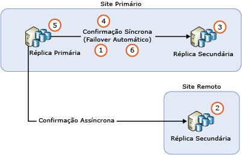
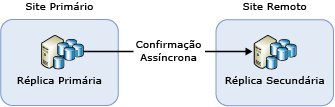
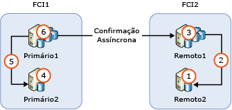

# <a name="upgrading-always-on-availability-group-replica-instances"></a>Atualizar instâncias de réplica do Grupo de Disponibilidade AlwaysOn
[!INCLUDE[appliesto-ss-xxxx-xxxx-xxx-md](../../../includes/appliesto-ss-xxxx-xxxx-xxx-md.md)]

Ao atualizar uma instância do [!INCLUDE[ssNoVersion](../../../includes/ssnoversion-md.md)] que hospeda um AG (Grupo de Disponibilidade) do AlwaysOn para uma nova versão do [!INCLUDE[ssCurrent](../../../includes/sscurrent-md.md)], para um novo service pack ou atualização cumulativa do [!INCLUDE[ssNoVersion](../../../includes/ssnoversion-md.md)], ou ao instalar um novo service pack ou atualização cumulativa do Windows, você poderá reduzir o tempo de inatividade para a réplica primária para um único failover manual executando uma atualização sem interrupção (ou dois failovers manuais em caso de failback para a primária original). Durante o processo de atualização, uma réplica secundária não estará disponível para failover ou para operações somente leitura e, depois da atualização, poderá levar algum tempo para que a réplica secundária fique atualizada com o nó da réplica primária, dependendo do volume de atividade no nó da réplica primária (portanto, espere alto tráfego de rede). Além disso, lembre-se de que depois do failover inicial para uma réplica secundária executando uma versão mais recente do SQL Server, os bancos de dados nesse Grupo de Disponibilidade passarão por um processo de atualização para colocá-los na versão mais recente. Durante esse tempo, não haverá nenhuma réplica legível para nenhum desses bancos de dados. O tempo de inatividade depois do failover inicial dependerá do número de bancos de dados no Grupo de Disponibilidade. Se você planeja realizar o failback no primário original, essa etapa não será repetida ao realizar o failback.
  
>[!NOTE]  
>Este artigo limita a discussão à atualização do próprio SQL Server. Ele não aborda a atualização do sistema operacional que contém o Cluster de Failover do Windows Server (WSFC). Não há suporte para atualização do sistema operacional do Windows que hospeda o cluster de failover para sistemas operacionais anteriores ao Windows Server 2012 R2. Para atualizar um nó de cluster em execução no Windows Server 2012 R2, confira o artigo [Atualização sem interrupção do Sistema Operacional do Cluster](http://docs.microsoft.com/windows-server/failover-clustering/cluster-operating-system-rolling-upgrade).  
  
## <a name="prerequisites"></a>Prerequisites  
Antes de começar, examine as seguintes informações importantes:  
  
- [Versão com suporte e atualizações da edição](../../../database-engine/install-windows/supported-version-and-edition-upgrades.md): verifique se você pode atualizar para o SQL Server 2016 de sua versão do sistema operacional Windows e da versão do SQL Server. Por exemplo, não é possível atualizar diretamente de uma instância do SQL Server 2005 para o [!INCLUDE[ssCurrent](../../../includes/sscurrent-md.md)].  
  
- [Escolha um método de atualização do mecanismo de banco de dados](../../../database-engine/install-windows/choose-a-database-engine-upgrade-method.md): para atualizar na ordem correta, selecione o método e as etapas de atualização apropriados com base em sua análise de atualizações de versão e de edição com suporte e também com base em outros componentes instalados em seu ambiente.  
  
- [Planejar e testar o plano de atualização do mecanismo de banco de dados](../../../database-engine/install-windows/plan-and-test-the-database-engine-upgrade-plan.md): examine as notas de versão e os problemas conhecidos da atualização, a lista de verificação pré-atualização e desenvolva e teste o plano de atualização.  
  
- [Requisitos de hardware e software para a instalação do SQL Server](../../../sql-server/install/hardware-and-software-requirements-for-installing-sql-server.md): examine os requisitos de software para a instalação do [!INCLUDE[ssCurrent](../../../includes/sscurrent-md.md)]. Se for necessário um software adicional, instale-o em cada nó antes de começar o processo de atualização para minimizar qualquer tempo de inatividade.  

- [Verifique se a replicação ou captura de dados de alteração é usada em algum banco de dados AG](#special-steps-for-change-data-capture-or-replication): se qualquer banco de dados no AG estiver habilitado para CDC (captura de dados de alteração), conclua estas [instruções](#special-steps-for-change-data-capture-or-replication).

>[!NOTE]  
>Não há suporte para a combinação de versões das instâncias do SQL Server no mesmo AG fora de uma atualização sem interrupção, que atualiza as réplicas adequadamente. Uma versão posterior de uma instância do SQL Server não pode ser adicionada como uma nova réplica a um AG existente. Por exemplo, uma réplica do SQL Server 2017 não pode ser adicionada a um AG existente do SQL Server 2016. Para migrar para uma nova versão da instância do SQL Server usando AGs, o único método com suporte é um AG distribuído, que está no SQL Server 2016 Enterprise Edition ou posterior.

## <a name="rolling-upgrade-basics-for-always-on-ags"></a>Noções básicas de atualização sem interrupção para AGs do AlwaysOn  
Observe as diretrizes a seguir ao realizar atualizações de servidor para minimizar o tempo de inatividade e a perda de dados dos seus AGs:  
  
- Antes de iniciar a atualização sem interrupção,  
  
    - Execute um failover manual em, pelo menos, uma das instâncias de réplica de confirmação síncrona  
  
    - Proteja os dados executando um backup completo em cada banco de dados de disponibilidade  
  
    - Execute o comando DBCC CHECKDB em cada banco de dados de disponibilidade  
  
-   Sempre execute a atualização das instâncias remotas da réplica secundária primeiro; depois, das instâncias locais da réplica secundária; por fim, da instância da réplica primária.  
  
-   Os backups não podem ocorrer em um banco de dados que está no processo de ser atualizado.  Antes de atualizar as réplicas secundárias, configure a preferência de backup automatizado para executar backups apenas na réplica primária.  Durante uma atualização de versão, nenhuma réplica será legível ou estará disponível para backups. Durante uma atualização sem versão, você pode configurar backups automatizados para serem executados em réplicas secundárias antes de atualizar a réplica primária.  
  
-   Durante uma atualização de versão, secundários legíveis não podem ser lidos após uma atualização do secundário legível e antes do failover de uma réplica primária para uma secundária atualizada ou a da atualização da réplica primária.  
  
-   Para proteger o AG contra failovers indesejados durante o processo de atualização, remova o failover de disponibilidade de todas as réplicas de confirmação síncrona antes de começar.  
  
-   Não atualize a instância da réplica primária antes de fazer failover do AG para a instância atualizada com uma réplica secundária primeiro. Do contrário, os aplicativos cliente poderão passar por um longo tempo de inatividade durante a atualização na instância da réplica primária.  
  
-   Sempre faça failover do AG em uma instância da réplica secundária de confirmação síncrona. Se você fizer failover para uma instância de réplica secundária de confirmação assíncrona, os bancos de dados estarão vulneráveis a perda de dados e a movimentação dos dados será automaticamente suspensa até que você a retome manualmente.  
  
-   Não atualize a instância da réplica primária antes de atualizar qualquer outra instância da réplica secundária. Uma réplica primária atualizada não pode mais enviar logs para nenhuma réplica secundária cuja instância do [!INCLUDE[ssCurrent](../../../includes/sscurrent-md.md)] ainda não tenha sido atualizada para a mesma versão. Quando a movimentação dos dados para uma réplica secundária for suspensa, nenhum failover automático poderá ocorrer nessa réplica, e os bancos de dados de disponibilidade ficarão vulneráveis à perda de dados.  
  
-   Antes de fazer failover em um GA, verifique se o estado da sincronização do destino do failover é SINCRONIZADO.  
  
## <a name="rolling-upgrade-process"></a>Processo de atualização sem interrupção  
 Na prática, o processo exato depende de fatores como a topologia da implantação dos AGs e o modo de confirmação de cada réplica. Mas, no cenário mais simples, a atualização sem interrupção é um processo de vários estágios que, na sua forma mais simples, envolve as seguintes etapas:  
  
   
  
1.  Remover o failover automático em todas as réplicas de confirmação síncrona  
  
2.  Atualizar todas as instâncias de réplica secundária que executam réplicas secundárias de confirmação assíncrona  
  
3.  Atualizar todas as instâncias de réplica secundária locais que não estão executando a réplica primária  
  
4.  Fazer o failover manual do AG em uma réplica secundária local de confirmação síncrona  
  
5.  Atualizar a instância da réplica local que hospedava a réplica primária  
  
6.  Configurar parceiros de failover automático conforme desejado  
  
 Se necessário, você pode executar um failover manual extra para retornar o AG à sua configuração original.  
  
## <a name="ag-with-one-remote-secondary-replica"></a>AG com uma réplica secundária remota  
 Se você tiver implantado um AG somente para recuperação de desastre, talvez seja necessário fazer failover do AG para uma réplica secundária de confirmação assíncrona. Essa configuração é ilustrada na figura a seguir:  
  
   
  
 Nesse caso, você deve fazer failover do AG para uma réplica secundária de confirmação assíncrona durante a atualização sem interrupção. Para evitar a perda de dados, altere o modo de confirmação para confirmação síncrona e aguarde a réplica secundária ser sincronizada para que você possa fazer o failover do AG. Portanto, o processo de atualização sem interrupção possivelmente será o seguinte:  
  
1.  Atualizar a instância de réplica secundária no local remoto  
  
2.  Alterar o modo de confirmação para confirmação síncrona  
  
3.  Aguardar até que o estado da sincronização seja SINCRONIZADO  
  
4.  Fazer failover do AG para a réplica secundária no site remoto  
  
5.  Atualizar a instância da réplica local (local primário)  
  
6.  Fazer failover do AG de volta para o local primário  
  
7.  Alterar o modo de confirmação para confirmação assíncrona  
  
 Como o modo de confirmação síncrona não é uma configuração recomendada para a sincronização de dados em um site remoto, os aplicativos cliente podem observar um aumento imediato na latência do banco de dados depois que a configuração é alterada. Além disso, a execução de um failover fará com que todas as mensagens de log não confirmadas sejam descartadas. O número de mensagens de log descartadas pode ser significante devido à alta latência da rede entre os dois locais, fazendo com que os clientes experimentem um alto volume de falha transacional. Você pode minimizar o impacto nos aplicativos cliente ao executar as seguintes ações:  
  
-   Selecione cuidadosamente uma janela de manutenção durante o baixo tráfego do cliente  
  
-   Durante a atualização do [!INCLUDE[ssCurrent](../../../includes/sscurrent-md.md)] no local primário, altere o modo de disponibilidade novamente para confirmação assíncrona e, em seguida, reverta para confirmação síncrona quando estiver pronto para fazer failover para o local primário novamente  
  
## <a name="ag-with-failover-cluster-instance-nodes"></a>AG com nós da instância de cluster de failover  
 Se um AG contiver nós de FCI (instância de cluster de failover), você deverá atualizar os nós inativos antes de atualizar os nós ativos. A figura a seguir ilustra um cenário de AG comum com FCIs para alta disponibilidade local e confirmação assíncrona entre as FCIs de recuperação de desastre remota e a sequência de upgrade.  
  
   
  
1.  Atualizar REMOTE2  
  
2.  Fazer failover de FCI2 para REMOTE2  
  
3.  Atualizar REMOTE1  
  
4.  Atualizar PRIMARY2  
  
5.  Fazer failover de FCI1 para PRIMARY2  
  
6.  Atualizar PRIMARY1  
  
## <a name="upgrade-update-sql-server-instances-with-multiple-ags"></a>Atualizar instâncias do SQL Server com vários AGs  
 Se você estiver executando vários AGs com réplicas primárias em nós de servidor separados (uma configuração Ativo/Ativo), o caminho da atualização envolverá mais etapas de failover para preservar a alta disponibilidade no processo. Suponhamos que você esteja executando três AGs nos três nós de servidor, com todas as réplicas no modo de confirmação síncrona na tabela a seguir:  
  
|AG|Node1|Node2|Node3|  
|------------------------|-----------|-----------|-----------|  
|AG1|Primária|||  
|AG2||Primária||  
|AG3|||Primária|  
  
 Talvez seja apropriado na sua situação executar uma atualização sem interrupção com balanceamento de carga na sequência a seguir:  
  
1.  Fazer failover de AG2 para Node3 (para liberar Node2)  
  
2.  Atualizar Node2  
  
3.  Fazer failover de AG1 para Node2 (para liberar Node1)  
  
4.  Atualizar Node1  
  
5.  Fazer failover de AG2 e AG3 para Node1 (para liberar Node3)  
  
6.  Atualizar Node3  
  
7.  Fazer failover de AG3 para Node3  
  
 Essa sequência de atualização tem um tempo de inatividade médio inferior a dois failovers por AG. A configuração resultante é mostrada na tabela a seguir.  
  
|AG|Node1|Node2|Node3|  
|------------------------|-----------|-----------|-----------|  
|AG1||Primária||  
|AG2|Primária|||  
|AG3|||Primária|  
  
 Com base na sua implementação, o caminho da atualização pode variar, bem como o tempo de inatividade experimentado pelos aplicativos cliente.  
  
> [!NOTE]  
>  Em muitos casos, após a atualização sem interrupção, você executará o failback para a réplica primária original. 

## <a name="special-steps-for-change-data-capture-or-replication"></a>Etapas especiais para replicação ou captura de dados de alteração

Dependendo da atualização aplicada, outras etapas podem ser necessárias para bancos de dados de réplica de AG que são habilitados para a replicação ou captura de dados de alteração. Consulte as notas de versão da atualização para determinar se as etapas a seguir são necessárias:

1. Atualize todas as réplicas secundárias.

1. Depois de atualizar todas as réplicas secundárias, faça o failover no AG para a instância atualizada. 

1. Execute o seguinte Transact-SQL na instância que hospeda a réplica primária:

   ```sql
   EXECUTE [master].[sys].[sp_vupgrade_replication];
   ```

   >[!NOTE]
   >Este comando pode levar vários minutos para ser executado. 

1. Atualize a instância que foi originalmente a réplica primária.

Para obter mais informações, consulte [Funcionalidade de CDC pode falhar após a atualização para a CU mais recente](http://blogs.msdn.microsoft.com/sql_server_team/cdc-functionality-may-break-after-upgrading-to-the-latest-cu-for-sql-server-2012-2014-and-2016/).

  
## <a name="see-also"></a>Consulte Também  
 [Atualizar para o SQL Server 2016 usando o Assistente de Instalação &#40;Instalação&#41;](../../../database-engine/install-windows/upgrade-sql-server-using-the-installation-wizard-setup.md)   

 [Instalar o SQL Server 2016 do prompt de comando](../../../database-engine/install-windows/install-sql-server-2016-from-the-command-prompt.md)  
  
  
