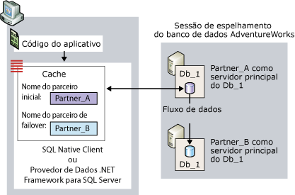
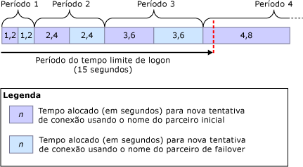
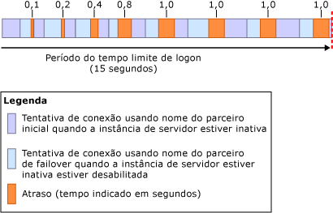

# <a name="connect-clients-to-a-database-mirroring-session-sql-server"></a>Conectar clientes a uma sessão de espelhamento de banco de dados (SQL Server)
[!INCLUDE[appliesto-ss-xxxx-xxxx-xxx-md](../../includes/appliesto-ss-xxxx-xxxx-xxx-md.md)]
  Para se conectar a uma sessão de espelhamento de banco de dados, um cliente pode usar o [!INCLUDE[ssNoVersion](../../includes/ssnoversion-md.md)] Native Client ou o .NET Framework Data Provider para o [!INCLUDE[ssNoVersion](../../includes/ssnoversion-md.md)]. Quando configurados para um banco de dados do [!INCLUDE[ssCurrent](../../includes/sscurrent-md.md)] , esses provedores de acesso de dados dão suporte completo ao espelhamento de banco de dados. Para obter informações sobre as considerações de programação para usar um banco de dados espelho, consulte [Using Database Mirroring](../../relational-databases/native-client/features/using-database-mirroring.md). Além disso, a instância de servidor principal atual deve estar disponível e o logon do cliente deve ter sido criado na instância de servidor. Para obter mais informações, consulte [Solução de problemas de usuários órfãos &#40;SQL Server&#41;](../../sql-server/failover-clusters/troubleshoot-orphaned-users-sql-server.md). As conexões de cliente com uma sessão de espelhamento de banco de dados não envolvem a instância de servidor testemunha, se essa existir.  
  
  
##  <a name="InitialConnection"></a> Estabelecendo a conexão inicial com uma sessão de espelhamento de banco de dados  
 Para a conexão inicial com um banco de dados espelho, um cliente deve fornecer uma cadeia de conexão que no mínimo forneça o nome de uma instância de servidor. Esse nome de servidor exigido deve identificar a instância do servidor principal atual e é conhecido como *nome do parceiro inicial*.  
  
 Opcionalmente, a cadeia de conexão também pode fornecer o nome de outra instância de servidor que deverá identificar a instância do servidor espelho atual para uso, se o parceiro inicial estiver indisponível durante a primeira tentativa de conexão. O segundo nome é conhecido como *nome do parceiro de failover*.  
  
 A cadeia de conexão também deve fornecer um nome de banco de dados. Isso é necessário para habilitar tentativas de failover pelo provedor de acesso de dados.  
  
 Ao receber uma cadeia de conexão, o provedor de acesso de dados armazena o nome do parceiro inicial e o nome de parceiro de failover, se fornecido, em um cache na memória volátil do cliente (para código gerenciado, o cache é delimitado ao domínio do aplicativo). Uma vez em cache, o nome do parceiro inicial nunca é atualizado pelo provedor de acesso de dados. Quando o cliente fornece o nome de parceiro de failover, o provedor de acesso de dados também armazena temporariamente esse nome, caso o provedor não possa se conectar usando o nome do parceiro inicial.  
  
 Uma sessão de espelhamento de banco de dados não protege contra problemas de acesso ao servidor que sejam específicos dos clientes, como quando um computador cliente está tendo problemas de comunicação com a rede. Uma tentativa de conexão com um banco de dados espelho também pode falhar por várias razões não relacionadas ao provedor de acesso de dados; por exemplo, uma tentativa de conexão pode falhar porque a instância do servidor principal está inativa, como acontece quando o banco de dados cai ou por causa de um erro de rede.  
  
 Ao tentar se conectar, o provedor de acesso de dados começa usando o nome do parceiro inicial. Se a instância de servidor especificada estiver disponível e for a instância de servidor principal atual, a tentativa de conexão geralmente será bem-sucedida.  
  
> [!NOTE]  
>  Se a sessão de espelhamento for pausada, o cliente geralmente fará a conexão com o servidor principal e baixará o nome do parceiro. Porém, o banco de dados estará indisponível para o cliente até retomar o espelhamento.  
  
 Se essa tentativa não funcionar, o provedor de acesso de dados tentará o nome do parceiro de failover, se disponível. Se um dos nomes de parceiro identificar o servidor principal atual corretamente, o provedor de acesso de dados em geral terá êxito em abrir a conexão inicial. Na conclusão dessa conexão, o provedor de acesso de dados baixa o nome da instância do servidor do servidor espelho atual. Esse nome é armazenado no cache como o nome do parceiro de failover, substituindo o nome do parceiro de failover fornecido pelo cliente, se houver. Depois disso, o provedor de dados .NET Framework para o [!INCLUDE[ssNoVersion](../../includes/ssnoversion-md.md)] não atualiza o nome do parceiro de failover. Em contraste, o [!INCLUDE[ssNoVersion](../../includes/ssnoversion-md.md)] Native Client atualiza o cache sempre que uma conexão subsequente ou redefinição de conexão retorna um nome de parceiro diferente.  
  
 A figura a seguir ilustra uma conexão de cliente com o parceiro inicial, **Partner_A**, para um banco de dados espelho denominado **Db_1**. Esta figura mostra um caso em que o nome do parceiro inicial fornecido pelo cliente identifica corretamente o servidor principal atual, **Partner_A**. A tentativa de conexão inicial tem sucesso e o provedor de acesso a dados armazena o nome do servidor espelho (atualmente **Partner_B**) como o nome do parceiro de failover no cache local. Finalmente, o cliente se conecta à cópia principal do banco de dados **Db_1** .  
  
   
  
 A tentativa de conexão inicial pode falhar, por exemplo, por causa de um erro de rede ou uma instância de servidor inativa. Como o parceiro inicial está indisponível, para que o provedor de acesso de dados tente se conectar ao parceiro de failover, o cliente deve ter fornecido o nome do parceiro de failover na cadeia de conexão.  
  
 Nesse caso, se o nome do parceiro de failover estiver indisponível, a tentativa de conexão original continuará até o tempo limite de conexão de rede ou um erro seja retornado (da mesma maneira que para um banco de dados não espelhado).  
  
 Quando o nome do parceiro de failover é fornecido na cadeia de conexão, o comportamento do provedor de acesso de dados dependerá do protocolo de rede e do sistema operacional do cliente, como segue:  
  
-   Para TCP/IP, as tentativas de conexão são governadas por um algoritmo de nova tentativa de conexão específico ao espelhamento de banco de dados. O *algoritmo de nova tentativa de conexão* determina o tempo máximo (o *tempo de nova tentativa*) designado para abrir uma conexão em uma determinada tentativa de conexão.  
  
-   Para outros protocolos de rede  
  
     Se um erro ocorrer ou se o parceiro inicial estiver indisponível, a tentativa inicial de conexão aguardará até o fim do tempo limite para conexão na rede ou para logon, no provedor de acesso de dados. Geralmente, essa espera é de 20 a 30 segundos. Depois disso, se o tempo limite do provedor de acesso de dados não tiver expirado, ele tentará se conectar ao parceiro de failover. Se o tempo limite expirar antes que a conexão aconteça ou o parceiro de failover esteja indisponível, a tentativa de conexão falhará. Se o parceiro de failover estiver disponível dentro do tempo limite de logon e agora for o servidor principal, a tentativa de conexão geralmente será bem-sucedida.  
  
  
### <a name="connection-strings-for-a-mirrored-database"></a>Cadeias de conexão para um banco de dados espelho  
 A cadeia de conexão fornecida pelo cliente contém informações que o provedor de acesso de dados usa para se conectar ao banco de dados. Esta seção discute as palavras-chave especificamente relevantes para conexão com um banco de dados espelhado usando um [!INCLUDE[ssNoVersion](../../includes/ssnoversion-md.md)] Native Client ODBC Driver Connection.  
  
#### <a name="network-attribute"></a>Atributo de rede  
 A cadeia de conexão deve conter o atributo **Network** para especificar o protocolo de rede. Isso assegura que o protocolo de rede especificado persista entre conexões com parceiros diferentes. O melhor protocolo por conectar a um banco de dados espelho é o TCP/IP. Para garantir que o cliente solicite o TCP/IP em cada conexão com os parceiros, uma cadeia de conexão fornece o seguinte atributo:  
  
```  
Network=dbmssocn;   
```  
  
> [!IMPORTANT]  
>  Recomendamos manter o TCP/IP no topo da lista de protocolos de um cliente. No entanto, se a cadeia de conexão especificar o atributo **Network** , isso substituirá a ordem da lista.  
  
 Alternativamente, para garantir que o cliente solicite pipes nomeados para cada conexão com os parceiros, uma cadeia de conexão fornece o seguinte atributo:  
  
```  
Network=dbnmpntw;   
```  
  
> [!IMPORTANT]  
>  Como pipes nomeados não usam o algoritmo de nova tentativa TCP/IP, em muitos casos, uma tentativa de conexão de pipes nomeados pode exceder o tempo limite antes da conexão com um banco de dados espelho.  
  
#### <a name="server-attribute"></a>Atributo de servidor  
 A cadeia de conexão deve conter um atributo **Server** que forneça o nome do parceiro inicial que deverá identificar a instância do servidor principal atual.  
  
 A forma mais simples de identificar a instância do servidor é especificando seu nome, *<server_name>* [ **\\** _<SQL_Server_instance_name>_ ]. Por exemplo:  
  
 `Server=Partner_A;`  
  
 ou em  
  
 `Server=Partner_A\Instance_2;`  
  
 No entanto, quando o nome do sistema for usado, o cliente deverá executar uma pesquisa DNS para obter o endereço IP do servidor e uma consulta com o SQL Server Browser para obter o número de porta do servidor em que o parceiro reside. Essas pesquisas e consultas podem ser ignoradas especificando o endereço IP e o número de porta do parceiro no atributo **Server** , em vez de especificar o nome do servidor. Isso é recomendado para minimizar a possibilidade de atrasos externos durante a conexão com esse parceiro.  
  
> [!NOTE]  
>  Uma consulta com o SQL Server Browser será necessária se a cadeia de conexão especificar o nome da instância nomeada, e não a porta.  
  
 Para especificar o endereço IP e a porta, o atributo **Server** usa o formato `Server=` *<ip_address>* `,` *\<port>* , por exemplo:  
  
```  
Server=123.34.45.56,4724;   
```  
  
> [!NOTE]  
>  O endereço IP pode ser o IP Versão 4 (IPv4) ou IP Versão 6 (IPv6).  
  
#### <a name="database-attribute"></a>Atributo de banco de dados  
 Além disso, a cadeia de conexão deve especificar o atributo **Database** para fornecer o nome do banco de dados espelho. Se o banco de dados estiver indisponível quando o cliente tentar se conectar, uma exceção é ativada.  
  
 Por exemplo, para se conectar expressamente ao banco de dados **AdventureWorks** no servidor principal Partner_A, um cliente usa a seguinte cadeia de conexão:  
  
 `" Server=Partner_A; Database=AdventureWorks "`  
  
> [!NOTE]  
>  Essa cadeia de caracterse omite informações de autenticação.  
  
> [!IMPORTANT]  
>  O agrupamento do prefixo de protocolo com o atributo **Server** (`Server=tcp:` *\<servername>* ) é incompatível com o atributo **Network** e a especificação do protocolo em ambos os locais provavelmente resultará em um erro. Portanto, recomendamos que uma cadeia de conexão especifique o protocolo usando o atributo **Network** e especifique somente o nome do servidor no atributo **Server** (`"Network=dbmssocn; Server=` *\<servername>* `"`).  
  
#### <a name="failover-partner-attribute"></a>Atributo de parceiro de failover  
 Além do nome do parceiro inicial, o cliente pode especificar também o nome do parceiro de failover, que deve identificar a instância do servidor espelho atual. O parceiro de failover é especificado por uma das palavras-chave para o atributo do parceiro de failover. A palavra-chave desse atributo depende da API em uso. A tabela a seguir lista estas palavras-chave:  
  
|API|Palavra-chave do atributo de parceiro de failover|  
|---------|--------------------------------------------|  
|Provedor OLE DB|**FailoverPartner**|  
|Driver ODBC|**Failover_Partner**|  
|ADO ( ActiveX Data Object)|**Failover Partner**|  
  
 A forma mais simples de identificar a instância do servidor é pelo seu nome do sistema, *<server_name>* [ **\\** _<SQL_Server_instance_name>_ ].  
  
 Como alternativa, o endereço IP e número da porta podem ser fornecidos no atributo **Failover Partner** . Se a tentativa de conexão inicial falhar durante a primeira conexão com o banco de dados, a tentativa para se conectar ao parceiro de failover não precisará depender do DNS e do SQL Server Browser. Quando uma conexão é estabelecida, o nome do parceiro de failover será sobrescrito com o nome do parceiro de failover, assim, se um failover acontecer, as conexões redirecionadas necessitarão do DNS e do SQL Server Browser.  
  
> [!NOTE]  
>  Quando só o nome do parceiro inicial é fornecido, os desenvolvedores de aplicativos não precisam tomar nenhuma ação ou gravar nenhum código, exceto sobre como se reconectar.  
  
> [!NOTE]  
>  Desenvolvedores de aplicativos de código gerenciado fornecem o nome do parceiro de failover no **ConnectionString** do objeto **SqlConnection** . Para obter informações sobre como usar essa cadeia de conexão, consulte “Suporte ao espelhamento de banco de dados no Provedor de Dados .NET Framework para SQL Server" na documentação ADO.NET que é parte do [!INCLUDE[msCoName](../../includes/msconame-md.md)] .NET Framework SDK.  
  
#### <a name="example-connection-string"></a>Cadeia de conexão de exemplo  
 Por exemplo, para fazer a conexão explícita com o banco de dados **AdventureWorks** usando o TCP/IP em Partner_A ou Partner_B, um aplicativo cliente que utiliza o driver ODBC pode fornecer a seguinte cadeia de conexão:  
  
```  
"Server=Partner_A; Failover_Partner=Partner_B; Database=AdventureWorks; Network=dbmssocn"  
```  
  
 Alternativamente, o cliente pode usar o endereço IP e número da porta para identificar o parceiro inicial, Partner_A; por exemplo, se o endereço IP for 250.65.43.21 e o número da porta for 4734, a cadeia de conexão será:  
  
```  
"Server=250.65.43.21,4734; Failover_Partner=Partner_B; Database=AdventureWorks; Network=dbmssocn"  
```  
  
##  <a name="RetryAlgorithm"></a> Algoritmo de nova tentativa de conexão (para conexões TCP/IP)  
 Para uma conexão TCP/IP, quando ambos os nomes de parceiro estiverem no cache, o provedor de acesso a dados aderirá a um algoritmo de nova tentativa de conexão. Isto é verdade tanto para fazer a conexão inicial para a sessão como para reconectar depois de perder uma conexão estabelecida. Quando uma conexão tiver sido estabelecida, completar os passos de pré-logon e logon leva tempo adicional.  
  
> [!NOTE]  
>  O tempo gasto para abrir uma conexão pode exceder o tempo de retentar por causa de fatores externos, como lookups de DNS lento, controlador/Kerberos Key Distribution Center (KDC) de domínio lento, tempo gasto contatando o SQL Server Browser, congestão de rede e outros. Tais fatores externos podem impedir um cliente de conectar a um banco de dados espelho. Além disso, fatores externos podem fazer uma conexão levar mais tempo para abrir do que o tempo estimado para retentar. Para obter informações sobre como ignorar o DNS e o SQL Server Browser para a tentativa de conexão com o parceiro inicial, consulte [Estabelecendo a conexão inicial com uma sessão de espelhamento de banco de dados](#InitialConnection)anteriormente neste tópico.  
  
 Se uma tentativa de conexão falhar ou o tempo de nova tentativa expirar antes da conexão acontecer, o provedor de acesso de dados tentará o outro parceiro. Se uma conexão não for aberta neste ponto, o provedor tentará alternadamente os nomes do parceiro inicial e do failover, até que uma conexão seja aberta ou o período de logon expire. O período do tempo limite de logon padrão é de 15 segundos. Nós recomendamos que o período de tempo limite de logon seja pelo menos de 5 segundos. Especificar um período de tempo limite menor poderia impedir quaisquer das tentativas de conexão de ter êxito.  
  
 O tempo da retentar é uma porcentagem do período de logon. O tempo da retentar para uma tentativa de conexão é maior em cada turno sucessivo. No primeiro turno, o tempo de retentar para cada das duas tentativas é de 8 por cento do período de logon total. Em cada turno sucessivo, o algoritmo de retentar aumenta o tempo máximo de retentar pela mesma quantia. Assim, o retentar para as primeiras oito tentativas de conexão é como se segue:  
  
 8%, 8%, 16%, 16%, 24%, 24%, 32%, 32%  
  
 O tempo de retentar é calculado usando a seguinte fórmula:  
  
 _RetryTime_ **=** _PreviousRetryTime_ **+(** 0.08 **&#42;** _LoginTimeout_ **)**  
  
 Onde *PreviousRetryTime* é inicialmente 0.  
  
 Por exemplo, se usar o período de intervalo de logon padrão de 15 segundos, *LoginTimeout* *= 15*. Nesse caso, os tempos de nova tentativa alocados nos primeiros três turnos são os seguintes:  
  
|Arredondamento|Cálculo de*RetryTime*|Tempo de nova tentativa por tentativa|  
|-----------|-----------------------------|----------------------------|  
|1|0 **+(** 0,08 **&#42;** 15 **)**|1,2 segundos|  
|2|1,2 **+(** 0,08 **&#42;** 15 **)**|2,4 segundos|  
|3|2,4 **+(** 0,08 **&#42;** 15 **)**|3,6 segundos|  
|4|3,6 **+(** 0,08 **&#42;** 15 **)**|4,8 segundos|  
  
 A figura a seguir ilustra esses tempos de nova tentativa em tentativas de conexão sucessivas, todas elas com tempos limite esgotados.  
  
   
  
 Para o período limite de logon padrão, o tempo máximo estimado para os primeiros três turnos de tentativas de conexão é de 14.4 segundos. Se toda tentativa fosse usar tudo de seu tempo estimado, só 0.6 segundo de tempo restaria antes do período de logon expirar. Naquele caso, o quarto turno seria reduzido, permitindo só uma tentativa rápida final para conectar usando o nome de parceiro inicial. Porém, uma tentativa de conexão pode falhar em menos tempo do que seu tempo estimado, particularmente em turnos posteriores. Por exemplo, receber um erro de rede pode fazer com que uma tentativa termine antes que o tempo de retentar expire. Se as primeiras tentativas falharem devido a um erro de rede, haveria tempo adicional disponível para o quarto turno e, talvez, turnos adicionais.  
  
 Outra causa de uma tentativa falha é uma instância de servidor inativa, como acontece quando uma instância de servidor estiver comprometida numa interrupção de seu banco de dados. Neste caso, um atraso é imposto para impedir clientes de sobrecarregar os parceiros com uma sucessão rápida de tentativas de conexão.  
  
> [!NOTE]  
>  Quando ambos os nomes de parceiros estiverem disponíveis, se o período de tempo de limite de logon for infinito, o cliente tentará se reconectar indefinidamente aos servidores, alternando entre o nome de parceiro inicial e o nome de parceiro de failover.  
  
  
### <a name="retry-delays-during-failover"></a>Atrasos de nova tentativa durante o failover  
 Se um cliente tentar se conectar a um parceiro que está em failover, o parceiro responderá imediatamente que é inativo. Neste caso, cada turno de tentativas de conexão é muito mais breve que o tempo de retentar estimado. Isso significa que muitos turnos de tentativas de conexão poderiam acontecer antes que o período de logon expire. Para evitar a sobrecarrega dos parceiros com uma série rápida de tentativas de conexão durante um failover, o provedor de acesso de dados adiciona um breve retardo ao retentar depois de cada turno de retentar. A duração de um determinado retardo ao retentar é determinada pelo algoritmo de retardo ao retentar. Depois do primeiro turno, o retardo é 100 milissegundos. Após cada um dos três turnos, o retardo ao repetir dobra – para 200, 400 e 800. Em todos os últimos turnos, o atraso de nova tentativa é de 1 segundo até que a tentativa de conexão tenha êxito ou expire.  
  
> [!NOTE]  
>  Se a instância de servidor for parada, então a solicitação de conexão falhará imediatamente.  
  
 A figura seguinte ilustra como o atraso de nova tentativa afeta as tentativas de conexão durante um failover manual, no qual os parceiros trocam suas funções. O período de tempo limite de logon padrão é de 15 segundos.  
  
   
  
##  <a name="Reconnecting"></a> Reconectando uma sessão de espelhamento de banco de dados  
 Se uma conexão estabelecida com uma sessão de espelhamento de banco de dados falhar por qualquer motivo, por exemplo, devido a um failover de espelhamento de banco de dados, e o aplicativo tentar se reconectar ao servidor inicial, o provedor de acesso de dados poderá tentar se reconectar usando o nome de parceiro de failover armazenado no cache do cliente. Porém, a reconexão não é automática. O aplicativo deve se dar conta do erro. Então, o aplicativo precisa fechar a conexão com falha e abrir uma conexão nova que use os mesmos atributos de cadeia de caracteres de conexão. Neste momento, o provedor de acesso de dados redireciona a conexão ao parceiro de failover. Se a instância de servidor identificada por este nome for atualmente o servidor principal, a tentativa de conexão normalmente terá sucesso. Caso estiver obscuro se uma transação foi confirmada ou revertida, o aplicativo deve inspecionar o estado da transação, da mesma maneira como ao reconectar a uma instância de servidor autônoma.  
  
 A reconexão se assemelha a uma conexão inicial para a qual a cadeia de caracteres de conexão forneceu um nome de parceiro de failover. Se a primeira tentativa de conexão falhar, as tentativas de conexão alternarão seguidamente entre o nome do parceiro inicial e o nome do parceiro de failover até que o cliente conecte ao servidor principal ou o provedor de acesso de dados expire o tempo limite.  
  
> [!NOTE]  
>  [!INCLUDE[ssNoVersion](../../includes/ssnoversion-md.md)] O Native Client verifica se ele se conecta a uma instância de servidor principal, mas não se essa instância é o parceiro da instância de servidor especificado no nome de parceiro inicial da cadeia de conexão.  
  
 Se as conexões usarem TCP/IP, o algoritmo de nova tentativa de conexão determinará o período de tempo designado para as tentativas de conexão em cada turno.  
  
> [!IMPORTANT]  
>  Se o cliente for desconectado do banco de dados, o provedor de acesso de dados não tentará reconectar. O cliente deverá emitir uma solicitação de conexão nova. Também, se um aplicativo desligar ao perder a conexão, perderá os nomes do parceiro em cache. Se a conexão se perder porque o servidor principal ficou indisponível, o único modo pelo qual o aplicativo pode se reconectar ao servidor espelho é fornecendo o nome do parceiro de failover em sua cadeia de conexão.  
  
  
### <a name="impact-of-redirection-on-a-client-application"></a>Impacto do redirecionamento em um aplicativo cliente  
 Depois de um failover, o provedor de acesso a dados redireciona a conexão com a instância do servidor principal atual. Porém, a redireção é transparente aos clientes. Para um cliente, uma conexão redirecionada parece ser uma conexão com a instância de servidor identificada pelo nome do parceiro inicial. Quando o parceiro inicial for atualmente o servidor espelho, o cliente poderá parecer estar conectado ao servidor espelho e atualizando o banco de dados espelho. Porém, de fato o cliente foi redirecionado ao parceiro de failover que é o banco de dados principal atual e o cliente está atualizando o banco de dados principal novo.  
  
 Depois de ser redirecionado ao parceiro de failover, um cliente pode experimentar resultados inesperados ao usar uma instrução USE [!INCLUDE[tsql](../../includes/tsql-md.md)] para usar um banco de dados diferente. Isso poderá acontecer se a instância do servidor principal atual (o parceiro de failover) tiver um conjunto de bancos de dados diferente do servidor principal original (o parceiro inicial).  
  
##  <a name="Benefits"></a>   
  
##  <a name="StalePartnerName"></a> O impacto de um nome de parceiro de failover desatualizado  
 O administrador do banco de dados pode alterar o parceiro de failover a qualquer momento. Portanto, um nome de parceiro de failover fornecido pelo cliente pode estar desatualizado ou *obsoleto*. Por exemplo, considere um nome de parceiro de failover Partner_B que é substituído por outra instância de servidor, Partner_C. Se um cliente fornecer Partner_B como o nome do parceiro de failover, este nome estará desatualizado. Quando o nome do parceiro de failover fornecido pelo cliente está desatualizado, o comportamento do provedor de acesso de dados é equiparado ao caso em que um nome de parceiro de failover não é fornecido pelo cliente.  
  
 Por exemplo, considere uma situação em que um cliente usa uma cadeia de conexão para uma série de quatro tentativas de conexão. Na cadeia de conexão, o nome do parceiro inicial é Partner_A e o nome do parceiro de failover é Partner_B:  
  
```  
"Server=Partner_A; Failover Partner=Partner_B; Database=AdventureWorks"  
```  
  
 A tabela a seguir mostra quatro configurações de parceiro e indica para cada uma se essa cadeia de conexão funciona para conexão com o cliente pela primeira vez.  
  
> [!NOTE]  
>  Um aplicativo pode rastrear alterações de configuração e alterar sua cadeia de conexão. Isso requer código extra, mas reduz a carga administrativa.  
  
|Configuração|Servidor principal|Servidor espelho|Comportamento ao tentar conexão especificando Partner_A e Partner_B|  
|-------------------|----------------------|-------------------|------------------------------------------------------------------------------|  
|Configuração de espelhamento original.|Partner_A|Partner_B|O Partner_A é armazenado em cache como o nome do parceiro inicial. O cliente tem sucesso na conexão com o Partner_A. O cliente baixa o nome do servidor espelho, Partner_B, e o coloca em cache, ignorando o nome do parceiro de failover fornecido pelo cliente.|  
|O Partner_A experimenta um problema de hardware e ocorre failover (desconectando clientes).|Partner_B|none|O Partner_A ainda está no cache como o nome do parceiro inicial, mas o nome do parceiro de failover fornecido pelo cliente, Partner_B, permite que o cliente faça conexão com o servidor principal atual.|  
|O administrador do banco de dados interrompe o espelhamento (desconectando os clientes), substitui Partner_A por Partner_C e reinicializa o espelhamento.|Partner_B|Partner_C|O cliente tenta se conectar com o Partner_A e não consegue; então o cliente tenta o Partner_B (o servidor principal atual) e tem sucesso. O provedor de acesso de dados carrega o nome do servidor espelho atual, Partner_C, e o coloca em cache como o nome do parceiro de failover atual.|  
|O failover do serviço é enviado manualmente para o Partner_C (desconectando os clientes).|Partner_C|Partner_B|O cliente tenta conexão com o Partner_A inicialmente, e depois com o Partner_B. Os dois nomes falham, e finalmente o tempo limite da solicitação de conexão se esgota e falha.|  
  
  
## <a name="see-also"></a>Consulte Também  
 [Espelhamento de banco de dados &#40;SQL Server&#41;](../../database-engine/database-mirroring/database-mirroring-sql-server.md)   
 [Possíveis falhas durante espelhamento de banco de dados](../../database-engine/database-mirroring/possible-failures-during-database-mirroring.md)  
  
  
