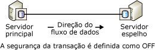
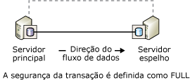
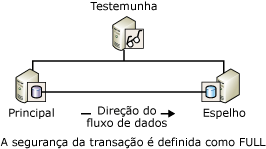

# <a name="database-mirroring-operating-modes"></a>Modos de operação de espelhamento de banco de dados
[!INCLUDE[appliesto-ss-xxxx-xxxx-xxx-md](../../includes/appliesto-ss-xxxx-xxxx-xxx-md.md)]
  Este tópico descreve os modos de operação síncronos e assíncronos de sessões de espelhamento de banco de dados.  
  
> [!NOTE]  
>  Para obter uma introdução ao espelhamento de banco de dados, consulte [Espelhamento de banco de dados &#40;SQL Server&#41;](../../database-engine/database-mirroring/database-mirroring-sql-server.md).  
  
  
##  <a name="TermsAndDefinitions"></a> Termos e definições  
 Esta seção introduz alguns termos que são essenciais para este tópico.  
  
 Modo de alto desempenho  
 A sessão de espelhamento de banco de dados opera de forma assíncrona e usa só o servidor principal e o servidor espelho. A única forma de troca de função é o serviço forçado (com possível perda de dados).  
  
 Modo de alta segurança  
 A sessão de espelhamento de banco de dados opera de forma síncrona e, opcionalmente, usa uma testemunha, bem como o servidor principal e o servidor espelho.  
  
 Segurança de transação  
 Uma propriedade de banco de dados específica de espelhamento que determina se uma sessão de espelhamento de banco de dados opera de forma síncrona ou assíncrona. Há dois níveis de segurança: COMPLETO e DESLIGADO.  
  
 Witness (testemunha)  
 Para uso apenas com o modo de alta segurança, uma instância opcional do SQL Server que permite ao servidor espelho reconhecer se um failover automático deve ser iniciado. Ao contrário dos dois parceiros de failover, a testemunha não atende ao banco de dados. O suporte ao failover automático é a única função da testemunha.  
  
## <a name="asynchronous-database-mirroring-high-performance-mode"></a>Espelhamento de banco de dados assíncrono (Modo de alto desempenho)  
 Esta seção descreve como funciona o espelhamento de banco de dados assíncrono, quando é apropriado usar o modo de alto desempenho e como responder se o servidor principal falhar.  
  
> [!NOTE]  
>  A maioria das edições do [!INCLUDE[ssCurrent](../../includes/sscurrent-md.md)] só dão suporte ao espelhamento de banco de dados síncrono ("somente segurança completa"). Para obter informações sobre as edições que dão suporte completo ao espelhamento de banco de dados, consulte “Alta disponibilidade (AlwaysOn)” em [Edições e recursos com suporte do SQL Server 2016](../../sql-server/editions-and-supported-features-for-sql-server-2016.md).
  
 Quando a segurança de transação está definida como OFF, a sessão de espelhamento de banco de dados opera de maneira assíncrona. A operação assíncrona permite apenas a um modo de operação, o modo de alto desempenho. Esse modo aumenta desempenho às custas de alta disponibilidade. O modo de alto desempenho usa apenas o servidor principal e o servidor espelho. Problemas no servidor espelho nunca causam impacto no servidor principal. Com a perda do servidor principal, o banco de dados espelho fica marcado como DESCONECTADO, mas está disponível em espera passiva.  
  
 O modo de alto desempenho oferece suporte apenas a uma forma de troca de função: serviço forçado (com possível perda de dados), que usa o servidor espelho como um servidor em espera passiva. O serviço forçado é uma das possíveis respostas à falha do servidor principal. Como a perda de dados é possível, devem ser consideradas outras alternativas antes de forçar serviço ao espelho. Para obter mais informações, consulte [Respondendo à falha do principal](#WhenPrincipalFails), mais adiante neste tópico.  
  
 A figura a seguir mostra a configuração de uma sessão que usa modo de alto desempenho.  
  
   
  
 No modo de alto desempenho, assim que o servidor principal envia o log para uma transação para o servidor espelho, o servidor principal envia uma confirmação para o cliente, sem esperar uma confirmação do servidor espelho. As transações são confirmadas sem esperar que o servidor espelho grave o log no disco. A operação assíncrona permite a execução do servidor principal com latência de transação mínima.  
  
 O servidor espelho tenta acompanhar os registros de log enviados pelo servidor principal. Mas, o banco de dados espelho pode ficar um pouco atrasado em relação ao banco de dados principal, embora normalmente a lacuna entre os bancos de dados seja pequena. Entretanto, a lacuna pode ser significativa se o servidor principal estiver com grande carga de trabalho ou se o sistema do servidor espelho estiver sobrecarregado.  
  
 **Nesta seção:**  
  
-   [Quando o modo de alto desempenho é apropriado?](#WhenUseHighPerf)  
  
-   [O impacto de uma testemunha no modo de alto desempenho](#WitnessImpactOnHighPerf)  
  
-   [Respondendo à falha do principal](#WhenPrincipalFails)  
  
###  <a name="WhenUseHighPerf"></a> Quando o modo de alto desempenho é apropriado?  
 O modo de alto desempenho pode ser útil em um cenário de recuperação de desastre no qual os servidores principal e espelho estão separados por uma distância significativa e onde você não deseja que erros pequenos causem impacto ao servidor principal.  
  
> [!NOTE]  
>  O envio de logs pode ser um suplemento ao espelhamento de banco de dados e uma alternativa favorável ao espelhamento de banco de dados assíncrono. Para obter informações sobre as vantagens do envio de log, veja [Soluções de alta disponibilidade &#40;SQL Server&#41;](../../sql-server/failover-clusters/high-availability-solutions-sql-server.md). Para obter informações sobre como usar o envio de logs com o espelhamento de banco de dados, veja [Espelhamento de banco de dados e envio de logs &#40;SQL Server&#41;](../../database-engine/database-mirroring/database-mirroring-and-log-shipping-sql-server.md).  
  
###  <a name="WitnessImpactOnHighPerf"></a> O impacto de uma testemunha no modo de alto desempenho  
 Se você usar a Transact-SQL para configurar o modo de alto desempenho, sempre que a propriedade SAFETY for definida como OFF, é altamente recomendável que a propriedade WITNESS também seja definida como OFF. Uma testemunha pode coexistir com modo de alto desempenho, mas a testemunha não fornece nenhum benefício e representa um risco.  
  
 Se a testemunha estiver desconectada da sessão quando qualquer parceiro abaixar, o banco de dados ficará indisponível. Isso ocorre por que mesmo com o modo de alto desempenho não exigindo testemunhas, se uma delas é definida, a sessão exige um quorum que consista em duas ou mais instâncias do servidor. Se a sessão não tem quorum, não pode servir o banco de dados.  
  
 Quando uma testemunha é definida em modo de alto desempenho, a aplicação de quorum significa que:  
  
-   Se o servidor espelho for perdido, o servidor principal deve ser conectado à testemunha. Caso contrário, o servidor principal deixa seu banco de dados offline até que a testemunha ou o servidor espelho se reúna novamente à sessão.  
  
-   Se o servidor principal for perdido, forçar o serviço para o servidor espelho exige que o servidor espelho esteja conectado à testemunha.  
  
> [!NOTE]  
>  Para obter mais informações sobre os tipos de quoruns, veja [Quorum: Como uma testemunha afeta a disponibilidade do banco de dados &#40;Espelhamento de Banco de Dados&#41;](../../database-engine/database-mirroring/quorum-how-a-witness-affects-database-availability-database-mirroring.md).  
  
###  <a name="WhenPrincipalFails"></a> Respondendo à falha do principal  
 Quando o principal falhar, o proprietário do banco de dados tem várias escolhas, como se segue:  
  
-   Deixar o banco de dados indisponível até que o principal fique disponível novamente.  
  
     Se o banco de dados principal e seu log de transações estiverem intactos, essa escolha preserva todas as transações confirmadas às custas da disponibilidade.  
  
-   Interrompa a sessão de espelhamento de banco de dados, atualize manualmente o banco de dados e, então, inicie uma nova sessão de espelhamento de banco de dados.  
  
     Se o banco de dados principal estiver perdido mas o servidor principal ainda estiver sendo executado, tente imediatamente fazer o backup da parte final do log no banco de dados principal. Se o backup da parte final do log for bem-sucedido, a remoção do espelhamento pode ser a melhor alternativa. Após a remoção do espelhamento, é possível restaurar o log no banco de dados espelho anterior, que preserva todos os dados.  
  
    > [!NOTE]  
    >  Se o backup da parte final do log falhar e você não puder esperar pela recuperação do servidor principal, considere forçar o serviço, que tem a vantagem de manter o estado da sessão.  
  
-   Serviço forçado (com possível perda de dados) no servidor espelho.  
  
     O serviço forçado é estritamente um método de recuperação de desastres e deve ser usado com moderação. Forçar um serviço é possível somente se o servidor principal não estiver conectado, a sessão for assíncrona (a segurança de transação estiver definida como OFF) e quando a sessão não tiver qualquer testemunha (a propriedade WITNESS estiver definida como OFF) ou a testemunha estiver conectada ao servidor espelho (ou seja, quando houver quorum).  
  
     Forçar um serviço leva o servidor espelho a assumir a função de principal e a disponibilizar sua cópia do banco de dados aos clientes. Quando o serviço é forçado, quaisquer logs de transação que o principal ainda não tiver enviado ao servidor espelho serão perdidos. Assim, deve-se limitar o serviço forçado a situações onde a possível perda de dados é aceitável e a disponibilidade imediata do banco de dados é crítica. Para obter informações sobre como funciona o serviço forçado e as práticas recomendadas para utilizá-lo, veja [Troca de função durante uma sessão de espelhamento de banco de dados &#40;SQL Server&#41;](../../database-engine/database-mirroring/role-switching-during-a-database-mirroring-session-sql-server.md).  
  
##  <a name="Sync"></a> Espelhamento de banco de dados síncrono (modo de alta segurança)  
 Esta seção descreve como funciona o espelhamento de banco de dados síncronos, inclusive os modos de alta segurança alternativa (com failover automático e sem failover automático), e contém informações sobre a função da testemunha no failover automático.  
  
 Quando a segurança de transação é definida como FULL, a sessão de espelhamento de banco de dados é executada no modo de segurança alta e opera de forma síncrona depois de uma fase de sincronização inicial. Esta seção descreve os detalhes das sessões de espelhamento de banco de dados configuradas para operação síncrona.  
  
 Para realizar a operação síncrona de uma sessão, o servidor espelho deve sincronizar o banco de dados espelho com o banco de dados principal. Quando a sessão é iniciada, o servidor principal começa a enviar seu log ativo ao servidor espelho. O servidor espelho grava todos os registros de log de entrada no disco o mais rápido possível. Assim que todos os registros de log recebidos são gravados no disco, os bancos de dados são sincronizados. Contanto que os parceiros permaneçam em comunicação, os bancos de dados permanecem sincronizados.  
  
> [!NOTE]  
>  Para monitorar alterações de estado em uma sessão de espelhamento de banco de dados, use a classe de evento **Database Mirroring State Change** . Para obter mais informações, consulte [Database Mirroring State Change Event Class](../../relational-databases/event-classes/database-mirroring-state-change-event-class.md).  
  
 Depois de concluída a sincronização, toda transação confirmada no banco de dados principal também é confirmada no servidor espelho, garantindo a proteção dos dados. Isso é feito esperando a confirmação de uma transação no banco de dados principal, até o servidor principal receber uma mensagem do servidor espelho declarando que intensificou o log da transação no disco. Observe que a espera por essa mensagem aumenta a latência da transação.  
  
 O tempo necessário para a sincronização depende essencialmente do atraso do banco de dados espelho em relação ao banco de dados principal no início da sessão (medido inicialmente pelo número de registros de log recebido do servidor principal), da carga de trabalho no banco de dados principal e da velocidade do sistema espelho. Depois que uma sessão é sincronizada, o log intensificado que ainda precisar ser refeito no banco de dados espelho continuará na fila de restauração.  
  
 Assim que o banco de dados espelho for sincronizado, o estado de ambas as cópias do banco de dados será alterado para SYNCHRONIZED.  
  
 A operação síncrona é mantida da seguinte maneira:  
  
1.  Durante o recebimento de uma transação de um cliente, o servidor principal grava o log da transação no log de transações.  
  
2.  O servidor principal grava a transação no banco de dados e, simultaneamente, envia o registro de log ao servidor espelho. O servidor principal espera uma confirmação do servidor espelho antes de confirmar qualquer uma das operações a seguir ao cliente: uma reversão ou uma confirmação de transação.  
  
3.  O servidor espelho intensifica o log do disco e retorna uma confirmação ao servidor principal.  
  
4.  Durante o recebimento da confirmação do servidor espelho, o servidor principal envia uma mensagem de confirmação ao cliente.  
  
 O modo de segurança alta protege seus dados exigindo a sincronização dos dados entre dois locais. Todas as transações confirmadas estão garantidas para serem gravadas no disco do servidor espelho.  
  
 **Nesta seção:**  
  
-   [Modo de segurança alta sem failover automático](#HighSafetyWithOutAutoFailover)  
  
-   [Modo de segurança alta com failover automático](#HighSafetyWithAutoFailover)  
  
###  <a name="HighSafetyWithOutAutoFailover"></a> Modo de segurança alta sem failover automático  
 A figura a seguir mostra a configuração do modo de segurança alta sem failover automático. A configuração consiste apenas nos dois parceiros.  
  
   
  
 Quando os parceiros estão conectados e o banco de dados já está sincronizado, há suporte ao failover manual. Se a instância de servidor espelho diminuir, a instância de servidor principal não será afetada e as execuções serão expostas (ou seja, sem espelhamento dos dados). Se o servidor principal estiver perdido, o espelho será suspenso, mas o serviço poderá ser forçado para o servidor espelho (com possível perda de dados). Para obter mais informações, consulte [Troca de função durante uma sessão de espelhamento de banco de dados &#40;SQL Server&#41;](../../database-engine/database-mirroring/role-switching-during-a-database-mirroring-session-sql-server.md).  
  
###  <a name="HighSafetyWithAutoFailover"></a> Modo de segurança alta com failover automático  
 O failover automático fornece alta disponibilidade, assegurando que o banco de dados ainda funcione depois da perda de um servidor. O failover automático exige que a sessão tenha uma terceira instância de servidor, a *testemunha*que, idealmente, reside em um terceiro computador. A figura a seguir mostra a configuração da sessão do modo de segurança alta que oferece suporte a failover automático.  
  
   
  
 Ao contrário dos dois parceiros, a testemunha não atende ao banco de dados. A testemunha simplesmente oferece suporte a failover automático verificando se o servidor principal está funcionando. O servidor espelho apenas iniciará o failover automático se o espelho e a testemunha permanecerem conectados um ao outro depois de serem desconectados do servidor principal.  
  
 Quando uma testemunha é definida, a sessão exige *quorum* – uma relação entre pelo menos duas instâncias de servidor que permita disponibilizar o banco de dados. Para obter mais informações, veja [Testemunha de espelhamento de banco de dados](../../database-engine/database-mirroring/database-mirroring-witness.md) e [Quorum: Como uma testemunha afeta a disponibilidade do banco de dados &#40;Espelhamento de Banco de Dados&#41;](../../database-engine/database-mirroring/quorum-how-a-witness-affects-database-availability-database-mirroring.md).  
  
 O failover automático exige as seguintes condições:  
  
-   O banco de dados já esteja sincronizado.  
  
-   A falha ocorra quando todas as três instâncias de servidor estejam conectadas, e a testemunha e o servidor espelho permaneçam conectados.  
  
 A perda de um parceiro tem o seguinte efeito:  
  
-   Se o servidor principal ficar indisponível nas condições anteriores, acontecerá o failover automático. O servidor espelho é alternado para a função principal e oferece seu banco de dados como banco de dados principal.  
  
-   Se o servidor principal ficar indisponível quando essas condições não forem atendidas, será possível forçar o serviço (com possível perda de dados). Para obter mais informações, veja [Troca de função durante uma sessão de espelhamento de banco de dados &#40;SQL Server&#41;](../../database-engine/database-mirroring/role-switching-during-a-database-mirroring-session-sql-server.md).  
  
-   Se apenas o servidor espelho ficar indisponível, o principal e a testemunha continuarão funcionando.  
  
 Se a sessão perder a testemunha, o quorum exigirá ambos os parceiros. Se qualquer parceiro perder quorum, ambos os parceiros perderão quorum e o banco de dados ficará indisponível até que o quorum seja restabelecido. Esse requisito de quorum garante que na ausência de uma testemunha o banco de dados nunca será executado *exposto*, ou seja, sem ser espelhado.  
  
> [!NOTE]  
>  Se você espera que a testemunha permaneça desconectada por um tempo significativo, recomendamos que você remova a testemunha da sessão até ela ficar disponível.  
  
##  <a name="TsqlSettingsAndOpModes"></a> Configurações Transact-SQL e modos de operação de espelhamento de banco de dados  
 Esta seção descreve uma sessão de espelhamento de banco de dados em termos das configurações de ALTER DATABASE e dos estados do banco de dados espelho e da testemunha, se houver. A seção destina-se a usuários que administram o espelhamento de banco de dados usando sobretudo ou exclusivamente o [!INCLUDE[tsql](../../includes/tsql-md.md)], em vez de usar o [!INCLUDE[ssManStudioFull](../../includes/ssmanstudiofull-md.md)].  
  
> [!TIP]  
>  Como alternativa ao uso do [!INCLUDE[tsql](../../includes/tsql-md.md)], é possível controlar o modo de operação de uma sessão no Pesquisador de Objetos usando a página **Espelhamento** da caixa de diálogo **Propriedades do Banco de Dados** . Para obter mais informações, consulte [Estabelecer uma sessão de espelhamento de banco de dados usando a Autenticação do Windows &#40;SQL Server Management Studio&#41;](../../database-engine/database-mirroring/establish-database-mirroring-session-windows-authentication.md).  
  
 **Nesta seção:**  
  
-   [Como a segurança de transação e estado da testemunha afetam o modo de operação](#TxnSafetyAndWitness)  
  
-   [Exibindo a configuração de segurança e estado da testemunha](#ViewWitness)  
  
-   [Fatores que afetam o comportamento na perda do servidor principal](#FactorsOnLossOfPrincipal)  
  
###  <a name="TxnSafetyAndWitness"></a> Como a segurança de transação e estado da testemunha afetam o modo de operação  
 O modo de operação de uma sessão é determinado pela combinação da configuração de sua segurança de transação e do estado da testemunha. A qualquer momento, o proprietário do banco de dados pode alterar o nível de segurança de transação e pode adicionar ou remover a testemunha.  
  
 **Nesta seção:**  
  
-   [Transaction Safety](#TxnSafety)  
  
-   [Estado de testemunha](#WitnessState)  
  
####  <a name="TxnSafety"></a> Transaction Safety  
 Segurança de transação é uma propriedade de banco de dados específica de espelhamento que determina se uma sessão de espelhamento de banco de dados opera de forma síncrona ou assíncrona. Há dois níveis de segurança: COMPLETO e DESLIGADO.  
  
-   SAFETY FULL  
  
     Segurança de transação completa faz a sessão operar sincronicamente em modo de segurança alta. Se uma testemunha estiver presente, uma sessão oferece suporte a failover automático.  
  
     Quando se estabelece uma sessão utilizando instruções ALTER DATABASE, a sessão começa com a propriedade SAFETY configurada como FULL; ou seja, a sessão começa em modo de alta segurança. Após o início da sessão, é possível adicionar uma testemunha.  
  
     Para obter mais informações, veja [Espelhamento de banco de dados Síncrono (modo de segurança alta)](#Sync), anteriormente neste tópico.  
  
-   SAFETY OFF  
  
     A desativação da segurança de transação faz a sessão operar de forma assíncrona, em modo de alto desempenho. Se a propriedade SAFETY for definida como OFF, a propriedade WITNESS também deve ser definida como OFF (o padrão). Para obter informações sobre o impacto da testemunha no modo de alto desempenho, veja [O estado da testemunha](#WitnessState), mais adiante neste tópico. Para obter mais informações sobre como executar com a segurança de transação desligada, veja [Espelhamento de banco de dados Assíncrono (Modo de alto desempenho)](#asynchronous-database-mirroring-high-performance-mode), anteriormente neste tópico.  
  
 A configuração de segurança de transação do banco de dados é registrada em cada parceiro na exibição de catálogo **sys.database_mirroring** nas colunas **mirroring_safety_level** e **mirroring_safety_level_desc**. Para obter mais informações, veja [sys.database_mirroring &#40;Transact-SQL&#41;](../../relational-databases/system-catalog-views/sys-database-mirroring-transact-sql.md).  
  
 A qualquer momento, o proprietário do banco de dados pode alterar o nível de segurança da transação.  
  
####  <a name="WitnessState"></a> O estado da testemunha  
 Se uma testemunha tiver sido definida, é necessário quorum, para que o estado da testemunha seja sempre significativo.  
  
 Se existir, a testemunha terá um dos dois estados:  
  
-   Quando a testemunha está conectada a um parceiro, a testemunha está no estado CONNECTED com relação àquele parceiro e tem quorum com aquele parceiro. Nesse caso, o banco de dados pode ser disponibilizado, mesmo se um dos parceiros estiver indisponível.  
  
-   Quando a testemunha existe mas não está conectada a um parceiro, a testemunha está no estado UNKNOWN com relação àquele parceiro. Nesse caso, a testemunha não tem quorum com aquele parceiro e se os parceiros não estiverem conectados entre si, o banco de dados fica indisponível.  
  
 Para obter mais informações sobre quorum, veja [Quorum: Como uma testemunha afeta a disponibilidade do banco de dados &#40;Espelhamento de Banco de Dados&#41;](../../database-engine/database-mirroring/quorum-how-a-witness-affects-database-availability-database-mirroring.md).  
  
 O estado de cada testemunha em uma instância do servidor é registrado na exibição de catálogo **sys.database_mirroring** nas colunas **mirroring_witness_state** e **mirroring_witness_state_desc**. Para obter mais informações, veja [sys.database_mirroring &#40;Transact-SQL&#41;](../../relational-databases/system-catalog-views/sys-database-mirroring-transact-sql.md).  
  
 A tabela a seguir apresenta um resumo de como o modo de operação de uma sessão depende da configuração de sua segurança de transação e do estado da testemunha.  
  
|Modo de operação|Segurança de transação|Estado de testemunha|  
|--------------------|------------------------|-------------------|  
|Modo de alto desempenho|OFF|NULL (nenhuma testemunha)**|  
|Modo de segurança alta sem failover automático|FULL|NULL (nenhuma testemunha)|  
|Modo de segurança alta com failover automático*|FULL|CONNECTED|  
  
 *Se a testemunha for desconectada, recomendamos que você configure WITNESS OFF até que a instância do servidor testemunha se torne disponível.  
  
 **Se uma testemunha estiver presente no modo de desempenho alto, ela não participará da sessão. Porém, para tornar o banco de dados disponível, pelo menos duas das instâncias do servidor devem permanecer conectadas. Portanto, recomendamos manter a propriedade WITNESS definida como OFF em sessões de modo de desempenho alto. Para obter mais informações, confira [Quorum: Como uma testemunha afeta a disponibilidade do banco de dados &#40;Espelhamento de Banco de Dados&#41;](../../database-engine/database-mirroring/quorum-how-a-witness-affects-database-availability-database-mirroring.md).  
  
###  <a name="ViewWitness"></a> Exibindo a configuração de segurança e estado da testemunha  
 Para exibir a configuração de segurança e o estado da testemunha para um banco de dados, use a exibição de catálogo **sys.database_mirroring** . As colunas relevantes são as seguintes:  
  
|Fator|Colunas|Descrição|  
|------------|-------------|-----------------|  
|Segurança de transação|**mirroring_safety_level** ou **mirroring_safety_level_desc**|Configuração de segurança de transação para atualizações no banco de dados espelho, um dos seguintes:<br /><br /> UNKNOWN<br /><br /> OFF<br /><br /> FULL<br /><br /> NULL = banco de dados não está online.|  
|Existe uma testemunha?|**mirroring_witness_name**|Nome do servidor de testemunha de espelhamento de banco de dados ou NULL, indicando que não existe testemunha.|  
|Estado de testemunha|**mirroring_witness_state** ou **mirroring_witness_state_desc**|Estado da testemunha no banco de dados em um determinado parceiro:<br /><br /> UNKNOWN<br /><br /> CONNECTED<br /><br /> DISCONNECTED<br /><br /> NULL = não existe testemunha ou o banco de dados não está online.|  
  
 Por exemplo, no servidor principal ou espelho, digite:  
  
```  
SELECT mirroring_safety_level_desc, mirroring_witness_name, mirroring_witness_state_desc FROM sys.database_mirroring  
```  
  
 Para obter mais informações sobre essa exibição de catálogo, veja [sys.database_mirroring &#40;Transact-SQL&#41;](../../relational-databases/system-catalog-views/sys-database-mirroring-transact-sql.md).  
  
###  <a name="FactorsOnLossOfPrincipal"></a> Fatores que afetam o comportamento na perda do servidor principal  
 A tabela a seguir apresenta um resumo do efeito combinado da configuração de segurança de transação, do estado do banco de dados e do estado da testemunha sobre o comportamento de uma sessão de espelhamento na perda do servidor principal.  
  
|Segurança de transação|Estado de espelhamento de banco de dados espelho|Estado de testemunha|Comportamento quando o principal é perdido|  
|------------------------|----------------------------------------|-------------------|-------------------------------------|  
|FULL|SYNCHRONIZED|CONNECTED|Ocorre failover automático.|  
|FULL|SYNCHRONIZED|DISCONNECTED|Paradas de servidor espelho; failover não é possível e o banco de dados não pode ser disponibilizado.|  
|OFF|SUSPENDED ou DISCONNECTED|NULL (nenhuma testemunha)|Serviço pode ser forçado ao servidor espelho (com possível perda de dados).|  
|FULL|SYNCHRONIZING ou SUSPENDED|NULL (nenhuma testemunha)|Serviço pode ser forçado ao servidor espelho (com possível perda de dados).|  
  
##  <a name="RelatedTasks"></a> Tarefas relacionadas  
  
-   [Adicionar ou substituir uma testemunha de espelhamento de banco de dados &#40;SQL Server Management Studio&#41;](../../database-engine/database-mirroring/add-or-replace-a-database-mirroring-witness-sql-server-management-studio.md)  
  
-   [Estabelecer uma sessão de espelhamento de banco de dados usando a Autenticação do Windows &#40;SQL Server Management Studio&#41;](../../database-engine/database-mirroring/establish-database-mirroring-session-windows-authentication.md)  
  
-   [Adicionar uma testemunha de espelhamento de banco de dados usando a Autenticação do Windows &#40;Transact-SQL&#41;](../../database-engine/database-mirroring/add-a-database-mirroring-witness-using-windows-authentication-transact-sql.md)  
  
-   [Remover a testemunha de uma sessão de espelhamento de banco de dados &#40;SQL Server&#41;](../../database-engine/database-mirroring/remove-the-witness-from-a-database-mirroring-session-sql-server.md)  
  
-   [Alterar a segurança da transação em uma sessão de espelhamento de banco de dados &#40;Transact-SQL&#41;](../../database-engine/database-mirroring/change-transaction-safety-in-a-database-mirroring-session-transact-sql.md)  
  
## <a name="see-also"></a>Consulte Também  
 [Monitorando o espelhamento de banco de dados &#40;SQL Server&#41;](../../database-engine/database-mirroring/monitoring-database-mirroring-sql-server.md)   
 [Testemunha de espelhamento de banco de dados](../../database-engine/database-mirroring/database-mirroring-witness.md)  
  
  
