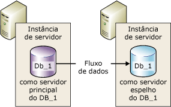
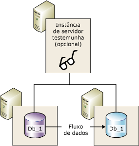
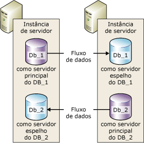

# Espelhamento de banco de dados (SQL Server)
[!INCLUDE[appliesto-ss-xxxx-xxxx-xxx-md](../../includes/appliesto-ss-xxxx-xxxx-xxx-md.md)]
    
> [!NOTE]  
>  [!INCLUDE[ssNoteDepFutureAvoid](../../includes/ssnotedepfutureavoid-md.md)] Em vez disso, use [!INCLUDE[ssHADR](../../includes/sshadr-md.md)].  
  
 O*Espelhamento de banco de dados* é uma solução para aumentar a disponibilidade de um banco de dados do [!INCLUDE[ssNoVersion](../../includes/ssnoversion-md.md)] . O espelhamento é implementado por base de banco de dados e só funciona com bancos de dados que usam o modelo de recuperação completa.  
  
> [!IMPORTANT]  
>  Para obter informações sobre o suporte para espelhamento de banco de dados, restrições, pré-requisitos, recomendações sobre como configurar servidores de parceiro e recomendações sobre como implantar o espelhamento de banco de dados, veja [Pré-requisitos, restrições e recomendações para espelhamento de banco de dados](../../database-engine/database-mirroring/prerequisites-restrictions-and-recommendations-for-database-mirroring.md).  
  
  
##   Benefícios do espelhamento de banco de dados  
 O espelhamento de banco de dados é uma estratégia simples que oferece os seguintes benefícios:  
  
-   Aumenta a disponibilidade de um banco de dados.  
  
     No caso de desastre, no modo de segurança alta com failover automático, o failover coloca rapidamente online a cópia do banco de dados em espera (sem perda de dados). Nos outros modos de operação, o administrador do banco de dados tem a possibilidade de forçar o serviço (com possível perda de dados) para a cópia do banco de dados em espera. Para obter mais informações, consulte [Troca de função](#RoleSwitching), posteriormente neste tópico.  
  
-   Aumenta a proteção dos dados.  
  
     O espelhamento de banco de dados fornece completa ou quase completa redundância de dados, dependendo se o modo operacional é de alta segurança ou de alto desempenho. Para obter mais informações, consulte [Modos de operação](#OperatingModes), mais adiante neste tópico.  
  
     Um parceiro de espelhamento de banco de dados executado no [!INCLUDE[ssEnterpriseEd10](../../includes/ssenterpriseed10-md.md)] ou em versões posteriores tenta resolver automaticamente determinados tipos de erros que impedem a leitura de uma página de dados. O parceiro que não está habilitado para ler uma página solicita uma cópia atualizada de outro parceiro. Se essa solicitação tiver êxito, a página ilegível será substituída pela cópia. Isso normalmente resolve o erro. Para obter mais informações, consulte [Reparo automático de página &#40;Grupos de disponibilidade: espelhamento de banco de dados&#41;](../../sql-server/failover-clusters/automatic-page-repair-availability-groups-database-mirroring.md).  
  
-   Aumenta a disponibilidade do banco de dados de produção durante as atualizações.  
  
     Para minimizar o tempo de inatividade de um banco de dados espelho, atualize de forma sequencial as instâncias do [!INCLUDE[ssNoVersion](../../includes/ssnoversion-md.md)] que estão hospedando os parceiros de failover. Isso ocasionará o tempo de inatividade de um único failover. Essa forma de atualização é conhecida como *atualização sem-interrupção*. Para obter mais informações, veja [Atualizando instâncias espelhadas](../../database-engine/database-mirroring/upgrading-mirrored-instances.md).  
  
  
##   Termos e definições de espelhamento de banco de dados  
 failover automático  
 O processo pelo qual, quando o servidor principal fica indisponível, o servidor espelho assume a função de servidor principal e torna sua cópia do banco de dados online como o banco de dados principal.  
  
 parceiros de failover  
 As duas instâncias de servidor (o servidor principal ou o servidor espelho) que agem como parceiros de troca de função para um banco de dados espelhado.  
  
 serviço forçado  
 Um failover iniciado pelo proprietário do banco de dados na falha do servidor principal que transfere o serviço do banco de dados espelho enquanto ele estiver em um estado desconhecido.  
  
 Modo de alto desempenho  
 A sessão de espelhamento de banco de dados opera de forma assíncrona e usa só o servidor principal e o servidor espelho. A única forma de troca de função é o serviço forçado (com possível perda de dados).  
  
 Modo de alta segurança  
 A sessão de espelhamento de banco de dados opera de forma síncrona e, opcionalmente, usa uma testemunha, bem como o servidor principal e o servidor espelho.  
  
 failover manual  
 Um failover iniciado pelo proprietário do banco de dados, enquanto o servidor principal ainda estiver em execução, que transfere o serviço do banco de dados principal para o banco de dados espelho, enquanto eles estão em um estado sincronizado.  
  
 banco de dados espelho  
 A cópia do banco de dados em geral totalmente sincronizada com o banco de dados principal.  
  
 servidor espelho  
 Em uma configuração de espelhamento de banco de dados, a instância de servidor na qual o banco de dados espelho reside.  
  
 banco de dados principal  
 No espelhamento de banco de dados, um banco de dados de leitura/gravação cujos registros do log de transações são aplicados a uma cópia somente leitura de um banco de dados (um banco de dados espelho).  
  
 servidor principal  
 No espelhamento de banco de dados, o parceiro cujo banco de dados é atualmente o banco de dados principal.  
  
 fila de restauração  
 Registros de log de transação recebidos que estão esperando no disco de um servidor espelho.  
  
 função  
 O servidor principal e o servidor espelho executam funções de principal e espelho complementares. Opcionalmente, a função de testemunha é executada por uma terceira instância de servidor.  
  
 Troca de função  
 O espelho assume a função principal.  
  
 fila de envio  
 Registros de log de transação não enviados que foram acumulados no disco de log do servidor principal.  
  
 sessão  
 A relação que ocorre durante o espelhamento de banco de dados entre o servidor principal, o servidor espelho e o servidor testemunha (se presente).  
  
 Depois que uma sessão de espelhamento é iniciada ou retomada, o processo no qual os registros do log do banco de dados principal acumulados no servidor principal são enviados ao servidor espelho, que grava esses registros de log o mais rapidamente possível para ficar em dia com o servidor principal.  
  
 Segurança de transação  
 Uma propriedade de banco de dados específica de espelhamento que determina se uma sessão de espelhamento de banco de dados opera de forma síncrona ou assíncrona. Há dois níveis de segurança: FULL e OFF.  
  
 Witness (testemunha)  
 Para uso apenas com o modo de alta segurança, uma instância opcional do SQL Server que permite ao servidor espelho reconhecer quando iniciar um failover automático. Ao contrário dos dois parceiros de failover, a testemunha não atende ao banco de dados. O suporte ao failover automático é a única função da testemunha.  
  
  
##   Visão geral do espelhamento de banco de dados  
 O espelhamento de banco de dados mantém duas cópias de um único banco de dados que devem estar localizadas em instâncias do servidor diferentes do [!INCLUDE[ssDEnoversion](../../includes/ssdenoversion-md.md)]. Geralmente, essas instâncias do servidor estão em localidades diferentes dos computadores. Iniciar o espelhamento de banco de dados em um banco de dados inicia uma relação, conhecida como uma *sessão de espelhamento de banco de dados*entre essas instâncias de servidor.  
  
 Uma instância do servidor atua como banco de dados para clientes ( *servidor principal*). A outra instância funciona como servidor em espera ativa ou passiva ( *servidor espelho*), dependendo da configuração e do estado da sessão de espelhamento. Quando uma sessão de espelhamento de banco de dados é sincronizada, o espelhamento de banco de dados fornece um servidor em espera ativa que oferece suporte rápido a failover , sem que haja perda de dados de transações confirmadas. Quando a sessão não é sincronizada, o servidor espelho fica, normalmente, disponível como servidor em espera passiva (com possível perda de dados).  
  
 Os servidores principal e espelho comunicam e cooperam entre si como *parceiros* na *sessão de espelhamento de banco de dados*. Os dois parceiros executam funções complementares na sessão: a *função principal* e a *função de espelho*. Em um dado momento, um parceiro executa a função principal e o outro parceiro executa a função espelho. Cada parceiro é descrito como *proprietário* de sua função atual. O parceiro que possui a função principal é conhecido como *servidor principal*, e a sua cópia do banco de dados é o banco de dados principal atual. O parceiro que possui a função espelho é conhecido como *servidor espelho*, e a sua cópia de banco de dados é o banco de dados espelho atual. Quando o espelhamento de banco de dados é implantado em um ambiente de produção, o banco de dados principal é o *banco de dados de produção*.  
  
 O espelhamento de banco de dados compreende *refazer* cada operação de inserção, atualização e exclusão, que ocorre no banco de dados principal, no banco de dados espelho o mais rápido possível. Para refazer a operação, envie um fluxo de registros de log de transações ativo para o servidor espelho, que aplica os registros de log ao banco de dados espelho, na sequência, com a maior rapidez possível. Ao contrário da replicação, que trabalha no nível lógico, o espelhamento de banco de dados trabalha no nível do registro de log físico. A partir do [!INCLUDE[ssKatmai](../../includes/sskatmai-md.md)], o servidor principal compacta o fluxo de registros do log de transações antes de enviá-lo ao servidor espelho. Essa compactação do log ocorre em todas as sessões de espelhamento.  
  
> [!NOTE]  
>  Uma determinada instância do servidor pode participar de várias sessões de espelhamento de banco de dados simultâneas com os mesmos parceiros ou diferentes. Uma instância do servidor pode ser um parceiro em algumas sessões e uma testemunha em outras sessões. A instância de servidor espelho deve estar executando a mesma edição do [!INCLUDE[ssNoVersion](../../includes/ssnoversion-md.md)].  
  
 **Nesta seção:**  
  
-   [Modos de operação](#OperatingModes)  
  
-   [Troca de função](#RoleSwitching)  
  
-   [Sessões simultâneas](#ConcurrentSessions)  
  
-   [Conexões cliente](#ClientConnections)  
  
-   [Impacto ao pausar uma sessão no log de transações principal](#ImpactOfPausing)  
  
  
###   Modos de operação  
 Uma sessão de espelhamento de banco de dados executa com operação síncrona ou assíncrona. No modo operacional assíncrono, as transações são confirmadas sem esperar que o servidor espelho grave o log no disco, o que maximiza o desempenho. Na operação síncrona, a transação é confirmada em ambos os parceiros, mas à custa da latência de transação aumentada.  
  
 Há dois modos operacionais de espelhamento. Um deles, o *modo de segurança alta* , dá suporte à operação síncrona. No modo de segurança alta, quando uma sessão é iniciada, o servidor espelho sincroniza rapidamente o banco de dados espelho com banco de dados principal. Assim que os bancos de dados são sincronizados, a transação é confirmada em ambos os parceiros, a custa do aumento de latência da transação.  
  
 O segundo modo de operação, o *modo de alto desempenho*, é executado de forma assíncrona. O servidor espelho tenta preservar os registros de log enviados pelo servidor principal. O banco de dados espelho pode ficar um pouco defasado em relação ao banco de dados principal. Entretanto, normalmente a defasagem entre os bancos de dados é pequena. Porém, a defasagem pode tornar-se significante se o servidor principal estiver com grande carga de trabalho ou se o sistema do servidor espelho estiver sobrecarregado.  
  
 No modo de alto desempenho, assim que o servidor principal envia um registro de log para o servidor espelho, o servidor principal envia uma confirmação para o cliente. O servidor principal não aguarda uma confirmação do servidor espelho. Isso significa que as transações são confirmadas sem esperar que o servidor espelho grave o log no disco. Essa operação assíncrona habilita o servidor principal para executar com latência de transação mínima e com grande chance de que alguns dados sejam perdidos.  
  
 Todas as sessões de espelhamento de banco de dados oferecem suporte somente a um servidor principal e a um servidor espelho. Essa configuração é mostrada na ilustração a seguir.  
  
   
  
 O modo de segurança alta com failover automático exige a instância de um terceiro servidor, conhecido como *testemunha*. Ao contrário dos dois parceiros, a testemunha não atende ao banco de dados. A testemunha oferece suporte a failover automático, verificando se o servidor principal está instalado e funcionando. O servidor espelho apenas iniciará o failover automático se o espelho e a testemunha permanecerem conectados um ao outro depois de serem desconectados do servidor principal.  
  
 A ilustração a seguir mostra uma configuração com testemunha.  
  
   
  
 Para obter mais informações, consulte [Troca de função](#RoleSwitching), posteriormente neste tópico.  
  
> [!NOTE]  
>  Estabelecer uma nova sessão de espelhamento ou adicionar uma testemunha para uma configuração de espelhamento existente exige que todas as instâncias de servidor envolvidas executem a mesma versão do [!INCLUDE[ssNoVersion](../../includes/ssnoversion-md.md)]. No entanto, quando você estiver atualizando para o [!INCLUDE[ssKatmai](../../includes/sskatmai-md.md)] ou posterior, as versões das instâncias envolvidas podem variar. Para obter mais informações, veja [Atualizando instâncias espelhadas](../../database-engine/database-mirroring/upgrading-mirrored-instances.md).  
  
  
####   Segurança de transação e modos de operação  
 O que vai determinar se um modo de operação é assíncrono ou síncrono é a configuração de segurança da transação. Caso somente o [!INCLUDE[ssManStudioFull](../../includes/ssmanstudiofull-md.md)] seja usado para configurar o espelhamento de banco de dados, as definições de segurança da transação serão configuradas automaticamente quando o modo de operação for selecionado.  
  
 Se o [!INCLUDE[tsql](../../includes/tsql-md.md)] for usado para configurar o espelhamento de banco de dados, será necessário saber como definir a segurança de transação. A segurança de transação é controlada pela propriedade SAFETY da instrução ALTER DATABASE. Em um banco de dados que está sendo espelhado, SAFETY é FULL ou OFF.  
  
-   Se a opção SAFETY for definida como FULL, a operação de espelhamento de banco de dados será síncrona, depois da fase de sincronização inicial. Se a testemunha for definida no modo de segurança alta, a sessão oferecerá suporte ao failover automático.  
  
-   Se a opção SAFETY for definida como OFF, a operação de espelhamento de banco de dados será assíncrona. A sessão é executada em modo de alto desempenho e a opção WITNESS também deve ser OFF.  
  
 Para obter mais informações, consulte [Database Mirroring Operating Modes](../../database-engine/database-mirroring/database-mirroring-operating-modes.md).  
  
  
###   Troca de função  
 No contexto da sessão de espelhamento de banco de dados, as funções principal e espelho podem ser, normalmente, alternadas em um processo conhecido como *troca de função*. A troca de função envolve a transferência da função principal ao servidor espelho. Na troca de função, o servidor espelho funciona como *parceiro de failover* do servidor principal. Quando ocorre a troca de função, o servidor espelho assume a função principal e coloca online a sua cópia do banco de dados, como banco de dados principal novo. O servidor principal anterior, se disponível, assume a função de espelho e seu banco de dados se torna o novo banco de dados espelho. Potencialmente, as funções podem ser alternadas de forma repetida.  
  
 Estas são as três formas de troca de função existentes.  
  
-   *Automatic failover*  
  
     Requer modo de segurança alta e a presença do servidor espelho e de uma testemunha. O banco de dados já deve estar sincronizado e a testemunha deve estar conectada ao servidor espelho.  
  
     A função da testemunha é verificar se um determinado servidor parceiro está instalado e funcionando. Se o servidor espelho perder a conexão com o servidor principal, mas a testemunha ainda estiver conectada, o servidor espelho não iniciará o failover. Para obter mais informações, veja [Testemunha de espelhamento de banco de dados](../../database-engine/database-mirroring/database-mirroring-witness.md).  
  
-   *Manual failover*  
  
     Requer modo de segurança alta. Os parceiros devem estar conectados entre si e o banco de dados já deve estar sincronizado.  
  
-   *Serviço forçado* (com possível perda de dados)  
  
     Nos modos de alto desempenho e de segurança alta sem failover automático, é possível forçar o serviço se o servidor principal falhar e o servidor espelho estiver disponível.  
  
    > [!IMPORTANT]  
    >  O modo de alto desempenho destina-se a executar sem uma testemunha. Porém, se existir uma testemunha, forçar o serviço requer que a testemunha esteja conectada ao servidor espelho.  
  
 Em qualquer cenário de troca de função, assim que o novo banco de dados principal estiver online, para recuperar rapidamente os aplicativos cliente, reconecte-os ao banco de dados.  
  
  
###   Sessões simultâneas  
 Uma determinada instância do servidor pode participar de várias sessões de espelhamento de banco de dados simultâneas (uma para cada banco de dados espelho) com as mesmas ou diferentes instâncias do servidor. Frequentemente, uma instância do servidor atua exclusivamente como um parceiro ou uma testemunha em todo o processo das sessões de espelhamento de banco de dados. Porém, como cada sessão é independente das demais, uma instância do servidor pode agir como um parceiro em algumas sessões e uma testemunha em outras. Por exemplo, considere as quatro sessões a seguir entre três instâncias de servidor (`SSInstance_1`, `SSInstance_2`e `SSInstance_3`). Cada instância do servidor atua como parceiro em algumas sessões e como testemunha em outras.  
  
|Instância de servidor|Sessão para banco de dados A|Sessão para banco de dados B|Sessão para banco de dados C|Sessão para banco de dados D|  
|---------------------|----------------------------|----------------------------|----------------------------|----------------------------|  
|`SSInstance_1`|Witness (testemunha)|Partner (parceiro)|Partner (parceiro)|Partner (parceiro)|  
|`SSInstance_2`|Partner (parceiro)|Witness (testemunha)|Partner (parceiro)|Partner (parceiro)|  
|`SSInstance_3`|Partner (parceiro)|Partner (parceiro)|Witness (testemunha)|Witness (testemunha)|  
  
 A figura a seguir ilustra duas instâncias de servidor que estão participando como parceiros de duas sessões de espelhamento. Uma sessão destina-se a um banco de dados chamado **Db_1**e a outra, a um banco de dados chamado **Db_2**.  
  
   
  
 Cada um dos bancos de dados é independente dos outros. Por exemplo, uma instância de servidor poderia ser, inicialmente, o servidor espelho para dois bancos de dados. Se um dos bancos de dados falhar, a instância de servidor torna-se o servidor principal para o banco de dados com falha enquanto que o servidor espelho será para o outro banco de dados.  
  
 Em outro exemplo, considere uma instância de servidor como servidor principal para dois ou mais bancos de dados que estão sendo executados em modo de alta segurança, com failover automático. Se a instância do servidor falhar, todos os bancos de dados ativarão automaticamente o failover nos seus respectivos bancos de dados espelho.  
  
 Ao configurar a instância de um servidor para operar como parceiro e como testemunha, verifique se o ponto de extremidade do espelhamento de banco de dados dá suporte às duas funções (para obter mais informações, veja [O ponto de extremidade de espelhamento de banco de dados &#40;SQL Server&#41;](../../database-engine/database-mirroring/the-database-mirroring-endpoint-sql-server.md)). Assegure-se também de que o sistema tenha recursos suficientes para reduzir contenção de recurso.  
  
> [!NOTE]  
>  Como os bancos de dados espelhados são independentes, eles não podem realizar failover em grupo.  
  
###   Conexões cliente  
 O suporte à conexão de cliente para sessões de espelhamento de banco de dados é fornecido pelo [!INCLUDE[msCoName](../../includes/msconame-md.md)] .NET Data Provider for [!INCLUDE[ssNoVersion](../../includes/ssnoversion-md.md)]. Para obter mais informações, consulte [Conectar clientes a uma sessão de espelhamento de banco de dados &#40;SQL Server&#41;](../../database-engine/database-mirroring/connect-clients-to-a-database-mirroring-session-sql-server.md).  
  
  
###   Impacto ao pausar uma sessão no log de transações principal  
 O proprietário de banco de dados pode pausar uma sessão a qualquer momento. Ao fazer a pausa, preserva-se o estado da sessão enquanto durante a remoção do espelhamento. Quando uma sessão é pausada, o servidor principal não envia nenhum log novo registrado ao servidor espelho. Todos esses registros permanecem ativos e são acumulados no log de transações do banco de dados principal. Desde que uma sessão de espelhamento de banco de dados permaneça pausada, o log de transações não poderá ser truncado. No entanto, se a sessão de espelhamento de banco de dados permanecer pausada por muito tempo, o log poderá ser preenchido.  
  
 Para obter mais informações, consulte [Pausando e retomando o espelhamento de banco de dados &#40;SQL Server&#41;](../../database-engine/database-mirroring/pausing-and-resuming-database-mirroring-sql-server.md).  
  
##   Configurando uma sessão de espelhamento de banco de dados  
 Antes de uma sessão de espelhamento ser iniciada, o proprietário do banco de dados ou o administrador do sistema deverá criar o banco de dados espelho, estabelecer os pontos de extremidades e logons e, em alguns casos, criar e configurar certificados. Para obter mais informações, consulte [Configurando o espelhamento de banco de dados &#40;SQL Server&#41;](../../database-engine/database-mirroring/setting-up-database-mirroring-sql-server.md).  
  
##   Interoperabilidade e coexistência com outros recursos de mecanismo de banco de dados  
 O espelhamento de banco de dados pode ser usado com os recursos ou componentes do [!INCLUDE[ssNoVersion](../../includes/ssnoversion-md.md)]a seguir.  
  
-   [Envio de logs](../../database-engine/database-mirroring/database-mirroring-and-log-shipping-sql-server.md)  
  
-   [Catálogos de texto completo](../../database-engine/database-mirroring/database-mirroring-and-full-text-catalogs-sql-server.md)  
  
-   [Instantâneos do banco de dados](../../database-engine/database-mirroring/database-mirroring-and-database-snapshots-sql-server.md)  
  
-   [Replicação](../../database-engine/database-mirroring/database-mirroring-and-replication-sql-server.md)  
  
##   Nesta seção  
 [Pré-requisitos, restrições e recomendações para espelhamento de banco de dados](../../database-engine/database-mirroring/prerequisites-restrictions-and-recommendations-for-database-mirroring.md)  
 Descreve os pré-requisitos e as recomendações para configuração do espelhamento de banco de dados.  
  
 [Database Mirroring Operating Modes](../../database-engine/database-mirroring/database-mirroring-operating-modes.md)  
 Contém informações sobre os modos de operação síncronos e assíncronos de sessões de espelhamento de banco de dados, e sobre como alternar funções de parceiros durante uma sessão de espelhamento de banco de dados.  
  
 [Testemunha de espelhamento de banco de dados](../../database-engine/database-mirroring/database-mirroring-witness.md)  
 Descreve a função de uma testemunha no espelhamento de banco de dados, como usar uma única testemunha em várias sessões de espelhamento, recomendações de software e hardware para testemunhas e a função da testemunha no failover automático. Também contém informações sobre como adicionar ou remover uma testemunha.  
  
 [Troca de função durante uma sessão de espelhamento de banco de dados &#40;SQL Server&#41;](../../database-engine/database-mirroring/role-switching-during-a-database-mirroring-session-sql-server.md)  
 Contém informações sobre como alternar funções de parceiros durante uma sessão de espelhamento de banco de dados, inclusive failover automático, failover manual e serviço forçado (com possível perda de dados). Além disso, contém informações sobre como estimar a interrupção de serviço durante a troca de função.  
  
 [Possíveis falhas durante espelhamento de banco de dados](../../database-engine/database-mirroring/possible-failures-during-database-mirroring.md)  
 Aborda problemas físicos, de sistema operacional e do [!INCLUDE[ssNoVersion](../../includes/ssnoversion-md.md)] , incluindo erros de hardware e software, que podem causar uma falha em uma sessão de espelhamento de banco de dados. Aborda como o mecanismo de tempo limite de espelhamento responde a erros de software.  
  
 [O ponto de extremidade de espelhamento de banco de dados &#40;SQL Server&#41;](../../database-engine/database-mirroring/the-database-mirroring-endpoint-sql-server.md)  
 Discute como funciona o ponto de extremidade do espelhamento de banco de dados.  
  
 [Configurando o espelhamento de banco de dados &#40;SQL Server&#41;](../../database-engine/database-mirroring/setting-up-database-mirroring-sql-server.md)  
 Contém tópicos sobre os pré-requisitos, recomendações e etapas de configuração do espelhamento de banco de dados.  
  
 [Conectar clientes a uma sessão de espelhamento de banco de dados &#40;SQL Server&#41;](../../database-engine/database-mirroring/connect-clients-to-a-database-mirroring-session-sql-server.md)  
 Contém tópicos que abrangem os atributos de cadeia de conexão de cliente e os algoritmos para conectar e reconectar um cliente a um banco de dados espelho.  
  
 [Pausando e retomando o espelhamento de banco de dados &#40;SQL Server&#41;](../../database-engine/database-mirroring/pausing-and-resuming-database-mirroring-sql-server.md)  
 Discute o que acontece enquanto o espelhamento de banco de dados é pausado, inclusive o impacto no truncamento de log de transações e contém descrições sobre como pausar e retomar o espelhamento de banco de dados.  
  
 [Removendo o espelhamento de banco de dados &#40;SQL Server&#41;](../../database-engine/database-mirroring/removing-database-mirroring-sql-server.md)  
 Discute o impacto da remoção do espelhamento e contém descrições sobre como terminar uma sessão  
  
 [Monitorando o espelhamento de banco de dados &#40;SQL Server&#41;](../../database-engine/database-mirroring/monitoring-database-mirroring-sql-server.md)  
 Contém informações sobre como usar o Monitor de Espelhamento de Banco de Dados ou os procedimentos armazenados **dbmmonitor** para monitorar o espelhamento ou as sessões do banco de dados.  
  
  
##   Tarefas relacionadas  
  
### Tarefas de configuração  
 **Usando o SQL Server Management Studio**  
  
-   [Iniciar o Assistente para Configurar Segurança de Espelhamento de Banco de Dados &#40;SQL Server Management Studio&#41;](../../database-engine/database-mirroring/start-the-configuring-database-mirroring-security-wizard.md)  
  
-   [Estabelecer uma sessão de espelhamento de banco de dados usando a Autenticação do Windows &#40;SQL Server Management Studio&#41;](../../database-engine/database-mirroring/establish-database-mirroring-session-windows-authentication.md)  
  
 **Usando Transact-SQL**  
  
-   [Permitir o acesso à rede a um ponto de extremidade de espelhamento de banco de dados usando a Autenticação do Windows &#40;SQL Server&#41;](../../database-engine/database-mirroring/database-mirroring-allow-network-access-windows-authentication.md)  
  
-   [Permitir que um ponto de extremidade de espelhamento de banco de dados use certificados para conexões de saída &#40;Transact-SQL&#41;](../../database-engine/database-mirroring/database-mirroring-use-certificates-for-outbound-connections.md)  
  
-   [Permitir que um ponto de extremidade de espelhamento de banco de dados use certificados para conexões de entrada &#40;Transact-SQL&#41;](../../database-engine/database-mirroring/database-mirroring-use-certificates-for-inbound-connections.md)  
  
-   [Criar um ponto de extremidade de espelhamento de banco de dados para a Autenticação do Windows &#40;SQL Server&#41;](../../database-engine/database-mirroring/create-a-database-mirroring-endpoint-for-windows-authentication-transact-sql.md)  
  
-   [Estabelecer uma sessão de espelhamento de banco de dados com a Autenticação do Windows &#40;Transact-SQL&#41;](../../database-engine/database-mirroring/database-mirroring-establish-session-windows-authentication.md)  
  
-   [Adicionar uma testemunha de espelhamento de banco de dados usando a Autenticação do Windows &#40;Transact-SQL&#41;](../../database-engine/database-mirroring/add-a-database-mirroring-witness-using-windows-authentication-transact-sql.md)  
  
-   [Configurar um banco de dados espelho para usar a propriedade confiável &#40;Transact-SQL&#41;](../../database-engine/database-mirroring/set-up-a-mirror-database-to-use-the-trustworthy-property-transact-sql.md)  
  
 **Usando Transact-SQL ou SQL Server Management Studio**  
  
-   [Atualizando instâncias espelhadas](../../database-engine/database-mirroring/upgrading-mirrored-instances.md)  
  
-   [Preparar um banco de dados espelho para espelhamento &#40;SQL Server&#41;](../../database-engine/database-mirroring/prepare-a-mirror-database-for-mirroring-sql-server.md)  
  
  
### Tarefas administrativas  
 **Transact-SQL**  
  
-   [Alterar a segurança da transação em uma sessão de espelhamento de banco de dados &#40;Transact-SQL&#41;](../../database-engine/database-mirroring/change-transaction-safety-in-a-database-mirroring-session-transact-sql.md)  
  
-   [Executar failover manualmente em uma sessão de espelhamento de banco de dados &#40;Transact-SQL&#41;](../../database-engine/database-mirroring/manually-fail-over-a-database-mirroring-session-transact-sql.md)  
  
-   [Forçar serviço em uma sessão de espelhamento de banco de dados &#40;Transact-SQL&#41;](../../database-engine/database-mirroring/force-service-in-a-database-mirroring-session-transact-sql.md)  
  
-   [Pausar ou retomar uma sessão de espelhamento de banco de dados &#40;SQL Server&#41;](../../database-engine/database-mirroring/pause-or-resume-a-database-mirroring-session-sql-server.md)  
  
-   [Remover a testemunha de uma sessão de espelhamento de banco de dados &#40;SQL Server&#41;](../../database-engine/database-mirroring/remove-the-witness-from-a-database-mirroring-session-sql-server.md)  
  
-   [Remover o espelhamento de banco de dados &#40;SQL Server&#41;](../../database-engine/database-mirroring/remove-database-mirroring-sql-server.md)  
  
 **SQL Server Management Studio**  
  
-   [Adicionar ou substituir uma testemunha de espelhamento de banco de dados &#40;SQL Server Management Studio&#41;](../../database-engine/database-mirroring/add-or-replace-a-database-mirroring-witness-sql-server-management-studio.md)  
  
-   [Executar failover manualmente de uma sessão de espelhamento de banco de dados &#40;SQL Server Management Studio&#41;](../../database-engine/database-mirroring/manually-fail-over-a-database-mirroring-session-sql-server-management-studio.md)  
  
-   [Pausar ou retomar uma sessão de espelhamento de banco de dados &#40;SQL Server&#41;](../../database-engine/database-mirroring/pause-or-resume-a-database-mirroring-session-sql-server.md)  
  
-   [Remover a testemunha de uma sessão de espelhamento de banco de dados &#40;SQL Server&#41;](../../database-engine/database-mirroring/remove-the-witness-from-a-database-mirroring-session-sql-server.md)  
  
-   [Remover o espelhamento de banco de dados &#40;SQL Server&#41;](../../database-engine/database-mirroring/remove-database-mirroring-sql-server.md)  
  
  
## Consulte Também  
 [O ponto de extremidade de espelhamento de banco de dados &#40;SQL Server&#41;](../../database-engine/database-mirroring/the-database-mirroring-endpoint-sql-server.md)   
 [Reparo automático de página &#40;Grupos de disponibilidade: espelhamento de banco de dados&#41;](../../sql-server/failover-clusters/automatic-page-repair-availability-groups-database-mirroring.md)   
 [Solução de problemas de configuração de espelhamento de banco de dados &#40;SQL Server&#41;](../../database-engine/database-mirroring/troubleshoot-database-mirroring-configuration-sql-server.md)   
 [Espelhamento de banco de dados: interoperabilidade e coexistência &#40;SQL Server&#41;](../../database-engine/database-mirroring/database-mirroring-interoperability-and-coexistence-sql-server.md)   
 [Pré-requisitos, restrições e recomendações para espelhamento de banco de dados](../../database-engine/database-mirroring/prerequisites-restrictions-and-recommendations-for-database-mirroring.md)   
 [Visão geral dos grupos de disponibilidade AlwaysOn &#40;SQL Server&#41;](../../database-engine/availability-groups/windows/overview-of-always-on-availability-groups-sql-server.md)   
 [Sobre o envio de logs &#40;SQL Server&#41;](../../database-engine/log-shipping/about-log-shipping-sql-server.md)  
  
  
