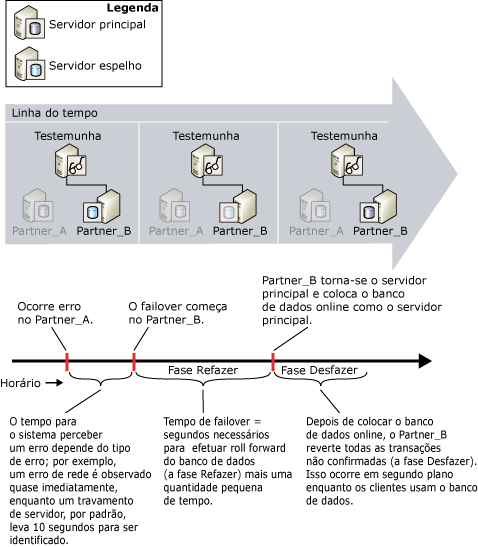

# Estime a interrupção do serviço durante troca de função (Espelhamento de Banco de Dados)
  Durante uma troca de função, a quantidade de tempo que o espelhamento de banco de dados fica fora de serviço depende do tipo de função trocada e da causa da troca de função.  
  
-   Para failover automático, dois fatores contribuem para a interrupção do serviço de tempo: o tempo necessário para o servidor espelho reconhecer que a instância de servidor principal falhou, ou seja, detecção de erros, mais o tempo necessário para o failover do banco de dados, isto é, tempo de failover.  
  
-   Para uma operação de serviço forçado, mesmo ocorrendo uma falha, a sua detecção e a resposta ao erro dependem da reação humana. Porém, a estimativa de interrupção potencial de serviço é limitada à estimativa de tempo do servidor espelho para trocar funções depois de emitido o comando de serviço forçado.  
  
    > [!NOTE]  
    >  Para reduzir o tempo exigido para detectar condições específicas, como alguns tipos de erros, você pode definir alertas para essas condições.  
  
-   Para um failover manual, apenas o tempo exigido do failover do banco de dados após o comando de failover é emitido.  
  
## Detecção de erro  
 O tempo para o sistema perceber um erro depende do tipo de erro; por exemplo, um erro de rede é observado quase imediatamente, enquanto um travamento de servidor, por padrão, leva 10 segundos para ser percebido, que é o período de tempo limite padrão.  
  
 Para obter informações sobre erros que podem causar uma falha durante uma sessão de espelhamento de banco de dados e detecção de tempo limite em modo de segurança alta com failover automático, consulte [Possíveis falhas durante o Espelhamento de Banco de Dados](../../database-engine/database-mirroring/possible-failures-during-database-mirroring.md)).  
  
## Tempo de failover  
 O tempo de failover consiste principalmente no tempo necessário para o servidor espelho anterior efetuar o roll-forward de qualquer log restante na fila de restauração, mais um pequeno tempo adicional (para obter mais informações sobre como o servidor espelho processa registros de log, consulte [Espelhamento de Banco de Dados &#40;SQL Server&#41;](../../database-engine/database-mirroring/database-mirroring-sql-server.md)). Para obter informações sobre como calcular o tempo de failover, consulte Estimando sua taxa do failover a ser refeito, posteriormente neste tópico.  
  
> [!IMPORTANT]  
>  Se o failover ocorrer durante uma transação na qual um índice ou uma tabela for criada e, depois, for alterada, o failover pode demorar mais tempo que o habitual.  Por exemplo, o failover durante a série seguinte de operações pode aumentar o tempo de failover: BEGIN TRANSACTION, CREATE INDEX em uma tabela e SELECT INTO tabela. A possibilidade de aumento do tempo de failover durante tal transação permanece até que ele seja concluído com uma instrução COMMIT TRANSACTION ou ROLLBACK TRANSACTION.  
  
### A Fila de Restauração  
 O avanço do banco de dados envolve a aplicação de quaisquer registros de log que estiverem atualmente na fila de restauração no servidor espelho. A opção *fila de restauração* consiste nos registros de log gravados no disco do servidor espelho, mas que ainda não avançaram para o banco de dados espelho.  
  
 O tempo de failover do banco de dados depende da rapidez com que o servidor espelho consegue efetuar o roll-forward do log na fila de restauração que, por sua vez, é determinada principalmente pelo hardware de sistema e pela carga de trabalho atual. Potencialmente, um banco de dados principal pode ficar tão ocupado que o servidor principal envia o log ao servidor espelho muito mais rápido do que consegue avançar o log. Nessa situação, o failover poderia levar muito tempo enquanto o servidor espelho avança o log na fila de restauração. Para saber o tamanho atual da fila de logs a serem refeitos, use o contador **Fila de Restauração** do objeto de desempenho do espelhamento de banco de dados. Para obter mais informações, consulte [SQL Server, Database Mirroring Object](../../relational-databases/performance-monitor/sql-server-database-mirroring-object.md).  
  
### Estimando a taxa de failover a ser refeito  
 Você pode medir o tempo necessário para efetuar o roll-forward de registros de log – a *taxa de restauração*– usando uma cópia de teste do banco de dados de produção.  
  
 O método para calcular o tempo do roll-forward durante o failover depende do número de threads que o servidor espelho usa durante a fase refazer. O número de threads depende do seguinte:  
  
-   No [!INCLUDE[ssStandard](../../includes/ssstandard-md.md)], o servidor espelho sempre usa um único thread para efetuar roll forward do banco de dados.  
  
-   No [!INCLUDE[ssEnterprise](../../includes/ssenterprise-md.md)], os servidores espelho em computadores com menos de cinco CPUs também usam apenas um único thread. Com cinco ou mais CPUs, um servidor espelho distribui suas operações de roll-forward em vários threads durante um failover (isso é conhecido como *restauração paralela*). A opção de restauração paralela é otimizada para usar um thread para todas as quatro CPUs.  
  
#### Estimando a taxa do thread único a ser refeito  
 Para refazer o thread único, efetue o roll-forward do banco de dados espelho durante o failover demora aproximadamente o mesmo tempo que a restauração de um backup de log leva para efetuar roll-forward da mesma quantidade de log. Para calcular o tempo de failover, crie um banco de dados de teste no ambiente no qual você pretende executar o espelhamento. Depois, pegue um backup de log do banco de dados de produção. Para medir a taxa de restauração daquele backup de log, cronometre quanto tempo você leva para restaurar o backup de log WITH NORECOVERY no banco de dados de teste.  
  
 Uma vez conhecida a taxa de restauração de seu servidor espelho, você pode calcular o tempo de failover do banco de dados em um determinado momento, dividindo a quantidade de logs atuais a serem refeitos no espelho (medida pelo contador de desempenho **Fila de Restauração** ) pela taxa de restauração. Em condições normais, se o servidor espelho conseguir manter a carga do principal, a **Fila de Restauração** será pequena ou quase zero, e um failover só levará alguns segundos.  
  
#### Estimando a taxa de restauração paralela  
 No [!INCLUDE[ssEnterprise](../../includes/ssenterprise-md.md)], a opção de restauração paralela é otimizada para usar um thread para todas as quatro CPUs. Para calcular o tempo do roll-forward da opção de restauração paralela, é mais preciso acessar um sistema de teste de execução do que um banco de dados de teste. Enquanto monitora a fila de restauração no servidor espelho, aumente a carga no servidor principal. Em operação normal, a fila de restauração é quase zero. Aumente a carga no servidor principal até que a Fila de Restauração comece a crescer continuamente; o sistema atingirá sua taxa máxima de restauração e, nesse momento, o contador de desempenho **Refazer Bytes/s** representará a taxa máxima de restauração. Para obter mais informações, consulte [SQL Server, Database Mirroring Object](../../relational-databases/performance-monitor/sql-server-database-mirroring-object.md).  
  
## Estimando a interrupção do serviço durante o failover automático  
 A figura seguinte ilustra como a detecção de erros e o tempo de failover contribuem para o tempo geral necessário para um failover automático ser concluído em **Partner_B**. O failover precisa de tempo para efetuar o roll-forward do banco de dados (a fase Refazer) mais uma quantidade pequena de tempo para tornar o banco de dados online. A fase Desfazer, que envolve a reversão de qualquer transação não confirmada, acontece depois que o novo banco de dados principal estiver online e continuar depois do failover. O banco de dados fica disponível durante a fase Desfazer.  
  
   
  
## Consulte também  
 [Modos de operação de espelhamento de banco de dados](../../database-engine/database-mirroring/database-mirroring-operating-modes.md)   
 [Troca de função durante uma sessão de espelhamento de banco de dados &#40;SQL Server&#41;](../../database-engine/database-mirroring/role-switching-during-a-database-mirroring-session-sql-server.md)   
 [Monitorando o espelhamento de banco de dados &#40;SQL Server&#41;](../../database-engine/database-mirroring/monitoring-database-mirroring-sql-server.md)  
  
  
