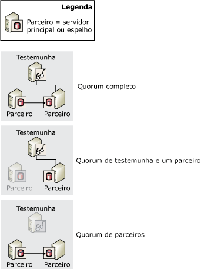
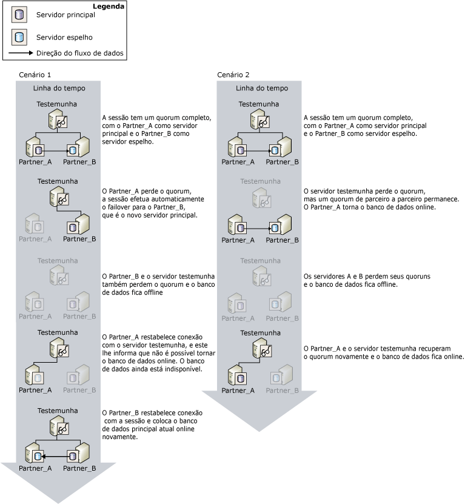

# Quorum: como uma testemunha afeta a disponibilidade do banco de dados (Espelhamento de Banco de Dados)
  Sempre que uma testemunha é definida para uma sessão de espelhamento de banco de dados, é necessário usar o *quorum* . Quorum é a relação criada quando duas ou mais instâncias do servidor na sessão de espelhamento de banco de dados são conectadas entre si. Normalmente, o quorum envolve três instâncias do servidor interconectadas. Quando uma testemunha é definida, o quorum é exigido para tornar o banco de dados disponível. Desenvolvido para o modo de segurança alta com failover automático, o quorum verifica o banco de dados pertence a somente um parceiro por vez.  
  
 Se uma determinada instância do servidor for desconectada da sessão de espelhamento, aquela instância perderá o quorum. Se nenhuma instância do servidor estiver conectada, a sessão perderá quorum e o banco de dados ficará indisponível. Há três tipos possíveis de quorum:  
  
-   Um *quorum cheio* inclui parceiros e a testemunha.  
  
-   Um *quorum testemunha a parceiro* consiste na testemunha e em qualquer parceiro.  
  
-   Um *quorum parceiro a parceiro* consiste em dois parceiros.  
  
 A figura a seguir mostra esses tipos de quorum.  
  
   
  
 Enquanto o servidor principal atual tiver quorum, o servidor deterá a função de principal e continuará a servir o banco de dados, a menos que o proprietário do banco de dados execute um failover manual. Se o servidor principal perder quorum, deixará de atender o banco de dados. O failover automático só será possível se o banco de dados principal perder quorum, garantindo que não está mais servindo o banco de dados.  
  
 Uma instância de servidor desconectada salva sua mais recente função na sessão. Normalmente, uma instância do servidor desconectada é reconectada à sessão ao ser reiniciada e ao recuperar quorum.  
  
> [!IMPORTANT]  
>  A testemunha só deverá ser definida quando você pretender usar o modo da segurança alta com failover automático. Em modo de alto desempenho, para o qual uma testemunha nunca é requerida, recomendamos definir a propriedade WITNESS como OFF. Para obter informações sobre o impacto de uma testemunha no modo de alto desempenho, veja [Modos de operação de espelhamento de banco de dados](../../database-engine/database-mirroring/database-mirroring-operating-modes.md).  
  
## Quorum em sessões de modo de segurança alta  
 No modo de segurança alta, o quorum permite o failover automático ao fornecer um contexto no qual as instâncias do servidor com quorum arbitram o parceiro que detém a função de principal. O servidor principal atenderá o banco de dados, se o banco de dados tiver quorum. Se o servidor principal perder quorum quando o servidor espelho sincronizado e a testemunha retiverem quorum, ocorrerá o failover automático.  
  
 Os cenários de quorum para modo da segurança alta são os seguintes:  
  
-   Um *quorum cheio* que consiste em parceiros e a testemunha.  
  
     Normalmente, todas as três instâncias do servidor participam de um quorum de três modos, chamado *quorum cheio*. Com quorum cheio, os servidores principal e espelho continuam executando as suas respectivas funções (a menos que ocorra um failover manual).  
  
-   Um *quorum testemunha a parceiro* consiste na testemunha e em qualquer um dos parceiros.  
  
     Se a conexão de rede entre os parceiros for perdida porque um dos parceiros foi perdido, há dois casos possíveis:  
  
    -   O servidor espelho é perdido e o servidor principal e testemunha retêm quorum.  
  
         Neste caso, o servidor principal define o seu banco de dados como DISCONNECTED e é executado com espelhamento no estado SUSPENDED. (Isso é chamado *execução exposta*, porque o banco de dados não está sendo espelhado no momento.) Quando o servidor espelho reassocia-se à sessão, recupera o quorum como espelho e começa a sincronizar novamente a cópia do banco de dados.  
  
    -   O servidor principal é perdido, e o servidor testemunha e espelho retêm quorum.  
  
         Nesse caso, ocorre o failover automático. Para obter mais informações, consulte [Database Mirroring Operating Modes](../../database-engine/database-mirroring/database-mirroring-operating-modes.md).  
  
    -   Todas as instâncias de servidor perdem quorum, mas subsequentemente o espelho e a testemunha são reconectados. O banco de dados não será servido neste caso.  
  
     Raramente, a conexão de rede entre parceiros de failover é perdida enquanto ambos os parceiros permanecem conectados à testemunha. Nesse evento, há dois quoruns testemunha a parceiro individuais, sendo que a testemunha é o contato. A testemunha informa ao servidor espelho que o servidor principal ainda está conectado. Então, o failover automático não acontece. Ao contrário, o servidor espelho retém a função espelho e aguarda para reconectar-se ao servidor principal. Nesse momento, se a fila de restauração contiver os registros de log, o servidor espelho continuará a efetuar o roll forward do banco de dados espelho. Durante a reconexão, o servidor espelho sincronizará o banco de dados espelho novamente.  
  
-   Um *quorum parceiro a parceiro* consiste nos dois parceiros.  
  
     Enquanto os parceiros retiverem o quorum, o banco de dados continuará no estado SYNCHRONIZED e será possível executar o failover manual. Sem a testemunha, o failover automático não pode ser executado. Porém, quando a testemunha readquire o quorum, a sessão reinicia a operação regular e o failover automático pode ser executado novamente.  
  
-   A sessão perde quorum.  
  
     Se todas as instâncias do servidor forem desconectadas uma das outras, será considerado que a sessão *quorum perdido*. Conforme as instâncias de servidor são reconectadas, elas readquirem quorum entre si.  
  
    -   Se o servidor principal se reconectar a qualquer uma das outras instâncias do servidor, o banco de dados ficará disponível.  
  
    -   Se o servidor principal permanecer desconectado, mas o espelho e a testemunha forem reconectados, não será possível executar o failover automático, pois pode haver perda de dados. Por isso, o banco de dados permanecerá indisponível até que o servidor principal associe-se novamente à sessão.  
  
    -   Quando todas as três instâncias do servidor forem reconectadas, o quorum cheio será readquirido e a sessão retomará sua operação regular.  
  
> [!IMPORTANT]  
>  Quando uma sessão tiver o quorum parceiro a parceiro, se qualquer parceiro perder quorum, a sessão perderá quorum. Consequentemente, caso pretenda deixar a testemunha desconectada por muito tempo, recomendamos a remoção temporária da testemunha da sessão. Ao remover a testemunha, os requisitos de quorum serão removidos. Então, se o servidor espelho for desconectado, o servidor principal poderá continuar atendendo o banco de dados. Para obter informações sobre como adicionar ou remover uma testemunha, veja [Testemunha de espelhamento de banco de dados](../../database-engine/database-mirroring/database-mirroring-witness.md).  
  
### Como o quorum afeta a disponibilidade do banco de dados  
 A ilustração a seguir mostra como a testemunha e os parceiros cooperam para garantir que, em um determinado momento, somente um parceiro detenha a função de principal e apenas o servidor principal atual possa colocar o seu banco de dados online. Ambos os cenários iniciam com quorum completo, **Partner_A** na função principal e **Partner_B** na função espelho.  
  
   
  
 O cenário 1 mostra como, depois que o servidor principal (**Partner_A**) falha, a testemunha e o espelho concordam que o principal, **Partner_A**, não está mais disponível e formam quorum. O espelho, **Partner_B** , assume a função principal. O failover automático ocorre e o **Partner_B**coloca sua cópia do banco de dados online. Em seguida, **Partner_B** deixa de funcionar e o banco de dados fica offline. Posteriormente, o antigo servidor principal, **Partner_A**, reconecta-se à testemunha readquirindo quorum. Porém, ao comunicar-se com a testemunha, **Partner_A** toma conhecimento de que não pode colocar a sua cópia do banco de dados online porque **Partner_B** agora detém a função principal. Quando o **Partner_B** reassocia-se à sessão, coloca o banco de dados online novamente.  
  
 No cenário 2, a testemunha perde quorum, enquanto os parceiros, **Partner_A** e **Partner_B**, retêm quorum entre si e o banco de dados permanece online. Então, os parceiros também perdem quorum e o banco de dados fica offline. Mais tarde, o servidor principal, **Partner_A**, reconecta-se à testemunha, recuperando quorum. A testemunha confirma se **Partner_A** ainda detém a função principal, e **Partner_A** coloca o banco de dados online.  
  
## Consulte também  
 [Modos de operação de espelhamento de banco de dados](../../database-engine/database-mirroring/database-mirroring-operating-modes.md)   
 [Troca de função durante uma sessão de espelhamento de banco de dados &#40;SQL Server&#41;](../../database-engine/database-mirroring/role-switching-during-a-database-mirroring-session-sql-server.md)   
 [Testemunha de espelhamento de banco de dados](../../database-engine/database-mirroring/database-mirroring-witness.md)   
 [Possíveis falhas durante o espelhamento de banco de dados](../../database-engine/database-mirroring/possible-failures-during-database-mirroring.md)   
 [Estados de espelhamento &#40;SQL Server&#41;](../../database-engine/database-mirroring/mirroring-states-sql-server.md)  
  
  
