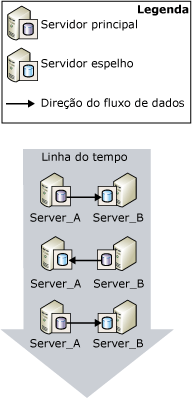
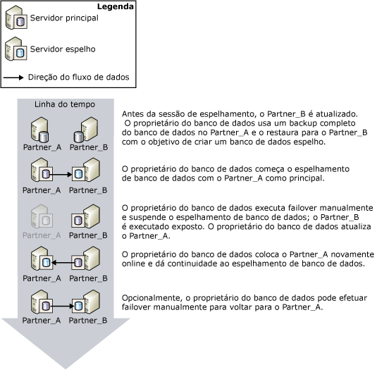
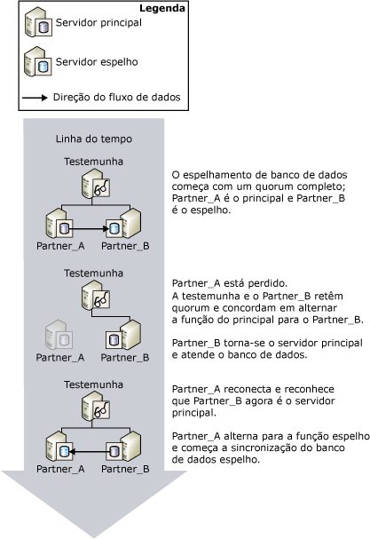
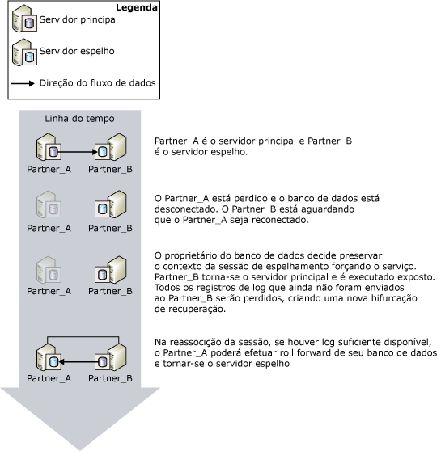

# Troca de função durante uma sessão de espelhamento de banco de dados (SQL Server)
[!INCLUDE[appliesto-ss-xxxx-xxxx-xxx-md](../../includes/appliesto-ss-xxxx-xxxx-xxx-md.md)]
  No contexto da sessão de espelhamento de banco de dados, as funções principal e espelho podem ser, normalmente, alternadas em um processo conhecido como *troca de função*. Na troca de função, o servidor espelho age como o *parceiro de failover* do servidor principal, assumindo a função principal, recuperando a cópia do banco de dados e colocando-a online como novo banco de dados principal. O antigo servidor principal, quando disponível, assume a função espelho e seu banco de dados se torna o novo banco de dados espelho. Potencialmente, as funções podem ser alternadas como resposta a várias falhas ou por razões administrativas.  
  
> [!NOTE]  
>  Este tópico pressupõe que você esteja familiarizado com os modos operacionais de espelhamento de banco de dados. Para obter mais informações, consulte [Database Mirroring Operating Modes](../../database-engine/database-mirroring/database-mirroring-operating-modes.md).  
  
 A ilustração a seguir mostra os parceiros de espelhamento, **Partner_A** e **Partner_B**, trocando as funções principal e espelho através de diversos failovers automáticos ou manuais.  
  
   
  
> [!IMPORTANT]  
>  Após a troca de função, os trabalhos executados no antigo banco de dados principal devem ser recriados no servidor principal novo para que lá sejam executados. Para obter mais informações, veja [Administração de logons e trabalhos após a troca de funções &#40;SQL Server&#41;](../../sql-server/failover-clusters/management-of-logins-and-jobs-after-role-switching-sql-server.md).  
  
 Há três tipos de troca de função: failover automático, failover manual e serviço forçado (com possível perda de dados). O suporte para cada tipo depende do modo operacional da sessão.  
  
> [!NOTE]  
>  Se você não estiver familiarizado com esses modos de operação, veja [Modos de operação do Espelhamento de Banco de Dados](../../database-engine/database-mirroring/database-mirroring-operating-modes.md).  
  
-   **Failover manual**  
  
     O modo de segurança alta oferece suporte ao failover manual. Sempre que o banco de dados for sincronizado, o proprietário do banco de dados poderá iniciar um failover manual.  
  
     O failover manual é fornecido por questões administrativas. Para obter mais informações, veja [Failover Manual](#ManualFailover), mais adiante neste tópico.  
  
-   **Failover automático**  
  
     Na presença de uma testemunha, o modo de segurança alta oferece suporte ao failover automático. O failover automático somente ocorre no servidor principal, quando a testemunha e o servidor espelho ainda estão conectados entre si e o banco de dados já está sincronizado. Para obter mais informações, veja [Failover Automático](#AutomaticFailover), mais adiante neste tópico.  
  
-   **Serviço forçado (com possível perda de dados)**  
  
     Há suporte ao recurso de forçar serviço no modo de segurança alta, quando nenhuma testemunha é definida, e no modo de alto desempenho. Se houver perda do servidor principal, o proprietário do banco de dados poderá disponibilizar o banco de dados ao forçar o serviço para o servidor espelho (com possível perda de dados).  
  
    > [!NOTE]  
    >  Nós recomendamos que a propriedade WITNESS seja definida como OFF no modo de alto desempenho. Caso contrário, para colocar o banco de dados online, o servidor espelho deverá ser conectado à testemunha.  
  
     Para obter mais informações, veja [Serviço forçado (com possível perda de dados)](#ForcedService), mais adiante neste tópico.  
  
 A tabela a seguir resume as formas de failover com suporte em cada um dos modos operacionais.  
  
||Alto desempenho|Modo de segurança alta sem testemunha|Modo de segurança alta com testemunha|  
|-|----------------------|-----------------------------------------|--------------------------------------|  
|failover automático|não|não|Sim|  
|failover manual|não|Sim|Sim|  
|Serviço forçado|Sim|Sim|não|  
  
 Após a troca de função, metadados específicos precisam estar presentes em ambos os parceiros para garantir que todos os usuários dos bancos de dados possam acessar o novo banco de dados principal. Além disso, os trabalhos de backup precisam ser criados no servidor principal novo, para garantir que o banco de dados continue a ser armazenado no cronograma habitual. Para obter mais informações, veja [Administração de logons e trabalhos após a troca de funções &#40;SQL Server&#41;](../../sql-server/failover-clusters/management-of-logins-and-jobs-after-role-switching-sql-server.md).  
  
 Durante a troca de função, a quantidade de tempo que o espelhamento de banco de dados ficará fora de serviço depende do tipo de troca de função e da causa da troca de função. Para obter mais informações, consulte [Estimar a interrupção do serviço durante troca de função &#40;Espelhamento de Banco de Dados&#41;](../../database-engine/database-mirroring/estimate-the-interruption-of-service-during-role-switching-database-mirroring.md).  
  
##   Manual Failover  
 O failover manual desconecta os clientes do banco de dados e reverte as funções dos parceiros. Apenas o modo de alta segurança oferece suporte ao failover manual.  
  
 **Nesta seção:**  
  
-   [Mantendo a disponibilidade durante as atualizações](#AvailabilityDuringUpgrades)  
  
-   [Condições exigidas para um failover manual](#ConditionsForManualFo)  
  
-   [Como o failover manual funciona](#HowManualFoWorks)  
  
###   Mantendo a disponibilidade durante as atualizações  
 O administrador de banco de dados pode usar o failover manual para atualizar o hardware ou o software sem sacrificar a disponibilidade. Para usar o espelhamento de banco de dados para atualizações de software, o servidor e/ou sistema espelho já deverá ter recebido as atualizações.  
  
> [!NOTE]  
>  O espelhamento de banco de dados deve ser capaz de fazer uma atualização sem-interrupção, mas isso não é garantido, porque as alterações futuras são desconhecidas. Para obter mais informações, veja [Atualizando instâncias espelhadas](../../database-engine/database-mirroring/upgrading-mirrored-instances.md).  
  
 A figura a seguir ilustra uma instância do uso do failover manual para manter a disponibilidade de banco de dados enquanto você atualiza uma instância de servidor de banco de dados. Quando a atualização é concluída, um administrador pode, opcionalmente, fazer failover de volta para a instância de servidor original. Isso é útil quando o administrador deseja interromper a sessão de espelhamento e usar o servidor espelho em outro lugar. Dessa forma, uma única instância de servidor pode ser usada repetidamente ao atualizar uma série de instâncias de servidor de banco de dados.  
  
   
  
###   Condições exigidas para um failover manual  
 O failover manual exige que a segurança da transação seja definida como FULL (ou seja, modo de alta segurança). Quando os parceiros estão conectados e o banco de dados já está sincronizado, há suporte ao failover manual.  
  
###   Como o failover manual funciona  
 O failover manual inicia a seguinte sequência de ações:  
  
1.  O servidor principal desconecta clientes do banco de dados principal, envia a parte final do log ao servidor espelho e, na preparação para alternar para a função espelho, define o estado de espelhamento como SYNCHRONIZING.  
  
2.  O servidor espelho registra o LSN (número de sequência de log) do último registro de log recebido do principal como o LSN do failover.  
  
    > [!NOTE]  
    >  Para exibir esse LSN, selecione a coluna **mirroring_failover_lsn** de [sys.database_mirroring &#40;Transact-SQL&#41;](../../relational-databases/system-catalog-views/sys-database-mirroring-transact-sql.md).  
  
3.  Se algum log estiver esperando na fila de restauração, o servidor espelho concluirá o roll forward do banco de dados espelho. A quantidade de tempo exigida depende da velocidade do sistema, da carga de trabalho recente e da quantidade de log na fila de restauração. Para um modo operacional síncrono, o tempo de failover pode ser regulado limitando o tamanho da fila de restauração. Porém, isso pode reduzir a velocidade do servidor principal para permitir que o servidor espelho seja mantido.  
  
    > [!NOTE]  
    >  Para saber o tamanho atual da fila de restauração, use o contador de desempenho **Fila de Restauração** do objeto de desempenho do espelhamento de banco de dados (para obter mais informações, veja [Monitorando o espelhamento de banco de dados &#40;SQL Server&#41;](../../database-engine/database-mirroring/monitoring-database-mirroring-sql-server.md)).  
  
4.  O servidor espelho se torna o servidor principal, e o servidor principal anterior se torna o novo servidor espelho.  
  
5.  O novo servidor principal reverte qualquer transação não confirmada e usa sua cópia do banco de dados online como o banco de dados principal.  
  
6.  O servidor principal anterior assume a função de espelho, e o banco de dados principal anterior se torna o banco de dados espelho. O novo servidor espelho rapidamente faz nova sincronização do novo banco de dados espelho com o novo banco de dados principal.  
  
    > [!NOTE]  
    >  Assim que o servidor espelho novo tiver sincronizado novamente os bancos de dados, o failover será novamente possível, mas na direção inversa.  
  
 Após o failover, os clientes devem se reconectar ao banco de dados principal atual. Para obter mais informações, consulte [Conectar clientes a uma sessão de espelhamento de banco de dados &#40;SQL Server&#41;](../../database-engine/database-mirroring/connect-clients-to-a-database-mirroring-session-sql-server.md).  
  
 **Para iniciar o failover manual**  
  
-   [Executar failover manualmente de uma sessão de espelhamento de banco de dados &#40;SQL Server Management Studio&#41;](../../database-engine/database-mirroring/manually-fail-over-a-database-mirroring-session-sql-server-management-studio.md)  
  
-   [Executar failover manualmente em uma sessão de espelhamento de banco de dados &#40;Transact-SQL&#41;](../../database-engine/database-mirroring/manually-fail-over-a-database-mirroring-session-transact-sql.md).  
  
##   Automatic Failover  
 Há suporte para o failover automático somente em sessões de espelhamento de banco de dados executadas com uma testemunha em modo de segurança alta (*modo de segurança alta com failover automático*). No modo de segurança alta com failover automático, depois de sincronizado o banco de dados, se o banco de dados principal ficar indisponível, ocorrerá um failover automático. Um failover automático faz com que o servidor espelho assuma a função de servidor principal e torne sua cópia do banco de dados online como o banco de dados principal. A exigência de sincronização do banco de dados evita a perda de dados durante o failover, pois toda transação confirmada no banco de dados principal também está confirmada no banco de dados espelho.  
  
> [!IMPORTANT]  
>  Para o failover automático melhorar a confiabilidade, o espelho e os bancos de dados principais devem residir em computadores diferentes.  
  
 **Nesta seção:**  
  
-   [Condições exigidas para um failover automático](#ConditionsForAutoFo)  
  
-   [Como o failover automático funciona](#HowAutoFoWorks)  
  
-   [Para desabilitar failover automático (SQL Server Management Studio)](#DisableAutoSSMS)  
  
-   [Para desabilitar o failover automático (usando o Transact-SQL)](#DisableAutoTsql)  
  
###   Condições exigidas para um failover automático  
 O failover automático exige as seguintes condições:  
  
-   A sessão de espelhamento de banco de dados deve ser executada em modo de segurança alta e deve possuir uma testemunha. Para obter mais informações, consulte [Database Mirroring Operating Modes](../../database-engine/database-mirroring/database-mirroring-operating-modes.md).  
  
-   O banco de dados espelho já deve estar sincronizado. Isso garante que todo o conteúdo do log enviado ao servidor espelho foi gravado no disco.  
  
-   O servidor principal perdeu comunicação com o restante da configuração de espelhamento de banco de dados, enquanto o espelho e a testemunha retêm quorum. Entretanto, se todas as instâncias de servidor perderem comunicação, e a testemunha e o servidor espelho recuperarem comunicação posteriormente, não ocorrerá failover automático.  
  
    > [!NOTE]  
    >  Para obter mais informações, consulte [Quorum: como uma testemunha afeta a disponibilidade do banco de dados &#40;Espelhamento de Banco de Dados&#41;](../../database-engine/database-mirroring/quorum-how-a-witness-affects-database-availability-database-mirroring.md).  
  
-   O servidor espelho detectou a perda do servidor principal.  
  
     A forma como o servidor espelho detecta uma falha do servidor principal depende do tipo de falha: rígida ou suave. Para obter mais informações, veja [Possíveis falhas durante o espelhamento de banco de dados](../../database-engine/database-mirroring/possible-failures-during-database-mirroring.md).  
  
###   Como o failover automático funciona  
 Nas condições anteriores, o failover automático inicia a seguinte sequência de ações:  
  
1.  Se o servidor principal ainda estiver em execução, o estado do banco de dados principal será alterado para DISCONNECTED e todos os clientes do banco de dados principal serão desconectados.  
  
2.  A testemunha e os servidores espelho registram que o servidor principal está indisponível.  
  
3.  Se algum log estiver esperando na fila de restauração, o servidor espelho concluirá o roll forward do banco de dados espelho.  
  
    > [!NOTE]  
    >  A quantidade de tempo exigida para aplicar o log depende da velocidade do sistema, da carga de trabalho recente e da quantidade de log na fila de restauração.  
  
4.  O banco de dados espelho anterior é movimentado online como o novo banco de dados principal, e a recuperação limpa todas as transações não confirmadas revertendo-as o mais depressa possível. Os bloqueios isolam essas transações.  
  
5.  Quando o servidor principal anterior retomar a sessão, ele reconhecerá que agora seu parceiro de failover possui a função principal. O servidor principal anterior assume a função de espelho, tornando seu banco de dados o banco de dados espelho. O novo servidor espelho sincroniza o banco de dados espelho novo com o banco de dados principal o mais rápido possível. Assim que o servidor espelho novo tiver sincronizado novamente os bancos de dados, o failover será novamente possível, mas na direção inversa.  
  
 A ilustração a seguir mostra uma única instância de failover automático.  
  
   
  
 Inicialmente, todos os três servidores estão conectados (a sessão tem quorum completo). **Partner_A** é o servidor principal e **Partner_B** é o servidor espelho. **Partner_A** (ou o banco de dados principal em **Partner_A**) torna-se indisponível. A testemunha e **Partner_B** reconhecem que o principal não está mais disponível na sessão que retém quorum. **Partner_B** se torna o servidor principal e disponibiliza sua cópia do banco de dados como o novo banco de dados principal. Por fim, o **Partner_A** se reconecta à sessão e descobre que agora o **Partner_B** possui a função principal. **Partner_A** assume a função de espelho.  
  
 Após o failover, os clientes devem se reconectar ao banco de dados principal atual. Para obter mais informações, consulte [Conectar clientes a uma sessão de espelhamento de banco de dados &#40;SQL Server&#41;](../../database-engine/database-mirroring/connect-clients-to-a-database-mirroring-session-sql-server.md).  
  
> [!NOTE]  
>  As transações que foram preparadas usando o Coordenador de Transações Distribuídas da [!INCLUDE[msCoName](../../includes/msconame-md.md)] , mas que ainda não estiverem confirmadas quando ocorrer um failover, serão consideradas anuladas depois da falha do banco de dados.  
  
###   Para desabilitar failover automático (SQL Server Management Studio)  
 Abra a página **Espelhamento das Propriedades do Banco de Dados** e altere o modo de operação, selecionando uma das seguintes opções:  
  
-   **Alta segurança sem failover automático (síncrono)**  
  
     Nesse modo, o banco de dados continua sendo sincronizado, e o failover manual continua sendo possível.  
  
-   **Alto desempenho (assíncrono)**  
  
     Nesse modo, o banco de dados espelho pode ficar um pouco atrasado em relação ao banco de dados principal, e o failover manual não seria mais possível.  
  
###   Para desabilitar o failover automático (usando o Transact-SQL)  
 Em qualquer momento da sessão de espelhamento de banco de dados, o proprietário de banco de dados pode desabilitar o failover automático desativando a testemunha.  
  
 **Para desativar a testemunha**  
  
-   [Remover a testemunha de uma sessão de espelhamento de banco de dados &#40;SQL Server&#41;](../../database-engine/database-mirroring/remove-the-witness-from-a-database-mirroring-session-sql-server.md)  
  
    > [!NOTE]  
    >  A desativação da testemunha enquanto retém a segurança de transação completa faz com que a sessão fique em modo de segurança alta sem failover automático.  
  
##   Forced Service (with Possible Data Loss)  
 O espelhamento de banco de dados permite forçar o serviço (com possível perda de dados) como método de recuperação de desastres, para permitir o uso de um servidor espelho como servidor em espera passiva. Só é possível forçar o serviço se o servidor principal estiver desconectado do servidor espelho em uma sessão de espelhamento. Já que forçar o serviço pode ocasionar a perda de dados, esse recurso deve ser usado de forma cautelosa e moderada.  
  
 O suporte para o serviço forçado depende do modo operacional e do estado da sessão, conforme a seguir:  
  
-   Normalmente, o modo de alto desempenho oferecerá suporte ao serviço forçado sempre que o servidor principal estiver desconectado. Entretanto, embora não seja necessário, pode haver uma testemunha para a sessão de modo de alto desempenho. Nesse caso, para forçar o serviço é preciso que o servidor espelho e a testemunha estejam conectados entre si.  
  
-   O modo de segurança alta sem failover automático oferecerá suporte ao recurso para forçar serviço sempre que o servidor principal estiver desconectado.  
  
-   O modo de segurança alta com failover automático oferece suporte ao forçamento do serviço sempre que o servidor espelho e a testemunha estiverem conectados entre si e nenhum dos dois estiver conectado ao servidor principal (contanto que o servidor espelho não esteja no processo de reversão do banco de dados espelho quando foi conectado ao principal pela última vez).  
  
 Recomendamos que o serviço seja forçado somente se for preciso restaurar imediatamente o serviço para o banco de dados e se estiver disposto a perder dados. O efeito do forçamento do serviço é similar à remoção de espelhamento, com exceção de que o forçamento do serviço facilitará a resincronização dos bancos de dados quando o espelhamento for reiniciado, com o risco de perda de dados. Forçar o serviço inicia uma transição uniforme da função principal para o banco de dados espelho. O servidor espelho assume a função de servidor principal e, imediatamente, serve sua cópia do banco de dados a clientes. O novo banco de dados principal é executado sem um espelho (ou seja, é executado exposto).  
  
> [!IMPORTANT]  
>  Se o servidor principal foi simplesmente desconectado da sessão de espelhamento de banco de dados e ainda estiver em execução, alguns clientes poderão continuar acessando o banco de dados principal original. Antes de forçar o serviço, é importante impedir que os clientes acessem o servidor principal original. Caso contrário, depois que o serviço for forçado, o banco de dados principal original e o banco de dados principal atual poderão ser atualizados de forma independente.  
  
 **Nesta seção:**  
  
-   [Casos comuns de serviço forçado](#TypicalCaseFS)  
  
-   [Riscos de forçar o serviço](#FSrisks)  
  
-   [Gerenciando a perda potencial de dados](#ManageDataLoss)  
  
-   [Tarefas relacionadas para gerenciar um failover forçado](#RelatedTasksForFS)  
  
###   Casos comuns de serviço forçado  
 A figura a seguir ilustra um caso comum de serviço forçado (com possível perda de dados).  
  
   
  
 Na figura, o servidor principal original, **Partner_A**, torna-se indisponível para o servidor espelho, **Partner_B**, fazendo com que o banco de dados espelho seja desconectado. Depois de garantir que **Partner_A** não está disponível aos clientes, o administrador do banco de dados força o serviço, com possível perda de dados, no **Partner_B**. **Partner_B** se torna o servidor principal e é executado com o banco de dados *exposto* (ou seja, sem estar espelhado). Nesse momento, os clientes podem se reconectar ao **Partner_B**.  
  
 Quando **Partner_A** se torna disponível, ele se reconecta ao novo servidor principal, associando-se novamente à sessão e assumindo a função espelho. A sessão de espelhamento fica imediatamente suspensa, sem sincronizar o novo banco de dados espelho. A suspensão da sessão permite que o administrador do banco de dados decida retomar a sessão ou, em casos extremos, remover e tentar recuperar os dados do antigo banco de dados principal. Nesse caso, o administrador do banco de dados escolhe retomar o espelhamento. Nesse momento, o **Partner_A** assume a função de servidor espelho e reverte o antigo banco de dados principal no ponto específico da última transação sincronizada com êxito; se nenhuma transação confirmada foi gravada em disco no servidor espelho antes de o serviço ser forçado, essas transações são perdidas. Em seguida,**Partner_A** confirma o novo banco de dados espelho, aplicando as alterações feitas no novo banco de dados principal, já que o servidor espelho antigo tornou-se o novo servidor principal.  
  
> [!NOTE]  
>  Embora o modo de alto desempenho não exija testemunhas, caso uma seja configurada, só será possível forçar o serviço se a testemunha estiver conectada ao servidor espelho no momento.  
  
###   Riscos de forçar o serviço  
 É essencial compreender que forçar o serviço pode causar perda de dados. É possível que haja perda de dados porque o servidor espelho não pode se comunicar com o servidor principal e, consequentemente, não pode garantir que os dois bancos de dados estejam sincronizados. O forçamento do serviço cria uma bifurcação da recuperação nova. Já que o banco de dados principal original e o banco de dados espelho estão em bifurcações da recuperação diferentes, cada banco de dados contém agora os dados que o outro banco de dados não tem: o banco de dados principal original contém as alterações que ainda não foram enviadas da sua fila de envio para o antigo banco de dados espelho (o log que não foi enviado); o antigo banco de dados espelho contém as alterações feitas depois que o serviço foi forçado.  
  
 Se o serviço for forçado porque o servidor principal falhou, a perda potencial de dados dependerá se os logs de transação não foram enviado ao servidor espelho antes da ocorrência da falha. No modo de segurança alta, isso só é possível até que o banco de dados espelho esteja sincronizado. No modo de alto desempenho, o log não enviado acumulado é sempre uma possibilidade.  
  
 As implicações de se forçar o serviço dependem, em parte, se a sessão tem uma testemunha:  
  
-   Na ausência de uma testemunha, o serviço poderá ser forçado se os parceiros forem desconectados, por exemplo, devido à interrupção na conexão de rede. Se o servidor principal original ainda estiver sendo executado, ambos os parceiros possuirão a função principal. Os clientes conectados ao novo servidor principal acessarão a versão atual do banco de dados, enquanto os clientes conectados ao servidor principal original acessarão o banco de dados principal original. Essa situação aumenta a possibilidade de perda de dados. Se os parceiros puderem reconectar-se, o servidor principal original assume a função espelho e altera o estado do seu banco de dados para "recuperando", antes que o espelhamento seja suspenso. Se a sessão for retomada, as transações no banco de dados principal original, cujo log estava na fila de envio na desconexão mais recente, serão perdidas. Além disso, todas as transações que ocorreram depois que o serviço foi forçado também serão perdidas.  
  
-   Na presença de uma testemunha, se o servidor espelho estiver desconectado do servidor principal e da testemunha, contanto que os dois mais recentes permaneçam conectados entre si, o principal será executado exposto. Em seguida, se o servidor principal for desconectado da testemunha, o serviço ao banco de dados será interrompido. Posteriormente, se o servidor espelho reconectar-se à testemunha, será possível forçar o serviço. Se o serviço for forçado, todas as alterações feitas enquanto o servidor principal original estiver em execução serão perdidas caso o servidor principal original seja reconectado.  
  
 Para obter mais informações, veja [Gerenciando a perda potencial de dados](#ManageDataLoss), mais adiante neste tópico.  
  
###   Gerenciando a perda potencial de dados  
 Depois que o serviço é forçado, assim que o antigo servidor principal estiver disponível, pressupondo que o seu banco de dados não foi danificado, é possível tentar gerenciar a perda potencial de dados. A abordagem disponível para o gerenciamento da perda potencial de dados depende se o servidor principal original foi conectado ao seu parceiro e associado novamente à sessão de espelhamento. Presumindo que o servidor principal original pode acessar a instância principal nova, a reconexão ocorre de forma automática e transparente.  
  
#### O servidor principal original foi reconectado  
 Normalmente, depois de uma falha, quando o servidor principal original reinicia, reconecta-se rapidamente ao seu parceiro. Na reconexão, o servidor principal original se torna o servidor espelho. Seu banco de dados se torna o banco de dados espelho e insere o estado recuperando antes de a sessão ser suspensa. O banco de dados espelho não será revertido a menos que o espelhamento seja retomado.  
  
 Entretanto, o banco de dados de recuperação não pode ser acessado, por isso, não é possível inspecioná-lo para avaliar os dados que seriam perdidos caso o espelhamento retomasse. Assim, a decisão de retomar ou remover o espelhamento depende se é aceitável a perda dos dados.  
  
-   Se a perda dos dados for inaceitável, é necessário remover o espelhamento para resgatá-los.  
  
     A remoção do espelhamento permitiria que os administradores de banco de dados recuperassem o banco de dados principal original e tentassem recuperar os dados perdidos. Entretanto, quando o antigo banco de dados espelho fica online, os parceiros antigos estarão servindo bancos de dados divergentes com o mesmo nome. O administrador do banco de dados precisa tornar um dos bancos de dados inacessível aos clientes para evitar divergência posterior do banco de dados e para impedir problemas de failover do cliente.  
  
-   Se perder todos dados for aceitável, será possível retomar o espelhamento.  
  
     Continuar o espelhamento faz com que o banco de dados espelho novo seja revertido, conforme a primeira etapa da sincronização do banco de dados. Se houver registros de log aguardando na fila de envio no momento da falha, as transações correspondentes serão perdidas, mesmo se tiverem sido confirmadas.  
  
#### O servidor principal original não foi reconectado  
 Se for possível impedir temporariamente que o servidor principal original seja reconectado na rede ao servidor principal novo, você poderá inspecionar o banco de dados principal original para avaliar os dados que seriam perdidos caso o espelhamento retomasse.  
  
-   Se a perda potencial de dados for aceitável  
  
     Permita que o servidor principal original reconecte-se a seu parceiro. A reconexão faz com que o espelhamento seja suspenso. Para prosseguir com o espelhamento, simplesmente retome a sessão. O antigo servidor principal assume a função de espelho. O servidor espelho novo libera a bifurcação de recuperação original, perdendo as transações que nunca foram enviadas ou recebidas pelo servidor espelho antigo.  
  
-   Se a perda de dados for inaceitável  
  
     Se o banco de dados principal contiver dados críticos que seriam perdidos caso a sessão retomasse, será possível preservar os dados no servidor principal original, removendo o espelhamento. Nós recomendamos que se tente fazer backup da parte final do log principal neste momento. Em seguida, é possível atualizar o servidor principal atual (antigo banco de dados espelho) exportando os dados que devem ser recuperados do banco de dados principal original e importando-os para o banco de dados principal atual. Recomendamos fazer um backup completo do banco de dados atualizado o mais rápido possível.  
  
     Para restabelecer o espelhamento com o banco de dados atualizado como banco de dados principal inicial, use esse backup (pelo menos, um backup de log subsequente) para criar um novo banco de dados espelho. Todo backup de log feito depois que o espelhamento foi removido deve ser aplicado. Consequentemente, recomendamos que os backups de log adicionais do banco de dados principal sejam adiados até que a nova sessão de espelhamento seja iniciada.  
  
###   Tarefas relacionadas para gerenciar um failover forçado  
 **Para forçar o serviço**  
  
-   [Forçar serviço em uma sessão de espelhamento de banco de dados &#40;Transact-SQL&#41;](../../database-engine/database-mirroring/force-service-in-a-database-mirroring-session-transact-sql.md).  
  
 **Para retomar o espelhamento de banco de dados.**  
  
-   [Pausar ou retomar uma sessão de espelhamento de banco de dados &#40;SQL Server&#41;](../../database-engine/database-mirroring/pause-or-resume-a-database-mirroring-session-sql-server.md)  
  
 **Para criar um novo banco de dados espelho**  
  
 [Preparar um banco de dados espelho para espelhamento &#40;SQL Server&#41;](../../database-engine/database-mirroring/prepare-a-mirror-database-for-mirroring-sql-server.md)  
  
 **Para inicializar o espelhamento de banco de dados**  
  
-   [Configurando o espelhamento de banco de dados &#40;SQL Server&#41;](../../database-engine/database-mirroring/setting-up-database-mirroring-sql-server.md)  
  
-   [Estabelecer uma sessão de espelhamento de banco de dados usando a Autenticação do Windows &#40;SQL Server Management Studio&#41;](../../database-engine/database-mirroring/establish-database-mirroring-session-windows-authentication.md)  
  
## Consulte Também  
 [Estimar a interrupção do serviço durante troca de função &#40;Espelhamento de Banco de Dados&#41;](../../database-engine/database-mirroring/estimate-the-interruption-of-service-during-role-switching-database-mirroring.md)   
 [Possíveis falhas durante o espelhamento de banco de dados](../../database-engine/database-mirroring/possible-failures-during-database-mirroring.md)   
 [Conectar clientes a uma sessão de espelhamento de banco de dados &#40;SQL Server&#41;](../../database-engine/database-mirroring/connect-clients-to-a-database-mirroring-session-sql-server.md)   
 [Testemunha de espelhamento de banco de dados](../../database-engine/database-mirroring/database-mirroring-witness.md)   
 [Restaurações completas de banco de dados &#40;Modelo de recuperação completa&#41;](../../relational-databases/backup-restore/complete-database-restores-full-recovery-model.md)   
 [Modos de operação de espelhamento de banco de dados](../../database-engine/database-mirroring/database-mirroring-operating-modes.md)   
 [Estados de espelhamento &#40;SQL Server&#41;](../../database-engine/database-mirroring/mirroring-states-sql-server.md)  
  
  
