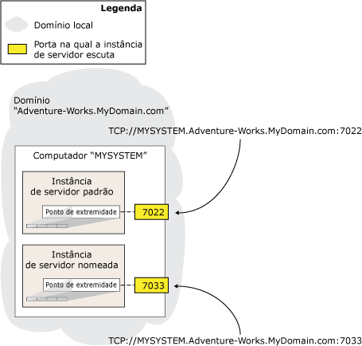

# O ponto de extremidade de espelhamento de banco de dados (SQL Server)
[!INCLUDE[appliesto-ss-xxxx-xxxx-xxx-md](../../includes/appliesto-ss-xxxx-xxxx-xxx-md.md)] Participar do [!INCLUDE[ssHADR](../../includes/sshadr-md.md)] ou fazer o espelhamento de banco de dados de uma instância de servidor requer seu próprio *ponto de extremidade de espelhamento de banco de dados* dedicado. Esse ponto de extremidade é um ponto de extremidade com finalidade especial usado exclusivamente para receber conexões de outras instâncias de servidor. Em uma determinada instância de servidor, toda conexão de espelhamento do [!INCLUDE[ssHADR](../../includes/sshadr-md.md)] ou de banco de dados com qualquer outra instância de servidor usa um único ponto de extremidade de espelhamento de banco de dados.  
  
 Os pontos de espelhamento de banco de dados usam o Protocolo de Controle de Transmissão (TCP) para enviar e receber mensagens entre as instâncias de servidor que participam das sessões do espelhamento de banco de dados ou hospedam réplicas de disponibilidade. O ponto de extremidade de espelhamento de banco de dados escuta em um exclusivo número de porta TCP.  
  
> [!NOTE]  
>  Conexões de cliente para um servidor principal ou uma réplica primária não usam o ponto de extremidade de espelhamento de banco de dados.  
  
> [!NOTE]  
>  O recurso de espelhamento de banco de dados será removido em uma versão futura do Microsoft SQL Server. Evite usar esse recurso em desenvolvimentos novos e planeje modificar os aplicativos que atualmente usam o espelhamento de banco de dados para usar o [!INCLUDE[ssHADR](../../includes/sshadr-md.md)] .  
  
  
##   Endereços de rede do servidor  
 O endereço de rede de uma instância de servidor (seu *endereço de rede de servidor* ou *URL do ponto de extremidade*) contém o número da porta de seu ponto de extremidade, como também o nome de sistema e nome de domínio do seu computador host. O número da porta identifica uma instância de servidor específica exclusivamente.  
  
 A figura seguinte ilustra como duas instâncias de servidor no mesmo servidor são identificadas exclusivamente. Os endereços de rede de servidor de ambas as instâncias de servidor contêm o mesmo nome de sistema, `MYSYSTEM`e nome de domínio, `Adventure-Works.MyDomain.com`. Para permitir o sistema a rotear conexões para uma instância de servidor, um endereço de rede de servidor inclui o número da porta associado ao ponto de extremidade de espelhamento de uma instância de servidor particular.  
  
   
  
 Por padrão, uma instância de [!INCLUDE[ssNoVersion](../../includes/ssnoversion-md.md)] não contém um ponto de extremidade de espelhamento de banco de dados. Estes devem ser criados manualmente como parte da configuração de uma sessão de espelhamento de banco de dados. O administrador de sistema deve criar um ponto de extremidade separado em cada instância de servidor que participará em espelhamento de banco de dados. Observe que se mais de uma instância de servidor em um determinado computador exigir um ponto de extremidade de espelhamento de banco de dados, especifique um número de porta diferente para cada ponto de extremidade.  
  
> [!IMPORTANT]  
>  Se o computador que executa [!INCLUDE[ssNoVersion](../../includes/ssnoversion-md.md)] tiver um firewall, a configuração de firewall deve permitir conexões de entrada e de saída para a porta especificada no ponto de extremidade.  
  
 Para o espelhamento de banco de dados e [!INCLUDE[ssHADR](../../includes/sshadr-md.md)], a autenticação e a criptografia são configuradas no ponto de extremidade. Para obter mais informações, consulte [Segurança de transporte para espelhamento de banco de dados e Grupos de Disponibilidade AlwaysOn (SQL Server)](../../database-engine/database-mirroring/transport-security-database-mirroring-always-on-availability.md).  
  
> [!IMPORTANT]  
>  Não reconfigure um ponto de extremidade de espelhamento de banco de dados em uso. Cada instância de servidor usa o ponto de extremidade do outro para aprender o estado dos outros sistemas. Se o ponto de extremidade for reconfigurado, poderia reinicializar, o que pode parecer ser um erro para as outras instâncias de servidor. Isso é particularmente importante no modo de failover automático no qual a reconfiguração de um ponto de extremidade em um parceiro poderia provocar um failover.  
  
  
##   Determinando o tipo de autenticação para um ponto de extremidade de espelhamento de banco de dados  
 É importante entender que as contas de serviço do [!INCLUDE[ssNoVersion](../../includes/ssnoversion-md.md)] de suas instâncias de servidor determinam que tipo de autenticação você pode usar para seus pontos de extremidade de espelhamento de banco de dados, desta forma:  
  
-   Se cada instância de servidor estiver em execução em uma conta de serviço de domínio, você poderá usar a Autenticação do Windows para seus pontos de extremidade de espelhamento de banco de dados. Se todas as instâncias de servidor forem executadas como a mesma conta de usuário do domínio, os logons de usuário corretos existirão automaticamente em ambos os bancos de dados **mestres** . Isso simplifica a configuração da segurança dos bancos de dados de disponibilidade e é recomendável.  
  
     Se qualquer instância de servidor que hospeda as réplicas de disponibilidade para um grupo de disponibilidade for executada como contas diferentes, o logon de cada conta deve ser criado no **mestre** na outra instância de servidor. Em seguida, esse logon deve receber permissões CONNECT para conectar ao ponto de extremidade de espelhamento de banco de dados dessa instância de servidor. Para obter mais informações, [Configurar contas de logon para espelhamento de banco de dados ou para Grupos de Disponibilidade AlwaysOn (SQL Server)](../../database-engine/database-mirroring/set-up-login-accounts-database-mirroring-always-on-availability.md).  
  
     Se suas instâncias de servidor usarem a Autenticação do Windows, você poderá criar pontos de extremidade de espelhamento de banco de dados usando o [!INCLUDE[tsql](../../includes/tsql-md.md)], o PowerShell ou o Assistente de Novo Grupo de Disponibilidade.  
  
    > [!NOTE]  
    >  Se uma instância de servidor que deve hospedar uma réplica de disponibilidade não tiver um ponto de extremidade de espelhamento de banco de dados, o Assistente de Novo Grupo de Disponibilidade poderá criar um ponto de extremidade de espelhamento de banco de dados que use a Autenticação do Windows. Para obter mais informações, consulte [Usar a caixa de diálogo Assistente de Grupo de Disponibilidade (SQL Server Management Studio)](../../database-engine/availability-groups/windows/use-the-availability-group-wizard-sql-server-management-studio.md).  
  
-   Se alguma instância de servidor estiver em execução em uma conta interna, como Sistema Local, Serviço Local ou Serviço de Rede, ou em uma conta que não pertença a um domínio, você deverá usar certificados para autenticação de ponto de extremidade. Se você estiver usando certificados para pontos de extremidade de espelhamento de banco de dados, o administrador do sistema deverá configurar cada instância de servidor para usar certificados nas conexões de saída e de entrada.  
  
     Não há nenhum método automatizado para configurar a segurança do espelhamento de banco de dados usando certificados. Você precisará usar a instrução CREATE ENDPOINT [!INCLUDE[tsql](../../includes/tsql-md.md)] ou o cmdlet **New-SqlHadrEndpoint** do PowerShell. Para obter mais informações, veja [CREATE ENDPOINT (Transact-SQL)](../../t-sql/statements/create-endpoint-transact-sql.md). Para obter informações sobre como habilitar a autenticação de certificado em uma instância de servidor, consulte [Usar certificados para um ponto de extremidade de Espelhamento de Banco de Dados (Transact-SQL)](../../database-engine/database-mirroring/use-certificates-for-a-database-mirroring-endpoint-transact-sql.md).  
  
  
##   Tarefas relacionadas  
 **Para configurar um ponto de extremidade de espelhamento de banco de dados**  
  
-   [Criar um ponto de extremidade de espelhamento de banco de dados para a Autenticação do Windows (Transact-SQL)](../../database-engine/database-mirroring/create-a-database-mirroring-endpoint-for-windows-authentication-transact-sql.md)  
  
-   [Usar certificados para um ponto de extremidade de Espelhamento de Banco de Dados (Transact-SQL)](../../database-engine/database-mirroring/use-certificates-for-a-database-mirroring-endpoint-transact-sql.md)  
  
    -   [Permitir que um ponto de extremidade de espelhamento de banco de dados use certificados para conexões de saída (Transact-SQL)](../../database-engine/database-mirroring/database-mirroring-use-certificates-for-outbound-connections.md)  
  
    -   [Permitir que um ponto de extremidade de espelhamento de banco de dados use certificados para conexões de entrada (Transact-SQL)](../../database-engine/database-mirroring/database-mirroring-use-certificates-for-inbound-connections.md)  
  
-   [Especificar um endereço de rede do servidor (Espelhamento de banco de dados)](../../database-engine/database-mirroring/specify-a-server-network-address-database-mirroring.md)  
  
-   [Especifique a URL do Ponto de Extremidade Ao Adicionar ou Modificando uma Réplica de disponibilidade (SQL Server)](../../database-engine/availability-groups/windows/specify-endpoint-url-adding-or-modifying-availability-replica.md)  
  
-   [Usar a caixa de diálogo Assistente de Grupo de Disponibilidade (SQL Server Management Studio)](../../database-engine/availability-groups/windows/use-the-availability-group-wizard-sql-server-management-studio.md)  
  
 **Para exibir informações sobre o ponto de extremidade de espelhamento de banco de dados**  
  
-   [sys.database_mirroring_endpoints (Transact-SQL)](../../relational-databases/system-catalog-views/sys-database-mirroring-endpoints-transact-sql.md)  
  
  
## Consulte Também  
 [Segurança de transporte para espelhamento de banco de dados e Grupos de Disponibilidade AlwaysOn (SQL Server)](../../database-engine/database-mirroring/transport-security-database-mirroring-always-on-availability.md)   
 [Solução de problemas de configuração de espelhamento de banco de dados (SQL Server)](../../database-engine/database-mirroring/troubleshoot-database-mirroring-configuration-sql-server.md)   
 [sys.dm_hadr_availability_replica_states (Transact-SQL)](../../relational-databases/system-dynamic-management-views/sys-dm-hadr-availability-replica-states-transact-sql.md)   
 [sys.dm_db_mirroring_connections (Transact-SQL)](../../relational-databases/system-dynamic-management-views/database-mirroring-sys-dm-db-mirroring-connections.md)  
  
  
