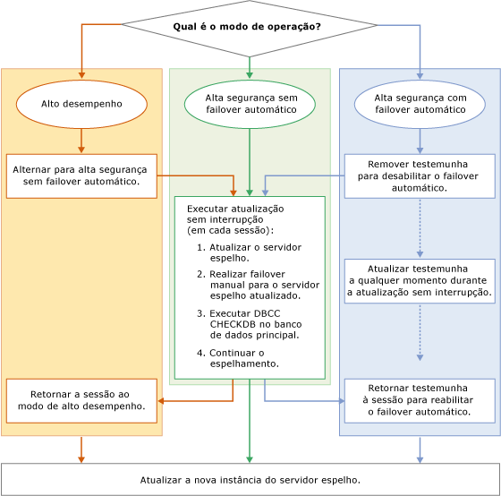

# Atualização de Instâncias Espelhadas
[!INCLUDE[appliesto-ss-xxxx-xxxx-xxx-md](../../includes/appliesto-ss-xxxx-xxxx-xxx-md.md)]
  Ao atualizar uma instância espelhada do [!INCLUDE[ssNoVersion](../../includes/ssnoversion-md.md)] para uma nova versão do [!INCLUDE[ssCurrent](../../includes/sscurrent-md.md)] , para um novo service pack ou uma atualização cumulativa do [!INCLUDE[ssNoVersion](../../includes/ssnoversion-md.md)]ou para um novo service pack ou atualização cumulativa do Windows, você pode reduzir o tempo de inatividade para cada banco de dados espelhado para um único failover manual executando uma atualização sem interrupção (ou dois failovers manuais em caso de failback para a primária original). Uma atualização sem-interrupção consiste em um processo de várias etapas que, em sua forma mais simples, envolve atualizar a instância do [!INCLUDE[ssCurrent](../../includes/sscurrent-md.md)] que funciona como o servidor espelho de uma sessão de espelhamento, executar o failover manual no banco de dados espelhado, atualizar a antiga instância principal do [!INCLUDE[ssCurrent](../../includes/sscurrent-md.md)] e retomar o espelhamento. Na prática, o processo exato dependerá do modo de operação e do número e do layout de sessões de espelhamento em execução nas instâncias do [!INCLUDE[ssCurrent](../../includes/sscurrent-md.md)] que você está atualizando.  
  
> [!NOTE]  
>  Para saber mais sobre como usar o espelhamento de banco de dados com envio de log durante a migração, baixe este [white paper sobre Espelhamento de Banco de Dados e Envio de Log](https://t.co/RmO6ruCT4J).  
  
## Prerequisites  
 Antes de começar, examine as seguintes informações importantes:  
  
-   [Atualizações compatíveis de versão e edição](../../database-engine/install-windows/supported-version-and-edition-upgrades.md): Verifique se você pode atualizar para o SQL Server 2016 de sua versão do sistema operacional Windows e da versão do SQL Server. Por exemplo, não é possível atualizar diretamente de uma instância do SQL Server 2005 para o [!INCLUDE[ssCurrent](../../includes/sscurrent-md.md)].  
  
-   [Escolher um método de atualização do mecanismo de banco de dados](../../database-engine/install-windows/choose-a-database-engine-upgrade-method.md): selecione o método e as etapas de atualização apropriados com base em sua análise de atualizações de versão e de edição com suporte e também com base em outros componentes instalados em seu ambiente a fim de atualizar os componentes na ordem correta.  
  
-   [Planejar e testar o plano de atualização do mecanismo de banco de dados](../../database-engine/install-windows/plan-and-test-the-database-engine-upgrade-plan.md): Analise as notas de versão e os problemas conhecidos da atualização, a lista de verificação pré-atualização, e desenvolva e teste o plano de atualização.  
  
-   [Requisitos de hardware e software para a instalação do SQL Server 2016](../../sql-server/install/hardware-and-software-requirements-for-installing-sql-server.md):  Analise os requisitos de software para a instalação do [!INCLUDE[ssCurrent](../../includes/sscurrent-md.md)]. Se for necessário um software adicional, instale-o em cada nó antes de começar o processo de atualização para minimizar qualquer tempo de inatividade.  
  
## Preparação recomendada (práticas recomendadas)  
 Antes de iniciar uma atualização sem-interrupção, é recomendável:  
  
1.  Executar um failover manual em pelo menos uma das sessões de espelhamento:  
  
    -   [Executar failover manualmente de uma sessão de espelhamento de banco de dados &#40;SQL Server Management Studio&#41;](../../database-engine/database-mirroring/manually-fail-over-a-database-mirroring-session-sql-server-management-studio.md)  
  
    -   [Executar failover manualmente em uma sessão de espelhamento de banco de dados &#40;Transact-SQL&#41;](../../database-engine/database-mirroring/manually-fail-over-a-database-mirroring-session-transact-sql.md).  
  
    > [!NOTE]  
    >  Para obter informações sobre como funciona o failover manual, veja [Troca de função durante uma sessão de espelhamento de banco de dados &#40;SQL Server&#41;](../../database-engine/database-mirroring/role-switching-during-a-database-mirroring-session-sql-server.md).  
  
2.  Proteger seus dados:  
  
    1.  Executar um backup de banco de dados completo em todos os bancos de dados principais:  
  
         [Criar um backup completo de banco de dados &#40;SQL Server&#41;](../../relational-databases/backup-restore/create-a-full-database-backup-sql-server.md).  
  
    2.  Execute o comando [DBCC CHECKDB](../../t-sql/database-console-commands/dbcc-checkdb-transact-sql.md) em todos os bancos de dados principais.  
  
## Etapas da atualização sem-interrupção  
 As etapas específicas de uma atualização sem-interrupção dependem do modo de operação da configuração de espelhamento. No entanto, as etapas básicas são as mesmas.  
  
> [!NOTE]  
>  Para obter informações sobre os modos de operação, consulte [Modos de operação do Espelhamento de Banco de Dados](../../database-engine/database-mirroring/database-mirroring-operating-modes.md).  
  
 A ilustração a seguir é um fluxograma que mostra as etapas básicas de uma atualização sem-interrupção para cada modo de operação. Os procedimentos correspondentes estão descritos após a ilustração.  
  
   
  
> [!IMPORTANT]  
>  Uma instância do servidor pode estar executando diferentes funções de espelhamento (servidor principal, servidor espelho ou testemunha) nas sessões de espelhamento simultâneas. Nesse caso, é preciso adaptar o processo básico de atualização sem-interrupção na mesma proporção. Para obter mais informações, veja [Troca de função durante uma sessão de espelhamento de banco de dados &#40;SQL Server&#41;](../../database-engine/database-mirroring/role-switching-during-a-database-mirroring-session-sql-server.md).  
  
> [!NOTE]  
>  Em muitos casos, após a atualização sem interrupção, você executará failback para o servidor principal original.  
  
### Para alterar uma sessão em modo de alto desempenho para modo de segurança alta  
  
1.  Se a sessão de espelhamento estiver sendo executada em modo de alto desempenho, antes de executar a atualização sem-interrupção, altere o modo operacional para segurança alta sem failover automático.  
  
    > [!IMPORTANT]  
    >  Se o servidor espelho está geograficamente distante do servidor principal, uma atualização sem-interrupção pode ser inadequada.  
  
    -   Em [!INCLUDE[ssManStudioFull](../../includes/ssmanstudiofull-md.md)]: altere a opção **Modo de operação** para **Segurança alta sem failover automático (síncrono)** usando a [página Espelhamento](../../relational-databases/databases/database-properties-mirroring-page.md) da caixa de diálogo **Propriedades do Banco de Dados**. Para obter informações sobre como acessar essa página, consulte [Iniciar o Assistente para Configurar Segurança de Espelhamento de Banco de Dados &#40;SQL Server Management Studio&#41;](../../database-engine/database-mirroring/start-the-configuring-database-mirroring-security-wizard.md).  
  
    -   Em [!INCLUDE[tsql](../../includes/tsql-md.md)]: defina a segurança de transações para FULL. Para obter mais informações, consulte [Alterar a segurança da transação em uma sessão de espelhamento de banco de dados &#40;Transact-SQL&#41;](../../database-engine/database-mirroring/change-transaction-safety-in-a-database-mirroring-session-transact-sql.md)  
  
### Para remover uma testemunha de uma sessão  
  
1.  Se a sessão de espelhamento envolver uma testemunha, recomendamos a remoção da testemunha antes de executar a atualização sem-interrupção. Caso contrário, quando a instância do servidor espelho estiver sendo atualizada, a disponibilidade do banco de dados dependerá da testemunha que permanece conectada à instância do servidor principal. Depois que remover uma testemunha, é possível atualizá-la a qualquer momento durante o processo de atualização sem-interrupção sem arriscar o tempo de inatividade do banco de dados.  
  
    > [!NOTE]  
    >  Para obter mais informações, confira [Quorum: Como uma testemunha afeta a disponibilidade do banco de dados &#40;Espelhamento de Banco de Dados&#41;](../../database-engine/database-mirroring/quorum-how-a-witness-affects-database-availability-database-mirroring.md).  
  
    -   [Remover a testemunha de uma sessão de espelhamento de banco de dados &#40;SQL Server&#41;](../../database-engine/database-mirroring/remove-the-witness-from-a-database-mirroring-session-sql-server.md)  
  
### Para executar a atualização sem-interrupção  
  
1.  Para minimizar o tempo de inatividade, recomendamos o seguinte: inicie a atualização sem-interrupção atualizando qualquer parceiro de espelhamento que no momento seja o servidor espelho em todas as suas sessões de espelhamento. Pode ser necessário atualizar várias instâncias do servidor neste momento.  
  
    > [!NOTE]  
    >  Uma testemunha pode ser atualizada em qualquer ponto do processo de atualização sem-interrupção. Por exemplo, se uma instância do servidor for um servidor espelho na Sessão 1 e for uma testemunha na Sessão 2, será possível atualizar a instância do servidor agora.  
  
     A instância do servidor a ser atualizada primeiro depende da configuração atual de suas sessões de espelhamento, como a seguir:  
  
    -   Se qualquer instância de servidor já for o servidor espelho em todas as suas sessões de espelhamento, atualize a instância de servidor para a nova versão.  
  
    -   Se todas as instâncias de servidor forem atualmente o servidor principal em quaisquer sessões de espelhamento, selecione uma instância de servidor para atualizar primeiro. Em seguida, execute manualmente um failover em cada um de seus bancos de dados principais e atualize essa instância de servidor.  
  
     Depois de ser atualizada, a instância do servidor retoma automaticamente cada uma das sessões de espelhamento.  
  
2.  Em cada sessão de espelhamento cuja instância do servidor de espelho acabou de ser atualizada, aguarde a sessão ser sincronizada. Depois, conecte-se à instância do servidor principal e execute o failover manual na sessão. Em failover, a instância do servidor atualizada torna-se o servidor principal para aquela sessão e o servidor principal anterior torna-se o servidor espelho.  
  
     O objetivo dessa etapa é que outra instância do servidor torne-se o servidor espelho em cada sessão de espelhamento na qual é um parceiro.  
  
     **Restrições depois da execução de failover para uma instância de servidor atualizada.**  
  
     Depois de executar failover de uma instância de servidor anterior para uma instância do servidor do [!INCLUDE[ssCurrent](../../includes/sscurrent-md.md)] , a sessão de banco de dados é suspensa. Ela não pode ser retomada até que o outro parceiro seja atualizado. Porém, o servidor principal ainda aceita conexões e permite acesso a dados e modificações no banco de dados principal.  
  
    > [!NOTE]  
    >  O estabelecimento de uma nova sessão de espelhamento exige que todas as instâncias de servidor estejam executando a mesma versão do [!INCLUDE[ssNoVersion](../../includes/ssnoversion-md.md)].  
  
3.  Depois de executar o failover, recomendamos a execução do comando [DBCC CHECKDB](../../t-sql/database-console-commands/dbcc-checkdb-transact-sql.md) no banco de dados principal.  
  
4.  Atualize cada instância de servidor que seja agora o servidor espelho em todas as sessões de espelhamento nas quais é um parceiro. Pode necessário atualizar vários servidores nesse momento.  
  
    > [!IMPORTANT]  
    >  Em uma configuração de espelhamento complexa, algumas instâncias do servidor podem ainda ser o servidor principal original em uma ou mais sessões de espelhamento. Repita as etapas 2 a 4 para essas instâncias do servidor até que todas as instâncias envolvidas sejam atualizadas.  
  
5.  Continue a sessão de espelhamento.  
  
    > [!NOTE]  
    >  O failover automático não funcionará até que a testemunha tenha sido atualizada e novamente adicionada à sessão de espelhamento.  
  
6.  Atualize qualquer instância de servidor restante que seja a testemunha em todas as suas sessões de espelhamento. Depois que uma testemunha atualizada voltar a uma sessão de espelhamento, o failover automático torna-se possível novamente. Pode necessário atualizar vários servidores nesse momento.  
  
### Para retornar a uma sessão em modo de alto desempenho  
  
1.  Opcionalmente, retorne ao modo de alto desempenho usando um dos seguintes métodos:  
  
    -   Em [!INCLUDE[ssManStudioFull](../../includes/ssmanstudiofull-md.md)]: altere a opção **Modo de operação** para **Alto desempenho (assíncrono)** usando a [página Espelhamento](../../relational-databases/databases/database-properties-mirroring-page.md) da caixa de diálogo **Propriedades do Banco de Dados** .  
  
    -   Em [!INCLUDE[tsql](../../includes/tsql-md.md)]: use [ALTER DATABASE](../../t-sql/statements/alter-database-transact-sql-database-mirroring.md)para definir a segurança de transações como OFF.  
  
### Para adicionar uma testemunha de volta a uma sessão de espelhamento  
  
1.  Opcionalmente, em modo de segurança alta, restabeleça a testemunha para cada sessão de espelhamento.  
  
     **Para retornar uma testemunha**  
  
    -   [Adicionar ou substituir uma testemunha de espelhamento de banco de dados &#40;SQL Server Management Studio&#41;](../../database-engine/database-mirroring/add-or-replace-a-database-mirroring-witness-sql-server-management-studio.md)  
  
    -   [Adicionar uma testemunha de espelhamento de banco de dados usando a Autenticação do Windows &#40;Transact-SQL&#41;](../../database-engine/database-mirroring/add-a-database-mirroring-witness-using-windows-authentication-transact-sql.md)  
  
## Consulte Também  
 [Atualizar para o SQL Server 2016 usando o Assistente de Instalação &#40;Instalação&#41;](../../database-engine/install-windows/upgrade-sql-server-using-the-installation-wizard-setup.md)   
 [Instalar o SQL Server 2016 do prompt de comando](../../database-engine/install-windows/install-sql-server-2016-from-the-command-prompt.md)   
 [Espelhamento de banco de dados ALTER DATABASE &#40;Transact-SQL&#41;](../../t-sql/statements/alter-database-transact-sql-database-mirroring.md)   
 [BACKUP &#40;Transact-SQL&#41;](../../t-sql/statements/backup-transact-sql.md)   
 [Exibir o estado de um banco de dados espelhado &#40;SQL Server Management Studio&#41;](../../database-engine/database-mirroring/view-the-state-of-a-mirrored-database-sql-server-management-studio.md)   
 [Espelhamento de banco de dados &#40;SQL Server&#41;](../../database-engine/database-mirroring/database-mirroring-sql-server.md)   
 [Troca de função durante uma sessão de espelhamento de banco de dados &#40;SQL Server&#41;](../../database-engine/database-mirroring/role-switching-during-a-database-mirroring-session-sql-server.md)   
 [Forçar o serviço em uma sessão de espelhamento de banco de dados &#40;Transact-SQL&#41;](../../database-engine/database-mirroring/force-service-in-a-database-mirroring-session-transact-sql.md)   
 [Iniciar o Monitor de Espelhamento de Banco de Dados &#40;SQL Server Management Studio&#41;](../../database-engine/database-mirroring/start-database-mirroring-monitor-sql-server-management-studio.md)   
 [Modos de operação do Espelhamento de Banco de Dados](../../database-engine/database-mirroring/database-mirroring-operating-modes.md)  
  
  
