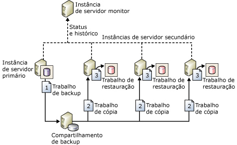

# Sobre o envio de logs (SQL Server)

[!INCLUDE[appliesto-ss-xxxx-xxxx-xxx-md-winonly](../../includes/appliesto-ss-xxxx-xxxx-xxx-md-winonly.md)]

  [!INCLUDE[ssNoVersion](../../includes/ssnoversion-md.md)] permite o envio automático de backups do log de transações de um *banco de dados primário* em uma instância do *servidor primário* para um ou mais *banco de dados secundário* em outras instâncias de *servidor secundário* . Os backups de logs de transação são aplicados individualmente aos bancos de dados secundários. Uma terceira instância de servidor opcional, conhecida como *servidor monitor*, registra o histórico e o status das operações de backup e restauração e, opcionalmente, emite alertas se essas operações não forem executadas como foram agendadas.  
  
 **Neste tópico:**  
  
-   [Benefícios](#Benefits)  
  
-   [Termos e definições](#TermsAndDefinitions)  
  
-   [Visão geral do envio de log](#ComponentsAndConcepts)  
  
-   [Interoperabilidade](#Interoperability)  
  
-   [Tarefas relacionadas](#RelatedTasks)  
  
##   Benefícios  
  
-   Fornece uma solução de recuperação de desastres para um único banco de dados primário e um ou mais bancos de dados secundários, cada um em uma instância separada do [!INCLUDE[ssNoVersion](../../includes/ssnoversion-md.md)].  
  
-   Dá suporte a acesso somente leitura limitado a bancos de dados secundários (durante o intervalo entre trabalhos de restauração).  
  
-   Permite um atraso especificado pelo usuário entre o momento em que o servidor primário faz backup do log do banco de dados primário e quando os servidores secundários devem restaurar (aplicar) o backup do log. Um atraso mais longo pode ser útil, por exemplo, se dados forem alterados acidentalmente no banco de dados primário. Se a alteração acidental for notada rapidamente, um atraso pode permitir que você recupere dados ainda inalterados de um banco de dados secundário, antes que a alteração seja refletida lá.  
  
##   Termos e definições  
 servidor primário  
 A instância do [!INCLUDE[ssNoVersion](../../includes/ssnoversion-md.md)] que é seu servidor de produção.  
  
 banco de dados primário  
 O banco de dados no servidor primário cujo backup você quer fazer e enviar para outro servidor. Toda a administração da configuração de envio de logs pelo [!INCLUDE[ssManStudioFull](../../includes/ssmanstudiofull-md.md)] é realizada a partir do banco de dados primário.  
  
 servidor secundário  
 A instância do [!INCLUDE[ssNoVersion](../../includes/ssnoversion-md.md)] onde você deseja manter uma cópia de espera passiva de seu banco de dados primário.  
  
 banco de dados secundário  
 A cópia de espera passiva do banco de dados primário. O banco de dados secundário pode estar no estado RECOVERING ou no estado STANDBY, o que deixa o banco de dados disponível para acesso limitado de somente leitura.  
  
 servidor monitor  
 Uma instância opcional do [!INCLUDE[ssNoVersion](../../includes/ssnoversion-md.md)] que rastreia todos os detalhes do envio de log, incluindo:  
  
-   A data do último backup do log de transações do banco de dados primário.  
  
-   A data da última vez em que os arquivos de backup foram copiados e restaurados nos servidores secundários.  
  
-   Informações sobre qualquer alerta de falha de backup.  
  
> [!IMPORTANT]  
>  Uma vez configurado o servidor monitor, ele não pode ser alterado sem antes remover o envio de log.  
  
 trabalho de backup  
 Um trabalho do [!INCLUDE[ssNoVersion](../../includes/ssnoversion-md.md)] Agent que executa a operação de backup, registra o histórico no servidor local e no servidor monitor e exclui os arquivos de backup antigos e as informações do histórico. Quando o envio de logs está habilitado, a categoria de trabalho "Backup de Envio de Logs" é criada na instância do servidor primário.  
  
 trabalho de cópia  
 Um trabalho do [!INCLUDE[ssNoVersion](../../includes/ssnoversion-md.md)] Agent que copia os arquivos de backup do servidor primário para um destino configurável no servidor secundário e registra o histórico no servidor secundário e no servidor monitor. Quando o envio de logs estiver habilitado em um banco de dados, a categoria de trabalho “Cópia de Envio de Log" será criada em cada servidor secundário em uma configuração de envio de logs.  
  
 trabalho de restauração  
 Um trabalho do [!INCLUDE[ssNoVersion](../../includes/ssnoversion-md.md)] Agent que restaura os arquivos de backup copiados nos bancos de dados secundários. Ele registra o histórico no servidor local e no servidor monitor e exclui arquivos e informações de histórico antigos. Quando o envio de logs estiver habilitado em um banco de dados, a categoria de trabalho “Restauração de Envio de Log" será criada na instância do servidor secundário.  
  
 trabalho de alerta  
 Um trabalho do [!INCLUDE[ssNoVersion](../../includes/ssnoversion-md.md)] Agent que emite alertas para os bancos de dados primário e secundário quando uma operação de backup e restauração não é concluída com êxito dentro de um limite especificado. Quando o envio de logs estiver habilitado em um banco de dados, a categoria de trabalho “Alerta de Envio de Log" será criada na instância do servidor monitor.  
  
> [!TIP]  
>  Para cada alerta, você precisa especificar um número de alerta. Além disso, configure o alerta para notificar um operador quando um alerta for gerado.  
  
##   Visão geral do envio de log  
 O envio de logs engloba três operações:  
  
1.  Backup do log de transações da instância do servidor primário.  
  
2.  Cópia do arquivo do log de transações para a instância do servidor secundário.  
  
3.  Restauração do backup de log na instância do servidor secundário.  
  
 O log pode ser enviado a várias instâncias de servidor secundário. Nesses casos, as operações 2 e 3 são repetidas em cada instância de servidor secundário.  
  
 Uma configuração de envio de logs não realiza automaticamente failover do servidor primário ao secundário. Se o banco de dados primário ficar indisponível, os bancos de dados secundários poderão ser colocados online manualmente.  
  
 Você pode usar um banco de dados secundário para gerar relatórios.  
  
 Além disso, é possível configurar alertas para a configuração de envio de log.  
  
### Uma configuração de envio de logs comum  
 A figura a seguir mostra a configuração do envio de logs com a instância do servidor primário, três instâncias de servidor secundário e uma instância de servidor monitor. A figura ilustra as etapas executadas pelos trabalhos de backup, cópia e restauração, como segue:  
  
1.  A instância do servidor primário executa o trabalho de backup do log de transações do banco de dados primário. Essa instância do servidor coloca o backup do log em um arquivo de backup de log primário, enviado para a pasta de backup.  Nesta figura, a pasta de backup está em um diretório compartilhado, o *compartilhamento de backup*.  
  
2.  Cada uma das três instâncias de servidor secundário executa seu próprio trabalho de cópia do arquivo de backup de log primário para a sua própria pasta de destino local.  
  
3.  Cada instância de servidor secundário executa seu próprio trabalho de restauração do arquivo de backup de log a partir da pasta de destino local no banco de dados secundário local.  
  
 As instâncias de servidor primário e secundário enviam seus próprios históricos e status para a instância do servidor monitor.  
  
   
  
##   Interoperabilidade  
 O envio de logs pode ser usado com os seguintes recursos ou componentes do [!INCLUDE[ssNoVersion](../../includes/ssnoversion-md.md)]:  
  
-   [Pré-requisitos para migrar de envio de logs para grupos de disponibilidade AlwaysOn &#40;SQL Server&#41;](../../database-engine/availability-groups/windows/prereqs-migrating-log-shipping-to-always-on-availability-groups.md)  
  
-   [Espelhamento de banco de dados e envio de logs &#40;SQL Server&#41;](../../database-engine/database-mirroring/database-mirroring-and-log-shipping-sql-server.md)  
  
-   [Replicação e envio de logs &#40;SQL Server&#41;](../../database-engine/log-shipping/log-shipping-and-replication-sql-server.md)  
  
> [!NOTE]  
>  [!INCLUDE[ssHADR](../../includes/sshadr-md.md)] e o espelhamento de banco de dados são mutuamente exclusivos. Um banco de dados que é configurado para um desses recursos não pode ser configurado para o outro.  
  
##   Tarefas relacionadas  
  
-   [Atualizando o envio de logs para o SQL Server 2016 &#40;Transact-SQL&#41;](../../database-engine/log-shipping/upgrading-log-shipping-to-sql-server-2016-transact-sql.md)  
  
-   [Configurar o envio de logs &#40;SQL Server&#41;](../../database-engine/log-shipping/configure-log-shipping-sql-server.md)  
  
-   [Adicionar um banco de dados secundário a uma configuração de envio de logs &#40;SQL Server&#41;](../../database-engine/log-shipping/add-a-secondary-database-to-a-log-shipping-configuration-sql-server.md)  
  
-   [Remover um banco de dados secundário de uma configuração de envio de logs &#40;SQL Server&#41;](../../database-engine/log-shipping/remove-a-secondary-database-from-a-log-shipping-configuration-sql-server.md)  
  
-   [Remover envio de log &#40;SQL Server&#41;](../../database-engine/log-shipping/remove-log-shipping-sql-server.md)  
  
-   [Exibir o relatório de envio de logs &#40;SQL Server Management Studio&#41;](../../database-engine/log-shipping/view-the-log-shipping-report-sql-server-management-studio.md)  
  
-   [Monitorar o envio de logs &#40;Transact-SQL&#41;](../../database-engine/log-shipping/monitor-log-shipping-transact-sql.md)  
  
-   [Executar failover para um secundário de envio de logs &#40;SQL Server&#41;](../../database-engine/log-shipping/fail-over-to-a-log-shipping-secondary-sql-server.md)  
  
-   [Executar failover para um secundário de envio de logs &#40;SQL Server&#41;](../../database-engine/log-shipping/fail-over-to-a-log-shipping-secondary-sql-server.md)  
  
-   [Gerenciamento de logons e trabalhos após a troca de funções &#40;SQL Server&#41;](../../sql-server/failover-clusters/management-of-logins-and-jobs-after-role-switching-sql-server.md)  
  
## Consulte Também  
 [Visão geral dos grupos de disponibilidade AlwaysOn &#40;SQL Server&#41;](../../database-engine/availability-groups/windows/overview-of-always-on-availability-groups-sql-server.md)  
  
  
