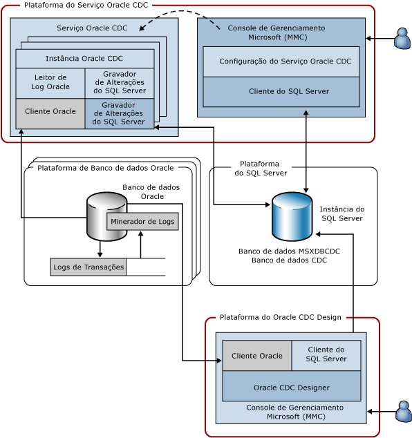

# Arquitetura de sistema do Serviço Change Data Capture para Oracle da Attunity

[!INCLUDE[ssis-appliesto](../../includes/ssis-appliesto-ssvrpluslinux-asdb-asdw-xxx.md)]

  O Serviço CDC para Oracle captura alterações feitas em tabelas selecionadas em um ou mais bancos de dados Oracle de origem em bancos de dados do [!INCLUDE[ssNoVersion](../../includes/ssnoversion-md.md)] CDC localizados em uma instância do [!INCLUDE[ssNoVersion](../../includes/ssnoversion-md.md)] . O diagrama a seguir mostra os componentes que compõem o Serviço CDC para Oracle.  
  
   
  
 Esta figura ilustra quatro plataformas que são usadas. Em muitos casos, estas plataformas podem se sobrepor, porém este diagrama representa um caso de uso padrão. Por exemplo, faz sentido que os bancos de dados Oracle e [!INCLUDE[ssNoVersion](../../includes/ssnoversion-md.md)] sejam executados em um computador separado e não sejam compartilhados com a plataforma do Serviço Oracle CDC ou a plataforma da qual o Serviço CDC é criado. As plataformas ilustradas nesta figura são:  
  
-   Serviço Oracle CDC: pode ser qualquer computador do Windows com suporte, no qual o Serviço Oracle CDC esteja instalado e em execução. Esta plataforma também pode representar um nó de cluster em um cluster de failover da Microsoft (as configurações de alta disponibilidade são discutidas posteriormente neste documento).  
  
-   Oracle Database: pode ser qualquer computador no qual uma versão com suporte do banco de dados Oracle é executada. Isto inclui qualquer computador que execute Windows, Linux ou qualquer outro sistema operacional com suporte pela versão do banco de dados Oracle instalado. Observe que o diagrama mostra esta plataforma no plural porque um único Serviço Oracle CDC pode capturar alterações de vários bancos de dados Oracle de origem.  
  
-   [!INCLUDE[ssNoVersion](../../includes/ssnoversion-md.md)]: pode ser qualquer computador no qual o banco de dados do [!INCLUDE[ssNoVersion](../../includes/ssnoversion-md.md)] de destino (um SKU do [!INCLUDE[ssCurrent](../../includes/sscurrent-md.md)] com suporte) é executado. Um Serviço Oracle CDC dá suporte a um destino do [!INCLUDE[ssNoVersion](../../includes/ssnoversion-md.md)] em que ele armazena tabelas de alteração e configuração de serviço. A Plataforma do [!INCLUDE[ssNoVersion](../../includes/ssnoversion-md.md)] também pode representar uma instância clusterizada do [!INCLUDE[ssCurrent](../../includes/sscurrent-md.md)] ou uma instância espelhada do [!INCLUDE[ssCurrent](../../includes/sscurrent-md.md)] usando o recurso **AlwaysOn** .  
  
-   CDC Designer para Oracle: pode ser qualquer computador Windows com suporte que pode acessar o banco de dados Oracle de origem e o banco de dados do [!INCLUDE[ssNoVersion](../../includes/ssnoversion-md.md)] de destino.  
  
 A tabela a seguir descreve os componentes que são executados nas quatro plataformas descritas acima.  
  
|Componente/descrição|O componente é composto de:|  
|----------------------------|----------------------------|  
|Serviço Oracle CDC: este é um serviço do Windows onde ocorre a atividade de captura de dados de alterações.|Instância Oracle CDC: um subprocesso do Serviço Oracle CDC que trata a atividade de captura de dados de alterações de um único banco de dados Oracle de origem (há uma instância Oracle CDC por banco de dados Oracle de origem).|  
||Leitor de logs Oracle: lê logs de transação do Oracle usando o Cliente Oracle.|  
||Cliente Oracle: o Cliente Instantâneo Oracle usado para comunicação com o Oracle. Este é um pré-requisito que deve ser obtido do Oracle e instalado antes de instalar o Serviço Oracle CDC.|  
||Gravador de Alterações [!INCLUDE[ssNoVersion](../../includes/ssnoversion-md.md)]: grava alterações confirmadas feitas na tabela Oracle capturada em tabelas de alterações do [!INCLUDE[ssNoVersion](../../includes/ssnoversion-md.md)]. Este componente também mantém esse estado de captura dentro do banco de dados do [!INCLUDE[ssNoVersion](../../includes/ssnoversion-md.md)] de destino.|  
||Cliente ODBC [!INCLUDE[ssNoVersion](../../includes/ssnoversion-md.md)]: Microsoft Native Client para [!INCLUDE[ssCurrent](../../includes/sscurrent-md.md)]. Este é um componente de pré-requisito que deve ser obtido da Microsoft e instalado antes de instalar o Serviço Oracle CDC.|  
|Configuração do Serviço Change Data Capture para Oracle: é um snap-in do Console de Gerenciamento Microsoft que cria o serviço do Windows e define sua configuração.|[!INCLUDE[ssNoVersion](../../includes/ssnoversion-md.md)] Cliente: o cliente do SQL ADO.NET que é enviado com a versão 4 do .NET framework.|  
|Oracle Database: um banco de dados Oracle de origem do qual as alterações nas tabelas selecionadas são capturadas.|Minerador de Logs: um componente do Oracle por meio do qual os logs de transação do Oracle são lidos.|  
||Logs de transação: os logs de refazer do Oracle online e arquivados que são usados pelo Oracle para garantir que o banco de dados possa reverter transações e recuperar-se de falhas (neste caso, o banco de dados Oracle deve operar em modo de log de arquivo morto).|  
|[!INCLUDE[ssNoVersion](../../includes/ssnoversion-md.md)] Instância: uma instância do [!INCLUDE[ssNoVersion](../../includes/ssnoversion-md.md)] onde os bancos de dados CDC são hospedados. Isso pode ser uma Instância do [!INCLUDE[ssNoVersion](../../includes/ssnoversion-md.md)] clusterizada (cluster de failover) ou um banco de dados espelhado (AlwaysOn).|Banco de dados MSXDBCDC: um banco de dados no qual são mantidas informações sobre os Serviços CDC que funcionam com essa Instância do [!INCLUDE[ssNoVersion](../../includes/ssnoversion-md.md)]. Também mantém informações sobre as Instâncias Oracle CDC tratadas por cada Serviço CDC. Este banco de dados é criado como parte do processo de criação do Serviço CDC.|  
||Os bancos de dados CDC: bancos de dados do [!INCLUDE[ssNoVersion](../../includes/ssnoversion-md.md)] que armazenam as alterações feitas a um dos bancos de dados Oracle de origem. Os bancos de dados CDC são habilitados para o [!INCLUDE[ssNoVersion](../../includes/ssnoversion-md.md)] CDC para que tenham tabelas e funções do [!INCLUDE[ssNoVersion](../../includes/ssnoversion-md.md)] CDC, facilitando consumir alterações que se originam do Oracle.|  
|CDC Designer para Oracle: um snap-in do Console de Gerenciamento Microsoft que ajuda a criar Instâncias Oracle CDC. Use isto para selecionar as tabelas e colunas a serem capturadas, forneça informações de conexão do Oracle e gerencie o ciclo de vida de Instâncias CDC.|[!INCLUDE[ssNoVersion](../../includes/ssnoversion-md.md)] Cliente: o cliente do SQL ADO.NET que é enviado com a versão 4 do .NET framework.|  
||Cliente Oracle: o Cliente Instantâneo Oracle usado para comunicação com o Oracle. Este é um componente de pré-requisito que deve ser obtido da Oracle e instalado antes de instalar o Serviço Oracle CDC.|  
  
 O Serviço Oracle CDC e suas Instâncias Oracle CDC filhas só podem se comunicar com o banco de dados Oracle de origem e a instância do [!INCLUDE[ssNoVersion](../../includes/ssnoversion-md.md)] de destino como clientes. Eles não escutam ativamente em nenhuma rede e outros protocolos. O Serviço Oracle CDC monitora os bancos de dados CDC em busca de alterações de configuração e atualiza sua operação com base na configuração atualizada.  
  
  
