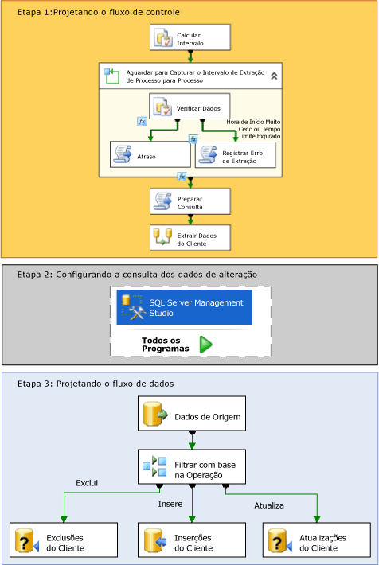

# Change Data Capture (SSIS)
  No [!INCLUDE[ssNoVersion](../../includes/ssnoversion-md.md)], o change data capture oferece uma solução efetiva para o desafio de executar de forma eficiente as cargas incrementais de tabelas de origem para data marts e data warehouses.  
  
## O que é o Change Data Capture?  
 As tabelas de origem mudam com o passar do tempo. Um data mart ou um data warehouse baseado nessas tabelas precisam refletir essas alterações. Porém, um processo que periodicamente copia um instantâneo de toda a origem consome muito tempo e recursos. Métodos alternativos que incluem colunas de carimbos de data e hora, gatilhos ou consultas complexas normalmente prejudicam o desempenho e aumentam a complexidade. O que é necessário é um fluxo seguro de dados de alteração, estruturado de forma que consumidores possam aplicá-lo com facilidade às representações de destino dos dados. A captura de dados de alteração no [!INCLUDE[ssNoVersion](../../includes/ssnoversion-md.md)] fornece essa solução.  
  
 O recurso de captura de dados de alteração do [!INCLUDE[ssDE](../../includes/ssde-md.md)] captura atividades de inserção, atualização e exclusão aplicadas a tabelas do [!INCLUDE[ssNoVersion](../../includes/ssnoversion-md.md)] , disponibilizando os detalhes das alterações em um formato relacional facilmente consumível. As tabelas de alteração usadas pelo Change Data Capture contêm colunas que refletem a estrutura de coluna da tabela de origem controlada, junto com os metadados necessários para entender as mudanças ocorridas, linha por linha.  
  
> [!NOTE]  
>  A captura de dados de alteração não está disponível em todas as edições do [!INCLUDE[msCoName](../../includes/msconame-md.md)][!INCLUDE[ssNoVersion](../../includes/ssnoversion-md.md)]. Para obter uma lista de recursos com suporte nas edições do [!INCLUDE[ssNoVersion](../../includes/ssnoversion-md.md)], consulte [Recursos com suporte nas edições do SQL Server 2016](~/sql-server/editions-and-supported-features-for-sql-server-2016.md).  
  
## Como o Change Data Capture funciona no Integration Services  
 Um pacote do [!INCLUDE[ssISnoversion](../../includes/ssisnoversion-md.md)] pode coletar com facilidade os dados de alteração nos bancos de dados do [!INCLUDE[ssNoVersion](../../includes/ssnoversion-md.md)] para executar cargas incrementais eficientes em um data warehouse. No entanto, antes de usar o [!INCLUDE[ssISnoversion](../../includes/ssisnoversion-md.md)] para carregar dados de alteração, um administrador deve habilitar a captura de dados de alteração no banco de dados e nas tabelas em que deseja capturar alterações. Para obter mais informações sobre como configurar a captura de dados de alteração em um banco de dados, consulte [Habilitar e desabilitar a captura de dados de alterações &#40;SQL Server&#41;](../../relational-databases/track-changes/enable-and-disable-change-data-capture-sql-server.md).  
  
 Depois que um administrador habilitar a captura de dados de alteração no banco de dados, você poderá criar um pacote que execute uma carga incremental dos dados de alteração. O diagrama a seguir mostra as etapas para a criação desse pacote que executa uma carga incremental a partir de uma única tabela:  
  
   
  
 Conforme mostrado no diagrama anterior, a criação de um pacote que executa uma carga inicial de dados alterados envolve as seguintes etapas:  
  
 **Etapa 1:Projetando o fluxo de controle**  
 No fluxo de controle do pacote, é necessário definir as seguintes tarefas:  
  
-   Calcule os valores iniciais e finais de **datetime** referentes aos intervalos de alterações feitas nos dados de origem que você deseja recuperar.  
  
     Para calcular esses valores, use uma tarefa Executar SQL ou expressões [!INCLUDE[ssISnoversion](../../includes/ssisnoversion-md.md)] com funções **datetime** . Em seguida, armazene esses pontos de extremidade em variáveis de pacote para uso no pacote.  
  
     **Para obter mais informações:** [Especificar um intervalo de dados de alteração](../../integration-services/change-data-capture/specify-an-interval-of-change-data.md)  
  
-   Determine se os dados de alteração para o intervalo selecionado estão prontos. Esta etapa é necessária porque o processo de captura assíncrono pode ainda não ter alcançado o ponto de extremidade selecionado.  
  
     Para determinar se os dados estão prontos, comece com um contêiner Loop For para atrasar a execução, se necessário, até que os dados de alteração do intervalo selecionado estejam prontos. Dentro do contêiner de loop, use uma tarefa Executar SQL para consultar as tabelas de mapeamento de tempo mantidas pela captura de dados de alteração. Em seguida, use uma tarefa Script que chame o método **Thread.Sleep** ou outra tarefa Executar SQL com uma instrução **WAITFOR** para retardar a execução do pacote temporariamente, se necessário. Opcionalmente, use outra tarefa Script para registrar uma condição de erro ou um tempo limite.  
  
     **Para obter mais informações:** [Determinar se os dados de alterações estão protos](../../integration-services/change-data-capture/determine-whether-the-change-data-is-ready.md)  
  
-   Prepare a cadeia de caracteres de consulta que será usada para consultar os dados de alteração.  
  
     Use uma tarefa Script ou Executar SQL para montar a instrução SQL que será usada para consultar a existência de alterações.  
  
     **Para obter mais informações:** [Preparar para consultar os dados de alterações](../../integration-services/change-data-capture/prepare-to-query-for-the-change-data.md)  
  
 **Etapa 2: Configurando a consulta de dados de alteração**  
 Crie a função com valor de tabela que consultará os dados.  
  
 Use [!INCLUDE[ssManStudioFull](../../includes/ssmanstudiofull-md.md)] para desenvolver e salvar a consulta.  
  
 **Para obter mais informações:** [Recuperar e compreender os dados de alterações](../../integration-services/change-data-capture/retrieve-and-understand-the-change-data.md)  
  
 **Etapa 3: Projetando o fluxo de dados**  
 No fluxo de dados do pacote, é necessário definir as seguintes tarefas:  
  
-   Recupere os dados de alteração das tabelas de alteração.  
  
     Para recuperar os dados, use um componente de origem para consultar as tabelas de alterações para as alterações que se enquadram nos intervalos selecionados. A origem chama uma função com valor de tabela do Transact-SQL criada anteriormente.  
  
     **Para obter mais informações:** [Recuperar e compreender os dados de alterações](../../integration-services/change-data-capture/retrieve-and-understand-the-change-data.md)  
  
-   Divida as alterações em inserções, atualizações e exclusões para processamento.  
  
     Para dividir as alterações, use uma transformação de Divisão Condicional para direcionar as inserções, atualizações e exclusões para saídas diferentes para o processamento apropriado.  
  
     **Para obter mais informações:** [Processar inserções, atualizações e exclusões](../../integration-services/change-data-capture/process-inserts-updates-and-deletes.md)  
  
-   Aplique as inserções, exclusões e atualizações ao destino.  
  
     Para aplicar as alterações ao destino, use um componente de destino. Além disso, use as transformações de Comando OLE DB com as instruções UPDATE e DELETE com parâmetros para aplicar atualizações e exclusões ao destino. Você também pode aplicar atualizações e exclusões usando componentes de destino para salvar as linhas em tabelas temporárias. Em seguida, use tarefas Executar SQL para realizar operações de atualização e exclusão em massa no destino a partir das tabelas temporárias.  
  
     **Para obter mais informações:** [Aplicar as alterações no destino](../../integration-services/change-data-capture/apply-the-changes-to-the-destination.md)  
  
### Alterar dados de várias tabelas  
 O processo descrito no diagrama e nas etapas anteriores envolve uma carga incremental a partir de uma única tabela. Quando é necessário executar uma carga incremental a partir de várias tabelas, o processo geral é o mesmo. Porém, o design do pacote precisa ser alterado para acomodar o processamento de várias tabelas. Para obter mais informações sobre como criar um pacote que execute uma carga incremental de várias tabelas, consulte [Executar uma carga incremental de várias tabelas](../../integration-services/change-data-capture/perform-an-incremental-load-of-multiple-tables.md).  
  
## Exemplos de pacotes do Change Data Capture  
 [!INCLUDE[ssISnoversion](../../includes/ssisnoversion-md.md)] fornece dois exemplos que demonstram como usar o Change Data Capture em pacotes. Para obter mais informações, consulte os tópicos a seguir:  
  
-   [Leiame_Exemplo do Change Data Capture para pacote de intervalo especificado](http://go.microsoft.com/fwlink/?LinkId=133507)  
  
-   [Leiame_Exemplo do Change Data Capture desde o último pacote de solicitação](http://go.microsoft.com/fwlink/?LinkId=133508)  
  
## Related Tasks  
  
-   [Especificar um intervalo de dados de alteração](../../integration-services/change-data-capture/specify-an-interval-of-change-data.md)  
  
-   [Determinar se os dados de alterações estão protos](../../integration-services/change-data-capture/determine-whether-the-change-data-is-ready.md)  
  
-   [Preparar para consultar os dados de alterações](../../integration-services/change-data-capture/prepare-to-query-for-the-change-data.md)  
  
-   [Criar a função para recuperar os dados de alteração](../../integration-services/change-data-capture/create-the-function-to-retrieve-the-change-data.md)  
  
-   [Recuperar e compreender os dados de alterações](../../integration-services/change-data-capture/retrieve-and-understand-the-change-data.md)  
  
-   [Processar inserções, atualizações e exclusões](../../integration-services/change-data-capture/process-inserts-updates-and-deletes.md)  
  
-   [Aplicar as alterações ao destino](../../integration-services/change-data-capture/apply-the-changes-to-the-destination.md)  
  
-   [Executar uma carga incremental de várias tabelas](../../integration-services/change-data-capture/perform-an-incremental-load-of-multiple-tables.md)  
  
## Conteúdo relacionado  
 Entrada de blog, [SSIS Design Pattern – Incremental Load](http://go.microsoft.com/fwlink/?LinkId=217679), em sqlblog.com  
  
  
