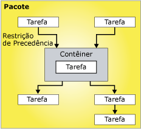

# Fluxo de Controle
  Um pacote consiste em um fluxo de controle e, opcionalmente, em um ou mais fluxos de dados. [!INCLUDE[ssNoVersion](../../includes/ssnoversion-md.md)][!INCLUDE[ssISnoversion](../../includes/ssisnoversion-md.md)] fornece três tipos diferentes de controle de elementos de fluxo: contêineres que fornecem estruturas em pacotes, tarefas que fornecem funcionalidade e restrições de precedência que conectam os executáveis, contêineres e tarefas em um fluxo de controle ordenado.  
  
 Para obter mais informações, consulte [Restrições de precedência](../../integration-services/control-flow/precedence-constraints.md), [Contêineres do Integration Services](../../integration-services/control-flow/integration-services-containers.md)e [Tarefas do Integration Services](../../integration-services/control-flow/integration-services-tasks.md).  
  
 O diagrama seguinte mostra um fluxo de controle que tem um contêiner e seis tarefas. Cinco das tarefas estão definidas no nível de pacote e uma tarefa está definida no nível de contêiner. A tarefa está dentro de um contêiner.  
  
   
  
 A arquitetura do [!INCLUDE[ssISnoversion](../../includes/ssisnoversion-md.md)] dá suporte ao aninhamento de contêineres, e um fluxo de controle pode incluir vários níveis de contêineres aninhados. Por exemplo, um pacote pode conter um contêiner como Loop Foreach, que por sua vez pode conter um outro contêiner Loop Foreach e assim por diante.  
  
 Manipuladores de eventos também têm fluxos de controle, que são criados usando os mesmos tipos de elementos de fluxo de controle.  
  
## Implementação do fluxo de controle  
 Você cria o fluxo de controle em um pacote por meio da guia **Fluxo de Controle** no Designer do [!INCLUDE[ssIS](../../includes/ssis-md.md)] . Quando a guia **Fluxo de controle** estiver ativa, a Caixa de Ferramentas listará as tarefas e os contêineres que você pode adicionar ao fluxo de controle.  
  
 O diagrama a seguir exibe o fluxo de controle de um pacote simples no designer de fluxo de controle. O controle de fluxo exibido no diagrama é feito de três tarefas de nível de pacote e um contêiner de nível de pacote que contém três tarefas. As tarefas e contêineres são conectadas usando-se as restrições de precedência.  
  
   
  
 Criar um fluxo de controle inclui as tarefas seguintes:  
  
-   Adicionar contêineres que implementam fluxos de trabalho repetitivos em um pacote ou dividem um fluxo de controle em subconjuntos.  
  
-   Adicionar tarefas que oferecem suporte ao fluxo de dados, preparar dados, executar fluxo de trabalho e funções de business intelligence e implementar script.  
  
     O [!INCLUDE[ssISnoversion](../../includes/ssisnoversion-md.md)] inclui uma variedade de tarefas que você pode usar para criar fluxo de controle que atenda às necessidades empresariais do pacote. Se o pacote tiver que trabalhar com dados, o fluxo de controle deve incluir, no mínimo, uma tarefa de fluxo de dados. Por exemplo, um pacote pode ter que extrair dados, agregar valores de dados e, então, gravar os resultados em uma fonte de dados.  Para obter mais informações, consulte [Tarefas do Integration Services](../../integration-services/control-flow/integration-services-tasks.md) e [Adicionar ou excluir uma tarefa ou um contêiner em um fluxo de controle](../../integration-services/control-flow/add-or-delete-a-task-or-a-container-in-a-control-flow.md).  
  
-   Conectar contêineres e tarefas em um fluxo de controle ordenado usando restrições de precedência.  
  
     Depois de adicionar uma tarefa ou um contêiner à superfície de design da guia **Fluxo de Controle** , o Designer do [!INCLUDE[ssIS](../../includes/ssis-md.md)] adiciona automaticamente um conector ao item. Se um pacote inclui dois ou mais itens, tarefas ou contêineres, você pode uni-los a um fluxo de controle, arrastando seus conectores de um item para outro.  
  
     O conector entre dois itens representa uma restrição de precedência. Uma restrição de precedência define a relação entre os dois itens conectados. Ela especifica a ordem na qual as tarefas e contêineres são executados no tempo de execução, e as condições sob as quais as tarefas e contêineres são executados. Por exemplo, uma restrição de precedência pode especificar que uma tarefa deva ter sucesso para que a próxima tarefa no fluxo de controle seja executada. Para obter mais informações, consulte [Precedence Constraints](../../integration-services/control-flow/precedence-constraints.md).  
  
-   Adicionando gerenciadores de conexões.  
  
     Muitas tarefas exigem uma conexão com uma fonte de dados e você tem que adicionar ao pacote os gerenciadores de conexões que a tarefa requer. Dependendo do tipo de enumerador que usa, o contêiner Loop Foreach também pode requerer um gerenciador de conexões. Você pode adicionar o gerenciador de conexões conforme cria o fluxo de controle, item a item, ou antes que comece a construção do fluxo de controle. Para obter mais informações, consulte [Conexões do Integration Services &#40;SSIS&#41;](../../integration-services/connection-manager/integration-services-ssis-connections.md) e [Criar gerenciadores de conexões](http://msdn.microsoft.com/library/6ca317b8-0061-4d9d-b830-ee8c21268345).  
  
 [!INCLUDE[ssIS](../../includes/ssis-md.md)]Designer também inclui muitos recursos de tempo de design que você pode usar para gerenciar a superfície de design e tornar o controle autodocumentação do fluxo.  
  
## Tarefas relacionadas  
  
-   [Adicionar ou excluir uma tarefa ou um contêiner em um fluxo de controle](../../integration-services/control-flow/add-or-delete-a-task-or-a-container-in-a-control-flow.md)  
  
-   [Definir as propriedades de uma tarefa ou contêiner](http://msdn.microsoft.com/library/52d47ca4-fb8c-493d-8b2b-48bb269f859b)  
  
-   [Agrupa ou desagrupa componentes](../../integration-services/group-or-ungroup-components.md)  
  
  
