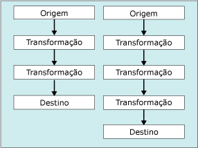

# Tarefa de Fluxo de Dados
  A tarefa de Fluxo de Dados encapsula o mecanismo de fluxo de dados que move dados entre as origens e os destinos, permitindo que o usuário transforme, limpe e modifique os dados à medida que são movidos. A adição de uma tarefa de Fluxo de Dados em um pacote de fluxo de controle permite que o pacote extraia, transforme e carregue dados.  
  
 Um fluxo de dados consiste em pelo menos um componente de fluxo de dados, mas normalmente é um conjunto de componentes de fluxo de dados conectados: fontes que extraem dados; transformações que modificam, roteiam ou resumem dados; e destinos que carregam dados.  
  
 Em tempo de execução, a tarefa de Fluxo de Dados cria um plano de execução a partir do fluxo de dados e o mecanismo de fluxo de dados executa o plano. Você pode criar uma tarefa de Fluxo de Dados que não tenha nenhum fluxo de dados, porém a tarefa será executada somente se pelo menos um fluxo de dados for incluído.  
  
 Para inserir dados de arquivos de texto em massa em um banco de dados do [!INCLUDE[ssNoVersion](../../includes/ssnoversion-md.md)] , você pode usar a tarefa Inserção em Massa em vez de uma tarefa de Fluxo de Dados e um fluxo de dados. Porém, a tarefa de Inserção em Massa não pode transformar dados. Para obter mais informações, veja [Tarefa Inserção em Massa](../../integration-services/control-flow/bulk-insert-task.md).  
  
## Vários fluxos  
 Uma tarefa de Fluxo de Dados pode incluir vários fluxos de dados. Se uma tarefa copiar vários conjuntos de dados e se a ordem na qual os dados são copiados não for significativa, poderá ser mais conveniente incluir vários fluxos de dados na tarefa de Fluxo de Dados. Por exemplo, você poderia criar cinco fluxos de dados, cada um copiando dados de um arquivo simples para uma tabela de dimensão diferente em um esquema em estrela de data warehouse.  
  
 Entretanto, o mecanismo de fluxo de dados determina a ordem de execução quando há vários fluxos de dados em uma tarefa de fluxo de dados. Portanto, quando a ordem for importante, o pacote deverá usar várias tarefas de Fluxo de Dados, cada tarefa contendo um fluxo de dados. Você poderá então aplicar restrições de precedência para controlar a ordem de execução das tarefas.  
  
 O diagrama a seguir mostra uma tarefa de Fluxo de Dados com vários fluxos de dados.  
  
   
  
## Entradas de log  
 [!INCLUDE[ssISnoversion](../../includes/ssisnoversion-md.md)] fornece um conjunto de eventos de log que estão disponíveis para todas as tarefas. [!INCLUDE[ssISnoversion](../../includes/ssisnoversion-md.md)] também fornece entradas de log personalizadas a muitas tarefas. Para obter mais informações, consulte [Log do SSIS &#40;Integration Services&#41;](../../integration-services/performance/integration-services-ssis-logging.md). A tarefa de Fluxo de Dados inclui as seguintes entradas de log personalizadas:  
  
|Entrada de log|Description|  
|---------------|-----------------|  
|**BufferSizeTuning**|Indica que a tarefa de Fluxo de Dados alterou o tamanho do buffer. A entrada de log descreve os motivos da mudança de tamanho e relaciona o novo tamanho do buffer temporário.|  
|**OnPipelinePostEndOfRowset**|Indica que um componente recebeu o sinal de final do conjunto de linhas, definido pela última chamada do método **ProcessInput** . Uma entrada é gravada para cada componente no fluxo de dados que processa a entrada. A entrada contém o nome do componente.|  
|**OnPipelinePostPrimeOutput**|Indica que o componente completou sua última chamada para o método **PrimeOutput** . Dependendo do fluxo de dados, várias entradas de log podem ser gravadas. Se o componente for uma fonte, essa entrada de log significa que o componente tem linhas de processamento concluídas.|  
|**OnPipelinePreEndOfRowset**|Indica que um componente está prestes a receber o sinal de final do conjunto de linhas, definido pela última chamada do método **ProcessInput** . Uma entrada é gravada para cada componente no fluxo de dados que processa a entrada. A entrada contém o nome do componente.|  
|**OnPipelinePrePrimeOutput**|Indica que o componente está prestes a receber sua chamada do método **PrimeOutput** . Dependendo do fluxo de dados, várias entradas de log podem ser gravadas.|  
|**OnPipelineRowsSent**|Informa o número de linhas fornecido a uma entrada de componente por uma chamada para o método **ProcessInput** . A entrada de log inclui o nome do componente.|  
|**PipelineBufferLeak**|Fornece informações sobre qualquer componente que manteve buffers ativos depois que o gerenciador de buffers for desativado. Se um buffer ainda estiver ativo, os recursos de buffers não foram liberados e pode haver perdas de memória. A entrada de log fornece o nome do componente e a ID do buffer.|  
|**PipelineComponentTime**|Reporta o tempo (em milissegundos) que o componente gastou em cada uma das cinco principais etapas de processamento — Validate, PreExecute, PostExecute, ProcessInput e ProcessOutput.|  
|**PipelineExecutionPlan**|Informa o plano de execução do fluxo de dados. O plano de execução fornece informações sobre como os buffers serão enviados para os componentes. Essas informações, em combinação com a entrada de log PipelineExecutionTrees, descrevem o que está ocorrendo na tarefa de Fluxo de Dados.|  
|**PipelineExecutionTrees**|Informa as árvores de execução sobre o layout do fluxo de dados. O agendador do mecanismo de fluxo de dados usa as árvores para criar o plano de execução do fluxo de dados.|  
|**PipelineInitialization**|Fornece informações de inicialização sobre a tarefa. Essas informações incluem os diretórios para armazenamento temporário de dados de BLOB, o tamanho do buffer padrão e o número de linhas em um buffer. Dependendo da configuração da tarefa de Fluxo de Dados, várias entradas de log podem ser gravadas.|  
  
 Essas entradas de log fornecerão informações detalhadas sobre a execução da tarefa de Fluxo de Dados sempre que você executar um pacote. Ao executar os pacotes repetidamente, você poderá coletar informações que com o passar do tempo fornecerá informações históricas importantes sobre o processamento que a tarefa executa, problemas que podem afetar o desempenho e o volume de dados que a tarefa controla.  
  
 Para obter mais informações sobre como usar essas entradas de log para monitorar e melhorar o desempenho do fluxo de dados, consulte um dos seguintes tópicos:  
  
-   [Contadores de desempenho](../../integration-services/performance/performance-counters.md)  
  
-   [Data Flow Performance Features](../../integration-services/data-flow/data-flow-performance-features.md)  
  
### Mensagens de amostra de uma tarefa de Fluxo de Dados  
 A tabela a seguir relaciona as mensagens de amostra de entradas de log para um pacote simples. O pacote usa uma origem OLE DB para extrair dados de uma tabela, uma transformação Classificar para classificar os dados e um destino OLE DB para gravar os dados em uma tabela diferente.  
  
|Entrada de log|Mensagens|  
|---------------|--------------|  
|**BufferSizeTuning**|`Rows in buffer type 0 would cause a buffer size greater than the configured maximum. There will be only 9637 rows in buffers of this type.`   `Rows in buffer type 2 would cause a buffer size greater than the configured maximum. There will be only 9497 rows in buffers of this type.`   `Rows in buffer type 3 would cause a buffer size greater than the configured maximum. There will be only 9497 rows in buffers of this type.`|  
|**OnPipelinePostEndOfRowset**|`A component will be given the end of rowset signal. : 1180 : Sort : 1181 : Sort Input`   `A component will be given the end of rowset signal. : 1291 : OLE DB Destination : 1304 : OLE DB Destination Input`|  
|**OnPipelinePostPrimeOutput**|`A component has returned from its PrimeOutput call. : 1180 : Sort`   `A component has returned from its PrimeOutput call. : 1 : OLE DB Source`|  
|**OnPipelinePreEndOfRowset**|`A component has finished processing all of its rows. : 1180 : Sort : 1181 : Sort Input`   `A component has finished processing all of its rows. : 1291 : OLE DB Destination : 1304 : OLE DB Destination Input`|  
|**OnPipelinePrePrimeOutput**|`PrimeOutput will be called on a component. : 1180 : Sort`   `PrimeOutput will be called on a component. : 1 : OLE DB Source`|  
|**OnPipelineRowsSent**|`Rows were provided to a data flow component as input. :  : 1185 : OLE DB Source Output : 1180 : Sort : 1181 : Sort Input : 76`   `Rows were provided to a data flow component as input. :  : 1308 : Sort Output : 1291 : OLE DB Destination : 1304 : OLE DB Destination Input : 76`|  
|**PipelineComponentTime**|`The component "Calculate LineItemTotalCost" (3522) spent 356 milliseconds in ProcessInput.`   `The component "Sum Quantity and LineItemTotalCost" (3619) spent 79 milliseconds in ProcessInput.`   `The component "Calculate Average Cost" (3662) spent 16 milliseconds in ProcessInput.`   `The component "Sort by ProductID" (3717) spent 125 milliseconds in ProcessInput.`   `The component "Load Data" (3773) spent 0 milliseconds in ProcessInput.`   `The component "Extract Data" (3869) spent 688 milliseconds in PrimeOutput filling buffers on output "OLE DB Source Output" (3879).`   `The component "Sum Quantity and LineItemTotalCost" (3619) spent 141 milliseconds in PrimeOutput filling buffers on output "Aggregate Output 1" (3621).`   `The component "Sort by ProductID" (3717) spent 16 milliseconds in PrimeOutput filling buffers on output "Sort Output" (3719).`|  
|**PipelineExecutionPlan**|`SourceThread0`   `Drives: 1`   `Influences: 1180 1291`   `Output Work List`   `CreatePrimeBuffer of type 1 for output ID 11.`   `SetBufferListener: "WorkThread0" for input ID 1181`   `CreatePrimeBuffer of type 3 for output ID 12.`   `CallPrimeOutput on component "OLE DB Source" (1)`   `End Output Work List`   `End SourceThread0`   `WorkThread0`   `Drives: 1180`   `Influences: 1180 1291`   `Input Work list, input ID 1181 (1 EORs Expected)`   `CallProcessInput on input ID 1181 on component "Sort" (1180) for view type 2`   `End Input Work list for input 1181`   `Output Work List`   `CreatePrimeBuffer of type 4 for output ID 1182.`   `SetBufferListener: "WorkThread1" for input ID 1304`   `CallPrimeOutput on component "Sort" (1180)`   `End Output Work List`   `End WorkThread0`   `WorkThread1`   `Drives: 1291`   `Influences: 1291`   `Input Work list, input ID 1304 (1 EORs Expected)`   `CallProcessInput on input ID 1304 on component "OLE DB Destination" (1291) for view type 5`   `End Input Work list for input 1304`   `Output Work List`   `End Output Work List`   `End WorkThread1`|  
|**PipelineExecutionTrees**|`begin execution tree 0`   `output "OLE DB Source Output" (11)`   `input "Sort Input" (1181)`   `end execution tree 0`   `begin execution tree 1`   `output "OLE DB Source Error Output" (12)`   `end execution tree 1`   `begin execution tree 2`   `output "Sort Output" (1182)`   `input "OLE DB Destination Input" (1304)`   `output "OLE DB Destination Error Output" (1305)`   `end execution tree 2`|  
|**PipelineInitialization**|`No temporary BLOB data storage locations were provided. The buffer manager will consider the directories in the TEMP and TMP environment variables.`   `The default buffer size is 10485760 bytes.`   `Buffers will have 10000 rows by default`   `The data flow will not remove unused components because its RunInOptimizedMode property is set to false.`|  
  
 Muitos eventos de log gravam várias entradas, e as mensagens para várias entradas de log contêm dados complexos. Para facilitar a compreensão e comunicar o conteúdo de mensagens complexas, você pode analisar a mensagem de texto. Dependendo do local dos logs, você poderá usar as instruções Transact-SQL ou um componente Script para separar o texto complexo em colunas ou em outros formatos que considere mais útil.  
  
 Por exemplo, a tabela a seguir contém a mensagem "Foram fornecidas linhas para um componente de fluxo de dados como entrada. :  : 1185: Saída de origem OLE DB: 1180: Classificação: 1181: Classificar entrada: 76", analisado em colunas. A mensagem foi gravada pelo evento **OnPipelineRowsSent** quando foram enviadas linhas da origem OLE DB para a transformação Classificação.  
  
|Coluna|Description|Value|  
|------------|-----------------|-----------|  
|**PathID**|O valor da propriedade **ID** do caminho entre a origem OLE DB e a transformação Classificação.|1185|  
|**PathName**|O valor da propriedade **Nome** do caminho.|Saída da origem OLE DB|  
|**ComponentID**|O valor da propriedade **ID** da transformação Classificação.|1180|  
|**ComponentName**|O valor da propriedade **Nome** da transformação Classificação.|Sort|  
|**InputID**|O valor da propriedade **ID** da entrada para a transformação Classificação.|1181|  
|**InputName**|O valor da propriedade **Nome** da entrada para a transformação Classificação.|Classificar entrada|  
|**RowsSent**|O número de linhas enviadas para a entrada da transformação Classificação.|76|  
  
## Configuração da tarefa Fluxo de Dados  
 Você pode definir as propriedades na janela **Propriedades** ou programaticamente.  
  
 Para obter mais informações sobre como definir essas propriedades na janela **Propriedades** , clique no tópico a seguir:  
  
-   [Definir as propriedades de uma tarefa ou contêiner](http://msdn.microsoft.com/library/52d47ca4-fb8c-493d-8b2b-48bb269f859b)  
  
## Configuração programática da tarefa Fluxo de Dados  
 Para obter mais informações sobre como adicionar uma tarefa de fluxo de dados programaticamente em um pacote e definir propriedades de fluxo de dados, clique no tópico a seguir:  
  
-   [Adicionando a tarefa Fluxo de Dados programaticamente](../../integration-services/building-packages-programmatically/adding-the-data-flow-task-programmatically.md)  
  
## Tarefas relacionadas  
 [Definir as propriedades de uma tarefa ou contêiner](http://msdn.microsoft.com/library/52d47ca4-fb8c-493d-8b2b-48bb269f859b)  
  
## Conteúdo relacionado  
 Vídeo, [Distribuidor de Dados Balanceados](http://go.microsoft.com/fwlink/?LinkID=226278&clcid=0x409), em technet.microsoft.com.  
  
  
