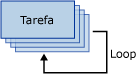

# Cont&#234;iner Loop For
  O contêiner Loop For define um fluxo de controle repetitivo em um pacote. A implementação de loop é semelhante à estrutura de loop **For** em linguagens de programação. Em cada repetição do loop, o contêiner Loop For avalia uma expressão e repete seu fluxo de trabalho até a expressão ser avaliada como **False**.  
  
 O contêiner Loop For usa os seguintes elementos para definir o loop:  
  
-   Uma expressão de inicialização opcional que atribui valores aos contadores de loop.  
  
-   Uma expressão de avaliação que contém a expressão usada para testar se o loop deve parar ou continuar.  
  
-   Uma expressão de iteração opcional que incrementa ou diminui o contador de loop.  
  
 O diagrama a seguir mostra um contêiner Loop For com uma tarefa Enviar Email. Se a expressão de inicialização é `@Counter = 0`, a expressão de avaliação é `@Counter < 4` e a expressão de iteração é `@Counter = @Counter + 1`, o loop é repetido quatro vezes e envia quatro mensagens de email.  
  
   
  
 As expressões devem ser expressões do [!INCLUDE[ssNoVersion](../../includes/ssnoversion-md.md)] [!INCLUDE[ssISnoversion](../../includes/ssisnoversion-md.md)] válidas.  
  
 Para criar as expressões de inicialização e de atribuição, você pode usar o operador de atribuição (=). Não há suporte para esse operador pela gramática de expressão do Integration Services e só pode ser usado pelos tipos de expressão de inicialização e de atribuição no contêiner Loop For. Qualquer expressão que usa o operador de atribuição deve ter a sintaxe `@Var = <expression>`, em que **Var** é uma variável de tempo de execução e \<expression> é uma expressão que segue as regras da sintaxe de expressão do [!INCLUDE[ssIS](../../includes/ssis-md.md)]. A expressão pode incluir as variáveis, literais e quaisquer operadores e funções que a gramática de expressão SSIS ofereça suporte. A expressão deve avaliar um tipo de dados que pode ser convertido em tipo de dados da variável.  
  
 Um contêiner Loop For pode ter só uma expressão de avaliação. Isso significa que o contêiner Loop For executa todos os seus elementos de fluxo de controle o mesmo número de vezes. Como o contêiner Loop For pode incluir outros contêineres Loop For, você pode construir loops aninhados e implementar loop complexo em pacotes.  
  
 Você pode definir uma propriedade de transação no contêiner Loop For para estabelecer uma transação para um subconjunto do fluxo de controle de pacote. Desse modo, é possível gerenciar as transações em um nível mais granular. Por exemplo, se um contêiner Loop For repetir um fluxo de controle que atualiza dados em uma tabela várias vezes, você poderá configurar o Loop For e seu fluxo de controle para usar uma transação para garantir que, se todos os dados não forem atualizados com êxito, nenhum dado seja atualizado. Para obter mais informações, consulte [Transações do Integration Services](../../integration-services/integration-services-transactions.md).  
  
## Configuração do contêiner Loop For  
 Você pode definir propriedades pelo Designer do [!INCLUDE[ssIS](../../includes/ssis-md.md)] ou programaticamente.  
  
 Para obter mais informações sobre as propriedades que podem ser definidas no [!INCLUDE[ssIS](../../includes/ssis-md.md)] Designer, clique em um dos seguintes tópicos:  
  
-   [Editor do Loop For](../Topic/For%20Loop%20Editor.md)  
  
-   [Página Expressões](../../integration-services/expressions/expressions-page.md)  
  
 Para obter mais informações sobre como definir essas propriedades programaticamente, consulte a documentação da classe **T:Microsoft.SqlServer.Dts.Runtime.ForLoop** no Guia do Desenvolvedor.  
  
## Tarefas relacionadas  
 Para obter informações sobre como configurar um contêiner Loop For, consulte os tópicos a seguir:  
  
-   [Configurar um contêiner Loop For](../Topic/Configure%20a%20For%20Loop%20Container.md)  
  
-   [Definir as propriedades de uma tarefa ou contêiner](../Topic/Set%20the%20Properties%20of%20a%20Task%20or%20Container.md)  
  
## Consulte também  
 [Fluxo de Controle](../../integration-services/control-flow/control-flow.md)   
 [Expressões do Integration Services &#40;SSIS&#41;](../../integration-services/expressions/integration-services-ssis-expressions.md)  
  
  