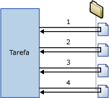

# Contêiner Loop Foreach
  O contêiner Loop Foreach define um fluxo de controle repetitivo em um pacote. A implementação de loop é semelhante à estrutura de loop **Foreach** em linguagens de programação. Em um pacote, o looping é habilitado por um enumerador Foreach.  O contêiner Loop Foreach repete o fluxo de controle para cada membro de um enumerador especificado.  
  
 [!INCLUDE[ssNoVersion](../../includes/ssnoversion-md.md)] [!INCLUDE[ssISnoversion](../../includes/ssisnoversion-md.md)] fornece os seguintes tipos de enumerador:  
  
-   Enumerador Foreach ADO para enumerar linhas em tabelas. Por exemplo, você pode obter as linhas em um conjunto de registros ADO.  
  
     O destino do Conjunto de Registros salva dados na memória em um conjunto de registros armazenado em uma variável de pacote do tipo de dados **Object** . Geralmente você usa um contêiner Loop Foreach com o enumerador ADO Foreach para processar uma linha do conjunto de registros de cada vez. A variável especificada para o enumerador Foreach ADO deve ser de tipo de dados Object. Para obter mais informações sobre o destino do conjunto de registros, consulte [Usar um destino do conjunto de registros](../../integration-services/data-flow/use-a-recordset-destination.md).  
  
-   O Enumerador de Conjunto de Linhas de Esquema ADO.NET Foreach enumera informações de esquema sobre uma fonte de dados. Por exemplo, você pode enumerar e obter uma lista das tabelas do banco de dados [!INCLUDE[ssSampleDBnormal](../../includes/sssampledbnormal-md.md)] [!INCLUDE[ssNoVersion](../../includes/ssnoversion-md.md)] .  
  
-   Enumerador de Arquivo Foreach para enumerar arquivos em uma pasta. O enumerador pode desviar subpastas. Por exemplo, você pode ler todos os arquivos que têm extensão de nome de arquivo * .log na pasta e respectivas subpastas do Windows.  
  
-   Enumerador Foreach de Variável para enumerar o objeto enumerável que uma variável especificada contém. O objeto enumerável pode ser uma matriz, um **DataTable**ADO.NET, um enumerador do [!INCLUDE[ssISnoversion](../../includes/ssisnoversion-md.md)] , e assim por diante. Por exemplo, você pode enumerar os valores de uma matriz que contém o nome de servidores.  
  
-   Enumerador de Item Foreach para enumerar itens que são coleções. Por exemplo, você pode enumerar os nomes de executáveis e diretórios em funcionamento utilizados por uma tarefa Executar Processo.  
  
-   Enumerador Nodelist Foreach para enumerar o conjunto de resultados de uma expressão Xpath (XML Path Language). Por exemplo, essa expressão enumera e obtém uma lista de todos os autores do período clássico: `/authors/author[@period='classical']`.  
  
-   Enumerador SMO Foreach para enumerar objetos [!INCLUDE[ssNoVersion](../../includes/ssnoversion-md.md)] Management Objects (SMO). Por exemplo, você pode enumerar e obter uma lista das exibições em um banco de dados do [!INCLUDE[ssNoVersion](../../includes/ssnoversion-md.md)] .  
  
-   Enumerador de Arquivos Foreach HDFS para enumerar arquivos HDFS no local de HDFS especificado.  
  
-   Enumerador de Blob do Azure Foreach para enumerar blobs em um contêiner de blob no Armazenamento do Azure.  

-   Enumerador de arquivo do ADLS Foreach para enumerar arquivos em um diretório no Azure Data Lake Store.
  
 O diagrama a seguir mostra um contêiner Loop Foreach que tem uma tarefa Sistema de Arquivos. O loop Foreach usa o enumerador de Arquivo Foreach e a tarefa Sistema de Arquivos é configurada para copiar um arquivo. Se a pasta que o enumerador especifica contiver quatro arquivos, o loop repetirá quatro vezes e copiará quatro arquivos.  
  
   
  
 Você pode usar uma combinação de variáveis e expressões de propriedade para atualizar a propriedade do objeto de pacote com o valor de coleção do enumerador. Primeiro você mapeia o valor de coleção para uma variável definida pelo usuário e, depois, implementa uma expressão na propriedade que usa a variável. Por exemplo, o valor de coleção do enumerador de Arquivo Foreach é mapeado para uma variável denominada **MyFile** e, depois, a variável é usada na expressão para a propriedade Subject de uma tarefa Enviar Email. Quando o pacote é executado, a propriedade Subject é atualizada com o nome de um arquivo cada vez que o loop é repetido. Para obter mais informações, consulte [Usar expressões de propriedade em pacotes](../../integration-services/expressions/use-property-expressions-in-packages.md).  
  
 Variáveis mapeadas para o valor de coleção do enumerador também podem ser usadas em expressões e scripts.  
  
 Um contêiner Loop Foreach pode incluir várias tarefas e contêineres , mas só pode usar um tipo de enumerador. Se o contêiner Loop Foreach incluir várias tarefas, você poderá mapear o valor de coleção do enumerador para várias propriedades de cada tarefa.  
  
 Você pode definir um atributo de transação no contêiner Loop Foreach para definir uma transação para um subconjunto do fluxo de controle de pacotes. Deste modo, é possível gerenciar as transações em nível de Loop Foreach em vez de pacote. Por exemplo, se um contêiner Loop Foreach repetir um fluxo de controle que atualiza dimensões e tabelas de fato em um esquema de estrela, você poderá configurar uma transação para assegurar que todas as tabelas de fato sejam atualizadas com êxito, ou que nenhuma seja atualizada. Para obter mais informações, consulte [Transações do Integration Services](../../integration-services/integration-services-transactions.md).  
  
## Tipos de enumerador  
 Enumeradores são configuráveis, e você deve fornecer informações diferentes, dependendo do enumerador.  
  
 A tabela a seguir resume as informações que cada tipo de enumerador requer.  
  
|Enumerador|Requisitos de configuração|  
|----------------|--------------------------------|  
|ADO Foreach|Especifique a variável de origem de objeto ADO e o modo do enumerador. A variável deve ser do tipo de dados Object.|  
|Conjunto de Linhas de Esquema ADO.NET Foreach|Especifique a conexão com um banco de dados e o esquema a ser enumerado.|  
|Arquivo Foreach|Especifique uma pasta e os arquivos a serem enumerados, o formato do nome de arquivo dos arquivos recuperados, e se as subpastas devem ser desviadas.|  
|Foreach de Variável|Especifique a variável que contém os objetos a serem enumerados.|  
|Item Foreach|Defina os itens na coleção Itens Foreach, inclusive colunas e tipos de dados de coluna.|  
|Nodelist Foreach|Especifique a origem do documento XML e configure a operação XPath.|  
|SMO Foreach|Especifique a conexão com um banco de dados e os objetos SMO a serem enumerados.|  
|Enumerador de Arquivos Foreach HDFS|Especifique uma pasta e os arquivos a serem enumerados, o formato do nome de arquivo dos arquivos recuperados, e se as subpastas devem ser desviadas.|  
|Blob do Azure Foreach|Especifica o contêiner de Blob do Azure em que os blobs de contêineres serão enumerados.|  
|Arquivo ADLS Foreach|Especifique o diretório do Azure Data Lake Store que contém os arquivos a serem enumerados.|

## Adicionar enumeração a um fluxo de controle com um contêiner do Loop Foreach
 [!INCLUDE[ssISnoversion](../../includes/ssisnoversion-md.md)] inclui o contêiner do Loop Foreach, um elemento de fluxo de controle que torna simples a inclusão de um constructo de loop que enumera arquivos e objetos no fluxo de controle de um pacote. Para obter mais informações, consulte [Contêiner Loop Foreach](../../integration-services/control-flow/foreach-loop-container.md).  
  
 O contêiner Loop Foreach não fornece nenhuma funcionalidade, ele só fornece a estrutura na qual você cria o fluxo de controle repetível, especifica o tipo do enumerados e configura o enumerador. Para fornecer funcionalidade de contêiner, você deve incluir no mínimo uma tarefa no contêiner Loop Foreach. Para obter mais informações, consulte [Tarefas do Integration Services](../../integration-services/control-flow/integration-services-tasks.md).  
  
 O contêiner Loop Foreach pode incluir um fluxo de controle com várias tarefas e outros contêineres. Adicionar tarefas e contêineres ao contêiner Loop Foreach é semelhante a adicioná-las a um pacote, exceto que você arrasta as tarefas e contêineres para o contêiner Loop Foreach e não para o pacote. Se o contêiner Loop Foreach incluir mais de uma tarefa ou contêiner, você poderá conectá-los usando as restrições de precedência, assim como faria em um pacote. Para obter informações, consulte [Restrições de precedência](../../integration-services/control-flow/precedence-constraints.md).  
  
### Adicionar e configurar um contêiner de Loop Foreach
  
1.  Adicione o contêiner Loop Foreach ao pacote. Para obter mais informações, consulte [Adicionar ou excluir uma tarefa ou um contêiner em um fluxo de controle](../../integration-services/control-flow/add-or-delete-a-task-or-a-container-in-a-control-flow.md).  
  
2.  Adicione tarefas e contêineres ao contêiner Loop Foreach. Para obter mais informações, consulte [Adicionar ou excluir uma tarefa ou um contêiner em um fluxo de controle](../../integration-services/control-flow/add-or-delete-a-task-or-a-container-in-a-control-flow.md).  
  
3.  Conecte tarefas e contêineres no contêiner Loop Foreach usando restrições de precedência. Para obter mais informações, consulte [Como conectar tarefas e contêineres utilizando uma restrição de precedência padrão](http://msdn.microsoft.com/library/8f31f15f-98ff-4c35-b41f-8b8cfd148d75).  
  
4.  Configure o contêiner Loop Foreach. Para obter mais informações, consulte [Configurar um contêiner Loop Foreach](http://msdn.microsoft.com/library/519c6f96-5e1f-47d2-b96a-d49946948c25).  

## Para configurar um contêiner Loop Foreach
Este procedimento descreve como configurar um contêiner Loop Foreach, incluindo expressões de propriedade nos níveis de enumerador e contêiner.  
  
1.  No [!INCLUDE[ssBIDevStudioFull](../../includes/ssbidevstudiofull-md.md)], abra o projeto do [!INCLUDE[ssISnoversion](../../includes/ssisnoversion-md.md)] que contém o pacote desejado.  
  
2.  Clique na guia **Fluxo de Controle** e clique duas vezes no Loop Foreach.  
  
3.  Na caixa de diálogo **Editor de Loop Foreach** , clique em **Geral** e, como alternativa, modifique o nome e a descrição do Loop Foreach.  
  
4.  Clique em **Coleção** e selecione um tipo de enumerador na lista **Enumerador** .  
  
5.  Especifique um enumerador e defina opções de enumerador conforme mostrado a seguir:  
  
    -   Para usar o enumerador de Arquivo Foreach, forneça a pasta que contém os arquivos a serem enumerados, especifique um filtro do nome e tipo de arquivo e especifique se o nome do arquivo totalmente qualificado deverá ser retornado. Indique também se você deseja a função recursiva em subpastas para obter mais arquivos.  
  
    -   Para usar o enumerador de Item Foreach, clique em **Colunas**e, na caixa de diálogo **Colunas Para Cada Item** , clique em **Adicionar** para adicionar colunas. Selecione um tipo de dados para cada coluna na lista **Tipo de Dados** e clique em **OK**.  
  
         Digite os valores nas colunas ou selecione-os nas listas.  
  
        > [!NOTE]  
        >  Para adicionar uma nova linha, clique em qualquer lugar fora da célula digitada.  
  
        > [!NOTE]  
        >  Se um valor não for compatível com o tipo de dados de coluna, o texto será realçado.  
  
    -   Para usar o enumerador ADO Foreach, selecione uma variável existente ou clique em **Nova Variável** na lista **Variável de origem de objeto ADO** para especificar a variável que contém o nome do objeto ADO a ser enumerado e selecione uma opção de modo de enumeração.  
  
         Se você estiver criando uma variável nova, defina as propriedades da variável na caixa de diálogo **Adicionar Variável** .  
  
    -   Para usar o enumerador de Conjunto de Linhas de Esquema ADO.NET Foreach, selecione uma conexão ADO.NET existente ou clique em **Nova conexão** na lista **Conexão** e depois selecione um esquema.  
  
         Outra opção é clicar em **Definir Restrições** e selecionar restrições de esquema, selecionar a variável que contém o valor de restrição ou digitar o valor da restrição e clicar em **OK**.  
  
    -   Para usar o enumerador Foreach de Variável , selecione uma variável na lista **Variável** .  
  
    -   Para usar o enumerador NodeList Foreach, clique em DocumentSourceType, selecione o tipo de fonte na lista e clique em DocumentSource. Dependendo do valor selecionado para DocumentSourceType, selecione uma variável ou uma conexão de arquivo da lista, crie uma nova variável ou conexão de arquivo ou digite a origem XML no **Editor de Origem de Documento**.  
  
         Depois, clique em EnumerationType e selecione um tipo de enumeração na lista. Se EnumerationType for **Navegador, Nó ou Texto de Nó**, clique em OuterXPathStringSourceType e selecione o tipo de fonte, clicando em seguida em OuterXPathString. Dependendo do conjunto de valores de OuterXPathStringSourceType, selecione uma variável ou uma conexão de arquivo da lista, crie uma nova variável ou conexão de arquivo ou digite a cadeia de caracteres da expressão de XML Path Language (XPath) externa.  
  
         Se EnumerationType for **ElementCollection**, defina OuterXPathStringSourceType e OuterXPathString, conforme descrito acima. Depois, clique em InnerElementType e selecione um tipo de enumeração para os elementos internos e clique em InnerXPathStringSourceType. Dependendo do valor definido para InnerXPathStringSourceType, selecione uma variável ou uma conexão de arquivo, crie uma nova variável ou conexão de arquivo ou digite a cadeia de caracteres da expressão XPath interna.  
  
    -   Para usar o enumerador SMO Foreach, selecione uma conexão ADO.NET existente ou clique em **Nova conexão** na lista **Conexão** e então digite a cadeia de caracteres a ser usada ou clique em **Procurar**. Se você clicar em **Procurar**, na caixa de diálogo **Selecionar Enumeração SMO** , selecione o tipo de objeto a ser enumerado e o tipo de enumeração e clique em **OK**.  
  
6.  Outra opção é clicar no botão Procurar **(…)** na caixa de texto **Expressões** na página **Coleção** para criar expressões que atualizem os valores de propriedade. Para obter mais informações, consulte [Adicionar ou alterar uma expressão de propriedade](../../integration-services/expressions/add-or-change-a-property-expression.md).  
  
    > [!NOTE]  
    >  As propriedades relacionadas na lista **Propriedade** variam por enumerador.  
  
7.  Opcionalmente, clique em **Mapeamentos de Variáveis** para mapear propriedades de objeto do valor da coleção e execute um dos procedimentos a seguir:  
  
    1.  Na lista **Variáveis**, selecione uma variável ou clique em **\<Nova Variável>** para criar uma nova variável.  
  
    2.  Se você adicionar uma variável nova, defina as propriedades da variável na caixa de diálogo **Adicionar Variável** e clique em **OK**.  
  
    3.  Se você usar o enumerador Para Cada Item, você poderá atualizar o valor de índice na lista **Índice** .  
  
        > [!NOTE]  
        >  O valor de índice indica qual coluna no item será mapeada para a variável. Apenas o enumerador Para Cada Item pode usar um valor de índice diferente de 0.  
  
8.  Opcionalmente, clique em **Expressões** e, na página **Expressões** , crie expressões de propriedade para as propriedades do contêiner Loop Foreach. Para obter mais informações, consulte [Adicionar ou alterar uma expressão de propriedade](../../integration-services/expressions/add-or-change-a-property-expression.md).  
  
9. Clique em **OK**.  

## Página Geral – Editor de Loop Foreach
Use a página **Geral** da caixa de diálogo **Editor de Loop Foreach** para nomear e descrever um contêiner Loop Foreach que usa um enumerador especificado para repetir um fluxo de trabalho para cada membro em uma coleção.  
  
 Para saber mais sobre o contêiner Loop Foreach e como configurá-lo, consulte [Contêiner Loop Foreach](../../integration-services/control-flow/foreach-loop-container.md) e [Configurar um contêiner Loop Foreach](http://msdn.microsoft.com/library/519c6f96-5e1f-47d2-b96a-d49946948c25).  
  
### Opções  
 **Nome**  
 Forneça um nome exclusivo para o contêiner Loop Foreach. Esse nome é usado como rótulo no ícone de tarefa e nos logs.  
  
> [!NOTE]  
>  Os nomes de objeto devem ser exclusivos em um pacote.  
  
 **Descrição**  
 Digite uma descrição do contêiner Loop Foreach.  

## Página Coleção – Editor de Loop Foreach
 Use a página **Coleção** da caixa de diálogo **Editor de Loop Foreach** para configurar o enumerador e especificar o tipo dele.  
  
 Para saber mais sobre o contêiner Loop Foreach e como configurá-lo, consulte [Contêiner Loop Foreach](../../integration-services/control-flow/foreach-loop-container.md) e [Configurar um contêiner Loop Foreach](http://msdn.microsoft.com/library/519c6f96-5e1f-47d2-b96a-d49946948c25).  
  
### Opções estáticas  
 **Enumerador**  
 Selecione o tipo de enumerador na lista. As opções desta propriedade estão listadas na seguinte tabela:  
  
|Valor|Description|  
|-----------|-----------------|  
|**Enumerador de Arquivo Foreach**|Enumera arquivos. Se este valor for selecionado, serão exibidas as opções dinâmicas na seção **Enumerador de Arquivo Foreach**.|  
|**Enumerador de Item Foreach**|Enumera valores em um item. Se este valor for selecionado serão exibidas as opções dinâmicas na seção **Enumerador de Item Foreach**.|  
|**Enumerador ADO Foreach**|Enumera tabelas ou linhas em tabelas. Se este valor for selecionado serão exibidas as opções dinâmicas na seção **Enumerador ADO Foreach**.|  
|**Enumerador de Conjunto de Linhas de Esquema ADO.NET Foreach**|Enumera um esquema. Se este valor for selecionado serão exibidas as opções dinâmicas na seção **Enumerador ADO.NET Foreach**.|  
|**Enumerador From Variable Foreach**|Enumera o valor em uma variável. Se este valor for selecionado serão exibidas as opções dinâmicas na seção **Enumerador Foreach de Variável**.|  
|**Enumerador Nodelist Foreach**|Enumera nós em um documento XML. Se este valor for selecionado serão exibidas as opções dinâmicas na seção **Enumerador NodeList Foreach**.|  
|**Enumerador SMO Foreach**|Enumera um objeto SMO. Se este valor for selecionado serão exibidas as opções dinâmicas na seção **Enumerador SMO Foreach**.|  
|**Enumerador de Arquivos Foreach HDFS**|Enumere arquivos HDFS no local de HDFS especificado. Se esse valor for selecionado, serão exibidas as opções dinâmicas na seção **Enumerador de Arquivos Foreach HDFS**.|  
|**Enumerador de Blob do Azure Foreach**|Arquivos de Blob enumeráveis no local de Blob especificado. A seleção desse valor exibe as opções dinâmicas na seção **Enumerador de Blob do Azure Foreach**.|  
|**Enumerador de Arquivos ADLS Foreach**|Enumere arquivos no diretório especificado do Data Lake Store. Se esse valor for selecionado, serão exibidas as opções dinâmicas na seção **Enumerador de Arquivos ADLS Foreach**.|
  
 **Expressões**  
 Clique ou expanda **Expressões** para exibir a lista de expressões de propriedade existentes. Clique no botão de reticências **(...)** para adicionar uma expressão de propriedade para uma propriedade de enumerador ou edite e avalie uma expressão de propriedade existente.  
  
 **Tópicos relacionados:**[Expressões do Integration Services  40SSIS 41](../../integration-services/expressions/integration-services-ssis-expressions.md), [Editor de expressões de propriedade](../../integration-services/expressions/property-expressions-editor.md), [Construtor de Expressões](../../integration-services/expressions/expression-builder.md)  
  
### Opções dinâmicas do Enumerador  
  
#### Enumerador = Enumerador de Arquivo Foreach  
 Você usa o Enumerador de Arquivo Foreach para enumerar arquivos em uma pasta. Por exemplo, se o Loop Foreach incluir uma tarefa Execute SQL, você poderá usar o enumerador de arquivo Foreach para enumerar arquivos que contêm instruções SQL executadas pela tarefa Execute SQL. O enumerador pode ser configurado para incluir subpastas.  
  
 O conteúdo das pastas e subpastas que o enumerador de arquivo Foreach enumera pode alterar-se enquanto o loop estiver sendo executando porque processos externos ou tarefas no loop adicionam, renomeiam ou excluem arquivos enquanto o loop está em execução. Essas alterações podem causar várias situações inesperadas:  
  
-   Se arquivos forem excluídos, as ações de uma tarefa no Loop Foreach poderão afetar um conjunto de arquivos diferente dos arquivos usados por tarefas subsequentes.  
  
-   Se forem renomeados arquivos e um processo externo adicionar arquivos automaticamente para substituir os arquivos renomeados, as ações de tarefas no Loop Foreach poderão afetar os mesmos arquivos duas vezes.  
  
-   Se forem adicionados arquivos, poderá ser difícil determinar quais arquivos foram afetados pelo Loop Foreach.  
  
 **Pasta**  
 Forneça o caminho da pasta raiz a enumerar.  
  
 **Procurar**  
 Procure para localizar a pasta raiz.  
  
 **Arquivos**  
 Especifique os arquivos a enumerar.  
  
> [!NOTE]  
>  Use caracteres curinga (*) para especificar os arquivos a serem incluídos na coleção. Por exemplo, para incluir arquivos com nomes que contêm "abc", use o seguinte filtro: \*abc\*.  
>   
>  Quando você especifica uma extensão de nome de arquivo, o enumerador também retorna os arquivos que têm a mesma extensão com caracteres adicionais acrescentados. (É o mesmo comportamento do comando **dir** no sistema operacional, que também compara nomes de arquivos 8.3 para fins de compatibilidade com versões anteriores.) Este comportamento do enumerador poderia causar resultados inesperados. Por exemplo, você deseja enumerar somente arquivos do Excel 2003 e especifica "*.xls". Todavia, o enumerador também retorna arquivos do Excel 2007 porque esses arquivos têm a extensão ".xlsx".  
>   
>  Você pode usar uma expressão para especificar os arquivos a serem incluídos em uma coleção, expandindo **Expressões** na página **Coleção** , selecionando a propriedade **FileSpec** e clicando no botão de reticências (…) para adicionar a expressão de propriedade.  
  
 **Totalmente qualificado**  
 Selecione para recuperar o caminho totalmente qualificado de nomes de arquivo. Se forem especificados caracteres curinga na opção Arquivos, os caminhos totalmente qualificados que retornarem corresponderão ao filtro.  
  
 **Apenas nome**  
 Selecione para recuperar só os nomes de arquivo. Se forem especificados caracteres curinga na opção Arquivos, os nomes de arquivo que retornarem corresponderão ao filtro.  
  
 **Nome e extensão**  
 Selecione para recuperar os nomes de arquivo e suas extensões. Se forem especificados caracteres curinga na opção Arquivos, os nomes e extensões que retornarem corresponderão ao filtro.  
  
 **Percorrer Subpastas**  
 Selecione para incluir as subpastas na enumeração.  
  
#### Enumerador = Enumerador de Item Foreach  
 Use o Enumerador de Item Foreach para enumerar itens em uma coleção. Defina os itens na coleção especificando colunas e valores de coluna. As colunas em uma linha definem um item. Por exemplo, um item que especifica os executáveis que uma tarefa Execute Process executa e o diretório de trabalho usado pela tarefa tem duas colunas, uma que lista os nomes de executáveis e outra que lista o diretório de trabalho. O número de linhas determina o número de vezes que o loop é repetido. Se a tabela tiver 10 linhas, o loop será repetido 10 vezes.  
  
 Para atualizar as propriedades da tarefa Execute Process, mapeie variáveis para colunas de item usando o índice da coluna. A primeira coluna definida no item do enumerador tem o valor de índice 0, a segunda coluna, 1 e assim por diante. Os valores das variáveis são atualizados com cada repetição do loop. As propriedades do **Executable** e do **WorkingDirectory** da tarefa Execute Process podem então ser atualizadas por expressões de propriedade que usam estas variáveis.  
  
 **Definir os itens na coleção de Itens Foreach**  
 Forneça um valor para cada coluna na tabela.  
  
> [!NOTE]  
>  Uma linha nova é adicionada automaticamente à tabela depois que você insere valores nas colunas das linhas.  
  
> [!NOTE]  
>  Se os valores fornecidos não forem compatíveis com o tipo de dados da coluna, o texto aparecerá em vermelho.  
  
 **Tipo de dados da coluna**  
 Lista o tipo de dados da coluna ativa.  
  
 **Remover**  
 Selecione um item e clique em **Remover** para removê-lo da lista.  
  
 **Colunas**  
 Clique para configurar o tipo de dados das colunas no item.  
  
 **Tópicos relacionados:** [Referência da interface do usuário da caixa de diálogo Colunas Para Cada Item](http://msdn.microsoft.com/library/ea76aae0-8798-4677-8ab8-4a579de4957c)  
  
#### Enumerador = Enumerador ADO Foreach  
 Use o enumerador ADO Foreach para enumerar linhas ou tabelas em um objeto ADO ou ADO.NET armazenado em uma variável. Por exemplo, se o Loop Foreach incluir uma tarefa de Script que grava um conjunto de dados em uma variável, você poderá usar o enumerador ADO Foreach para enumerar linhas no conjunto de dados. Se a variável contiver um conjunto de dados ADO.NET, o enumerador poderá ser configurado para enumerar linhas em várias tabelas ou para enumerar tabelas.  
  
 **Variável de origem de um objeto ADO**  
 Selecione uma variável definida pelo usuário na lista ou clique em \<**Nova variável...**> para criar uma nova variável.  
  
> [!NOTE]  
>  A variável deve ter o tipo de dados do Objeto, caso contrário ocorrerá um erro.  
  
 **Tópicos relacionados:** [Variáveis do Integration Services &#40;SSIS&#41;](../../integration-services/integration-services-ssis-variables.md), [Adicionar variável](http://msdn.microsoft.com/library/d09b5d31-433f-4f7c-8c68-9df3a97785d5)  
  
 **Linhas na primeira tabela**  
 Selecione para enumerar somente linhas na primeira tabela.  
  
 **Linhas em todas as tabelas (somente conjunto de dados ADO.NET)**  
 Selecione para enumerar linhas em todas as tabelas. Esta opção só estará disponível se os objetos a enumerar forem todos membros do mesmo conjunto de dados ADO.NET.  
  
 **Todas as tabelas (somente conjunto de dados ADO.NET)**  
 Selecione para enumerar somente tabelas.  
  
#### Enumerador = Enumerador de Conjunto de Linhas de Esquema ADO.NET Foreach  
 Use o Enumerador de Conjunto de Linhas de Esquema ADO.NET Foreach para enumerar um esquema para uma fonte de dados específica. Por exemplo, se o Loop Foreach incluir uma tarefa Execute SQL, você poderá usar o Enumerador de Conjunto de Linhas de Esquema ADO.NET Foreach para enumerar esquemas como as colunas no banco de dados **AdventureWorks** e a tarefa Execute SQL para obter as permissões do esquema.  
  
 **Conexão**  
 Selecione um gerenciador de conexões ADO.NET na lista ou clique em \<**Nova conexão...**> para criar um novo gerenciador de conexões ADO.NET.  
  
> [!IMPORTANT]  
>  O gerenciador de conexões ADO.NET deve usar um provedor .NET para OLE DB. Se você estiver se conectando com o SQL Server, o provedor indicado é o Cliente Nativo do [!INCLUDE[ssNoVersion](../../includes/ssnoversion-md.md)] , listado na seção **Provedores de .Net para OleDb** da caixa de diálogo **Gerenciador de conexões** .  
  
 **Tópicos relacionados:** [ADO Connection Manager](../../integration-services/connection-manager/ado-connection-manager.md), [Configure ADO.NET Connection Manager](../../integration-services/connection-manager/configure-ado-net-connection-manager.md)  
  
 **Esquema**  
 Selecione o esquema a enumerar.  
  
 **Definir Restrições**  
 Defina as restrições a serem aplicadas ao esquema especificado.  
  
 **Tópicos relacionados:** [Caixa de diálogo restrições de esquema](http://msdn.microsoft.com/library/92e5fd32-4944-4f7c-a448-b458df93d0d5)  
  
#### Enumerador = Enumerador Foreach de Variável  
 Você usa o Enumerador Foreach de Variável para enumerar os objetos enumeráveis na variável especificada. Por exemplo, se o Loop Foreach incluir uma tarefa Execute SQL que executa uma consulta e armazena o resultado em uma variável, você poderá usar o Enumerador Foreach de Variável para enumerar os resultados da consulta.  
  
 **Variável**  
 Selecione uma variável na lista ou clique em \<**Nova variável...**> para criar uma nova variável.  
  
 **Tópicos relacionados:** [Variáveis do Integration Services &#40;SSIS&#41;](../../integration-services/integration-services-ssis-variables.md), [Adicionar variável](http://msdn.microsoft.com/library/d09b5d31-433f-4f7c-8c68-9df3a97785d5)  
  
#### Enumerador = Enumerador NodeList Foreach  
 Use o enumerador NodeList Foreach para enumerar o conjunto de nós XML resultante da aplicação de uma expressão XPath a um arquivo XML. Por exemplo, se o Loop Foreach incluir uma tarefa Script, você poderá usar o enumerador NodeList Foreach para passar um valor que atende aos critérios da expressão XPath do arquivo XML para a tarefa Script.  
  
 A expressão XPath que se aplica ao arquivo XML é a operação XPath externa, armazenada na propriedade OuterXPathString. Se o tipo de enumeração XPath for definido como **ElementCollection**, o enumerador NodeList Foreach poderá aplicar uma expressão XPath interna, armazenada na propriedade InnerXPathString, a uma coleção de elementos.  
  
 Para saber mais sobre como trabalhar com documentos e dados XML, consulte "[Employing XML in the .NET Framework](http://go.microsoft.com/fwlink/?LinkId=56214)" na Biblioteca MSDN.  
  
 **DocumentSourceType**  
 Selecione o tipo de origem do documento XML. As opções desta propriedade estão listadas na seguinte tabela:  
  
|Valor|Description|  
|-----------|-----------------|  
|**Entrada Direta**|Defina a origem de um documento XML.|  
|**Conexão do Arquivo**|Selecione um arquivo que contém o documento XML.|  
|**Variável**|Defina a origem como uma variável que contém o documento XML.|  
  
 **DocumentSource**  
 Se **DocumentSourceType** for definido como **Entrada direta**, forneça o código XML ou clique no botão de reticências (...) para fornecer o XML usando a caixa de diálogo **Editor de Origem de Documento**.  
  
 Se **DocumentSourceType** for definido como **Conexão do arquivo**, selecione um Gerenciador de conexões do arquivo ou clique em \<**Nova conexão...**> para criar um novo gerenciador de conexões.  
  
 **Tópicos relacionados:** [File Connection Manager](../../integration-services/connection-manager/file-connection-manager.md), [File Connection Manager Editor](../../integration-services/connection-manager/file-connection-manager-editor.md)  
  
 Se **DocumentSourceType** for definido como **Variável**, selecione uma variável existente ou clique em \<**Nova variável...**> para criar uma nova variável.  
  
 **Tópicos relacionados:** [Variáveis do Integration Services &#40;SSIS&#41;](../../integration-services/integration-services-ssis-variables.md), [Adicionar variável](http://msdn.microsoft.com/library/d09b5d31-433f-4f7c-8c68-9df3a97785d5).  
  
 **EnumerationType**  
 Selecione um tipo de enumeração na lista. As opções desta propriedade estão listadas na seguinte tabela:  
  
|Valor|Description|  
|-----------|-----------------|  
|**Navegador**|Enumere usando um XPathNavigator.|  
|**Nó**|Enumere nós retornados por uma operação XPath.|  
|**NodeText**|Enumere nós de texto retornados por uma operação XPath.|  
|**ElementCollection**|Enumera nós de elementos retornados por uma operação XPath.|  
  
 **OuterXPathStringSourceType**  
 Selecione o tipo de origem da cadeia XPath. As opções desta propriedade estão listadas na seguinte tabela: 
  
|Valor|Description|  
|-----------|-----------------|  
|**Entrada Direta**|Defina a origem de um documento XML.|  
|**Conexão do Arquivo**|Selecione um arquivo que contém o documento XML.|  
|**Variável**|Defina a origem como uma variável que contém o documento XML.|  
  
 **OuterXPathString**  
 Se **OuterXPathStringSourceType** for definido como **Entrada direta**, forneça a cadeia de caracteres XPath.  
  
 Se **OuterXPathStringSourceType** for definido como **Conexão do arquivo**, selecione um Gerenciador de conexões do arquivo ou clique em \<**Nova conexão...**> para criar um novo gerenciador de conexões.  
  
 **Tópicos relacionados:** [File Connection Manager](../../integration-services/connection-manager/file-connection-manager.md), [File Connection Manager Editor](../../integration-services/connection-manager/file-connection-manager-editor.md)  
  
 Se **OuterXPathStringSourceType** for definido como **Variável**, selecione uma variável existente ou clique em \<**Nova variável...**> para criar uma nova variável.  
  
 **Tópicos relacionados:** [Variáveis do Integration Services &#40;SSIS&#41;](../../integration-services/integration-services-ssis-variables.md), [Adicionar variável](http://msdn.microsoft.com/library/d09b5d31-433f-4f7c-8c68-9df3a97785d5).  
  
 **InnerElementType**  
 Se **EnumerationType** for definido como **ElementCollection**, selecione o tipo de elemento interno na lista.  
  
 **InnerXPathStringSourceType**  
 Seleciona o tipo de origem da cadeia interna XPath. As opções desta propriedade estão listadas na seguinte tabela:  
  
|Valor|Description|  
|-----------|-----------------|  
|**Entrada Direta**|Defina a origem de um documento XML.|  
|**Conexão do Arquivo**|Selecione um arquivo que contém o documento XML.|  
|**Variável**|Defina a origem como uma variável que contém o documento XML.|  
  
 **InnerXPathString**  
 Se **InnerXPathStringSourceType** for definido como **Entrada direta**, forneça a cadeia de caracteres XPath.  
  
 Se **InnerXPathStringSourceType** for definido como **Conexão do arquivo**, selecione um Gerenciador de conexões do arquivo ou clique em \<**Nova conexão...**> para criar um novo gerenciador de conexões.  
  
 **Tópicos relacionados:** [File Connection Manager](../../integration-services/connection-manager/file-connection-manager.md), [File Connection Manager Editor](../../integration-services/connection-manager/file-connection-manager-editor.md)  
  
 Se **InnerXPathStringSourceType** for definido como **Variável**, selecione uma variável existente ou clique em \<**Nova variável...**> para criar uma nova variável.  
  
 **Tópicos relacionados:** [Variáveis do Integration Services &#40;SSIS&#41;](../../integration-services/integration-services-ssis-variables.md), [Adicionar variável](http://msdn.microsoft.com/library/d09b5d31-433f-4f7c-8c68-9df3a97785d5).  
  
#### Enumerador = Enumerador SMO Foreach  
 Use o enumerador SMO Foreach para enumerar objetos SMO (SQL Server Management Object). Por exemplo, se o Loop Foreach incluir uma tarefa Execute SQL, você poderá usar o enumerador SMO Foreach para enumerar as tabelas no banco de dados **AdventureWorks** e executar consultas que contam o número de linhas em cada tabela.  
  
 **Conexão**  
 Selecione um gerenciador de conexões ADO.NET existente ou clique em \<**Nova conexão...**> para criar um novo gerenciador de conexões.  
  
 Tópicos relacionados: [ADO.NET Connection Manager](../../integration-services/connection-manager/ado-net-connection-manager.md), [Configure ADO.NET Connection Manager](../../integration-services/connection-manager/configure-ado-net-connection-manager.md)  
  
 **Enumerar**  
 Especifique o objeto SMO a enumerar.  
  
 **Procurar**  
 Selecione a enumeração SMO.  
  
 **Tópicos relacionados:** [Selecionar a caixa de diálogo de enumeração SMO](http://msdn.microsoft.com/library/64ada1fe-21a2-4675-98fc-d5c803aa32f0)  
  
####   Enumerador = Enumerador de Arquivos HDFS Foreach  
 O **Enumerador de Arquivos Foreach HDFS** permite que um pacote do SSIS enumere arquivos HDFS no local de HDFS especificado. O nome de cada arquivo HDFS pode ser armazenado em uma variável e usado em tarefas dentro do Contêiner do Loop Foreach.  
  
 **Gerenciador de Conexões do Hadoop**  
 Especifique um Gerenciador de conexões do Hadoop existente ou crie um novo, que aponte para onde os arquivos HDFS são hospedados. Para obter mais informações, consulte [Hadoop Connection Manager](../../integration-services/connection-manager/hadoop-connection-manager.md).  
  
 **Caminho do Diretório**  
 Especifique o nome do diretório de HDFS contém os arquivos HDFS a serem enumerados.  
  
 **Filtro de nome do arquivo**  
 Especifique um filtro de nome para enumerar arquivos com um determinado padrão de nome. Por exemplo, MySheet*.xls\* inclui arquivos como MySheet001.xls e MySheetABC.xlsx.  
  
 **Recuperar o nome do arquivo**  
 Especifique o tipo de nome do arquivo recuperado pelo SSIS.  
  
-   **Nome totalmente qualificado** significa o nome completo que contém o nome do arquivo e o caminho do diretório.  
  
-   **Somente nome** significa que o nome do arquivo é recuperado sem o caminho.  
  
 **Percorrer subpastas**  
 Especifique se deseja executar um loop recursivamente pelas subpastas.  
  
 Na página **Mapeamentos de Variáveis** do editor, selecione ou crie uma variável para armazenar o nome do arquivo HDFS enumerado.  
  
####   Enumerador = Enumerador de Blob do Azure Foreach  
 O  **Enumerador de Blob do Azure** habilita um pacote do SSIS a enumerar arquivos de Blob no local de Blob especificado. Você pode armazenar o nome do arquivo de blob enumerado em uma variável e usá-lo em tarefas dentro do Contêiner do Loop Foreach.  
  
 O **Enumerador de Blob do Azure** é um componente do SSIS (SQL Server Integration Services) Feature Pack para Azure do [!INCLUDE[ssSQL15](../../includes/sssql15-md.md)]. Baixe o Feature Pack [daqui](http://go.microsoft.com/fwlink/?LinkID=626967).  
  
 **Gerenciador de conexões do Armazenamento do Azure**  
 Selecione um Gerenciador de Conexão de Armazenamento do Azure existente ou crie um novo que se refere a uma Conta de Armazenamento do Azure.  
  
 Tópicos Relacionados: [Azure Storage Connection Manager](../../integration-services/connection-manager/azure-storage-connection-manager.md).  
  
 **Nome do contêiner de Blob**  
 Especifique o nome do contêiner de blob que contém os arquivos de blob a serem enumerados.
  
 **Diretório de blob**  
 Especifique o diretório de blob que contém os arquivos de blob a serem enumerados. O diretório de Blob é uma estrutura hierárquica virtual.  
  
 **Filtro de nome de Blob**  
 Especifique um filtro de nome para enumerar arquivos com determinado padrão de nome. Por exemplo, `MySheet*.xls\*` inclui arquivos como MySheet001.xls e MySheetABC.xlsx.  
  
 **Intervalo de tempo de Blob de/para o filtro**  
 Especifique um filtro de intervalo de tempo. Arquivos modificados após **TimeRangeFrom** e antes de **TimeRangeTo** são enumerados. 

####   Enumerador = Enumerador de Arquivos ADLS Foreach 
O **Enumerador de Arquivos ADLS** habilita um pacote SSIS para enumerar arquivos no Azure Data Lake Store. Você pode armazenar o caminho completo do arquivo enumerado (prefixado com uma barra – `/`) em uma variável e usar o caminho do arquivo em tarefas dentro do Contêiner do Loop Foreach.
  
**AzureDataLakeConnection**  
Especifica um gerenciador de conexões do Azure Data Lake ou cria um novo que se refere a uma conta do ADLS.   
  
**AzureDataLakeDirectory**  
Especifica o diretório do ADLS que contém os arquivos a serem enumerados.
  
**FileNamePattern**  
Especifica um filtro de nome de arquivo. Somente os arquivos cujo nome corresponde ao padrão especificado são enumerados. Há suporte para os curingas `*` e `?`. 
  
**SearchRecursively**  
Especifica se deve-se pesquisar recursivamente dentro do diretório especificado.  

## Página Mapeamentos de Variáveis – Editor de Loop Foreach
 Use a página **Mapeamentos de Variáveis** da caixa de diálogo **Editor de Loop Foreach** para mapear variáveis para o valor da coleção. O valor da variável é atualizado com os valores da coleção em cada iteração do loop.  
  
 Para saber mais sobre como usar o contêiner do Loop Foreach em um pacote do Integration Services, consulte [Contêiner do Loop Foreach](../../integration-services/control-flow/foreach-loop-container.md). Para saber mais sobre como configurá-lo, consulte [Configurar um contêiner do Loop Foreach](http://msdn.microsoft.com/library/519c6f96-5e1f-47d2-b96a-d49946948c25).  
  
 O tutorial do [!INCLUDE[msCoName](../../includes/msconame-md.md)] [!INCLUDE[ssNoVersion](../../includes/ssnoversion-md.md)] [!INCLUDE[ssISnoversion](../../includes/ssisnoversion-md.md)] , Criando um Pacote ETL Simples, inclui uma lição que ensina a adicionar e configurar um Loop Foreach.  
  
### Opções  
 **Variável**  
 Selecione uma variável existente ou clique em **Nova variável...** para criar uma nova variável.  
  
> [!NOTE]  
>  Depois que você mapeia uma variável, uma nova linha é adicionada automaticamente à lista **Variável**.  
  
 **Tópicos relacionados**: [Variáveis do Integration Services &#40;SSIS&#41;](../../integration-services/integration-services-ssis-variables.md), [Adicionar variável](http://msdn.microsoft.com/library/d09b5d31-433f-4f7c-8c68-9df3a97785d5)  
  
 **Index**  
 Se estiver usando o Enumerador de Item Foreach, especifique o índice da coluna no valor da coleção para mapear para a variável. Em outros tipos de enumerador, o índice é somente leitura.  
  
> [!NOTE]  
>  O índice é baseado em 0.  
  
**Delete (excluir)**  
 Selecione uma variável e clique em **Excluir**.  

## Caixa de diálogo Restrições de Esquemas (ADO.NET)
Use a caixa de diálogo **Restrições de Esquemas** para definir as restrições de esquema a aplicar ao Enumerador de Conjunto de Linhas de Esquemas ADO.NET Foreach.  
  
### Opções  
 **Restrições**  
 Selecione as restrições a aplicar ao esquema.  
  
 **Variável**  
 Use uma variável para definir restrições. Selecione uma variável na lista ou clique em **Nova variável...** para criar uma nova variável.  
  
 **Tópicos relacionados**: [Variáveis do Integration Services &#40;SSIS&#41;](../../integration-services/integration-services-ssis-variables.md), [Adicionar variável](http://msdn.microsoft.com/library/d09b5d31-433f-4f7c-8c68-9df3a97785d5)  
  
 **Texto**  
 Forneça o texto para definir restrições.  
 
## Caixa de diálogo Colunas Para Cada Item
Use a caixa de diálogo **Colunas Para Cada Item** para definir as colunas nos itens que o enumerador de Cada Item enumera.  
  
### Opções  
 **Coluna**  
 Lista as colunas.  
  
 **Tipo de Dados**  
 Selecione o tipo de dados.  
  
 **Adicionar**  
 Adicione uma nova coluna.  
  
 **Remover**  
 Selecione uma coluna e clique em **Remover**.  
 
 ## caixa de diálogo Selecionar Enumeração SMO
Use a caixa de diálogo **Selecionar Enumeração SMO** para especificar o objeto do SMO (Objetos de Gerenciamento do [!INCLUDE[ssNoVersion](../../includes/ssnoversion-md.md)] ) na instância especificada do [!INCLUDE[ssNoVersion](../../includes/ssnoversion-md.md)] para enumerar e selecionar o tipo de enumeração.  
  
### Opções  
 **Enumerar**  
 Expande o servidor e seleciona o objeto de SMO.  
  
 **Objetos**  
 Usa o tipo de enumeração Objetos.  
  
 **Pré-popular**  
 Usa a opção **Pré-popular** com o tipo de enumeração Objetos.  
  
 **Nomes**  
 Usa o tipo de enumeração Nomes.  
  
 **URNs**  
 Usa o tipo de enumeração URNs.  
  
 **Locais**  
 Usa o tipo de enumeração Locais. Esta opção está disponível somente para arquivos.  

## Usar expressões de propriedade em contêineres do Loop Foreach  
 É possível configurar pacotes para executar simultaneamente vários executáveis. Essa configuração deve ser usada com cautela quando o pacote incluir um contêiner Loop Foreach que implementa expressões de propriedade.  
  
 Geralmente é útil implementar uma expressão de propriedade para definir o valor da propriedade ConnectionString dos gerenciadores de conexões que os enumeradores Loop Foreach usam. A expressão de propriedade de ConnectionString é definida por uma variável que mapeia para o valor de coleção do enumerador e é atualizada a cada iteração do loop.  
  
 Para evitar consequências negativas do controle não determinante da execução paralela de tarefas no loop, o pacote deve ser configurado para executar só um executável de cada vez. Por exemplo, se um pacote puder executar várias tarefas simultaneamente; um contêiner Loop Foreach que enumera arquivos na pasta, recupera os nomes de arquivo e, depois, usa uma tarefa Executar SQL para inserir os nomes de arquivo em uma tabela podem gerar conflitos de gravação quando duas instâncias da tarefa Executar SQL tentarem gravar ao mesmo tempo. Para obter mais informações, consulte [Usar expressões de propriedade em pacotes](../../integration-services/expressions/use-property-expressions-in-packages.md).  

## Consulte Também  
 [Fluxo de Controle](../../integration-services/control-flow/control-flow.md)   
 [Contêineres do Integration Services](../../integration-services/control-flow/integration-services-containers.md)  
  
  
