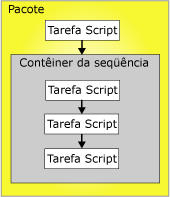

# Restrições de precedência

[!INCLUDE[ssis-appliesto](../../includes/ssis-appliesto-ssvrpluslinux-asdb-asdw-xxx.md)]

  As restrições de precedência vinculam executáveis, contêineres e tarefas em pacotes em um fluxo de controle e especificam condições que determinam a execução de executáveis. Um executável pode ser um contêiner Loop For, Loop Foreach ou Sequência; uma tarefa; ou um manipulador de eventos. Os manipuladores de eventos também usam restrições de precedência para vincular os seus executáveis a um fluxo de controle.  
  
 Uma restrição de precedência vincula dois executáveis: o de precedência e o restrito. O executável de precedência é executado antes do executável restrito e o resultado da execução do executável de precedência poderá determinar se o executável restrito será executado. O diagrama a seguir mostra dois executáveis vinculados por uma restrição de precedência.  
  
   
  
 Em um fluxo de controle linear, ou seja, aquele sem-ramificação, as restrições de precedência orientam sozinhas a sequência na qual a tarefa é executada. Se um fluxo de controle se ramifica, o mecanismo de tempo de execução [!INCLUDE[ssISnoversion](../../includes/ssisnoversion-md.md)] determina a ordem de execução dentre as tarefas e contêineres que vêm logo após a ramificação. O mecanismo de tempo de execução também determina a ordem de execução entre fluxos de trabalho não conectados em um fluxo de controle.  
  
 A arquitetura de contêiner aninhado do [!INCLUDE[ssISnoversion](../../includes/ssisnoversion-md.md)] habilita todos os contêineres, com exceção do contêiner host da tarefa que encapsula somente uma única tarefa, a incluírem outros contêineres, cada um com seu próprio fluxo de controle. Os contêineres Loop For, Loop Foreach e Sequência podem incluir várias tarefas e outros contêineres que, por sua vez, podem incluir várias tarefas e contêineres. Por exemplo, um pacote com uma tarefa Script e um contêiner Sequência tem uma restrição de precedência que vincula a tarefa Script e o contêiner Sequência. O contêiner Sequência inclui três tarefas Script e suas restrições de precedência vinculam as três tarefas Script em um fluxo de controle. O diagrama a seguir mostra as restrições de precedência em um pacote com dois níveis de aninhamento.  
  
   
  
 Como o pacote está no topo da hierarquia de contêineres do [!INCLUDE[ssIS](../../includes/ssis-md.md)] , vários pacotes não podem ser vinculados por restrições de precedência; entretanto, é possível adicionar uma tarefa Executar Pacote a um pacote e, indiretamente, vincular outro pacote ao fluxo de controle.  
  
 É possível configurar restrições de precedência adotando um dos seguinte procedimentos:  
  
-   Especifique uma operação de avaliação. A restrição de precedência usa um valor de restrição, uma expressão, ambos ou para determinar se o executável restrito será executado.  
  
-   Se a restrição de precedência usar um resultado de execução, você poderá especificar o resultado de execução para ser sucesso, falha ou conclusão.  
  
-   Se a restrição de precedência usar um resultado de avaliação, você poderá fornecer uma expressão que avalie a um booleano.  
  
-   Especifique se a restrição de precedência é avaliada isoladamente ou junto com outras restrições aplicáveis ao executável restrito.  
  
## Operações de avaliação  
 [!INCLUDE[ssISnoversion](../../includes/ssisnoversion-md.md)] fornece as operações de avaliação a seguir:  
  
-   Uma restrição que usa somente o resultado da execução do executável de precedência para determinar se o executável restrito será executado. O resultado da execução do executável de precedência pode ser conclusão, sucesso ou falha. Essa é a operação padrão.  
  
-   Uma expressão que é avaliada para determinar se o executável restrito será executado. Se a expressão avaliar como true, o executável restrito será executado.  
  
-   Uma expressão e uma restrição que combinam os requisitos dos resultados da execução do executável de precedência e os resultados de retorno da avaliação da expressão.  
  
-   Uma expressão ou restrição que usa os resultados da execução do executável de precedência ou os resultados de retorno da avaliação da expressão.  
  
 [!INCLUDE[ssIS](../../includes/ssis-md.md)] O Designer usa cores para identificar o tipo de restrição de precedência. A restrição Bem-sucedida é verde, a restrição Falha é vermelha, e a restrição Conclusão é azul. Para exibir rótulos de texto no [!INCLUDE[ssIS](../../includes/ssis-md.md)] Designer que mostrem o tipo de restrição, você deve configurar os recursos de acessibilidade do [!INCLUDE[ssIS](../../includes/ssis-md.md)] Designer.  
  
 A expressão deve ser uma expressão válida do [!INCLUDE[ssIS](../../includes/ssis-md.md)] e pode incluir funções, operadores e, variáveis do sistema e personalizadas. Para obter informações, consulte [Expressões do Integration Services &#40;SSIS&#41;](../../integration-services/expressions/integration-services-ssis-expressions.md) e [Manipuladores de Eventos do Integration Services &#40;SSIS&#41;](../../integration-services/integration-services-ssis-variables.md).  
  
## Resultados da execução  
 A restrição de precedência pode usar os resultados de execução a seguir sozinhos ou em combinação com uma expressão.  
  
-   A conclusão requer que somente o executável de precedência seja concluído, sem considerar o resultado, para que o executável restrito seja executado.  
  
-   O sucesso requer que o executável de precedência seja concluído com êxito para que o executável restrito seja executado.  
  
-   A falha requer que o executável de precedência falhe para que o executável restrito seja executado.  
  
> [!NOTE]  
>  Somente as restrições de precedência que forem membros da mesma coleção **Restrição de Precedência** poderão ser agrupadas em uma condição AND lógica. Por exemplo, você não pode combinar restrições de precedência de dois contêineres Loop Foreach.  
  
## Definir as propriedades de uma restrição de precedência com o Editor de Restrição de Precedência  
  
1.  No [!INCLUDE[ssBIDevStudioFull](../../includes/ssbidevstudiofull-md.md)], abra o projeto do [!INCLUDE[ssISnoversion](../../includes/ssisnoversion-md.md)] que contém o pacote desejado.  
  
2.  No Gerenciador de Soluções, clique duas vezes no pacote para abri-lo.  
  
3.  Clique na guia **Fluxo de Controle** .  
  
4.  Clique duas vezes na restrição de precedência.  
  
     O **Editor de Restrição de Precedência** será aberto.  
  
5.  Na lista suspensa **Operação de avaliação** , selecione uma operação de avaliação.  
  
6.  Na lista suspensa **Valor** , selecione o resultado de execução do executável de precedência.  
  
7.  Se a operação de avaliação usar uma expressão, na caixa **Expressão** , digite uma expressão e clique em **Testar** para avaliá-la.  
  
    > [!NOTE]  
    >  Nomes de variáveis diferenciam maiúsculas e minúsculas.  
  
8.  Se forem conectadas tarefas múltiplas ou contêineres ao executável restrito, selecione **AND Lógico** para especificar que os resultados de execução de todos os executáveis precedentes deverão se avaliados como **true**. Selecione **OR Lógico** para especificar que só um resultado de execução precisa ser avaliado como **true**.  
  
9. Clique em **OK** para fechar o **Editor de Restrição de Precedência**.  
  
10. Para salvar o pacote atualizado, clique em **Salvar Itens Selecionados** no menu **Arquivo** .  

## Editor de Restrição de Precedência
Use a caixa de diálogo **Editor de Restrição de Precedência** para configurar as restrições de precedência.  
  
### Opções  
 **Operação de avaliação**  
 Especifica a operação de avaliação usada pela restrição de precedência. As operações são: **Constraint**, **Expression**, **Expression and Constraint** e **Expression or Constraint**.  
  
 **Value**  
 Especifique o valor de restrição: **Success**, **Failure** ou **Completion**.  
  
> [!NOTE]  
>  A linha de restrição de precedência é verde para **Sucesso**, realçado para **Falha**e azul para **Conclusão**.  
  
 **Expression**  
 Se usar as operações **Expressão**, **Expressão e Restrição**ou **Expressão ou Restrição**, digite uma expressão ou inicie o Construtor de Expressões para criar a expressão. A expressão deve ser avaliada como um booliano.  
  
 **Testar**  
 Valide a expressão.  
  
 **AND lógico**  
 Selecione para especificar que várias restrições de precedência no mesmo executável devem ser avaliadas juntas. Todas as restrições devem ser avaliadas como **True**.  
  
> [!NOTE]  
>  Este tipo de restrição de precedência aparece como uma linha sólida nas cores verde, realçado ou azul.  
  
 **OR lógico**  
 Selecione para especificar que várias restrições de precedência no mesmo executável devem ser avaliadas juntas. Pelo menos uma restrição deve ser avaliada como **True**.  
  
> [!NOTE]  
>  Este tipo de restrição de precedência aparece como uma linha pontilhada nas cores verde, realçado ou azul.  
  
## Definir as propriedades de uma restrição de precedência na janela Propriedades  
  
1.  No [!INCLUDE[ssBIDevStudioFull](../../includes/ssbidevstudiofull-md.md)], abra o projeto do [!INCLUDE[ssISnoversion](../../includes/ssisnoversion-md.md)] que contém o pacote a ser modificado.  
  
2.  No Gerenciador de Soluções, clique duas vezes no pacote para abri-lo.  
  
3.  Clique na guia **Fluxo de Controle** . Na superfície de design da guia Fluxo de Controle , clique com o botão direito do mouse na restrição de precedência e clique em **Propriedades**. Na janela Propriedades, modifique os valores de propriedade.  
  
4.  Na janela **Propriedades** , defina as seguintes propriedades de leitura/gravação de restrições de precedência:  
  
    |Propriedade de leitura/gravação|Ação de configuração|  
    |--------------------------|--------------------------|  
    |Descrição|Forneça uma descrição.|  
    |EvalOp|Selecione uma operação de avaliação. Se a operação **Expression**, **ExpressionAndConstant**ou **ExpressionOrConstant** for selecionada, você poderá especificar uma expressão.|  
    |Expression|Se a operação de avaliação incluir uma expressão, forneça uma expressão. A expressão deve ser avaliada como um booliano. Para obter mais informações sobre a linguagem de expressão, consulte [Expressões do Integration Services &#40;SSIS&#41;](../../integration-services/expressions/integration-services-ssis-expressions.md).|  
    |LogicalAnd|Defina **LogicalAnd** para especificar se a restrição de precedência é avaliada juntamente com outras restrições de precedência, quando vários executáveis precederem e estiverem vinculados ao executável restrito|  
    |Nome|Atualize o nome da restrição de precedência.|  
    |ShowAnnotation|Especifique o tipo de anotação a ser usada. Selecione **Nunca** para desabilitar anotações, **AsNeeded** para habilitar a anotação sob demanda, **ConstraintName** para efetuar anotações automáticas usando o valor da propriedade Name, **ConstraintDescription** para efetuar anotações automaticamente usando o valor da propriedade Description e **ConstraintOptions** para efetuar anotações automáticas usando os valores das propriedades Value e Expression.|  
    |Valor|Se a operação de avaliação especificada na propriedade EvalOP incluir uma restrição, selecione o resultado de execução do executável de restrição.|  
  
5.  Feche a janela Propriedades.  
  
6.  Para salvar o pacote atualizado, clique em **Salvar Itens Selecionados** no menu **Arquivo** .  

## Definir o valor de uma restrição de precedência com o menu de atalho  
  
1.  No [!INCLUDE[ssBIDevStudioFull](../../includes/ssbidevstudiofull-md.md)], abra o projeto do [!INCLUDE[ssISnoversion](../../includes/ssisnoversion-md.md)] que contém o pacote desejado.  
  
2.  No Gerenciador de Soluções, clique duas vezes no pacote para abri-lo.  
  
3.  Clique na guia **Fluxo de Controle** .  
  
4.  Na superfície de design da guia **Fluxo de controle** , clique com o botão direito do mouse na restrição de precedência e depois clique em **Êxito**, **Falha**ou **Conclusão**.  
  
5.  Para salvar o pacote atualizado, clique em **Salvar Item Selecionado** no menu **Arquivo** .  

## Adicionar expressões a restrições de precedência
 Uma restrição de precedência pode usar uma expressão para definir a restrição entre dois executáveis: o executável de precedência e o executável de restrição. Os executáveis podem ser tarefas ou contêineres. A expressão pode ser usada sozinha ou em combinação com o resultado de execução do executável da restrição. O resultado da execução de um executável pode ter sucesso ou falha. Quando você configura o resultado de execução de uma restrição de precedência, pode definir o resultado de execução como **Sucesso**, **Falha**ou **Conclusão**. **Sucesso** exige que o executável de precedência tenha sucesso, **Falha** exige que o executável de precedência falhe e **Conclusão** indica que o executável de restrição deve ser executado independentemente da tarefa de restrição ter sucesso ou falhar. Para obter informações, consulte [Restrições de precedência](../../integration-services/control-flow/precedence-constraints.md).  
  
 A expressão deve ser avaliada como **Verdadeira** ou **Falsa** e deve ser uma expressão [!INCLUDE[ssISnoversion](../../includes/ssisnoversion-md.md)] válida. A expressão pode usar literais, variáveis personalizadas e de sistema e as funções e operadores que a gramática de expressão [!INCLUDE[ssIS](../../includes/ssis-md.md)] fornece. Por exemplo, a expressão `@Count == SQRT(144) + 10` usa a variável **Count**, a função SQRT e os operadores de igual (==) e soma (+). Para obter mais informações, consulte [Expressões do Integration Services &#40;SSIS&#41;](../../integration-services/expressions/integration-services-ssis-expressions.md).  
  
 Na ilustração a seguir, as tarefas A e B estão vinculadas por uma restrição de precedência que usa um resultado de execução e uma expressão. O valor da restrição é definido como **Sucesso** e a expressão é  `@X >== @Z`. A tarefa B, a tarefa de restrição, só será executada se a tarefa A for concluída com sucesso e o valor da variável **X** for maior que ou igual ao valor da variável **Z**.  
  
   
  
 Os executáveis também podem ser vinculados usando múltiplas restrições de precedência que contenham expressões diferentes. Por exemplo, na ilustração a seguir, as tarefas B e C estão vinculadas à tarefa A por restrições de precedência que usam resultados de execução e expressões. Ambos os valores de restrição são definidos como **Sucesso.** Uma restrição de precedência inclui a expressão `@X >== @Z`e a outra restrição de precedência inclui a expressão `@X < @Z`. Dependendo dos valores da variável **X** e da variável **Z**, uma das tarefas C ou B será executada.  
  
   
  
 Você pode adicionar ou modificar uma expressão usando o **Editor de Restrição de Precedência** no Designer [!INCLUDE[ssIS](../../includes/ssis-md.md)] , e a janela Propriedades que o [!INCLUDE[ssBIDevStudioFull](../../includes/ssbidevstudiofull-md.md)] fornece. Entretanto, a janela Propriedades não fornece verificação da sintaxe de expressão.  
  
 Se uma restrição de precedência incluir uma expressão, um ícone será exibido na superfície de design da guia **Fluxo de Controle** , próximo à restrição de precedência e a dica de ferramenta sobre o ícone exibirá a expressão.  

### Adicionar uma expressão a uma restrição de precedência  
  
1.  No [!INCLUDE[ssBIDevStudioFull](../../includes/ssbidevstudiofull-md.md)], abra o projeto do [!INCLUDE[ssISnoversion](../../includes/ssisnoversion-md.md)] que contém o pacote desejado.  
  
2.  No Gerenciador de Soluções, clique duas vezes no pacote para abri-lo.  
  
3.  Clique na guia **Fluxo de Controle** .  
  
4.  Na superfície de design da guia **Fluxo de Controle** , clique duas vezes na restrição de precedência. O **Editor de Restrição de Precedência** será aberto.  
  
5.  Selecione **Expressão**, **Expressão e Restrição**ou **Expressão ou Restrição** na lista **Operação de avaliação** .  
  
6.  Digite uma expressão na caixa de texto **Expressão** ou inicie o Construtor de Expressões para criar uma expressão.  
  
7.  Para validar a sintaxe da expressão, clique em **Testar**.  
  
8.  Para salvar o pacote atualizado, clique em **Salvar Itens Selecionados** no menu **Arquivo** .  
 
### Combinar valores de execução e expressões  
 A tabela a seguir descreve os efeitos de combinar uma restrição de valor de execução e uma expressão em uma restrição de precedência.  
  
|Operação de avaliação|A restrição avalia como|A expressão avalia como|O executável restrito executa|  
|--------------------------|-----------------------------|-----------------------------|---------------------------------|  
|Constraint|True|N/A|True|  
|Constraint|Falso|N/A|Falso|  
|Expression|N/A|True|True|  
|Expression|N/A|Falso|Falso|  
|Restrição e expressão|True|True|True|  
|Restrição e expressão|True|Falso|Falso|  
|Restrição e expressão|Falsa|True|Falso|  
|Restrição e expressão|Falso|Falso|Falso|  
|Restrição ou expressão|True|True|Verdadeira|  
|Restrição ou expressão|True|Falso|True|  
|Restrição ou expressão|Falso|True|Verdadeira|  
|Restrição ou expressão|Falso|Falso|Falso|  

## Cenários de restrição complexos com várias restrições de precedência 
Uma restrição de precedência conecta dois executáveis: duas tarefas, dois contêineres, ou um de cada. Eles são conhecidos como o executável de precedência e o executável restrito. Um executável restrito pode ter múltiplas restrições de precedência. Para obter mais informações, consulte [Precedence Constraints](../../integration-services/control-flow/precedence-constraints.md).  
  
 Reunir cenários de restrição complexos por agrupamento de restrições permite que você implemente o fluxo de controle complexo em pacotes. Por exemplo, na ilustração a seguir, a Tarefa D está vinculada à Tarefa A por uma restrição **Êxito** , a Tarefa D está vinculada à Tarefa B por uma restrição **Falha** e a Tarefa D está vinculada à Tarefa C por uma restrição **Êxito** . As restrições de precedência entre as Tarefas D e A, entre as Tarefas D e B e entre as Tarefas D e C participam de uma relação lógica *and* . Portanto, para que a Tarefa D seja executada, a Tarefa A deve ser executada com êxito, a Tarefa B deve falhar e a Tarefa C deve ser executada com êxito.  
  
   
  
### Propriedade LogicalAnd  
 Se uma tarefa ou contêiner tiver múltiplas restrições, a propriedade **LogicalAnd** especificará se uma restrição de precedência é avaliada isoladamente ou junto com outras restrições.  
  
 Você pode definir a propriedade **LogicalAnd** usando o **Editor de Restrição de Precedência** no [!INCLUDE[ssIS](../../includes/ssis-md.md)] Designer ou na janela Propriedades que o [!INCLUDE[ssBIDevStudioFull](../../includes/ssbidevstudiofull-md.md)] fornece.  

## Definir o valor padrão de restrições de precedência  
Quando você usa o [!INCLUDE[ssIS](../../includes/ssis-md.md)] Designer pela primeira vez, o valor padrão de uma restrição de precedência é **Success**. Siga estas etapas para configurar o [!INCLUDE[ssIS](../../includes/ssis-md.md)] Designer para usar um valor padrão diferente para restrições de precedência.
  
1.  Abra o [!INCLUDE[ssBIDevStudioFull](../../includes/ssbidevstudiofull-md.md)].  
  
2.  No menu **Ferramentas** , clique em **Opções**.  
  
3.  Na caixa de diálogo **Opções** , expanda **Designers do Business Intelligence** e então expanda **Designers do Integration Services**.  
  
4.  Clique em **Conexão Automática do Fluxo de Controle** e selecione **Conectar uma nova forma à forma selecionada por padrão**.  
  
5.  Na lista suspensa, escolha **Usar uma restrição de Falha para a nova forma** ou **Usar uma restrição de Conclusão para a nova forma**.  
  
6.  Clique em **OK**.  
  
## Criar uma restrição de precedência padrão  
  
1.  No [!INCLUDE[ssBIDevStudioFull](../../includes/ssbidevstudiofull-md.md)], abra o projeto do [!INCLUDE[ssISnoversion](../../includes/ssisnoversion-md.md)] que contém o pacote desejado.  
  
2.  No Gerenciador de Soluções, clique duas vezes no pacote para abri-lo.  
  
3.  Clique na guia **Fluxo de Controle** .  
  
4.  Na superfície de design da guia **Fluxo de Controle** , clique na tarefa ou no contêiner e arraste seu conector para o executável em que você deseja aplicar a restrição de precedência.  
  
5.  Para salvar o pacote atualizado, clique em **Salvar Itens Selecionados** no menu **Arquivo** .  
