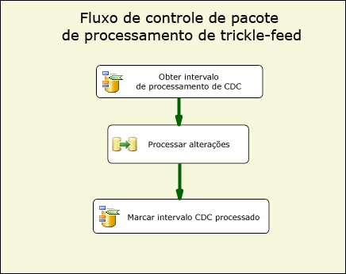
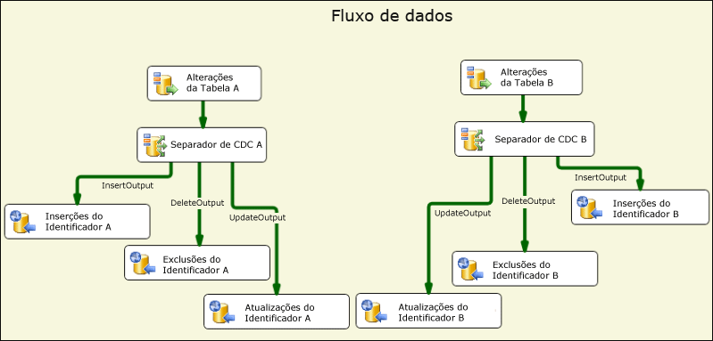
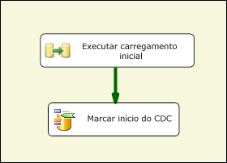
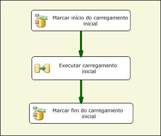
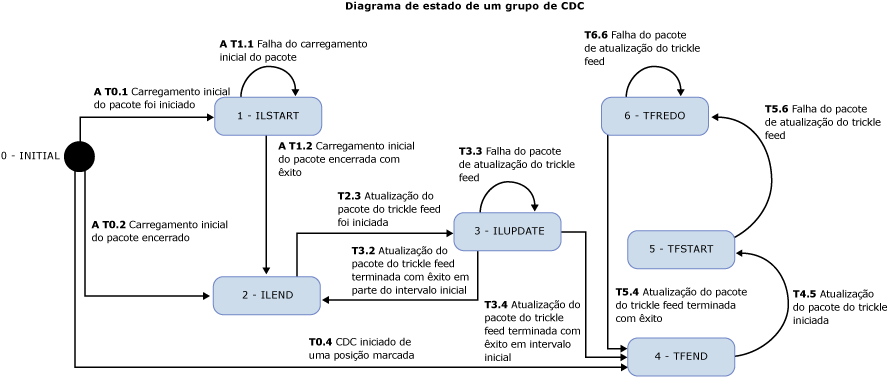

# Componentes de fluxo CDC

[!INCLUDE[sqlserver-ssis](../../includes/applies-to-version/sqlserver-ssis.md)]

  Os componentes Change Data Capture da Attunity para Microsoft [!INCLUDE[ssISCurrent](../../includes/ssiscurrent-md.md)] Microsoft ajudam os desenvolvedores do SSIS a trabalharem com CDC e reduzir a complexidade de pacotes CDC.  
  
 Os componentes do SSIS CDC são criados para funcionar com o recurso do [!INCLUDE[ssCurrent](../../includes/sscurrent-md.md)] CDC em que as tabelas de origem são os mesmos bancos de dados do [!INCLUDE[ssCurrent](../../includes/sscurrent-md.md)] ou Oracle (ao usar o Serviço Oracle CDC para o [!INCLUDE[ssCurrent](../../includes/sscurrent-md.md)]). Não há suporte para tabelas particionadas.  
  
 Os componentes incluem componentes de Controle e Fluxo de Dados que agilizam a experiência de ler e processar dados de alteração em pacotes de SSIS. Os componentes podem ser adicionados à biblioteca de componente no Microsoft [!INCLUDE[ssCurrent](../../includes/sscurrent-md.md)], mas são instalados separadamente.  
  
 Veja a seguir os componentes do Change Data Capture da Attunity:  
  
 **Componente de fluxo de controle CDC**:  
  
 [Tarefa Controle de CDC](../../integration-services/control-flow/cdc-control-task.md)  
  
 **Componentes de fluxo de dados CDC**:  
  
 [Origem CDC](../../integration-services/data-flow/cdc-source.md)  
  
 [Divisor de CDC](../../integration-services/data-flow/cdc-splitter.md)  
  
## Instalação  
 Esta seção descreve os procedimentos de instalação para os Componentes CDC para o Microsoft [!INCLUDE[ssISCurrent](../../includes/ssiscurrent-md.md)].  
  
 Os componentes CDC para SSIS são empacotados com o Microsoft® Change Data Capture Designer e Service para Oracle da Attunity para Microsoft SQL Server®. Este download é parte do SQL Server Feature Pack. Baixe componentes do Feature Pack da [página da Web do SQL Server 2016 Feature Pack](https://go.microsoft.com/fwlink/?LinkId=746297).  
  
### Suporte da versão

#### Suporte à versão do SQL Server

Os componentes CDC para SSIS são compatíveis com todas as versões do Microsoft SQL Server com suporte. Atualmente, as versões do SQL Server com suporte incluem o SQL Server 2012 a 2017.

#### Suporte à versão do sistema operacional
  
Os componentes CDC para SSIS têm suporte nos seguintes sistemas operacionais e plataformas:  
  
-   Windows 8 e 8.1
-   Windows 10  
-   Windows Server 2012 e 2012 R2
-   Windows Server 2016
  
### Executando o programa de instalação  
 Antes de executar o assistente de instalação, verifique se o [!INCLUDE[ssCurrent](../../includes/sscurrent-md.md)][!INCLUDE[ssBIDevStudio](../../includes/ssbidevstudio-md.md)] está fechado. Em seguida, siga as instruções no assistente de instalação.  
  
### Reiniciar o serviço SSIS 
Depois de instalar os componentes CDC, você deve reiniciar o serviço SSIS para verificar se os componentes funcionam corretamente ao desenvolver pacotes no SQL [!INCLUDE[ssBIDevStudio](../../includes/ssbidevstudio-md.md)].  
  
Uma mensagem é exibida depois de instalar os componentes. Clique em **Sim** quando solicitado.  
  
### Desinstalando os Componentes CDC da Microsoft  
 Você desinstala a origem do CDC, o separador do CDC ou a tarefa de controle do CDC usando o assistente de desinstalação. Se você estiver usando o [!INCLUDE[ssCurrent](../../includes/sscurrent-md.md)][!INCLUDE[ssBIDevStudio](../../includes/ssbidevstudio-md.md)] para desenvolvimento de pacote, tenha certeza de que o [!INCLUDE[ssBIDevStudio](../../includes/ssbidevstudio-md.md)] está fechado antes de executar o assistente de desinstalação.  
  
## Benefícios  
 Os Componentes CDC para componentes do [!INCLUDE[ssCurrent](../../includes/sscurrent-md.md)][!INCLUDE[ssISnoversion](../../includes/ssisnoversion-md.md)] permitem que os desenvolvedores do SSIS compilem facilmente os pacotes do SSIS que processam dados de alteração. Estes componentes aprimoram a capacidade de desenvolvedores de SSIS de lidarem com o CDC e reduzir a complexidade de pacotes de CDC.  
  
 Os componentes SSIS CDC são usados para fornecer os dados de alteração de uma maneira que seja fácil processá-los posteriormente para replicação, carregando um data warehouse, atualizando dimensões variáveis lentamente para OLAP, auditando alterações ou para usos adicionais possíveis. O tipo de processamento posterior usado é determinado pelo desenvolvedor do SSIS.  
  
 Os componentes do SSIS CDC são criados para funcionar com o recurso do [!INCLUDE[ssCurrent](../../includes/sscurrent-md.md)] CDC com tabelas de alteração que estão no mesmo banco de dados do [!INCLUDE[ssCurrent](../../includes/sscurrent-md.md)] .  
  
## Guia de Introdução com os componentes do Change Data Capture  
 Um pacote de CDC típico processa as alterações em um grupo de tabelas. A parte básica do fluxo de controle deste tipo de pacote de CDC é mostrada na figura a seguir. Este pacote é chamado de pacote de processamento de trickle feed.  
  
   
  
 Este Fluxo de Controle do [!INCLUDE[ssCurrent](../../includes/sscurrent-md.md)][!INCLUDE[ssISnoversion](../../includes/ssisnoversion-md.md)] contém duas tarefas de controle CDC e a tarefa de Fluxo de Dados. A primeira tarefa chamada **Obter Intervalo de Processamento CDC** estabelece o intervalo de LSN para as alterações que são processadas na tarefa de fluxo de dados chamada **Processar Alterações**. Este intervalo é estabelecido com base no que foi processado durante a última execução de pacote e foi salvo em um repositório persistente.  
  
 Para obter mais informações sobre a tarefa Controle CDC, consulte [CDC Control Task](../../integration-services/control-flow/cdc-control-task.md) e [CDC Control Task Editor](../../integration-services/control-flow/cdc-control-task-editor.md).  
  
 A figura a seguir mostra o fluxo de dados de **Processar Alterações** que conceitualmente mostra como as alterações são processadas.  
  
   
  
 As etapas ilustradas nesta figura são:  
  
-   As **Alterações para a Tabela X** são uma origem CDC que lê as alterações feitas à tabela X que foram feitas no intervalo de processamento CDC determinado no fluxo de controle pai.  
  
-   O **Divisor de CDC X** é usado para dividir as alterações em inserções, exclusões e atualizações. Neste cenário, supõe-se que a Origem CDC esteja configurada para gerar alterações Líquidas de forma que diferentes tipos de alteração possam ser processadas em paralelo.  
  
-   As alterações específicas são então processadas posteriormente downstream. Nesta ilustração, as alterações são inseridas em tabelas usando vários Destinos ODBC, mas, em casos reais, o processamento pode ser diferente.  
  
 Para obter mais informações sobre a origem CDC, consulte:  
  
 [Origem CDC](../../integration-services/data-flow/cdc-source.md)  
  
 [Editor de Origem CDC &#40;Página Gerenciador de Conexões&#41;](../../integration-services/data-flow/cdc-source-editor-connection-manager-page.md)  
  
 [Editor de Origem CDC &#40;página Colunas&#41;](../../integration-services/data-flow/cdc-source-editor-columns-page.md)  
  
 [Editor de Origem CDC &#40;Página Saída de Erro&#41;](../../integration-services/data-flow/cdc-source-editor-error-output-page.md)  
  
 Para obter mais informações sobre o Separador de CDC, consulte:  
  
 [Divisor de CDC](../../integration-services/data-flow/cdc-splitter.md)  
  
 Um dos problemas básicos que exigem atenção ao criar pacotes de CDC é como o processamento de alterações interage com o carregamento inicial (ou processamento inicial) dos dados.  
  
 Os componentes do CDC dão suporte a três cenários distintos de carregamento inicial e processamento de alterações:  
  
-   Carregamento inicial feito com um instantâneo do banco de dados. Neste caso, o processamento de alterações inicia com o LSN do evento de instantâneo.  
  
-   Carregamento inicial de um banco de dados novo. Neste caso, nenhuma alteração é feita durante o carregamento inicial, de modo que o LSN atual tem uma amostra feita em algum momento durante o carregamento inicial e o processamento de alterações inicia com esse LSN.  
  
-   Carregamento inicial de um banco de dados ativo. Neste caso, à medida que uma carga inicial está em andamento, as alterações são feitas no banco de dados e não há nenhum LSN único do qual o processamento de alterações possa ser iniciado com precisão. Neste caso, o desenvolvedor do pacote de carga inicial pode fazer uma amostra do LSN atual do banco de dados de origem antes e depois da carga inicial. Em seguida, ao processar as alterações, é preciso ter cuidado ao processar as alterações feitas em paralelo à carga inicial já que algumas das alterações processadas já são vistas na carga inicial (por exemplo, uma alteração de Inserção pode falhar com um erro de chave duplicada porque a linha inserida foi lida pelo processo de carga inicial).  
  
 A figura a seguir mostra um pacote SSIS que poderia tratar os primeiros dois cenários:  
  
   
  
 A figura a seguir mostra um pacote SSIS que poderia tratar o terceiro cenário:  
  
   
  
 Após um pacote de carga inicial, um pacote de atualização do trickle-feed é executado repetidamente de acordo com uma agenda para processar as alterações à medida que elas ficam disponíveis para consumo.  
  
 Passar o estado do processamento de CDC do pacote de carga inicial para o pacote trickle feed e entre tarefas diferentes dentro de cada pacote ocorre por meio de uma variável de cadeia de caracteres especial de pacote SSIS. O valor desta variável é chamado de Estado de CDC, que reflete o estado atual de CDC do processamento de CDC para os grupos de tabelas que são tratados pela carga inicial e por pacotes trickle feed.  
  
 O valor da variável de estado de CDC precisa ser mantido no armazenamento persistente. Ele deve ser lido antes de iniciar o processamento de CDC e deve ser salvo com o estado atual após a conclusão do processamento. A tarefa de carregar e armazenar o estado de CDC pode ser tratada pelo desenvolvedor de SSIS, mas o componente de Controle de CDC pode automatizar esta tarefa mantendo o valor do Estado de CDC em uma tabela de banco de dados.  
  
## Considerações de segurança  
 Esta seção lista algumas considerações de segurança relacionadas ao uso dos componentes de CDC no SSIS.  
  
### Autorização de acesso a dados de alteração  
 Os pacotes de atualização trickle feed precisam de acesso às funções do [!INCLUDE[ssCurrent](../../includes/sscurrent-md.md)] CDC. Esse acesso é concedido, por padrão, a membros da função de banco de dados fixa **db_owner** . Como **db_owner** é uma função avançada, ao definir instâncias de captura dentro do [!INCLUDE[ssCurrent](../../includes/sscurrent-md.md)] , é recomendável associar uma função de segurança associada a cada instância de captura que permite que o pacote SSIS CDC use um usuário muito mais restrito para processar as alterações.  
  
### Acesso ao LSN atual de banco de dados CDC  
 As operações de tarefa de Controle CDC para marcar o LSN inicial para processamento de alterações devem poder localizar o LSN atual de banco de dados CDC. Os componenes localizam o LSN usando o procedimento **sp_replincrementlsn** do banco de dados mestre. A permissão Execute neste procedimento deve ser dada ao logon usado para conectar ao banco de dados do [!INCLUDE[ssCurrent](../../includes/sscurrent-md.md)] CDC.  
  
### Acesso à tabela de Estados CDC  
 A tabela de Estados CDC é usada para persistir automaticamente Estados CDC que precisam ser atualizáveis pelo logon usado para conectar ao banco de dados [!INCLUDE[ssCurrent](../../includes/sscurrent-md.md)] CDC. Como esta tabela é criada pelo desenvolvedor do SSIS, defina o administrador do sistema do [!INCLUDE[ssCurrent](../../includes/sscurrent-md.md)] como um usuário que é autorizado para criar bancos de dados do [!INCLUDE[ssCurrent](../../includes/sscurrent-md.md)] e executar tarefas administrativas e de manutenção. Além disso, um administrador do sistema do [!INCLUDE[ssCurrent](../../includes/sscurrent-md.md)] que trabalha com bancos de dados habilitados para CDC devem conhecer a tecnologia e a implementação do [!INCLUDE[ssCurrent](../../includes/sscurrent-md.md)] CDC.  
  
## Agrupando tabelas para processamento CDC  
 Projetos de banco de dados variam em tamanho de várias tabelas para muitos milhares de tabelas. Ao criar a carga inicial e os pacotes CDC, é interessante agrupar tabelas em muitos grupos menores para facilitar o gerenciamento e a eficiência. Esta seção lista várias considerações que afetam a classificação de tabelas em grupos pequenos, onde as tabelas em cada são inicialmente carregadas e, em seguida, atualizadas como um grupo.  
  
 Os padrões de CDC com suporte pelos componentes CDC presumem que este agrupamento já esteja determinado. Cada grupo define um contexto CDC separado que é mantido separadamente de outros grupos. Para cada grupo, são criados pacotes de atualização trickle feed e de carga inicial. As atualizações trickle feed são programadas para execuções periódicas com base na taxa de restrições de processamento de alterações (por exemplo, CPU e consumo de E/S, impacto em outros sistemas) e a latência desejada.  
  
 As tabelas são agrupadas com base nas seguintes considerações:  
  
1.  De acordo com o banco de dados de destino. Todas as tabelas que são gravadas em bancos de dados de destino diferentes ou passam por processamento diferente devem ser atribuídas a grupos de CDC diferentes.  
  
2.  As tabelas que estão relacionadas a restrições de integridade referenciais devem ser atribuídas ao mesmo grupo para evitar problemas de integridade referencial no destino.  
  
3.  As tabelas para as quais a latência maior pode ser tolerada podem ser agrupadas para que possam ser processadas com menos frequência e, com isso, reduzir a carga de sistema global.  
  
4.  As tabelas para as quais há uma taxa mais alta de alteração devem estar em grupos menores e as tabelas com uma taxa baixa de alteração podem ser agrupadas em grupos maiores.  
  
 Os dois pacotes seguintes são criados para cada grupo de CDC:  
  
-   Um pacote de Carga Inicial, que lê o intervalo inteiro de dados das tabelas de origem e são aplicados às tabelas de destino.  
  
-   Um pacote de atualização trickle feed que lê as alterações feitas às tabelas de origem e é aplicado às alterações feitas às tabelas de destino. Este pacote deve ser executado regularmente, de maneira agendada.  
  
## Estado CDC  
 Cada grupo de CDC tem um estado associado a ele, que é representado por uma cadeia de caracteres com um formato específico. Para obter mais informações, consulte [CDC Control Task](../../integration-services/control-flow/cdc-control-task.md). A tabela a seguir mostra os valores possíveis de estado de CDC.  
  
|Estado|DESCRIÇÃO|  
|-----------|-----------------|  
|0-(INITIAL)|O estado que existe antes que qualquer pacote seja executado no grupo de CDC atual. Este também é o estado quando o estado de CDC está vazio.   Para obter mais informações sobre operações de tarefa Controle CDC, consulte [CDC Control Task](../../integration-services/control-flow/cdc-control-task.md).|  
|1-ILSTART (Initial-Load-Started)|Este é o estado que existe quando o pacote de carga inicial é iniciado. Isto ocorre depois da chamada da operação **MarkInitialLoadStart** para a tarefa Controle CDC.   Para obter mais informações sobre operações de tarefa Controle CDC, consulte [CDC Control Task](../../integration-services/control-flow/cdc-control-task.md).|  
|2- ILEND (Initial-Load-Ended)|Este é o estado que existe quando o pacote de carga inicial é terminado com êxito. Isto ocorre depois da chamada da operação MarkInitialLoadEnd para a tarefa Controle CDC.   Para obter mais informações sobre operações de tarefa Controle CDC, consulte [CDC Control Task](../../integration-services/control-flow/cdc-control-task.md).|  
|3-ILUPDATE (Initial Load Update)|Este é o estado que existe depois da primeira execução do pacote de atualização depois da carga inicial, enquanto ainda processa o intervalo de processamento inicial. Isto ocorre depois da chamada da operação **GetProcessingRange** para a tarefa Controle CDC.   Se estiver usando a coluna **_$reprocessing** , ela será definida como 1 para indicar que o pacote pode estar reprocessando linhas já no destino.   Para obter mais informações sobre operações de tarefa Controle CDC, consulte [CDC Control Task](../../integration-services/control-flow/cdc-control-task.md).|  
|4-TFEND (Trickle-Feed-Update-Ended)|Este é o estado esperado para execuções regulares de CDC. Ele indica que a execução anterior foi concluída com êxito e que uma nova execução com um novo intervalo de processamento pode ser iniciada.|  
|5-TFSTART (Trickle-Feed-Update-Started)|Este é o estado que existe em execuções subsequentes do pacote de atualização depois da chamada da operação **GetProcessingRange** para a tarefa controle CDC.   Isto indica que uma execução CDC regular foi iniciada, mas não foi concluída ou ainda não foi concluída completamente (**MarkProcessedRange**).   Para obter mais informações sobre operações de tarefa Controle CDC, consulte [CDC Control Task](../../integration-services/control-flow/cdc-control-task.md).|  
|6-TFREDO (Reprocessing-Trickle-Feed-Updates)|Este é o estado em um **GetProcessingRange** que ocorre depois de TFSTART. Isto indica que a execução anterior não foi concluída com êxito.   Se estiver usando a coluna __$reprocessing, ela será definida como 1 para indicar que o pacote pode estar reprocessando linhas já no destino.|  
|7-ERROR|O grupo de CDC está em um estado de ERROR.|  
  
 A seguir, veja o diagrama de estado para os componentes CDC. Um estado de ERROR é atingido quando um estado não é esperado. Os estados esperados estão ilustrados no diagrama a seguir. No entanto o diagrama não mostra o estado ERROR.  
  
 Por exemplo, no final de um pacote de carga inicial, ao tentar definir o estado como ILEND, se o estado for TFSTART, o grupo de CDC estará em um estado de erro e o pacote Atualização Trickle Feed não será executado (o pacote de Carga Inicial é executado).  
  
   
  
 Quando o pacote de Carga Inicial é executado com êxito, o pacote de Atualização Trickle Feed é executado repetidamente em uma agenda predeterminada para processar as alterações nas tabelas de origem. Cada execução do pacote Atualização Trickle Feed é uma execução de CDC.  
  
## Nesta seção  
  
-   [Origem CDC](../../integration-services/data-flow/cdc-source.md)  
  
-   [Divisor de CDC](../../integration-services/data-flow/cdc-splitter.md)  
  
## Related Tasks  
  
-   [Direcionar o fluxo de CDC de acordo com o tipo de alteração](../../integration-services/data-flow/direct-the-cdc-stream-according-to-the-type-of-change.md)  
  
-   [Definir uma variável de estado](../../integration-services/data-flow/define-a-state-variable.md)  
  
## Conteúdo relacionado  
  
-   Entrada de blog, [CDC no SSIS para SQL Server 2012](https://www.mattmasson.com/2011/12/cdc-in-ssis-for-sql-server-2012-2/)em mattmasson.com.  
  
-   Entrada de blog sobre como configurar o serviço de CDC, [CDC para Oracle no SQL Server 2012](https://go.microsoft.com/fwlink/?LinkId=247827)em blogs.msdn.com.  
  
-   Artigo técnico [Instalando o Change Data Capture do Microsoft SQL Server 2012 para Oracle da Attunity](https://go.microsoft.com/fwlink/?LinkId=252958)em social.technet.microsoft.com.  
  
-   Artigo técnico [Solucionando problemas de configuração do Microsoft Change Data Capture para Oracle da Attunity](https://go.microsoft.com/fwlink/?LinkId=252960)em social.technet.microsoft.com.  
  
-   Artigo técnico [Solucionando erros de instância CDC no Microsoft Change Data Capture para Oracle da Attunity](https://go.microsoft.com/fwlink/?LinkId=252961)em social.technet.microsoft.com.  
  
-   Vídeo [CDC para bancos de dados Oracle usando o SQL Server Integration Services 2012 (vídeo do SQL Server)](https://technet.microsoft.com/sqlserver/jj218898)em technet.microsoft.com.  
  
## Consulte Também  
 [Tarefa Controle de CDC](../../integration-services/control-flow/cdc-control-task.md)  
  
  
