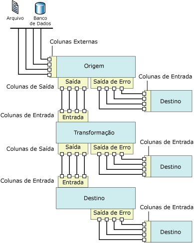

# Fluxo de Dados

[!INCLUDE[sqlserver-ssis](../../includes/applies-to-version/sqlserver-ssis.md)]

  O [!INCLUDE[ssNoVersion](../../includes/ssnoversion-md.md)] [!INCLUDE[ssISnoversion](../../includes/ssisnoversion-md.md)] fornece três tipos diferentes de componentes de fluxo de dados: fontes, transformações e destinos. As fontes extraem dados de armazenamentos de dados, como tabelas e exibições em bancos de dados relacionais, arquivos e bancos de dados do [!INCLUDE[ssASnoversion](../../includes/ssasnoversion-md.md)] . As transformações modificam, resumem e limpam dados. Os destinos carregam dados em repositórios de dados ou criam conjuntos de dados na memória.  
  
> [!NOTE]  
>  Quando você usa provedores personalizados, precisa atualizar o arquivo ProviderDescriptors.xml com os valores de coluna de metadados.  
  
 Além disso, o [!INCLUDE[ssISnoversion](../../includes/ssisnoversion-md.md)] fornece caminhos que conectam a saída de um componente com a entrada de outro. Os caminhos definem a sequência de componentes e permitem que você adicione anotações ao fluxo de dados ou exiba a origem da coluna.  
  
 Você conecta os componentes de fluxo de dados conectando a saída de fontes e destinos à entrada de transformações e destinos. Quando estiver criando um fluxo de dados, você geralmente conecta o segundo componente e componentes subsequentes à medida que os adiciona ao fluxo de dados. Depois de conectar o componente, as colunas de entrada estão disponíveis para usar na configuração do componente. Quando nenhuma coluna de entrada estiver disponível, você terá que completar a configuração do componente depois que ele estiver conectado ao fluxo de dados. Para obter mais informações, consulte [Caminhos do Integration Services](../../integration-services/data-flow/integration-services-paths.md) e [Conectar componentes com caminhos](https://msdn.microsoft.com/library/05633e4c-1370-4b05-802b-f36b07dd71c8).  
  
 O diagrama a seguir exibe um fluxo de dados que tem uma fonte, uma transformação com uma entrada e uma saída e um destino. O diagrama inclui as entradas, as saídas e as saídas de erro, além da entrada, da saída e das colunas externas.  
  
   
  
## Implementação de fluxo de dados  
 Adicionar uma tarefa de Fluxo de Dados ao controle de fluxo de um pacote, é a primeira etapa na implementação de um fluxo de dados em um pacote. Um pacote pode incluir múltiplas tarefas de Fluxo de Dados, cada qual com seu próprio fluxo de dados. Por exemplo, se um pacote exige que os fluxos de dados sejam executados em uma sequência específica ou que outras tarefas sejam executadas entre os fluxos de dados, você deverá usar uma tarefa de Fluxo de Dados separada para cada fluxo de dados.  
  
 Após o controle de fluxo incluir uma tarefa de Fluxo de Dados, você pode começar a criar o fluxo de dados que um pacote usa. Para obter mais informações, consulte [Tarefa de Fluxo de Dados](../../integration-services/control-flow/data-flow-task.md).  
  
 Criar um fluxo de dados inclui as etapas seguintes:  
  
-   Adicionar uma ou mais origens para extrair dados de arquivos e bancos de dados e adicionar gerenciadores de conexões para conectar-se às origens.  
  
-   Adicionar as transformações que satisfazem os requisitos empresariais do pacote. Não é exigido que um fluxo de dados inclua transformações.  
  
     Algumas transformações exigem um gerenciador de conexões. Por exemplo, a transformação Pesquisa usa um gerenciador de conexões para conectar-se ao banco de dados que contém os dados da pesquisa.  
  
-   Conectar os componentes de fluxo de dados conectando a saída de fontes e transformações à entrada de transformações e destinos.  
  
-   Adicionar um ou mais destinos para carregar dados nos repositórios de dados, como arquivos e bancos de dados, e adicionar gerenciadores de conexões para conectar-se às fontes de dados.  
  
-   Configurar saídas de erro em componentes para tratar problemas.  
  
     No tempo de execução, podem ocorrer erros no nível de linha quando componentes de fluxo de dados convertem dados, executam uma pesquisa ou avaliam expressões. Por exemplo, uma coluna de dados com um valor de cadeia de caracteres não pode ser convertido em um número inteiro ou uma expressão tenta fazer uma divisão por zero. As duas operações geram erros e as linhas que contêm os erros podem ser processadas separadamente usando um fluxo de erro. Para obter mais informações sobre como usar fluxos de erro em um fluxo de dados de pacote, consulte [Tratamento de erros em dados](../../integration-services/data-flow/error-handling-in-data.md).  
  
-   Incluir anotações para criar a autodocumentação do fluxo de dados. Para obter mais informações, consulte [Usar anotações em pacotes](../../integration-services/use-annotations-in-packages.md).  
  
> [!NOTE]  
>  Ao criar um novo pacote, você também pode usar um assistente para ajudar a configurar gerenciadores de conexões, origens e destinos corretamente. Para obter mais informações, consulte [Create Packages in SQL Server Data Tools](../../integration-services/create-packages-in-sql-server-data-tools.md).  
  
 Quando a guia **Fluxo de Dados** está ativa, a Caixa de Ferramentas contém as origens, as transformações e os destino que podem ser adicionados ao fluxo de dados.  
  
## Expressões  
 Vários dos componentes do fluxo de dados, como origens, transformações e destinos, permitem o uso de expressões de propriedade em algumas de suas propriedades. Uma expressão de propriedade é uma expressão que substitui o valor da propriedade quando o pacote é carregado. Em tempo de execução, o pacote usa os valores atualizados de propriedade. As expressões são criadas usando a sintaxe de expressão do [!INCLUDE[ssISnoversion](../../includes/ssisnoversion-md.md)] e podem incluir as funções, os operadores, os identificadores e as variáveis do [!INCLUDE[ssISnoversion](../../includes/ssisnoversion-md.md)] . Para obter mais informações, consulte [Expressões do Integration Services &#40;SSIS&#41;](../../integration-services/expressions/integration-services-ssis-expressions.md), [Expressões do Integration Services &#40;SSIS&#41;](../../integration-services/expressions/integration-services-ssis-expressions.md) e [Usar expressões de propriedade em pacotes](../../integration-services/expressions/use-property-expressions-in-packages.md).  
  
 Se você criar um pacote no [!INCLUDE[ssBIDevStudioFull](../../includes/ssbidevstudiofull-md.md)], as propriedades de quaisquer componentes de fluxo de dados que oferecem suporte às expressões de propriedade estarão expostas na tarefa de Fluxo de Dados à qual pertencem. Para adicionar, alterar e remover as expressões de propriedade dos componentes de fluxo de dados, clique na tarefa de Fluxo de Dados e, em seguida, use a janela Propriedades ou o editor para a tarefa adicionar, alterar ou excluir expressões de propriedade. As expressões de propriedades para a tarefa de Fluxo de Dados em si são gerenciadas na janela Propriedades.  
  
 Se o fluxo de dados contiver componentes que usem expressões, essas expressões também serão exibidas na janela Propriedades. Para exibir expressões, selecione a tarefa de Fluxo de Dados à qual o componente pertence. Você pode exibir propriedades por categorias ou em ordem alfabética. Se você usar a exibição categorizada na janela Propriedades, as expressões que não são usadas em uma propriedade específica serão relacionadas na categoria **Diversos** . Se você usar a exibição alfabética, as expressões serão relacionadas na ordem do nome do componente de fluxo de dados.  
  
## Origens  
 No [!INCLUDE[ssISnoversion](../../includes/ssisnoversion-md.md)], uma fonte é o componente de fluxo de dados que disponibiliza os dados de diferentes fontes de dados externas aos outros componentes do fluxo de dados. É possível extrair dados de arquivos simples, arquivos XML, pastas de trabalho do Microsoft Excel e arquivos que contenham dados brutos. Você também pode extrair os dados acessando tabelas e exibições em bancos de dados e executando consultas.  
  
 Um fluxo de dados pode incluir uma única fonte ou múltiplas.  
  
 A fonte de um fluxo de dados geralmente tem uma saída regular. A saída regular contém colunas de saída, que são colunas que a fonte adiciona ao fluxo de dados.  
  
 A saída regular faz referência a colunas externas. Uma coluna externa é uma coluna na fonte. Por exemplo, a coluna **MadeFlag** na tabela **Produto** do banco de dados **AdventureWorks** é uma coluna externa que pode ser adicionada à saída regular. Os metadados de colunas externas incluem informações como nome, tipo de dados e comprimento da coluna de origem.  
  
 Uma saída de erro de uma fonte contém as mesmas colunas da saída regular e duas colunas adicionais que fornecem informações sobre erros. O modelo de objeto do [!INCLUDE[ssISnoversion](../../includes/ssisnoversion-md.md)] não restringe o número de saídas regulares e de saídas de erro que as fontes podem ter. A maior parte das fontes que o [!INCLUDE[ssISnoversion](../../includes/ssisnoversion-md.md)] inclui, com exceção do componente Script, tem uma saída regular e muitas fontes têm uma saída de erro. As fontes personalizadas podem ser codificadas para implementar várias saídas regulares e saídas de erro.  
  
 Todas as colunas de saída estão disponíveis como colunas de entrada para o próximo componente de fluxo de dados no fluxo.  
  
 Também é possível gravar origens personalizadas. Para obter mais informações, consulte [Desenvolvendo um componente de fluxo de dados personalizado](../../integration-services/extending-packages-custom-objects/data-flow/developing-a-custom-data-flow-component.md) e [Desenvolvendo tipos específicos de componentes de fluxo de dados](../../integration-services/extending-packages-custom-objects-data-flow-types/developing-specific-types-of-data-flow-components.md).  
  
 As origens a seguir têm propriedades que podem ser atualizadas através de expressões de propriedades:  
  
-   [Origem do ADO NET](../../integration-services/data-flow/ado-net-source.md)  
  
-   [Origem XML](../../integration-services/data-flow/xml-source.md)  
  
### Fontes disponíveis para download  
 A tabela a seguir lista mais tipos de fontes que podem ser baixadas do site da [!INCLUDE[msCoName](../../includes/msconame-md.md)] .  
  
|Fonte|Descrição|  
|------------|-----------------|  
|Fonte Oracle|A fonte Oracle é o componente de fonte do [!INCLUDE[msCoName](../../includes/msconame-md.md)] Connector para Oracle da Attunity. O [!INCLUDE[msCoName](../../includes/msconame-md.md)] Connector para Oracle da Attunity também inclui um gerenciador de conexões e um destino. Para obter mais informações, consulte a página de download de [Microsoft Connectors para Oracle e Teradata da Attunity](https://go.microsoft.com/fwlink/?LinkId=789384).|  
|Fonte SAP BI|A fonte SAP BI é o componente de fonte do [!INCLUDE[msCoName](../../includes/msconame-md.md)] Connector para SAP BI. O [!INCLUDE[msCoName](../../includes/msconame-md.md)] Connector para SAP BI também inclui um gerenciador de conexões e um destino. Para obter mais informações, consulte a página de download [Microsoft SQL Server Feature Pack](https://go.microsoft.com/fwlink/?LinkID=746297).|  
|Fonte Teradata|A fonte Teradata é o componente de fonte do [!INCLUDE[msCoName](../../includes/msconame-md.md)] Connector para Teradata da Attunity. O [!INCLUDE[msCoName](../../includes/msconame-md.md)] Connector para Teradata da Attunity também inclui um gerenciador de conexões e um destino. Para obter mais informações, consulte a página de download de [Microsoft Connectors para Oracle e Teradata da Attunity](https://go.microsoft.com/fwlink/?LinkId=789384).|  
  
 Para ver uma demonstração de como utilizar os ganhos de desempenho do [!INCLUDE[msCoName](../../includes/msconame-md.md)] Connector para Oracle da Attunity, consulte [Desempenho do Microsoft Connector para Oracle da Attunity (vídeo do SQL Server)](https://go.microsoft.com/fwlink/?LinkID=210369).  
  
## Transformações  
 A capacidade das transformações varia amplamente. As transformações podem executar tarefas como atualizar, resumir, limpar, mesclar e distribuir dados. É possível modificar valores em colunas, pesquisar valores em tabelas, limpar dados e agregar valores de colunas.  
  
 As entradas e saídas de uma transformação definem as colunas de dados de entrada e de saída. Dependendo da operação executada nos dados, algumas transformações têm uma única entrada e várias saídas, enquanto outras têm várias entradas e uma única saída. As transformações também podem incluir saídas de erro, que fornecem informações sobre o erro ocorrido, juntamente com os dados com falha: por exemplo, os dados de cadeia de caracteres que não puderam ser convertidos em um tipo de dados inteiro. O modelo de objeto do [!INCLUDE[ssISnoversion](../../includes/ssisnoversion-md.md)] não restringe o número de entradas, de saídas regulares e de saídas de erro que as transformações podem conter. Você pode criar transformações personalizadas que implementam qualquer combinação de várias entradas, saídas regulares e saídas de erro.  
  
 A entrada de uma transformação é definida como uma ou mais colunas de entrada. Algumas transformações do [!INCLUDE[ssISnoversion](../../includes/ssisnoversion-md.md)] também podem fazer referência a colunas externas como entrada. Por exemplo, a entrada da transformação Comando OLE DB inclui colunas externas. Uma coluna de saída é uma coluna que a transformação adiciona ao fluxo de dados. Saídas regulares e saídas de erro contêm colunas de saída. Essas colunas de saída, por sua vez, agem como colunas de entrada para o próximo componente do fluxo de dados, seja outra transformação ou um destino.  
  
 As transformações a seguir têm propriedades que podem ser atualizadas através de expressões de propriedades:  
  
-   [Transformação Divisão Condicional](../../integration-services/data-flow/transformations/conditional-split-transformation.md)  
  
-   [Transformação Coluna Derivada](../../integration-services/data-flow/transformations/derived-column-transformation.md)  
  
-   [transformação Agrupamento Difuso](../../integration-services/data-flow/transformations/fuzzy-grouping-transformation.md)  
  
-   [transformação Pesquisa Difusa](../../integration-services/data-flow/transformations/fuzzy-lookup-transformation.md)  
  
-   [Transformação Comando OLE DB](../../integration-services/data-flow/transformations/ole-db-command-transformation.md)  
  
-   [Transformação Amostragem Percentual](../../integration-services/data-flow/transformations/percentage-sampling-transformation.md)  
  
-   [Transformação Dinâmica](../../integration-services/data-flow/transformations/pivot-transformation.md)  
  
-   [Transformação Amostragem de Linhas](../../integration-services/data-flow/transformations/row-sampling-transformation.md)  
  
-   [Transformação Classificação](../../integration-services/data-flow/transformations/sort-transformation.md)  
  
-   [Transformação não dinâmica](../../integration-services/data-flow/transformations/unpivot-transformation.md)  
  
 Para obter mais informações, consulte [Integration Services Transformations](../../integration-services/data-flow/transformations/integration-services-transformations.md).  
  
## Destinos  
 Destino é o componente de fluxo de dados que grava os dados de um fluxo em um repositório de dados específico ou cria um conjunto de dados na memória. É possível carregar dados em arquivos simples, processar objetos analíticos e fornecer dados para outros processos. Você também pode carregar os dados acessando tabelas e exibições em bancos de dados e executando consultas.  
  
 Um fluxo de dados pode incluir múltiplos destinos que carregam dados em repositórios de dados diferentes.  
  
 Um destino do [!INCLUDE[ssISnoversion](../../includes/ssisnoversion-md.md)] deve ter pelo menos uma entrada. A entrada contém colunas de entrada, originadas de outro componente de fluxo de dados. As colunas de entrada são mapeadas para colunas no destino.  
  
 Muitos destinos também têm uma saída de erro. A saída de erro de um destino contém colunas de saída, que normalmente contêm informações sobre erros ocorridos durante a gravação de dados no armazenamento de dados de destino. Erros ocorrem por muitas razões diferentes. Por exemplo, uma coluna pode conter um valor nulo, enquanto a coluna de destino não pode ser definida como nula.  
  
 O modelo de objeto do [!INCLUDE[ssISnoversion](../../includes/ssisnoversion-md.md)] não restringe o número de entradas regulares e de saídas de erro que os destinos podem ter e você pode criar destinos personalizados que implementam várias entradas e saídas de erro.  
  
 Você também pode gravar destinos personalizados. Para obter mais informações, consulte [Desenvolvendo um componente de fluxo de dados personalizado](../../integration-services/extending-packages-custom-objects/data-flow/developing-a-custom-data-flow-component.md) e [Desenvolvendo tipos específicos de componentes de fluxo de dados](../../integration-services/extending-packages-custom-objects-data-flow-types/developing-specific-types-of-data-flow-components.md).  
  
 Os destinos a seguir têm propriedades que podem ser atualizadas através de expressões de propriedades:  
  
-   [Destino de arquivo simples](../../integration-services/data-flow/flat-file-destination.md)  
  
-   [Destino do SQL Server Compact Edition](../../integration-services/data-flow/sql-server-compact-edition-destination.md)  
  
### Destinos disponíveis para download  
 A tabela a seguir lista mais tipos de destinos que podem ser baixados do site da [!INCLUDE[msCoName](../../includes/msconame-md.md)] .  
  
|Fonte|Descrição|  
|------------|-----------------|  
|Destino Oracle|O destino Oracle é o componente de destino do [!INCLUDE[msCoName](../../includes/msconame-md.md)] Connector para Oracle da Attunity. O [!INCLUDE[msCoName](../../includes/msconame-md.md)] Connector para Oracle da Attunity também inclui um gerenciador de conexões e uma fonte. Para obter mais informações, consulte a página de download de [Microsoft Connectors para Oracle e Teradata da Attunity](https://go.microsoft.com/fwlink/?LinkId=789384).|  
|Destino SAP BI|O destino SAP BI é o componente de destino do [!INCLUDE[msCoName](../../includes/msconame-md.md)] Connector para SAP BI. O [!INCLUDE[msCoName](../../includes/msconame-md.md)] Connector para SAP BI também inclui um gerenciador de conexões e uma fonte. Para obter mais informações, consulte a página de download [Microsoft SQL Server Feature Pack](https://go.microsoft.com/fwlink/?LinkID=746297).|  
|Destino Teradata|O destino Teradata é o componente de destino do [!INCLUDE[msCoName](../../includes/msconame-md.md)] Connector para Teradata da Attunity. O [!INCLUDE[msCoName](../../includes/msconame-md.md)] Connector para Teradata da Attunity também inclui um gerenciador de conexões e uma fonte. Para obter mais informações, consulte a página de download de [Microsoft Connectors para Oracle e Teradata da Attunity](https://go.microsoft.com/fwlink/?LinkId=789384).|  
  
 Para ver uma demonstração de como utilizar os ganhos de desempenho do [!INCLUDE[msCoName](../../includes/msconame-md.md)] Connector para Oracle da Attunity, consulte [Desempenho do Microsoft Connector para Oracle da Attunity (vídeo do SQL Server)](https://go.microsoft.com/fwlink/?LinkID=210369).  
  
## Gerenciadores de conexões  
 Muitos componentes de fluxo de dados se conectam às fontes de dados e você deve adicionar ao pacote os gerenciadores de conexões necessários para que o componente possa ser configurado corretamente. Você pode adicionar os gerenciadores de conexões conforme cria o fluxo de dados ou antes que você comece a criação do fluxo de dados. Para obter mais informações, consulte [Conexões do Integration Services &#40;SSIS&#41;](../../integration-services/connection-manager/integration-services-ssis-connections.md) e [Criar gerenciadores de conexões](https://msdn.microsoft.com/library/6ca317b8-0061-4d9d-b830-ee8c21268345).  
  
## Metadados externos  
 Quando você cria um fluxo de dados em um pacote usando o Designer [!INCLUDE[ssIS](../../includes/ssis-md.md)] , são feitas cópias dos metadados das fontes e destinos nas colunas externas de fontes e destinos, servindo como um instantâneo do esquema. Quando o [!INCLUDE[ssISnoversion](../../includes/ssisnoversion-md.md)] valida o pacote, o Designer [!INCLUDE[ssIS](../../includes/ssis-md.md)] compara esse instantâneo com o esquema da fonte ou do destino e envia erros e avisos, dependendo das alterações.  
  
 O projeto do [!INCLUDE[ssISnoversion](../../includes/ssisnoversion-md.md)] fornece um modo offline. Quando você trabalha offline, não são feitas conexões com as fontes ou os destinos usados pelo pacote e os metadados das colunas externas não são atualizados.  
  
## Entradas e saídas  
 As fontes têm saídas, os destinos têm entradas e as transformações têm entradas e saídas. Além disso, vários componentes de fluxo de dados podem ser configurados para usar uma saída de erro.  
  
### Entradas  
 Destinos e transformações têm entradas. Uma entrada contém uma ou mais colunas de entrada, que podem fazer referência a colunas externas se o componente de fluxo de dados tiver sido configurado para usá-las. As entradas podem ser configuradas para monitorar e controlar o fluxo de dados: por exemplo, você pode especificar se o componente deverá falhar em resposta a um erro, ignorar os erros ou redirecionar linhas de erro à saída de erro. Você também pode atribuir uma descrição à entrada ou atualizar o nome da entrada. No Designer [!INCLUDE[ssIS](../../includes/ssis-md.md)] , as entradas são configuradas usando a caixa de diálogo **Editor Avançado** . Para obter mais informações sobre o **Editor Avançado** , consulte [Integration Services User Interface](../../integration-services/integration-services-user-interface.md).  
  
### Saídas  
 Fontes e transformações sempre têm saídas. Uma saída contém uma ou mais colunas de saída, que podem fazer referência a colunas externas se o componente de fluxo de dados tiver sido configurado para usá-las. As saídas podem ser configuradas para fornecer informações úteis ao processamento downstream dos dados. Por exemplo, você pode indicar se a saída é classificada. Você também pode fornecer uma descrição para a saída ou atualizar o nome da saída. No Designer [!INCLUDE[ssIS](../../includes/ssis-md.md)] , as saídas são configuradas usando a caixa de diálogo **Editor Avançado** .  
  
### Saídas de erro  
 Fontes, destinos e transformações podem incluir saídas de erro. Você pode especificar como o componente de fluxo de dados responde a erros em cada entrada ou coluna usando a caixa de diálogo **Configurar Saída de Erro** . Se ocorrer um erro ou truncamento de dados em tempo de execução e o componente de fluxo de dados estiver configurado para redirecionar linhas, as linhas de dados com erro serão enviadas à saída de erro. A saída de erro pode ser conectada a transformações que aplicam transformações adicionais ou dados diretos a um destino diferente. Por padrão, uma saída de erro contém as colunas de saída e duas colunas de erro: **ErrorCode** e **ErrorColumn**. As colunas de saída contêm os dados da linha que falhou, **ErrorCode** fornece o código de erro e **ErrorColumn** identifica a coluna com falha.  
  
 Para obter mais informações, consulte [Tratamento de erros em dados](../../integration-services/data-flow/error-handling-in-data.md).  
  
### Colunas  
 Entradas, saídas e saídas de erro são coleções de colunas. Cada coluna é configurável e, dependendo do tipo de coluna, como entrada, saída ou externa, o [!INCLUDE[ssISnoversion](../../includes/ssisnoversion-md.md)] fornece propriedades diferentes para cada uma. [!INCLUDE[ssISnoversion](../../includes/ssisnoversion-md.md)] fornece três maneiras diferentes de definir propriedades de coluna: programaticamente, por meio das caixas de diálogo específicas aos componentes ou por meio da caixa de diálogo **Editor Avançado**.  
  
## Caminhos  
 Os caminhos conectam os componentes de fluxo de dados. No Designer [!INCLUDE[ssIS](../../includes/ssis-md.md)] , você pode exibir e modificar as propriedades de caminho, exibir os metadados de saída do ponto inicial do caminho e anexar visualizadores de dados a um caminho.  
  
 Para obter mais informações, consulte [Integration Services Paths](../../integration-services/data-flow/integration-services-paths.md) e [Debugging Data Flow](../../integration-services/troubleshooting/debugging-data-flow.md).  
  
## Configuração de componentes de fluxo de dados  
 Os componentes de fluxo de dados podem ser configurados no nível de componente, nos níveis de entrada, saída e saída de erro e no nível de coluna.  
  
-   No nível de componente, você define as propriedades que são comuns a todos os componentes e define as propriedades personalizadas do componente.  
  
-   Nos níveis de entrada, saída e saída de erro, você define as propriedades comuns de entradas, saídas e saída de erro. Se o componente der suporte a várias saídas, você poderá adicionar saídas.  
  
-   No nível de coluna, você define as propriedades comuns a todas as colunas, além de quaisquer propriedades personalizadas que o componente fornece para as colunas. Se o componente der suporte à adição de colunas de saída, você poderá adicionar colunas a saídas.  
  
 Você pode definir propriedades pelo Designer do [!INCLUDE[ssIS](../../includes/ssis-md.md)] ou programaticamente. No Designer [!INCLUDE[ssIS](../../includes/ssis-md.md)] , você pode definir propriedades de elemento usando as caixas de diálogo personalizadas fornecidas para cada tipo de elemento ou usando a janela Propriedades ou a caixa de diálogo **Editor Avançado** .  
  
 Para obter mais informações sobre como definir as propriedades usando o Designer [!INCLUDE[ssIS](../../includes/ssis-md.md)] , consulte [Definir as propriedades de um componente de fluxo de dados](../../integration-services/data-flow/set-the-properties-of-a-data-flow-component.md).  
  
## Related Tasks  
 [Adicionar ou excluir um componente em um fluxo de dados](../../integration-services/data-flow/add-or-delete-a-component-in-a-data-flow.md)  
  
 [Conectar componentes em um fluxo de dados](../../integration-services/data-flow/connect-components-in-a-data-flow.md)  
  
## Conteúdo relacionado  
 Vídeo, [Desempenho do Microsoft Connector para Oracle da Attunity (vídeo do SQL Server)](https://go.microsoft.com/fwlink/?LinkID=210369), em technet.microsoft.com.  
