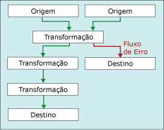

# <a name="error-handling-in-data"></a>Tratamento de erros em dados

[!INCLUDE[ssis-appliesto](../../includes/ssis-appliesto-ssvrpluslinux-asdb-asdw-xxx.md)]


  Quando um componente de fluxo de dados aplica uma transformação aos dados da coluna, extrai dados de fontes ou carrega dados nos destinos, podem ocorrer erros. Frequentemente, os erros ocorrem por causa de valores de dados inesperados. Por exemplo, uma conversão de dados falha porque uma coluna contém uma cadeia de caracteres em vez de um número, uma inserção em uma coluna de banco de dados falha porque os dados são uma data e a coluna tem um tipo de dados numéricos, ou uma expressão não é avaliada porque o valor de uma coluna é zero, resultando em uma operação matemática que não é válida.  
  
 Em geral, os erros se enquadram nas categorias a seguir:  
  
-   Erros de conversão de dados, que ocorrem se uma conversão resulta em perda de dígitos significativos, perda de dígitos insignificantes e truncamento de cadeias de caracteres. Os erros de conversão de dados também ocorrem se não houver suporte para a conversão solicitada.  
  
-   Erros de avaliação de expressão, que ocorrem se expressões avaliadas em tempo de execução realizarem operações inválidas ou se tornarem sintaticamente incorretas devido a valores de dados ausentes ou incorretos.  
  
-   Erros de pesquisa, que ocorrem se uma operação de pesquisa não conseguir localizar uma tabela de pesquisa correspondente.  
  
 Para obter uma lista de erros, avisos e outras mensagens do Integration Services, consulte [Referência de mensagens e erros do Integration Services](../../integration-services/integration-services-error-and-message-reference.md).  
  
## <a name="use-error-outputs-to-capture-row-level-errors"></a>Use saídas de erro para capturar erros de nível de linha  
 Muitos componentes de fluxo de dados dão suporte a saídas de erro, que permitem controlar como o componente manipula erros no nível da linha, em dados de entrada e de saída. Para especificar como o componente se comporta quando ocorre um truncamento ou erro, defina as opções de colunas individuais na entrada ou saída. Por exemplo, você pode especificar que o componente deve falhar se os dados com o nome do cliente estão truncados, mas ignorar erros em outra coluna que contenha dados menos importantes.  
  
 A saída de erro pode ser conectada à entrada de outra transformação ou carregada em um destino diferente do que a saída de não erro. Por exemplo, a saída de erro pode estar conectada a uma transformação Coluna Derivada que fornece uma cadeia de caracteres para uma coluna que esteja em branco.  
  
 O diagrama a seguir mostra um fluxo de dados simples incluindo uma saída de erro.  
  
   
  
 Para obter mais informações, consulte [Fluxo de Dados](../../integration-services/data-flow/data-flow.md) e [Caminhos do Integration Services](../../integration-services/data-flow/integration-services-paths.md).  

## <a name="configure-error-output-dialog-box"></a>Caixa de diálogo Configurar Saída de Erro
Use a caixa de diálogo **Configurar Saída de Erro** para configurar opções de tratamento de erros em transformações de fluxo de dados com suporte a saída de erros.  
  
 Para saber mais sobre como trabalhar com saídas de erro, consulte [Tratamento de erros em dados](../../integration-services/data-flow/error-handling-in-data.md).  
  
### <a name="options"></a>Opções  
 **Entrada ou Saída**  
 Visualize o nome da saída.  
  
 **Coluna**  
 Visualize as colunas de saída selecionas na caixa de diálogo do editor de transformação.  
  
 **Erro**  
 Se aplicável, especifique o que deve acontecer quando ocorrer um erro: ignorar a falha, redirecionar a linha ou falhar o componente.  
  
 **Tópicos relacionados:** [Tratamento de erro em dados](../../integration-services/data-flow/error-handling-in-data.md)  
  
 **Truncation**  
 Se aplicável, especifique o que deve acontecer quando ocorrer um truncamento: ignorar a falha, redirecionar a linha ou falhar o componente.  
  
 **Tópicos relacionados:** [Tratamento de erro em dados](../../integration-services/data-flow/error-handling-in-data.md)  
  
 **Descrição**  
 Visualize a descrição da operação.  
  
 **Definir este valor para células selecionadas**  
 Especifique o que deve acontecer a todas as células selecionadas quando ocorre um erro ou um truncamento: ignorar a falha, redirecionar a linha ou causar a falha no componente.  
  
 **Aplicar**  
 Aplique a opção de tratamento de erros às células selecionadas.  
  
## <a name="errors-are-either-failures-or-truncations"></a>Erros são falhas ou truncamentos  
 Os erros fazem parte de uma de duas categorias: erros ou truncamentos.  
  
 **Erros**. Um erro indica uma falha inequívoca e gera um resultado NULL. Esses erros podem incluir erros de conversão de dados ou erros de avaliação de expressão. Por exemplo, uma tentativa de converter uma cadeia de caracteres que contém caracteres alfabéticos em um número causa um erro. Conversões de dados, avaliações de expressão e atribuições de resultados de expressão para variáveis, propriedades e colunas de dados podem falhar por causa de lançamentos ilegais e tipos incompatíveis de dados. Para obter mais informações, consulte [Conversão &#40;Expressão SSIS&#41;](../../integration-services/expressions/cast-ssis-expression.md), [Tipos de dados do Integration Services em expressões](../../integration-services/expressions/integration-services-data-types-in-expressions.md) e [Tipos de dados do Integration Services](../../integration-services/data-flow/integration-services-data-types.md).  
  
 **Truncamentos**. Um truncamento é menos grave que um erro. Um truncamento gera resultados que podem ser utilizáveis ou até mesmo desejáveis. Você pode optar por tratar truncamentos como erros ou como condições aceitáveis. Por exemplo, se você estiver inserindo uma cadeia de caracteres com 15 caracteres em uma coluna que só tem 1 caractere de comprimento, poderá optar por truncar a cadeia de caracteres.  
  
## <a name="select-an-error-handling-option"></a>Selecione uma opção de tratamento de erro  
 Você pode configurar como fontes, transformações e destinos manipulam erros e truncamentos. A tabela a seguir descreve as opções.  
  
|Opção|Descrição|  
|------------|-----------------|  
|Falha no Componente|A tarefa Fluxo de Dados falha quando ocorre um erro ou um truncamento. Falha é a opção padrão para um erro e um truncamento.|  
|Ignorar Falha|O erro ou truncamento é ignorado e a linha de dados é direcionada para a saída da transformação ou fonte.|  
|Redirecionar Linha|O erro ou truncamento da linha de dados é direcionado para a saída de erro da fonte, transformação ou destino.|  
  
## <a name="get-more-info-about-the-error"></a>Obter mais informações sobre o erro  
 Além das colunas de dados, a saída de erro inclui as colunas **ErrorCode** e **ErrorColumn** . A coluna **ErrorCode** identifica o erro e a coluna **ErrorColumn** contém o identificador de linhagem da coluna de erro.  
  
 Em algumas circunstâncias, o valor da coluna **ErrorColumn** é definido como zero. Isto acontece quando a condição de erro afeta a linha inteira em vez de uma única coluna. Um exemplo é quando uma pesquisa falha na transformação Pesquisa.  
  
 Esses dois valores numéricos podem ter uso limitado sem a descrição do erro e o nome da coluna correspondentes. Aqui estão algumas maneiras de obter a descrição do erro e o nome da coluna.  
  
-   Você pode ver tanto descrições do erro quanto nomes da coluna anexando um visualizador de dados à saída de erro. No Designer SSIS, clique com o botão direito do mouse na seta vermelha levando a uma saída de erro e selecione **Habilitar Visualizador de Dados**.  
  
-   Você pode encontrar nomes de coluna, habilitando o registro em log e selecionando o evento **DiagnosticEx** . Esse evento grava um mapa de coluna de fluxo de dados no log. Em seguida, você pode procurar o nome da coluna de seu identificador neste mapa de coluna. Observe que o evento **DiagnosticEx** não preservar o espaço em branco em sua saída XML, a fim de reduzir o tamanho do log. Para melhorar a legibilidade, copie o log em um editor de XML, no Visual Studio, por exemplo, que ofereça suporte à formatação XML e ao realce de sintaxe. Para obter mais informações sobre registro em log, consulte [Log do Integration Services &#40;SSIS&#41;](../../integration-services/performance/integration-services-ssis-logging.md).  
  
     Aqui está um exemplo de um mapa de coluna de fluxo de dados.  
  
    ```xml  
  
    \<DTS:PipelineColumnMap xmlns:DTS="www.microsoft.com/SqlServer/Dts">  
        \<DTS:Pipeline DTS:Path="\Package\Data Flow Task">  
            \<DTS:Column DTS:ID="11" DTS:IdentificationString="ADO NET Source.Outputs[ADO NET Source Output].Columns[Customer]"/>  
            \<DTS:Column DTS:ID="12" DTS:IdentificationString="ADO NET Source.Outputs[ADO NET Source Output].Columns[Product]"/>  
            \<DTS:Column DTS:ID="13" DTS:IdentificationString="ADO NET Source.Outputs[ADO NET Source Output].Columns[Price]"/>  
            \<DTS:Column DTS:ID="14" DTS:IdentificationString="ADO NET Source.Outputs[ADO NET Source Output].Columns[Timestamp]"/>  
            \<DTS:Column DTS:ID="20" DTS:IdentificationString="ADO NET Source.Outputs[ADO NET Source Error Output].Columns[Customer]"/>  
            \<DTS:Column DTS:ID="21" DTS:IdentificationString="ADO NET Source.Outputs[ADO NET Source Error Output].Columns[Product]"/>  
            \<DTS:Column DTS:ID="22" DTS:IdentificationString="ADO NET Source.Outputs[ADO NET Source Error Output].Columns[Price]"/>  
            \<DTS:Column DTS:ID="23" DTS:IdentificationString="ADO NET Source.Outputs[ADO NET Source Error Output].Columns[Timestamp]"/>  
            \<DTS:Column DTS:ID="24" DTS:IdentificationString="ADO NET Source.Outputs[ADO NET Source Error Output].Columns[ErrorCode]"/>  
            \<DTS:Column DTS:ID="25" DTS:IdentificationString="ADO NET Source.Outputs[ADO NET Source Error Output].Columns[ErrorColumn]"/>  
            \<DTS:Column DTS:ID="31" DTS:IdentificationString="Flat File Destination.Inputs[Flat File Destination Input].Columns[Customer]"/>  
            \<DTS:Column DTS:ID="32" DTS:IdentificationString="Flat File Destination.Inputs[Flat File Destination Input].Columns[Product]"/>  
            \<DTS:Column DTS:ID="33" DTS:IdentificationString="Flat File Destination.Inputs[Flat File Destination Input].Columns[Price]"/>  
            \<DTS:Column DTS:ID="34" DTS:IdentificationString="Flat File Destination.Inputs[Flat File Destination Input].Columns[Timestamp]"/>  
        \</DTS:Pipeline>  
    \</DTS:PipelineColumnMap>  
  
    ```  
  
-   Você também pode usar o componente Script para incluir a descrição do erro e o nome da coluna nas colunas adicionais da saída de erro. Para ver um exemplo, consulte [Aprimorando uma saída de erro com o componente Script](../../integration-services/extending-packages-scripting-data-flow-script-component-examples/enhancing-an-error-output-with-the-script-component.md).  
  
    -   Você pode usar o componente Script para incluir a descrição do erro em uma coluna adicional, usando uma única linha de script para chamar o método <xref:Microsoft.SqlServer.Dts.Pipeline.Wrapper.IDTSComponentMetaData100.GetErrorDescription%2A> da interface <xref:Microsoft.SqlServer.Dts.Pipeline.Wrapper.IDTSComponentMetaData100> .  
  
    -   Inclua o nome da coluna em uma coluna adicional usando uma única linha de script para chamar o método <xref:Microsoft.SqlServer.Dts.Pipeline.Wrapper.IDTSComponentMetaData100.GetIdentificationStringByID%2A> da interface <xref:Microsoft.SqlServer.Dts.Pipeline.Wrapper.IDTSComponentMetaData100> .  
  
     Você pode adicionar o componente Script ao segmento de erro do fluxo de dados em qualquer lugar na direção downstream dos componentes de fluxo de dados cujos erros você deseja capturar. Normalmente, você coloca o componente Script imediatamente antes das linhas de erro serem gravadas em um destino. Deste modo, o script pesquisa descrições somente para linhas de erro que estão gravadas. O segmento de erro do fluxo de dados pode corrigir alguns erros e não gravar essas linhas em um destino de erro.  

## <a name="see-also"></a>Consulte Também  
 [Fluxo de Dados](../../integration-services/data-flow/data-flow.md)   
 [Transformar Dados com Transformações](../../integration-services/data-flow/transformations/transform-data-with-transformations.md)   
 [Conectar componentes com caminhos](https://msdn.microsoft.com/library/05633e4c-1370-4b05-802b-f36b07dd71c8)   
 [Tarefa de Fluxo de Dados](../../integration-services/control-flow/data-flow-task.md)   
 [Fluxo de Dados](../../integration-services/data-flow/data-flow.md)  
  
  
