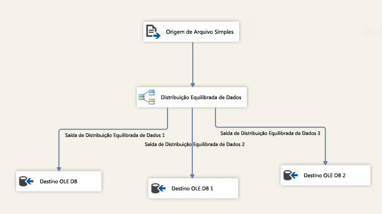

# Transformação de BDD (Balanced Data Distributor)
  A transformação de BDD (Balanced Data Distributor) aproveita o recurso de processamento simultâneo de CPUs modernas. Ela distribui buffers de linhas de entrada uniformemente em saídas em threads separados. Usando threads separados para cada caminho de saída, o componente de BDD melhora o desempenho de um pacote SSIS em computadores de vários núcleos ou de vários processadores.  
  
 O diagrama a seguir mostra um exemplo simples de como usar a transformação de BDD. Neste exemplo, a transformação de BDD escolhe um buffer de pipeline de cada vez a partir dos dados de entrada de uma fonte de arquivo simples, e envia-o a um dos três caminhos de saída em uma forma round robin. No SQL Server Data Tools, você pode verificar os valores de um <xref:Microsoft.SqlServer.Dts.Pipeline.Wrapper.MainPipeClass.DefaultBufferSize%2A>(tamanho padrão do buffer de pipeline) e <xref:Microsoft.SqlServer.Dts.Pipeline.Wrapper.MainPipeClass.DefaultBufferMaxRows%2A>(número máximo de linhas padrão em um buffer de pipeline) na janela **Propriedades** que exibe as propriedades de uma tarefa de fluxo de dados.  
  
   
  
 A transformação de BDD ajuda a melhorar o desempenho de um pacote em um cenário que satisfaça as seguintes condições:  
  
1.  Há uma grande quantidade de dados que entram na transformação de BDD. Se o tamanho dos dados é pequeno e somente um buffer pode manter os dados, não faz sentido usar a transformação de BDD. Se o tamanho dos dados for grande e vários buffers forem necessários para manter os dados, o BDD poderá processar com eficácia buffers de dados em paralelo usando threads separados.  
  
2.  Os dados podem ser lidos mais rápido do que o restante do fluxo de dados pode processá-los. Nesse cenário, as transformações que são executadas nos dados ocorrem lentamente comparado à taxa de entrada dos dados. Se o gargalo está no destino, o destino deve ser paralelizável.  
  
3.  Os dados não precisam ser ordenados. Por exemplo, se os dados precisam ser classificados, você não deve dividi-los usando a transformação de BDD.  
  
 Observe que, se o gargalo em um pacote SSIS for devido à taxa na qual os dados podem ser lidos da origem, o componente de BDD não ajudará a melhorar o desempenho. Se a causa do gargalo em um pacote SSIS for a falta de suporte do destino ao paralelismo, o BDD não ajudará; porém, você pode executar todas as transformações em paralelo e usar a transformação Union All para combinar os dados de saída provenientes de diferentes caminhos da saída da transformação de BDD antes de enviar os dados para o destino.  
  
> [!IMPORTANT]  
>  Consulte o vídeo [Balanced Data Distributor](http://go.microsoft.com/fwlink/?LinkID=226278) na biblioteca do TechNet para obter uma apresentação com uma demonstração sobre o uso da transformação.  
  
  
