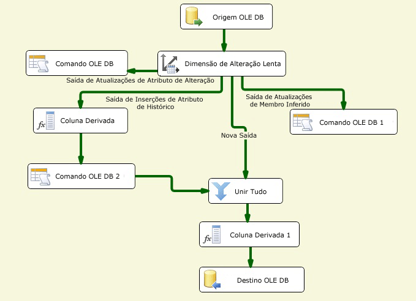

# Configurar saídas por meio do Assistente para Dimensões de Alteração Lenta
  O Assistente para Dimensões de Alteração Lenta funciona como o editor da transformação Dimensão de Alteração Lenta. Criar e configurar o fluxo de dados para alterar dados de dimensão lentamente pode ser uma tarefa complexa. O Assistente para Dimensões de Alteração Lenta oferece o método mais simples para criar o fluxo de dados para as saídas da transformação Dimensão de Alteração Lenta, guiando você pelas etapas de mapeamento de colunas, selecionando colunas de chave de negócio, definindo atributos de alteração de coluna e configurando o suporte para membros de dimensão deduzidos.  
  
 Você deve escolher pelo menos uma coluna de chave de negócio na tabela de dimensões e mapeá-la para uma coluna de entrada. O valor da chave de negócio vincula um registro na fonte a um registro na tabela de dimensões. A transformação usa esse mapeamento para localizar o registro na tabela de dimensões e determinar se um registro é novo ou está em alteração. A chave de negócio é geralmente a chave primária na fonte, mas poderá ser uma chave alternativa desde que identifique um registro com exclusividade e seu valor não se altere. A chave de negócio também pode ser uma chave composta, que consiste em várias colunas. A chave primária na tabela de dimensões é geralmente uma chave substituta, o que significa um valor numérico gerado automaticamente por uma coluna de identidade ou por uma solução personalizada, como um script.  
  
 Antes de poder executar o Assistente para Dimensões de Alteração Lenta, você deve adicionar uma fonte e uma transformação Dimensão de Alteração Lenta ao fluxo de dados e conectar a saída da fonte à entrada da transformação Dimensão de Alteração Lenta. Opcionalmente, o fluxo de dados pode incluir outras transformações entre a fonte de dados e a transformação Dimensão de Alteração Lenta.  
  
 Para abrir o Assistente para Dimensões de Alteração Lenta no Designer [!INCLUDE[ssIS](../../../includes/ssis-md.md)] , clique duas vezes na transformação Dimensão de Alteração Lenta.  
  
## Criando saídas de Dimensão de Alteração Lenta  
  
#### Para criar saídas da transformação Dimensão de Alteração Lenta  
  
1.  Escolha o gerenciador de conexões para acessar a fonte de dados que contém a tabela de dimensões que você quer atualizar.  
  
     Você pode selecionar em uma lista de gerenciadores de conexões incluídos no pacote.  
  
2.  Escolha a tabela de dimensões ou exibição que você quer atualizar.  
  
     Depois de selecionar o gerenciador de conexões, você pode selecionar a tabela ou a exibição na fonte de dados.  
  
3.  Defina atributos de chave em colunas e mapeie colunas de entrada para colunas na tabela de dimensões.  
  
     Você deve escolher pelo menos uma coluna de chave de negócio na tabela de dimensões e mapeá-la para uma coluna de entrada. Outras colunas de entrada podem ser mapeadas para colunas na tabela de dimensões como mapeamentos não chave.  
  
4.  Escolha o tipo de alteração para cada coluna.  
  
    -   O**Atributo de alteração** substitui valores existentes em registros.  
  
    -   O**Atributo histórico** cria registros novos em vez de atualizar registros existentes.  
  
    -   O**Atributo fixo** indica que o valor da coluna não deve ser alterado.  
  
5.  Defina opções de atributo fixo e de alteração.  
  
     Se você configurar colunas para usar o tipo de alteração **Atributo fixo** , poderá especificar se a transformação Dimensão de Alteração Lenta sofrerá falha quando forem detectadas alterações nessas colunas. Se você configurar colunas para usar o tipo de alteração **Atributo de alteração** , poderá especificar se todos os registros correspondentes, inclusive os registros desatualizados, serão atualizados.  
  
6.  Defina opções de atributo histórico.  
  
     Se você configurar colunas para usar o tipo de alteração **Atributo histórico** , deverá escolher como distinguir entre registros atuais e expirados. Você pode usar uma coluna de indicador de linha atual ou duas colunas de data para identificar linhas atuais e expiradas. Se você usar uma coluna de indicador de linha atual, poderá defini-la como **Atual**, **Verdadeira** quando atual e **Expirada** ou **Falsa** quando expirada. Você também pode inserir valores personalizados. Se usar duas colunas de data, uma data inicial e uma final, você poderá especificar a data que será usada quando os valores da coluna de data forem definidos digitando uma data ou selecionando uma variável de sistema e depois usando seu valor.  
  
7.  Especifique o suporte para membros deduzidos e escolha as colunas que o registro de membro deduzido contém.  
  
     Quando estiver carregando medidas em uma tabela de fatos, você poderá criar registros mínimos para membros deduzidos que ainda não existem. Posteriormente, quando dados significantes estiverem disponíveis, os registros de dimensão poderão ser atualizados. Podem ser criados os seguintes tipos de registros mínimos:  
  
    -   Um registro no qual todas as colunas com tipos de alteração são nulas.  
  
    -   Um registro no qual uma coluna Booleana indica que o registro é um membro deduzido.  
  
8.  Verifique as configurações que o Assistente para Dimensões de Alteração Lenta cria. Dependendo de quais tipos de alteração tiverem suporte, diferentes conjuntos de componentes de fluxo de dados serão adicionados ao pacote.  
  
     O diagrama a seguir exibe um exemplo de fluxo de dados que oferece suporte a atributos fixos, atributos de alteração e alterações de atributo histórico, membros deduzidos e alterações de registros correspondentes.  
  
       
  
## Atualizando saídas de Dimensão de Alteração Lenta  
 O modo mais simples de atualizar a configuração de saídas da transformação Dimensão de Alteração Lenta é executar novamente o Assistente para Dimensões de Alteração Lenta e modificar as propriedades das páginas do assistente. Você também pode atualizar a transformação Dimensão de Alteração Lenta usando a caixa de diálogo **Editor Avançado** ou programaticamente.  
  
## Consulte Também  
 [Slowly Changing Dimension Transformation](../../../integration-services/data-flow/transformations/slowly-changing-dimension-transformation.md)  
  
  
