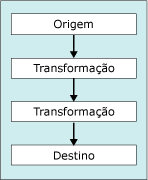

# Transformar dados com transforma&#231;&#245;es
  [!INCLUDE[ssISnoversion](../../../includes/ssisnoversion-md.md)] inclui três tipos de componentes de fluxo de dados: fontes, transformações e destinos.  
  
 O diagrama a seguir mostra um fluxo de dados simples que tem uma fonte, duas transformações e um destino.  
  
   
  
 [!INCLUDE[ssISnoversion](../../../includes/ssisnoversion-md.md)] As transformações fornecem a seguinte funcionalidade:  
  
-   Dividir, copiar e mesclar conjuntos de linhas e executar operações de pesquisa.  
  
-   Atualizar valores de coluna e criar novas colunas aplicando transformações tais como alterar minúsculas para maiúsculas.  
  
-   Executar operações de inteligência empresarial, tais como limpeza de dados, mineração de texto ou execução de consultas de previsão de mineração de dados.  
  
-   Criar novos conjuntos de linhas que consistem em valores agregados classificados, dados de exemplo ou dados dinâmicos ou não dinâmicos.  
  
-   Executar tarefas como exportar e importar dados, fornecer informações de auditoria e trabalhar com dimensões de alteração lenta.  
  
 Para obter mais informações, consulte [Integration Services Transformations](../../../integration-services/data-flow/transformations/integration-services-transformations.md).  
  
 Você também pode gravar transformações personalizadas. Para obter mais informações, consulte [Desenvolvendo um componente de fluxo de dados personalizado](../../../integration-services/extending-packages-custom-objects/data-flow/developing-a-custom-data-flow-component.md) e [Desenvolvendo tipos específicos de componentes de fluxo de dados](../../../integration-services/extending-packages-custom-objects-data-flow-types/developing-specific-types-of-data-flow-components.md).  
  
 Depois de adicionar a transformação ao designer de fluxo de dados, mas antes de configurar a transformação, você conecta a transformação ao fluxo de dados conectando a saída de outra transformação ou fonte no fluxo de dados à entrada desta transformação. O conector entre dois componentes de fluxo de dados é chamado de caminho. Para obter mais informações sobre como conectar componentes e trabalhar com caminhos, consulte [Conectar componentes com caminhos](../Topic/Connect%20Components%20with%20Paths.md).  
  
### Para adicionar uma transformação a um fluxo de dados  
  
-   [Adicionar ou excluir um componente em um fluxo de dados](../../../integration-services/data-flow/add-or-delete-a-component-in-a-data-flow.md)  
  
### Para conectar uma transformação a um fluxo de dados  
  
-   [Conectar componentes em um fluxo de dados](../../../integration-services/data-flow/connect-components-in-a-data-flow.md)  
  
### Para definir as propriedades de uma transformação  
  
-   [Definir as propriedades de um componente de fluxo de dados](../../../integration-services/data-flow/set-the-properties-of-a-data-flow-component.md)  
  
## Consulte também  
 [Tarefa de Fluxo de Dados](../../../integration-services/control-flow/data-flow-task.md)   
 [Fluxo de Dados](../../../integration-services/data-flow/data-flow.md)   
 [Conectar componentes com caminhos](../Topic/Connect%20Components%20with%20Paths.md)   
 [Tratamento de erros em dados](../../../integration-services/data-flow/error-handling-in-data.md)   
 [Fluxo de Dados](../../../integration-services/data-flow/data-flow.md)  
  
  