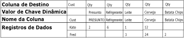
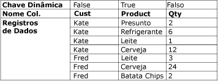

# Transformação Não Dinâmica
  A transformação não dinâmica transforma um conjunto de dados não normalizado em uma versão mais normalizada, expandindo valores de várias colunas de um único registro em vários registros, com os mesmos valores em uma única coluna. Por exemplo, um conjunto de dados que lista nomes de clientes tem uma linha para cada cliente, com os produtos e a quantidade comprada mostrados em colunas da linha. Depois que a transformação não dinâmica normaliza o conjunto de dados, este contém uma linha diferente para cada produto que o cliente comprou.  
  
 O diagrama a seguir mostra um conjunto de dados antes da transformação não dinâmica na coluna Produto.  
  
   
  
 O diagrama a seguir mostra um conjunto de dados depois da transformação não dinâmica na coluna Produto.  
  
   
  
 Em algumas circunstâncias, os resultados da transformação não dinâmica podem conter linhas com valores inesperados. Por exemplo, se os dados de exemplo a serem transformados mostrados no diagrama tivessem valores nulos em todas as colunas Qtd para Fred, a saída incluiria somente uma linha para Fred, e não cinco. A coluna Qtd conteria valor nulo ou zero, dependendo do tipo de dados da coluna.  
  
## Configuração da transformação Não Dinâmica  
 A transformação Não Dinâmica inclui a propriedade personalizada **PivotKeyValue** . Essa propriedade pode ser atualizada por uma expressão de propriedade quando o pacote é carregado. Para obter mais informações, consulte [Expressões do Integration Services &#40;SSIS&#41;](../../../integration-services/expressions/integration-services-ssis-expressions.md), [Usar expressões de propriedade em pacotes](../../../integration-services/expressions/use-property-expressions-in-packages.md) e [Propriedades personalizadas da transformação](../../../integration-services/data-flow/transformations/transformation-custom-properties.md).  
  
 Essa transformação tem uma entrada e uma saída. Não tem nenhuma saída de erro.  
  
 Você pode definir propriedades pelo Designer do [!INCLUDE[ssIS](../../../includes/ssis-md.md)] ou programaticamente.  
  
 Para obter mais informações sobre as propriedades que podem ser definidas na caixa de diálogo **Editor Avançado** ou programaticamente, clique em um dos seguintes tópicos:  
  
-   [Propriedades comuns](http://msdn.microsoft.com/library/51973502-5cc6-4125-9fce-e60fa1b7b796)  
  
-   [Propriedades personalizadas de Transformação](../../../integration-services/data-flow/transformations/transformation-custom-properties.md)  
  
 Para obter mais informações sobre como definir as propriedades, consulte [Definir as propriedades de um componente de fluxo de dados](../../../integration-services/data-flow/set-the-properties-of-a-data-flow-component.md).  
  
## Editor de Transformação Não Dinâmica
  Use a caixa de diálogo **Editor de Transformação Não Dinâmica** para selecionar as colunas que serão dinamizadas em linhas, e para especificar as colunas de dados e a nova coluna de saída de valor dinâmico.  
  
> [!NOTE]  
>  Este tópico se baseia no cenário Não Dinâmico descrito em [Transformação Não Dinâmica](../../../integration-services/data-flow/transformations/unpivot-transformation.md) para ilustrar o uso das opções.  
  
### Opções  
 **Colunas de Entrada Disponíveis**  
 Usando as caixas de seleção, especifique as colunas que serão dinamizadas em linhas.  
  
 **Nome**  
 Exiba o nome da coluna de entrada disponível.  
  
 **Passagem**  
 Indique se a coluna deve ser incluída na saída não dinâmica.  
  
 **Coluna de Entrada**  
 Selecione colunas para cada linha na lista de colunas de entrada disponíveis. As seleções se refletem naquelas da caixa de seleção da tabela **Colunas de Entrada Disponíveis** .  
  
 No cenário Não Dinâmico descrito em [Unpivot Transformation](../../../integration-services/data-flow/transformations/unpivot-transformation.md), as Colunas de Entrada são as colunas **Ham**, **Soda**, **Milk**, **Beer**e **Chips** .  
  
 **Coluna de Destino**  
 Forneça um nome para a coluna de dados.  
  
 No cenário Não Dinâmico descrito em [Transformação Não Dinâmica](../../../integration-services/data-flow/transformations/unpivot-transformation.md), a Coluna de Destino é a coluna de quantidade (**Qtd**).  
  
 **Valor de Chave Dinâmica**  
 Forneça um nome para o valor dinâmico. O padrão é o nome da coluna de entrada; no entanto, é possível escolher qualquer nome descritivo exclusivo.  
  
 O valor dessa propriedade pode ser especificado com uma expressão de propriedades.  
  
 No cenário Não Dinâmico descrito em [Unpivot Transformation](../../../integration-services/data-flow/transformations/unpivot-transformation.md), os valores dinâmicos aparecerão na nova coluna Product designada pela opção **Nome da Coluna de Valores de Chaves Dinâmicas** , como os valores de texto **Ham**, **Soda**, **Milk**, **Beer**e **Chips**.  
  
 **Nome da Coluna de Valores de Chaves Dinâmicas**  
 Forneça um nome para a coluna de valor dinâmico. O padrão é "Valor da Chave Dinâmica"; no entanto, é possível escolher qualquer nome descritivo exclusivo.  
  
 No cenário Não Dinâmico descrito em [Unpivot Transformation](../../../integration-services/data-flow/transformations/unpivot-transformation.md), o nome de coluna de chave dinâmica é **Product** e designa a nova coluna **Product** , na qual as colunas **Ham**, **Soda**, **Milk**, **Beer**e **Chips** são não dinâmicos.  
  
## Consulte Também  
 [Referência de mensagens e erros do Integration Services](../../../integration-services/integration-services-error-and-message-reference.md)   
 [Transformação Dinâmica](../../../integration-services/data-flow/transformations/pivot-transformation.md)  
  
  
