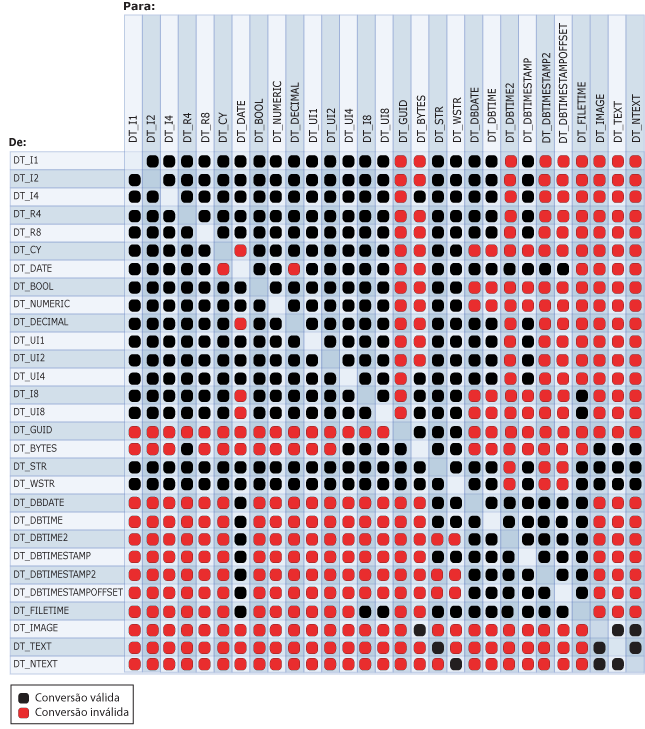

# <a name="cast-ssis-expression"></a>Cast (Expressão SSIS)
  Converte explicitamente uma expressão de um tipo de dados em um tipo de dados diferente. O operador cast também pode funcionar como um operador de truncamento.  
  
## <a name="syntax"></a>Sintaxe  
  
```  
  
(type_spec) expression  
  
```  
  
## <a name="arguments"></a>Argumentos  
 *type_spec*  
 É um tipo de dados [!INCLUDE[ssIS](../../includes/ssis-md.md)] válido.  
  
 *expressão*  
 É uma expressão válida.  
  
## <a name="result-types"></a>Tipos de resultado  
 O tipo de dados de *type_spec*. Para obter mais informações, consulte [Integration Services Data Types](../../integration-services/data-flow/integration-services-data-types.md).  
  
## <a name="remarks"></a>Remarks  
 O diagrama a seguir mostra operações de conversão legais.  
  
   
  
 A conversão para alguns tipos de dados requer parâmetros. A tabela a seguir lista esses tipos de dados e seus parâmetros.  
  
|Tipo de dados|Parâmetro|Exemplo|  
|---------------|---------------|-------------|  
|DT_STR|*charcount*<br /><br /> *codepage*|(DT_STR,30,1252) converte 30 bytes ou 30 caracteres únicos, para o tipo de dados DT_STR usando a página de código 1252.|  
|DT_WSTR|*Charcount*|(DT_WSTR,20) converte 20 pares de bytes, ou 20 caracteres Unicode, para o tipo de dados DT_WSTR.|  
|DT_BYTES|*Bytecount*|(DT_BYTES,50) converte 50 bytes para o tipo de dados de DT_BYTES.|  
|DT_DECIMAL|*Escala*|(DT_DECIMAL,2) converte um valor numérico para o tipo de dados DT_DECIMAL usando uma escala de 2.|  
|DT_NUMERIC|*Precisão*<br /><br /> *Escala*|(DT_NUMERIC,10,3) converte um valor numérico para o tipo de dados DT_NUMERIC usando uma precisão de 10 e uma escala de 3.|  
|DT_TEXT|*Codepage*|(DT_TEXT,1252) converte um valor para o tipo de dados DT_TEXT usando a página de código 1252.|  
  
 Quando uma cadeia de caracteres é convertida para um DT_DATE, ou vice-versa, a localidade da transformação é usada. Entretanto, a data está no formato ISO de AAAA-MM-DD, independentemente da preferência de localidade usada no formato ISO.  
  
> [!NOTE]  
>  Para converter uma cadeia de caracteres para um tipo de dados de data diferente de DT_DATE, consulte [Tipos de dados do Integration Services](../../integration-services/data-flow/integration-services-data-types.md).  
  
 Se a página de código for uma página de código de caractere de multibyte, o número de bytes e caracteres poderá diferir. A conversão de DT_WSTR para DT_STR com o mesmo valor de *charcount* pode causar truncamento dos caracteres finais na cadeia de caracteres convertidos. Se armazenamento suficiente estiver disponível na coluna da tabela de destino, defina o valor do parâmetro *charcount* para refletir o número de bytes que a página de código de multibyte exige. Por exemplo, se você converter dados de caractere para um tipo de dados DT_STR usando a página de código 936, deverá definir *charcount* para um valor até duas vezes maior que o número de caracteres que você espera que os dados contenham; se você converter os dados de caracteres usando a página de código UTF-8, deverá definir *charcount* para um valor até quatro vezes maior.  
  
 Para obter mais informações sobre a estrutura dos tipos de dados de data, consulte [Tipos de Dados do Integration Services](../../integration-services/data-flow/integration-services-data-types.md).  
  
## <a name="ssis-expression-examples"></a>Exemplos de expressões SSIS  
 Este exemplo converte um valor numérico para um inteiro.  
  
```  
(DT_I4) 3.57  
```  
  
 Este exemplo converte um inteiro para uma cadeia de caracteres usando a página de código 1252.  
  
```  
(DT_STR,1,1252)5  
```  
  
 Este exemplo converte uma cadeia de três caracteres para caracteres de byte duplo.  
  
```  
(DT_WSTR,3)"Cat"  
```  
  
 Este exemplo converte um inteiro para um decimal com uma escala de dois.  
  
```  
(DT_DECIMAl,2)500  
```  
  
 Este exemplo converte um inteiro para um numérico com uma precisão de sete e escala de três.  
  
```  
(DT_NUMERIC,7,3)4000  
```  
  
 Este exemplo converte valores na coluna **FirstName** , definidos com um tipo de dados **nvarchar** e um comprimento de 50, para uma cadeia de caracteres usando a página de código 1252.  
  
```  
(DT_STR,50,1252)FirstName  
```  
  
 Este exemplo converte valores na coluna **DateFirstPurchase** do tipo DT_DBDATE em uma cadeia de caracteres Unicode de comprimento 20.  
  
```  
(DT_WSTR,20)DateFirstPurchase  
```  
  
 Este exemplo converte o literal da cadeia de caracteres "True" para um Booliano.  
  
```  
(DT_BOOL)"True"  
```  
  
 Este exemplo converte um literal de cadeia de caracteres para DT_DBDATE.  
  
```  
(DT_DBDATE) "1999-10-11"  
```  
  
 Este exemplo converte um literal de cadeia de caracteres para o tipo de dados DT_DBTIME2 que usa 5 dígitos para segundos fracionários. (O tipo de dados DT_DBTIME2 pode ter entre 0 e 7 dígitos especificados para segundos fracionários.)  
  
```  
(DT_DBTIME2, 5) "16:34:52.12345"  
```  
  
 Este exemplo converte um literal de cadeia de caracteres para o tipo de dados DT_DBTIMESTAMP2 que usa 4 dígitos para segundos fracionários. (O tipo de dados DT_DBTIMESTAMP2 pode ter entre 0 e 7 dígitos especificados para segundos fracionários.)  
  
```  
(DT_DBTIMESTAMP2, 4) "1999-10-11 16:34:52.1234"  
```  
  
 Este exemplo converte um literal de cadeia de caracteres para o tipo de dados DT_DBTIMESTAMPOFFSET que usa 7 dígitos para segundos fracionários. (O tipo de dados DT_DBTIMESTAMPOFFSET pode ter entre 0 e 7 dígitos especificados para segundos fracionários.)  
  
```  
(DT_DBTIMESTAMPOFFSET, 7) "1999-10-11 16:34:52.1234567 + 5:35"  
```  
  
## <a name="see-also"></a>Consulte Também  
 [Precedência de operador e capacidade de associação](../../integration-services/expressions/operator-precedence-and-associativity.md)   
 [Operadores &#40;Expressão do SSIS&#41;](../../integration-services/expressions/operators-ssis-expression.md)   
 [Expressões do SSIS &#40;Integration Services&#41;](../../integration-services/expressions/integration-services-ssis-expressions.md)   
 [Tipos de dados do Integration Services em expressões](../../integration-services/expressions/integration-services-data-types-in-expressions.md)  
  
  
