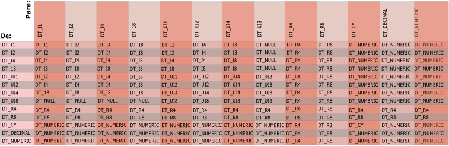

# Tipos de dados do Integration Services em expressões

[!INCLUDE[sqlserver-ssis](../../includes/applies-to-version/sqlserver-ssis.md)]

  O avaliador de expressão usa tipos de dados [!INCLUDE[ssISnoversion](../../includes/ssisnoversion-md.md)] . Quando dados são inseridos pela primeira vez em um fluxo de dados em um pacote [!INCLUDE[ssISnoversion](../../includes/ssisnoversion-md.md)] , o mecanismo de fluxo de dados converte todos os dados de coluna para um tipo de dados do [!INCLUDE[ssISnoversion](../../includes/ssisnoversion-md.md)] , e os dados da coluna que uma expressão usa já têm um tipo de dados do [!INCLUDE[ssISnoversion](../../includes/ssisnoversion-md.md)] . As expressões usadas nas transformações Divisão Condicional e Coluna Derivada podem fazer referência a colunas porque elas fazem parte de um fluxo de dados que inclui dados de coluna.  
  
## variáveis  
 Expressões também podem usar variáveis. As variáveis têm um tipo de dados Variant e o avaliador de expressão converte o tipo de dados de uma variável a partir do subtipo Variant para um tipo de dados do [!INCLUDE[ssISnoversion](../../includes/ssisnoversion-md.md)] antes de avaliar a expressão. As variáveis podem usar só um subconjunto dos tipos de dados do [!INCLUDE[ssISnoversion](../../includes/ssisnoversion-md.md)] . Por exemplo, uma variável não pode usar um tipo de dados BLOB (Bloco do objeto binário grande).  
  
 Para obter mais informações sobre tipos de dados do [!INCLUDE[ssISnoversion](../../includes/ssisnoversion-md.md)] e o mapeamento de tipos de dados Variant para tipos de dados do [!INCLUDE[ssISnoversion](../../includes/ssisnoversion-md.md)] , consulte [Tipos de dados dos Integration Services](../../integration-services/data-flow/integration-services-data-types.md).  
  
## Literais  
 Além disso, expressões podem incluir literais de cadeia de caracteres, Boolianos e numéricos. Para obter mais informações sobre como converter literais numéricos para tipos de dados do [!INCLUDE[ssISnoversion](../../includes/ssisnoversion-md.md)], consulte [Literais &#40;SSIS&#41;](../../integration-services/expressions/numeric-string-and-boolean-literals.md).  
  
## Cadeias de caracteres  
 Você pode usar DT_STR ou DT_WSTR como o tipo de retorno de uma expressão. Dentro de uma expressão, no entanto, apenas DT_WSTR tem suporte e valores DT_STR são convertidos em valores DT_WSTR. Esse comportamento tem várias implicações quando você está escrevendo uma expressão.  
  
-   Dentro de uma expressão, use NULL(DT_WSTR, ...) em vez de NULL(DT_STR, ...). Para obter mais informações sobre essa função, consulte [NULL &#40;Expressão SSIS&#41;](../../integration-services/expressions/null-ssis-expression.md).  
  
-   Dentro de uma expressão, você só pode usar a função CAST para converter um valor para o tipo DT_STR na raiz da expressão - ou seja, quando você estiver retornando o resultado final da expressão. Caso contrário, use o tipo DT_WSTR dentro na expressão.  
  
 Considere as expressões na captura de tela a seguir.  
  
   
  
1.  A primeira expressão é executada sem erro, porque a função NULL(DT_STR, ...) está no nível raiz da expressão.  
  
2.  A segunda expressão é executada sem erro, pois ela usa NULL (DT_WSTR, ...).  
  
3.  A terceira expressão gera um erro porque usa NULL(DT_STR, ...) dentro da expressão.  
  
4.  A quarta expressão é executada sem erro porque converte o resultado de NULL(DT_STR, ...) dentro da expressão.  
  
     O avaliador de expressão trata dessa conversão de modo inteligente e converte em DT_WSTR, não em DT_STR, porque reconhece que a operação não está no nível raiz da expressão.  
  
 Os exemplos a seguir demonstram os efeitos da conversão.  
  
   
  
1.  Na primeira expressão, a conversão não é no nível raiz da expressão. O avaliador de expressão trata dessa conversão de modo inteligente e converte em DT_WSTR, não em DT_STR. A expressão retorna DT_WSTR.  
  
2.  Na segunda expressão, a conversão é no nível raiz da expressão. A expressão retorna DT_STR.  
  
## Conversão implícita de dados  
 Uma conversão implícita de um tipo de dados ocorre quando o avaliador de expressão converte automaticamente os dados de um tipo de dados para outro. Por exemplo, se **smallint** é comparado com **int**, **smallint** é convertido implicitamente em **int** antes da execução da comparação.  
  
 O avaliador de expressão não pode executar conversão de dados implícita quando os argumentos e operandos tiverem tipos de dados incompatíveis. Além disso, o avaliador de expressão não pode converter nenhum valor implicitamente para um Booliano. Em vez disso, os argumentos e operandos devem ser convertidos explicitamente usando o operador cast. Para obter mais informações, consulte [Cast &#40;Expressão do SSIS&#41;](../../integration-services/expressions/cast-ssis-expression.md).  
  
 O diagrama a seguir mostra o tipo de resultado de conversões implícitas de operações BINARY. A intersecção da coluna e da linha nesta tabela é o tipo de resultado de uma operação binário com operandos dos tipos à esquerda (De) e à direita (Para).  
  
   
  
 A intersecção de um inteiro assinado e não assinado é um inteiro assinado potencialmente maior do que o argumento.  
  
 Operadores comparam cadeias de caracteres, datas, Boolianos e outros tipos de dados. Antes de um operador comparar dois valores, o avaliador de expressão executa certas conversões implícitas. O avaliador de expressão sempre converte os literais de cadeia de caracteres para o tipo de dados DT_WSTR e converte os literais Boolianos para o tipo de dados DT_BOOL. O avaliador de expressão interpreta todos os valores incluídos entre aspas como cadeias de caracteres. Os literais numéricos são convertidos para um dos tipos de dados do [!INCLUDE[ssISnoversion](../../includes/ssisnoversion-md.md)] numéricos.  
  
> [!NOTE]  
>  Valores Boolianos são valores lógicos, não números. Embora os valores Boolianos possam ser exibidos como números em alguns ambientes, eles não são armazenados como números, e várias linguagens de programação representam valores Boolianos como valores numéricos de modos diferentes, como faz os métodos do .NET Framework.  
>   
>  Por exemplo, as funções de conversão disponíveis no Visual Basic convertem **True** para -1; no entanto, o método **System.Convert.ToInt32** no .NET Framework converte **True** para +1. A Linguagem de expressão do [!INCLUDE[ssISnoversion](../../includes/ssisnoversion-md.md)] converte **True** para -1.  
>   
>  Para evitar erros ou resultados inesperados, você não deve gravar códigos que contem com valores numéricos específicos para **True** e **False**. Onde for possível, você deve restringir o uso de variáveis boolianas aos valores lógicos para os quais elas são projetados.  
  
 Para obter mais informações, consulte estes tópicos:  
  
-   [== &#40;Igual&#41; &#40;Expressão do SSIS&#41;](../../integration-services/expressions/equal-ssis-expression.md)  
  
-   [\!= &#40;Diferente&#41; &#40;Expressão do SSIS&#41;](../../integration-services/expressions/unequal-ssis-expression.md)  
  
-   [&#62; &#40;Maior que&#41; &#40;Expressão SSIS&#41;](../../integration-services/expressions/greater-than-ssis-expression.md)  
  
-   [&#60; &#40;Menor que&#41; &#40;Expressão SSIS&#41;](../../integration-services/expressions/less-than-ssis-expression.md)  
  
-   [&#62;= &#40;Maior que ou igual a&#41; &#40;Expressão SSIS&#41;](../../integration-services/expressions/greater-than-or-equal-to-ssis-expression.md)  
  
-   [&#60;= &#40;Menor que ou igual a&#41; &#40;Expressão SSIS&#41;](../../integration-services/expressions/less-than-or-equal-to-ssis-expression.md)  
  
 Uma função que usa um único argumento retorna um resultado com o mesmo tipo de dados que o argumento, com as seguintes exceções:  
  
-   DAY, MONTH e YEAR aceitam uma data e retornam um resultado inteiro (DT_I4).  
  
-   ISNULL aceita uma expressão de qualquer tipo de dados [!INCLUDE[ssIS](../../includes/ssis-md.md)] e retorna um resultado Booliano (DT_BOOL).  
  
-   SQUARE e SQRT aceitam uma expressão numérica e retornam um resultado numérico (DT_R8) não integral.  
  
 Se os argumentos tiverem o mesmo tipo de dados, o resultado será daquele tipo. A única exceção é o resultado de uma operação binária em dois valores com o tipo de dados DT_DECIMAL, que retorna um resultado com o tipo de dados DT_NUMERIC.  
  
## Requisitos para obter dados usados em expressões  
 O avaliador de expressão aceita todos os tipos de dados de [!INCLUDE[ssISnoversion](../../includes/ssisnoversion-md.md)] . Porém, dependendo da operação ou da função, os operandos e os argumentos requerem certos tipos de dados. O avaliador de expressão impõe os seguintes requisitos de tipo de dados em dados usados em expressões:  
  
-   Operandos usados em operações **lógicas** devem ser avaliados como um Booliano. Por exemplo, ColumnA > 1&&ColumnB < 2.  
  
-   Operandos usados em operações **matemáticas** devem ser avaliados como um valor numérico. Por exemplo, 23.75 * 4.  
  
-   Operandos usados em operações de comparação, como operações lógicas e de igualdade, devem ser avaliados como tipos de dados compatíveis.  
  
     Por exemplo, uma das expressões no exemplo a seguir usa o tipo de dados de DT_DBTIMESTAMPOFFSET:  
  
     `(DT_DBTIMESTAMPOFFSET,3) "1999-10-11 20:34:52.123 -3:30" != (DT_DBDATE)"1999-10-12"`  
  
     O sistema converte a expressão, `(DT_DBDATE)"1999-10-12"`, para DT_DBTIMESTAMPOFFSET. O exemplo é avaliado como TRUE porque a expressão convertida se torna "1999-10-12 00:00:00.000 +00:00", que não é igual ao valor de outra expressão, `(DT_DBTIMESTAMPOFFSET,3) "1999-10-11 20:34:52.123 -3:30"`.  
  
-   Argumentos passados para as funções matemáticas devem ser avaliados como um tipo de dados numérico. Dependendo da função ou operação, um tipo de dados numérico específico pode ser exigido. Por exemplo, a função HEX requer um inteiro assinado ou não assinado.  
  
-   Argumentos passados para funções da cadeia de caracteres devem ser avaliados como a um tipo de dados de caractere: DT_STR ou DT_WSTR. Por exemplo, UPPER ("flor"). Algumas funções da cadeia de caracteres, como SUBSTRING, requerer argumentos inteiros adicionais para a posição inicial e o comprimento da cadeia de caracteres.  
  
-   Argumentos passados para as funções de data e hora devem ser avaliados como uma data válida. Por exemplo, DAY(GETDATE()). Algumas funções, como DATEADD, exigem um argumento inteiro adicional para o número de dias que a função adiciona a uma data.  
  
 As operações que combinam um inteiro de oito bytes não assinado e um inteiro assinado exigem uma conversão explícita para esclarecer o formato do resultado. Para obter mais informações, consulte [Cast &#40;Expressão do SSIS&#41;](../../integration-services/expressions/cast-ssis-expression.md).  
  
 Resultados de muitas operações e funções predeterminaram tipos de dados. Esse pode ser o tipo de dados do argumento ou o tipo de dados para o qual o avaliador de expressão converte o resultado. Por exemplo, o resultado de um operador OR lógico (||) é sempre um Booliano, o resultado da função ABS é o tipo de dados numérico do argumento, e o resultado da multiplicação é o menor tipo de dados numérico que pode manter o resultado sem perda. Para obter mais informações sobre os tipos de dados de resultados, consulte [Expressão de Operadores &#40;SSIS&#41;](../../integration-services/expressions/operators-ssis-expression.md) e [Expressão de Funções &#40;SSIS&#41;](../../integration-services/expressions/functions-ssis-expression.md).  
  
## Related Tasks  
 [Usar uma expressão em um componente de fluxo de dados](https://msdn.microsoft.com/library/9181b998-d24a-41fb-bb3c-14eee34f910d)  
  
## Conteúdo relacionado  
  
-   Artigo técnico, [SSIS Expression Cheat Sheet](https://go.microsoft.com/fwlink/?LinkId=746575), em pragmaticworks.com  
  
-   Artigo técnico, [Exemplos de expressões SSIS](https://go.microsoft.com/fwlink/?LinkId=220761), em social.technet.microsoft.com  
  
  
