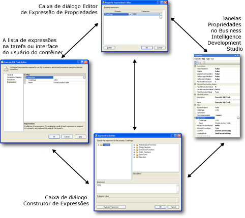

# Usar expressões de propriedade em pacotes

[!INCLUDE[ssis-appliesto](../../includes/ssis-appliesto-ssvrpluslinux-asdb-asdw-xxx.md)]

  Uma expressão de propriedade é uma expressão atribuída a uma propriedade para ativar uma atualização dinâmica da propriedade no tempo de execução. Por exemplo, uma expressão de propriedade pode atualizar a linha Para se uma tarefa Enviar Email usar a inserção de emails que já estão armazenados em uma variável.  
  
 Uma expressão pode ser adicionada a um pacote, tarefa, Loop Foreach, Loop For, Sequência, enumerador Foreach, manipulador de eventos, gerenciador de conexões de um pacote ou nível de projeto ou provedor de logs. Qualquer propriedade desses objetos que são de leitura/gravação pode implementar uma expressão de propriedade. [!INCLUDE[ssISnoversion](../../includes/ssisnoversion-md.md)] também dá suporte ao uso de expressões de propriedade em algumas propriedades personalizadas de componentes de fluxo de dados. As variáveis e as restrições de precedência não oferecem suporte às expressões de propriedade, mas elas incluem propriedades especiais que permitem o uso de expressões.  
  
 As expressões de propriedade podem ser atualizadas de diferentes maneiras:  
  
-   As variáveis definidas pelo usuário podem ser incluídas nas configurações do pacote e podem ser atualizadas quando o pacote for implantado. No momento da execução, a expressão de propriedade é avaliada usando o valor atualizado da variável.  
  
-   As variáveis de sistema que estão incluídas em expressões são atualizadas no tempo de execução, que altera os resultados da avaliação de propriedade.  
  
-   As funções de data e hora são avaliadas no momento da execução e fornecem valores atualizados às expressões de propriedade.  
  
-   As variáveis nas expressões podem ser atualizadas pelos scripts da tarefa Script e da execução do componente Script.  
  
 As expressões são criadas com a linguagem da expressão do [!INCLUDE[msCoName](../../includes/msconame-md.md)] [!INCLUDE[ssISnoversion](../../includes/ssisnoversion-md.md)]. As expressões podem usar variáveis de sistema ou definidas pelo usuário, junto com operadores, funções e conversões de tipo fornecidos pela linguagem da expressão.  
  
> [!NOTE]  
>  Os nomes das variáveis do sistema e das variáveis definidas pelo usuário diferenciam maiúsculas de minúsculas.  
  
 Para obter mais informações, consulte [Expressões do Integration Services &#40;SSIS&#41;](../../integration-services/expressions/integration-services-ssis-expressions.md).  
  
 Um importante uso das expressões de propriedade é personalizar configurações para cada instância implantada de um pacote. Isso permite atualizar dinamicamente as propriedades de pacote para diferentes ambientes. Por exemplo, é possível criar uma expressão de propriedade que atribua uma variável à cadeia de caracteres de conexão de um gerenciador de conexões, além de atualizar a variável quando o pacote for implantado, verificando se a cadeia de caracteres de conexão está correta no tempo de execução. As configurações de pacote são carregadas antes de as expressões de propriedade serem avaliadas.  
  
 Uma propriedade pode usar só uma expressão de propriedade e uma expressão de propriedade só pode ser aplicada a uma propriedade. Entretanto, você pode construir várias expressões de propriedade idênticas e atribuí-las a diferentes propriedades.  
  
 Algumas propriedades são definidas usando valores de enumeradores. Ao fazer referência ao membro do enumerador em uma expressão de propriedade, é preciso usar valores numéricos equivalentes ao nome amigável do membro do enumerador. Por exemplo, se uma expressão de propriedade define a propriedade **LoggingMode** , que usa um valor da enumeração **DTSLoggingMode** , a expressão de propriedade deve usar 0, 1 ou 2 em vez dos nomes amigáveis **Enabled**, **Disabled**ou **UseParentSetting**. Para obter mais informações, consulte [Constantes enumeradas em expressões de propriedade](../../integration-services/expressions/enumerated-constants-in-property-expressions.md).  
  
## Interface de Usuário da Expressão de Propriedade  
 [!INCLUDE[ssISnoversion](../../includes/ssisnoversion-md.md)] fornece um conjunto de ferramentas para construir e gerenciar as expressões de propriedade.  
  
-   A página **Expressões** , localizada nos editores personalizados para tarefas, o contêiner do Loop For e os contêineres Foreach. A página **Expressões** permite editar as expressões e exibir uma lista de expressões de propriedade que usados por uma tarefa, por um Loop Foreach ou por um Loop For.  
  
-   A janela **Propriedades** , para editar expressões e visualizar uma lista de expressões de propriedade usada por um pacote ou por objetos do pacote.  
  
-   A caixa de diálogo **Editor de Expressões de Propriedade** , para criar, atualizar e excluir expressões de propriedade.  
  
-   A caixa de diálogo **Construtor de Expressões** , para construir uma expressão usando as ferramentas gráficas. A caixa de diálogo **Construtor de Expressões** pode avaliar as expressões para sua análise sem atribuir o resultado da avaliação à propriedade.  
  
 O diagrama a seguir mostra as interfaces de usuário usadas para adicionar, alterar e remover as expressões de propriedade.  
  
   
  
 Na janela **Propriedades** e na página **Expressões**, clique no botão Procurar **(…)** no nível de coleção **Expressões** para abrir a caixa de diálogo **Editor de Expressões de Propriedade**. O Editor de Expressões de Propriedade permite mapear uma propriedade para uma expressão e digitar uma expressão de propriedade. Se desejar usar ferramentas gráficas de expressão para criar e validar uma expressão, clique no botão Procurar **(…)** no nível de expressão para abrir a caixa de diálogo **Construtor de Expressões** e crie ou modifique (e, se desejar, avalie) a expressão.  
  
 Você também pode abrir a caixa de diálogo **Construtor de Expressões** na caixa de diálogo **Editor de Expressões de Propriedade** .  
  
#### Trabalhar com expressões de propriedade  
  
-   [Adicionar ou alterar uma expressão de propriedade](../../integration-services/expressions/add-or-change-a-property-expression.md)  
  
### Definindo as Expressões de Propriedade dos Componentes de Fluxo de Dados  
 Se você construir um pacote no [!INCLUDE[ssBIDevStudioFull](../../includes/ssbidevstudiofull-md.md)], as propriedades dos componentes de fluxo de dados que dão suporte às expressões de propriedade estarão expostas na tarefa de Fluxo de Dados à qual pertencem. Para adicionar, alterar e remover as expressões de propriedade dos componentes de fluxo de dados, clique com o botão direito do mouse na tarefa Fluxo de Dados do fluxo de dados ao qual os componentes de fluxo pertencem e clique em **Propriedades**. A janela Propriedades lista as propriedades de componentes de fluxo de dados com as quais você pode usar as expressões de propriedade. Por exemplo, para criar ou modificar uma expressão de propriedade SamplingValue de uma transformação Amostragem de Linha em um fluxo de dados chamado SampleCustomer, clique com o botão direito do mouse na tarefa Fluxo de Dados de cada fluxo ao qual a transformação Amostragem de Linha pertence e clique em **Propriedades**. A propriedade SamplingValue é listada na janela Propriedades e tem o formato [SampleCustomer]. [SamplingValue].  
  
 Na janela Propriedades, você adiciona, altera e remove as expressões de propriedade dos componentes de fluxo de dados da mesma maneira como as expressões de propriedade de outros tipos de objetos do [!INCLUDE[ssISnoversion](../../includes/ssisnoversion-md.md)] . A janela Propriedades também fornece acesso a várias caixas de diálogo e construtores usados para adicionar, alterar ou remover as expressões de propriedade para os componentes de fluxo de dados. Para obter mais informações sobre as propriedades de componentes de fluxo de dados que podem ser usadas pelas expressões de propriedade, consulte [Propriedades personalizadas de transformação](../../integration-services/data-flow/transformations/transformation-custom-properties.md).  
  
## Carregando Expressões de Propriedade  
 Você não pode especificar ou controlar quando as expressões de propriedade estarão carregadas. As expressões de propriedade são avaliadas e carregadas quando o pacote e os objetos do pacote são validados. A validação ocorre quando você salva o pacote, abre o pacote no Designer [!INCLUDE[ssIS](../../includes/ssis-md.md)] e executa o pacote.  
  
 No entanto, os valores atualizados das propriedades dos objetos do pacote que usam a expressão de propriedade no Designer [!INCLUDE[ssIS](../../includes/ssis-md.md)] não poderão ser visualizados enquanto você não salvar o pacote, executá-lo ou reabri-lo após adicionar as expressões de propriedade.  
  
 As expressões de propriedade associadas a diferentes tipos de objetos – gerenciadores de conexões, provedores de logs e enumeradores – também são carregados quando os métodos específicos a esse tipo de objeto são chamados. Por exemplo, as propriedades de gerenciadores de conexões são carregadas antes que [!INCLUDE[ssISnoversion](../../includes/ssisnoversion-md.md)] criasse uma instância da conexão.  
  
 As expressões de propriedade são carregadas depois que as configurações de pacote são carregadas. Por exemplo, as variáveis são atualizadas primeiro pelas suas configurações e depois as expressões de propriedade que usam as variáveis são avaliadas e carregadas. Isso significa que as expressões de propriedade sempre usam os valores de variáveis que são definidos pelas configurações.  
  
> [!NOTE]  
>  Você não pode usar a opção **Set** do utilitário **dtexec** para popular uma expressão de propriedade.  
  
 A tabela a seguir resume quando expressões de propriedade de [!INCLUDE[ssISnoversion](../../includes/ssisnoversion-md.md)] são avaliadas e carregadas.  
  
|Tipo de objeto|Carregar e avaliar|  
|-----------------|-----------------------|  
|Pacote, Loop Foreach, Loop For, Sequência, tarefas e componentes de fluxo de dados|Após carregar as configurações   Antes da validação   Antes da execução|  
|Gerenciadores de conexões|Após carregar as configurações   Antes da validação   Antes da execução   Antes de criar uma instância de conexão|  
|Provedores de logs|Após carregar as configurações   Antes da validação   Antes da execução   Antes de abrir os logs|  
|Enumeradores Foreach|Após carregar as configurações   Antes da validação   Antes da execução   Antes de cada enumeração do loop|  
  
## Usando as expressões de propriedade no Loop Foreach  
 Geralmente é útil implementar uma expressão de propriedade para definir o valor da propriedade **ConnectionString** dos gerenciadores de conexões que são usados dentro do contêiner Loop Foreach. Depois que o enumerador mapeia seu valor atual para uma variável em cada iteração do loop, a expressão de propriedade pode usar o valor dessa variável para atualizar o valor da propriedade **ConnectionString** dinamicamente.  
  
 Se você quiser usar as expressões de propriedade com a propriedade **ConnectionString** dos gerenciadores de conexões Arquivo, Vários Arquivos, Arquivos Simples e Vários Arquivos Simples usados pelo Loop Foreach, será preciso considerar algumas informações. Um pacote pode ser configurado para executar vários arquivos executáveis simultaneamente definindo a propriedade **MaxConcurrentExecutables** como um valor maior que 1 ou com o valor -1. Um valor definido como -1 permite o número máximo de arquivos executáveis sendo executados simultaneamente para igualar o número de processadores mais dois. Para evitar consequências negativas da execução paralela de executáveis, o valor de **MaxConcurrentExecutables** deveria ser definido como 1. Se **MaxConcurrentExecutables** não for definido como 1, o valor da propriedade **ConnectionString** não poderá ser garantido e os resultados serão imprevisíveis.  
  
 Por exemplo, considere um Loop Foreach que enumera arquivos em uma pasta, recupera os nomes de arquivo e usa uma tarefa Executar SQL para inserir cada nome de arquivos em uma tabela. Se **MaxConcurrentExecutables** não for definido como 1, poderão ocorrer conflitos de gravação se duas instâncias da tarefa Executar SQL tentarem gravar dados na tabela ao mesmo tempo.  
  
## Expressões de Propriedades de Exemplo  
 As expressões de exemplo a seguir mostram como usar as variáveis de sistema, operadores, funções e literais de cadeia de caracteres em expressões de propriedade.  
  
### Expressão de Propriedade para a Propriedade LoggingMode de um Pacote  
 A expressão de propriedade a seguir pode ser usada para definir a propriedade LoggingMode de um pacote. A expressão usa as funções DAY e GETDATE para obter um valor inteiro que represente o dia em uma data. Se o dia for o 1º ou 15º, o log será ativado; caso contrário, será desativado. O valor 1 é o número inteiro equivalente do membro do enumerador LoggingMode **Enabled**e o valor 2 é o inteiro equivalente ao membro **Disabled**. Na expressão, use o valor numérico em vez do nome de membro de enumerador.  
  
 `DAY((DT_DBTIMESTAMP)GETDATE())==1||DAY((DT_DBTIMESTAMP)GETDATE())==15?1:2`  
  
### Expressão de Propriedade para o Assunto de uma Mensagem de Email  
 A expressão de propriedade a seguir pode ser usada para definir a propriedade Subject de uma tarefa Enviar Email e indicar um assunto de email útil. As expressões usam uma combinação de literais de cadeia de caracteres, variáveis de sistema, concatenação (+) e operadores de conversão, além das funções DATEDIFF e GETDATE. As variáveis de sistema são as variáveis `PackageName` e `StartTime` .  
  
 `"PExpression-->Package: (" + @[System::PackageName] + ") Started:"+  (DT_WSTR, 30) @[System::StartTime] + " Duration:"  +  (DT_WSTR,10) (DATEDIFF( "ss", @[System::StartTime] , GETDATE()  )) + " seconds"`  
  
 Se o nome do pacote for EmailRowCountPP, se tiver sido executado em 04/03/2005, com duração de 9 segundos, a expressão avaliará a seguinte cadeia de caracteres.  
  
 PExpression-->Pacote: (EmailRowCountPP) Iniciado em:3/4/2005 11:06:18 AM Duração:9 segundos.  
  
### Expressão de Propriedade para a Mensagem de uma Mensagem de Email  
 A expressão de propriedade a seguir pode ser usada para definir a propriedade MessageSource de uma tarefa Enviar Email. A expressão usa uma combinação de literais de cadeia de caracteres, variáveis definidas pelo usuário e o operador de concatenação (+). As variáveis definidas pelo usuário são chamadas de `nasdaqrawrows`, `nyserawrows`e `amexrawrows`. O "\n" da cadeia de caracteres indica um retorno de carro.  
  
 `"Rows Processed: "  +   "\n" +"   NASDAQ: "  +   (dt_wstr,9)@[nasdaqrawrows]   + "\n" + "   NYSE: "  +  (dt_wstr,9)@[nyserawrows]  + "\n" + "   Amex: "  +  (dt_wstr,9)@[amexrawrows]`  
  
 Se `nasdaqrawrows` for 7058, `nyserawrows` for 3528 e `amexrawrows` for 1102, expressão avaliará a cadeia de caracteres a seguir.  
  
 Linhas Processadas:  
  
 NASDAQ: 7058  
  
 NYSE: 3528  
  
 AMEX: 1102  
  
### Expressão de Propriedade para a Propriedade Executável de uma Tarefa Executar Processo  
 A expressão de propriedade a seguir pode ser usada para definir a propriedade Executable de uma tarefa Executar Processo. A expressão usa uma combinação de literais de cadeia de caracteres, operadores e funções. Ela também usa as funções DATEPART e GETDATE, além do operador condicional.  
  
 `DATEPART("weekday", GETDATE()) ==2?"notepad.exe":"mspaint.exe"`  
  
 Se for o segundo dia da semana, a tarefa Executar Processo executará o notepad.exe; caso contrário, a tarefa executará o arquivo mspaint.exe.  
  
### Expressão de Propriedade para a Propriedade ConnectionString de um Gerenciador de Conexões de Arquivos Simples  
 A expressão de propriedade a seguir pode ser usada para definir a propriedade ConnectionString de um gerenciador de conexões de Arquivos Simples. A expressão usa apenas uma variável definida pelo usuário, `myfilenamefull`, que contém o caminho para um arquivo de texto.  
  
 `@[User::myfilenamefull]`  
  
> [!NOTE]  
>  As expressões de propriedade para os gerenciadores de conexões só podem ser acessadas usando a janela Propriedades. Para exibir as propriedades para um gerenciador de conexões, você deve selecionar o gerenciador de conexões na área **Gerenciadores de Conexões** do Designer do [!INCLUDE[ssIS](../../includes/ssis-md.md)] quando abrir a janela Propriedades ou clicar com o botão direito do mouse no gerenciador de conexões e selecionar **Propriedades**.  
  
### Expressão de Propriedade para a Propriedade ConfigString de um Provedor de Logs do Arquivo de Texto  
 A expressão de propriedade a seguir pode ser usada para definir a propriedade ConfigString de um provedor de logs do Arquivo de Texto. A expressão usa apenas uma variável definida pelo usuário, `varConfigString`, que contém o nome do gerenciador de conexões do Arquivo a ser usado. O gerenciador de conexões do Arquivo especifica o caminho do arquivo de texto para o qual as entradas de log serão gravadas.  
  
 `@[User::varConfigString]`  
  
> [!NOTE]  
>  As expressões de propriedade para os provedores de logs só podem ser acessadas usando a janela Propriedades. Para exibir as propriedades de um provedor de logs, selecione o provedor de logs na guia **Explorador de Pacotes** do Designer do [!INCLUDE[ssIS](../../includes/ssis-md.md)] ao abrir a janela Propriedades ou clique com o botão direito do mouse no provedor de logs no Explorador de Pacotes e clique em **Propriedades**.  
  
## Recursos externos  
  
-   [Marca-texto de Expressão e Configuração (Projeto CodePlex)](https://go.microsoft.com/fwlink/?LinkId=146625)  
  
-   Artigo técnico, [Exemplos de expressões SSIS](https://go.microsoft.com/fwlink/?LinkId=220761), em social.technet.microsoft.com  
  
## Consulte Também  
 [Usar variáveis em pacotes](https://msdn.microsoft.com/library/7742e92d-46c5-4cc4-b9a3-45b688ddb787)  
  
  
