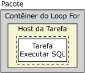
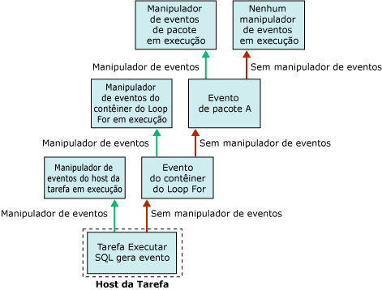

# Manipuladores de eventos do SSIS (Integration Services)

[!INCLUDE[sqlserver-ssis](../includes/applies-to-version/sqlserver-ssis.md)]

  Em tempo de execução, os executáveis (pacotes e contêineres Loop Foreach, Loop For, de Sequência e de host da tarefa) geram eventos. Por exemplo, um evento OnError será gerado quando acontecer um erro. Você pode criar manipuladores de eventos personalizados para esses eventos a fim de estender a funcionalidade do pacote e fazer com que os pacotes sejam mais fáceis de administrar em tempo de execução. Os manipuladores de eventos podem executar tarefas como:  
  
-   Limpar o armazenamento de dados temporários quando um pacote ou tarefa termina de ser executado.  
  
-   Recuperar informações de sistema para avaliar a disponibilidade de recursos antes da execução de um pacote.  
  
-   Atualizar dados de uma tabela quando ocorrer falha na pesquisa em uma tabela de referências.  
  
-   Enviar uma mensagem de email quando ocorrer erro, aviso ou falha em uma tarefa.  
  
 Quando um evento não tem um manipulador de eventos, o evento é gerado para o próximo contêiner superior na hierarquia de contêineres de um pacote. Se esse contêiner tiver um manipulador de eventos, este entrará em execução em resposta ao evento. Se não, o evento será gerado para o próximo contêiner superior na hierarquia de contêineres.  
  
 O diagrama a seguir mostra um pacote simples que tem um contêiner Loop For que contém uma tarefa Executar SQL.  
  
   
  
 Só o pacote tem um manipulador de eventos, para seu evento **OnError** . Se ocorrer um erro quando a tarefa Executar SQL for executada, o manipulador de eventos **OnError** do pacote entrará em execução. O diagrama a seguir mostra a sequência de chamadas que faz o manipulador de eventos **OnError** do pacote executar.  
  
   
  
 Manipuladores de eventos são membros de uma coleção de manipuladores de eventos e todos os contêineres incluem esta coleção. Se você criar o pacote usando o Designer [!INCLUDE[ssIS](../includes/ssis-md.md)] , poderá ver os membros das coleções de manipuladores de eventos nas pastas **Manipuladores de Eventos** , na guia **Explorador de Pacotes** , do Designer [!INCLUDE[ssIS](../includes/ssis-md.md)] .  
  
 Você pode configurar o contêiner de manipulador de eventos dos seguintes modos:  
  
-   Especifique um nome e uma descrição para o manipulador de eventos.  
  
-   Indique se o manipulador de eventos está em execução, se o pacote falha quando o manipulador de eventos falha e o número de erros que podem ocorrer antes de o manipulador de eventos falhar.  
  
-   Especifique um resultado de execução a retornar no lugar do resultado da execução real que o manipulador de eventos retorna durante a execução.  
  
-   Especifique a opção de transação do manipulador de eventos.  
  
-   Especifique o modo de registro usado pelo manipulador de eventos.  
  
## Conteúdo do manipulador de eventos  
 Criar um manipulador de eventos é como criar um pacote; um manipulador de eventos possui tarefas e contêineres, que são colocados em sequência em um fluxo de controle, e um manipulador de eventos também pode incluir fluxos de dados. O Designer [!INCLUDE[ssIS](../includes/ssis-md.md)] inclui a guia **Manipuladores de Eventos** para a criação de manipuladores de eventos personalizados.  
  
 Você também pode criar manipuladores de eventos programaticamente. Para obter mais informações, consulte [Manipulação de erros programaticamente](../integration-services/building-packages-programmatically/handling-events-programmatically.md).  
  
## Eventos de tempo de execução  
 A tabela a seguir lista os manipuladores de eventos que o [!INCLUDE[ssISnoversion](../includes/ssisnoversion-md.md)] fornece e descreve os eventos de tempo de execução que acionam a execução do manipulador de eventos.  
  
|Manipulador de eventos|evento|  
|-------------------|-----------|  
|**OnError**|Manipulador de eventos do evento **OnError** . Esse evento é gerado por um executável quando ocorre um erro.|  
|**OnExecStatusChanged**|Manipulador de eventos do evento **OnExecStatusChanged** . Esse evento é gerado por um executável quando seu status de execução é alterado.|  
|**OnInformation**|Manipulador de eventos do evento **OnInformation** . Esse evento é gerado durante a validação e execução de um executável para fornecer informações. Esse evento transmite apenas informações, nenhum erro ou avisos.|  
|**OnPostExecute**|Manipulador de eventos do evento **OnPostExecute** . Esse evento é gerado por um executável logo depois que este termina de ser executado.|  
|**OnPostValidate**|Manipulador de eventos do evento **OnPostValidate** . Esse evento é gerado por um executável quando sua validação é finalizada.|  
|**OnPreExecute**|Manipulador de eventos do evento **OnPreExecute** . Esse evento é gerado por um executável imediatamente antes da sua execução.|  
|**OnPreValidate**|Manipulador de eventos do evento **OnPreValidate** . Esse evento é gerado por um executável quando sua validação é iniciada.|  
|**OnProgress**|Manipulador de eventos do evento **OnProgress** . Esse evento é gerado por um executável quando um progresso mensurável é feito pelo executável.|  
|**OnQueryCancel**|Manipulador de eventos do evento **OnQueryCancel** . Esse evento é gerado por um executável para determinar se deve parar de ser executado.|  
|**OnTaskFailed**|Manipulador de eventos do evento **OnTaskFailed** . Esse evento é gerado por uma tarefa quando ela falha.|  
|**OnVariableValueChanged**|Manipulador de eventos do evento **OnVariableValueChanged** . Esse evento é gerado por um executável quando o valor de uma variável é alterado. O evento é gerado pelo executável no qual a variável está definida. Esse evento não será gerado se você definir a propriedade **RaiseChangeEvent** da variável como **False**. Para obter mais informações, consulte [Variáveis do SSIS &#40;Integration Services&#41;](../integration-services/integration-services-ssis-variables.md).|  
|**OnWarning**|Manipulador de eventos do evento **OnWarning** . Esse evento é gerado por um executável quando ocorre um aviso.|  

## Adicionar um manipulador de eventos a um pacote
No momento da execução, contêineres e tarefas elevam os eventos. Você pode criar manipuladores de eventos personalizados que respondam a esses eventos, executando um fluxo de trabalho quando o evento for gerado. Por exemplo, você pode criar um manipulador de eventos que envia uma mensagem de e-mail quando uma tarefa falha.  
  
 Um manipulador de eventos é semelhante a um pacote. Como um pacote, um manipulador de eventos pode fornecer escopo para variáveis e incluir um fluxo de controle e fluxos de dados opcionais. Você pode criar manipuladores de eventos para pacotes, o contêiner Loop Foreach, o contêiner Loop For, o contêiner Sequência e todas as tarefas.  
  
 Você cria manipuladores de eventos usando a superfície de design da guia **Manipuladores de Eventos** no Designer [!INCLUDE[ssIS](../includes/ssis-md.md)] .  
  
 Quando a guia **Manipuladores de Eventos** está ativa, os nós **Itens de Fluxo de Controle** e **Tarefas de Plano de Manutenção** da Caixa de Ferramentas no Designer [!INCLUDE[ssIS](../includes/ssis-md.md)] contêm a tarefa e contêineres para criar o fluxo de controle do manipulador de eventos. Os nós **Origens de Fluxo de Dados**, **Transformações**e **Destinos de Fluxos de Dados** contêm as fontes de dados, transformações e destinos para criar os fluxos de dados no manipulador de eventos. Para obter mais informações, consulte [Fluxo de Controle](../integration-services/control-flow/control-flow.md) e [Fluxo de Dados](../integration-services/data-flow/data-flow.md).  
  
 A guia **Manipuladores de Eventos** também inclui a área Gerenciadores de **Conexões** , em que você pode criar e modificar os gerenciadores de conexões que os manipuladores de eventos usam para conectar servidores e fontes de dados. Para obter mais informações, consulte [Criar gerenciadores de conexões](./connection-manager/integration-services-ssis-connections.md).  
  
### Adicionar um manipulador de eventos na guia Manipuladores de Eventos  
  
1.  No [!INCLUDE[ssBIDevStudioFull](../includes/ssbidevstudiofull-md.md)], abra o projeto do [!INCLUDE[ssISnoversion](../includes/ssisnoversion-md.md)] que contém o pacote desejado.  
  
2.  No Gerenciador de Soluções, clique duas vezes no pacote para abri-lo.  
  
3.  Clique na guia **Manipuladores de Eventos** .  
  
       
  
     Criar o fluxo de controle e os fluxos de dados em um manipulador de eventos é semelhante a criar o fluxo de controle e os fluxos de dados em um pacote. Para obter mais informações, consulte [Fluxo de Controle](../integration-services/control-flow/control-flow.md) e [Fluxo de Dados](../integration-services/data-flow/data-flow.md).  
  
4.  Na lista **Executável** , selecione o executável para o qual você quer criar um manipulador de eventos.  
  
5.  Na lista **Manipulador de Eventos** , selecione o manipulador de eventos que você quer criar.  
  
6.  Clique no link na superfície de design da guia **Manipulador de Eventos** .  
  
7.  Adicione itens de fluxo de controle ao manipulador de eventos e conecte itens usando uma restrição de precedência arrastando a restrição de um item de controle de fluxo para outro. Para obter mais informações, consulte [Control Flow](../integration-services/control-flow/control-flow.md).  
  
8.  Opcionalmente, adicione uma tarefa de Fluxo de Dados e, na superfície da guia **Fluxo de Dados** , crie um fluxo de dados para o manipulador de eventos. Para obter mais informações, consulte [Data Flow](../integration-services/data-flow/data-flow.md).  
  
9. No menu **Arquivo** , clique em **Salvar Itens Selecionados** para salvar o pacote.  

## Definir as propriedades de um manipulador de eventos  
 Você pode definir as propriedades na janela **Propriedades** do [!INCLUDE[ssBIDevStudioFull](../includes/ssbidevstudiofull-md.md)] ou programaticamente.  
  
 Para obter informações sobre como definir essas propriedades no [!INCLUDE[ssBIDevStudioFull](../includes/ssbidevstudiofull-md.md)], consulte [Definir as propriedades de uma tarefa ou de um contêiner](./control-flow/add-or-delete-a-task-or-a-container-in-a-control-flow.md).  
  
 Para obter informações sobre como definir essas propriedades programaticamente, consulte <xref:Microsoft.SqlServer.Dts.Runtime.DtsEventHandler>.  
  
## Related Tasks  
 Para obter informações sobre como adicionar um manipulador de eventos a um pacote, consulte [Adicionar um manipulador de eventos a um pacote]().  
  
