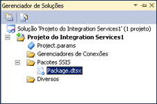

# Projetos e solu&#231;&#245;es do Integration Services (SSIS)
  [!INCLUDE[ssNoVersion](../includes/ssnoversion-md.md)] fornece o [!INCLUDE[ssBIDevStudioFull](../includes/ssbidevstudiofull-md.md)] para o desenvolvimento de pacotes do [!INCLUDE[ssISnoversion](../includes/ssisnoversion-md.md)] .  
  
 Quando você implanta pacotes em um banco de dados do [!INCLUDE[msCoName](../includes/msconame-md.md)] [!INCLUDE[ssNoVersion](../includes/ssnoversion-md.md)] ou no armazenamento de pacotes do [!INCLUDE[ssIS](../includes/ssis-md.md)] , usa o serviço do [!INCLUDE[ssISnoversion](../includes/ssisnoversion-md.md)] para gerenciar os pacotes. O serviço [!INCLUDE[ssISnoversion](../includes/ssisnoversion-md.md)] está disponível apenas no [!INCLUDE[ssManStudioFull](../includes/ssmanstudiofull-md.md)]. Para obter mais informações sobre o serviço, consulte [Serviço Integration Services &#40;Serviço SSIS&#41;](../integration-services/service/integration-services-service-ssis-service.md). Para obter mais informações sobre a implantação do pacote, consulte [Implantação de pacote herdado &#40;SSIS&#41;](../integration-services/packages/legacy-package-deployment-ssis.md).  
  
 Quando você implantar projetos do [!INCLUDE[ssISnoversion](../includes/ssisnoversion-md.md)] no servidor do [!INCLUDE[ssISnoversion](../includes/ssisnoversion-md.md)], usa as exibições de Transact-SQL e procedimentos armazenados no [!INCLUDE[ssManStudioFull](../includes/ssmanstudiofull-md.md)] para gerenciar os projetos. Para obter mais informações sobre a implantação de projetos, consulte [Deployment of Projects and Packages](https://msdn.microsoft.com/library/hh213290.aspx). Para obter mais informações sobre o servidor [!INCLUDE[ssISnoversion](../includes/ssisnoversion-md.md)], consulte [Servidor do Integration Services &#40;SSIS&#41;](https://msdn.microsoft.com/library/ms137731.aspx).  
  
 Para obter uma visão geral do [!INCLUDE[ssBIDevStudioFull](../includes/ssbidevstudiofull-md.md)] e [!INCLUDE[ssManStudioFull](../includes/ssmanstudiofull-md.md)], consulte [SSIS &#40;Integration Services&#41; e Ferramentas de Gerenciamento](https://msdn.microsoft.com/library/ms140028.aspx)%20and%20Studio%20Environments.md).  
  
## Projetos do Integration Services contêm pacotes  
 Um projeto é um contêiner no qual você desenvolve pacotes do [!INCLUDE[ssISnoversion](../includes/ssisnoversion-md.md)] .  
  
 No [!INCLUDE[ssBIDevStudioFull](../includes/ssbidevstudiofull-md.md)], um projeto do [!INCLUDE[ssISnoversion](../includes/ssisnoversion-md.md)] armazena e agrupa os arquivos que são relacionados ao pacote. Por exemplo, um projeto inclui os arquivos necessários para criar uma solução de ETL (extração, transferência e carregamento) específica.  
  
 Antes de você criar um projeto do [!INCLUDE[ssISnoversion](../includes/ssisnoversion-md.md)] , familiarize-se com o conteúdo básico deste tipo de projeto. Depois de entender o que um projeto contém, você pode começar a criar e trabalhar com um projeto do [!INCLUDE[ssISnoversion](../includes/ssisnoversion-md.md)] .  
  
## Pastas nos projetos do Integration Services  
 O diagrama a seguir mostra as pastas em um projeto [!INCLUDE[ssISnoversion](../includes/ssisnoversion-md.md)] no [!INCLUDE[ssBIDevStudioFull](../includes/ssbidevstudiofull-md.md)].  
  
   
  
 A tabela a seguir descreve as pastas que aparecem em um projeto do [!INCLUDE[ssISnoversion](../includes/ssisnoversion-md.md)] .  
  
|Pasta|Description|  
|------------|-----------------|  
|[!INCLUDE[ssIS](../includes/ssis-md.md)] Packages|Contém pacotes. Para obter mais informações, consulte [Integration Services &#40;SSIS&#41; Pacotes](../integration-services/integration-services-ssis-packages.md).|  
|Diversos|Contém arquivos diferentes de arquivos de pacotes.|  
  
## Arquivos em projetos do Integration Services  
 Ao adicionar um projeto do [!INCLUDE[ssISnoversion](../includes/ssisnoversion-md.md)] novo ou existente a uma solução, o [!INCLUDE[ssBIDevStudioFull](../includes/ssbidevstudiofull-md.md)] cria arquivos de projeto que têm extensões .dtproj e .dtproj.user e .database.  
  
-   O arquivo *.dtproj contém informações sobre configurações de projeto e itens como pacotes.  
  
-   O arquivo * .dtproj.user contém informações sobre suas preferências para trabalhar com o projeto  
  
-   O arquivo * .database contém informações que o [!INCLUDE[ssBIDevStudioFull](../includes/ssbidevstudiofull-md.md)] exige abrir o projeto [!INCLUDE[ssISnoversion](../includes/ssisnoversion-md.md)] .  
  
## Direcionamento de versão nos projetos do Integration Services  
 No [!INCLUDE[ssBIDevStudioFull](../includes/ssbidevstudiofull-md.md)], você pode criar, manter e executar pacotes que se destinam ao SQL Server 2016, SQL Server 2014 ou SQL Server 2012.  
  
 No Gerenciador de Soluções, clique com o botão direito do mouse em um projeto do Integration Services e selecione **Propriedades** para abrir as páginas de propriedades do projeto. Na guia **Geral** de **Propriedades de Configuração**, selecione a propriedade **TargetServerVersion** e, em seguida, escolha o SQL Server 2012, SQL Server 2014 ou SQL Server 2016.  
  
   
  
## As soluções contêm projetos  
 Uma solução é um contêiner que agrupa e gerencia os projetos que você usa quando desenvolve soluções empresariais completas. Uma solução permite que você manipule vários projetos como uma unidade e una um ou mais projetos relacionados que contribuam para uma solução empresarial.  
  
 Soluções podem incluir diferentes tipos de projetos. Se você quiser usar o [!INCLUDE[ssIS](../includes/ssis-md.md)] Designer para criar um pacote do [!INCLUDE[ssISnoversion](../includes/ssisnoversion-md.md)] , trabalhe em um projeto do [!INCLUDE[ssISnoversion](../includes/ssisnoversion-md.md)] em uma solução fornecida por [!INCLUDE[ssBIDevStudioFull](../includes/ssbidevstudiofull-md.md)].  
  
 Quando você cria uma nova solução, o [!INCLUDE[ssBIDevStudioFull](../includes/ssbidevstudiofull-md.md)] adiciona uma pasta Solução ao Gerenciador de Soluções e cria arquivos que têm extensões .sln e .suo.  
  
-   O arquivo * .sln contém informações sobre as configurações da solução e lista os projetos na solução.  
  
-   O arquivo *.suo contém informações sobre suas preferências para trabalhar com a solução.  
  
 Embora o [!INCLUDE[ssBIDevStudioFull](../includes/ssbidevstudiofull-md.md)] crie automaticamente uma solução quando um novo projeto é criado, você também pode criar uma solução em branco e então adicionar projetos depois.  
  
> **OBSERVAÇÃO:** por padrão, quando você cria um novo projeto do [!INCLUDE[ssISnoversion](../includes/ssisnoversion-md.md)] no [!INCLUDE[ssBIDevStudioFull](../includes/ssbidevstudiofull-md.md)], a solução não é mostrada no painel **Explorador de Projeto**. Para alterar este comportamento padrão, no menu **Ferramentas** , clique em **Opções**. Na caixa de diálogo **Opções** , expanda **Projetos e Soluções**e clique em **Geral**. Na página **Geral** , selecione **Sempre mostrar solução**.  
  
## Tarefas relacionadas  
 [Adicionar ou remover um projeto do Integration Services em uma solução](../Topic/Add%20or%20Remove%20an%20Integration%20Services%20Project%20in%20a%20Solution.md)  
  
 [Criar um novo projeto do Integration Services](../Topic/Create%20a%20New%20Integration%20Services%20Project.md)  
  
 [Adicionar um item a um projeto do Integration Services](../Topic/Add%20an%20Item%20to%20an%20Integration%20Services%20Project.md)  
  
 [Copiar itens do projeto](../Topic/Copy%20Project%20Items.md)  
  
## Conteúdo relacionado  
 [Implantação de um projeto do Integration Services](../Topic/Development%20of%20an%20Integration%20Services%20Project.md)  
  
  