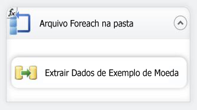
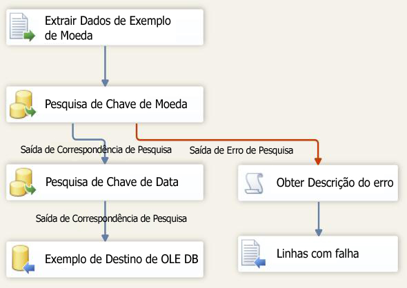

# Lição 6-3 – testar o pacote da Lição 6
Em tempo de execução, seu pacote irá obter o valor para a propriedade Diretório a partir do parâmetro VarFolderName.  
  
Para verificar se, em tempo de execução, o pacote atualizou corretamente o Diretório com o novo valor, simplesmente execute o pacote. Devido a serem copiados apenas três arquivos de dados de exemplo para o novo diretório, o fluxo de dados irá executar apenas três vezes ao invés de interagir com 14 arquivos da pasta original.  
  
## Verificando o layout do pacote  
Antes de testar o pacote deve-se verificar se os fluxos de controle e de dados do pacote da Lição 6 contêm os objetos mostrados nos diagramas a seguir. O fluxo de controle deve ser idêntico ao fluxo de controle da lição 5. O fluxo de dados deve ser idêntico ao fluxo de dados na lição 5.  
  
**Fluxo de Controle**  
  
  
  
**Fluxo de Dados**  
  
  
  
### Para testar o pacote de tutorial da Lição 6  
  
1.  No menu Depurar, clique em Iniciar Depuração.  
  
2.  Terminada a execução do pacote, no menu Depurar, clique em Parar Depuração.  
  
## Próxima tarefa da lição  
[Etapa 4: Implantando o pacote da Lição 6](../integration-services/lesson-6-4-deploying-the-lesson-6-package.md)  
  
  
  
