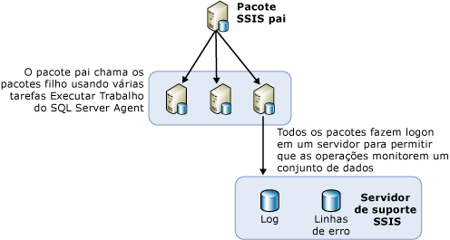

# Pacotes de balanceamento de carga em servidores remotos usando o SQL Server Agent

[!INCLUDE[ssis-appliesto](../../includes/ssis-appliesto-ssvrpluslinux-asdb-asdw-xxx.md)]

  Quando for necessário executar muitos pacotes, será conveniente usar outros servidores que estejam disponíveis. Este método de usar outros servidores para executar pacotes quando os pacotes estão sob o controle de um pacote pai é chamado balanceamento de carga. No [!INCLUDE[ssNoVersion](../../includes/ssnoversion-md.md)] [!INCLUDE[ssISnoversion](../../includes/ssisnoversion-md.md)], o balanceamento de carga é um procedimento manual que precisa ser projetado pelos proprietários dos pacotes. Balanceamento de carga não é executado automaticamente pelos servidores. Além disso, os pacotes que estão em execução nos servidores remotos devem ser pacotes completos, não tarefas individuais em outros pacotes.  
  
 Balanceamento de carga é útil nos seguintes cenários:  
  
-   Pacotes podem executar ao mesmo tempo.  
  
-   Pacotes são grandes e, se executados em sequência, podem executar por mais tempo que o permitido para o processamento.  
  
 Administradores e arquitetos podem determinar se usar servidores adicionais para o processamento beneficiaria os processos.  
  
## Ilustração do balanceamento de carga  
 O diagrama a seguir mostra um pacote pai em um servidor. O pacote pai contém várias tarefas Executar Trabalho do SQL Agent. Cada tarefa no pacote pai chama um SQL Server Agent em um servidor remoto. Esses servidores remotos contêm trabalhos do SQL Server Agent que incluem uma etapa que chama um pacote naquele servidor.  
  
   
  
 As etapas exigidas para balanceamento de carga nesta arquitetura não são conceitos novos. Em vez disso, o balanceamento de carga é alcançado usando conceitos existentes e objetos SSIS comuns em uma nova maneira.  
  
## Execução de pacotes em uma instância remota por meio do SQL Server Agent  
 Na arquitetura básica para execução de pacote remoto, um pacote central está localizado na instância do SQL Server que controla os pacotes remotos. O diagrama mostra esse pacote central, nomeado o Pai do SSIS. A instância onde esse pacote pai reside controla a execução dos trabalhos do SQL Server Agent que executam os pacotes filhos. Os pacotes filhos não executam conforme uma agenda fixa controlada pelo SQL Server Agent no servidor remoto. Em vez disso, os pacotes filhos são iniciados pelo SQL Server Agent, quando chamados pelo pacote pai, e são executados na mesma instância do SQL Server em que o SQL Server Agent reside.  
  
 Antes que possa executar um pacote remoto usando um SQL Server Agent, é preciso configurar os pacotes pai e filho e os trabalhos do SQL Server Agent que controlam os pacotes filhos. As seções a seguir fornecem mais informações sobre como criar, configurar, executar e manter pacotes que executam em servidores remotos. Há várias etapas para esse processo:  
  
-   Criando e instalando o pacote filho em servidores remotos.  
  
-   Criando os trabalhos SQL Server Agent nas instâncias remotas que executarão os pacotes.  
  
-   Criando um pacote pai.  
  
-   Determine o cenário de log para os pacotes filhos.  
  
## Implementação de pacotes filho
  Quando você implementa balanceamento de carga usando o [!INCLUDE[ssISnoversion](../../includes/ssisnoversion-md.md)], os pacotes filho são instalados em outros servidores para aproveitar a CPU disponível ou o tempo do servidor. Para criar e executar os pacotes filho são necessárias as seguintes etapas:  
  
-   Criar os pacotes filho.  
  
-   Mover os pacotes para o servidor remoto.  
  
-   Criar um trabalho do SQL Server Agent no servidor remoto que contém uma etapa que executa o pacote filho.  
  
-   Testar e depurar o trabalho do SQL Server Agent e os pacotes filho.  
  
 Quando você cria pacotes filho, os pacotes não têm nenhuma limitação em sua criação e é possível inserir qualquer funcionalidade desejada. Entretanto, se o pacote acessar dados, será necessário verificar se o servidor que executa o pacote tem acesso aos dados.  
  
 Para identificar o pacote pai que executa pacotes filho, em [!INCLUDE[ssBIDevStudioFull](../../includes/ssbidevstudiofull-md.md)] , clique com o botão direito do mouse no pacote no Gerenciador de Soluções e clique em **Pacote de Ponto de Entrada**.  
  
 Depois que os pacotes filho são criados, a próxima etapa é implantá-los nos servidores remotos.  
  
### Mover o pacote filho para uma instância remota  
 Há várias maneiras de mover os pacotes para outros servidores. Os dois métodos sugeridos são:  
  
-   Exportar os pacotes usando o [!INCLUDE[ssManStudioFull](../../includes/ssmanstudiofull-md.md)].  
  
-   Implantar os pacotes compilando um utilitário de implantação para o projeto que contém os pacotes que você deseja implantar e, depois, executar o Assistente de Instalação de Pacotes para instalar os pacotes no sistema de arquivos ou em uma instância do [!INCLUDE[ssNoVersion](../../includes/ssnoversion-md.md)]. Para obter mais informações, consulte [Implantação de pacote herdado &#40;SSIS&#41;](../../integration-services/packages/legacy-package-deployment-ssis.md).  
  
 Você precisa repetir a implantação em cada servidor remoto que desejar usar.  
  
### Criar trabalhos do SQL Server Agent  
 Depois que os pacotes filho forem implantados em vários servidores, crie um trabalho do SQL Server Agent em cada servidor que contém um pacote filho. O trabalho do SQL Server Agent possui uma etapa que executa o pacote filho quando o agente de trabalhos é chamado. Os trabalhos do SQL Server Agent não são trabalhos agendados; eles executam os pacotes filho somente quando são chamados pelo pacote pai. A notificação de êxito ou falha do trabalho no pacote pai reflete o sucesso ou a falha do trabalho do SQL Server Agent e se ele foi chamado com êxito, e não o êxito ou o fracasso do pacote filho ou se ele foi executado.  
  
### Depurar os trabalhos do SQL Server Agent e os pacotes filho  
 Você pode testar os trabalhos do SQL Server Agent e seus pacotes filho usando um dos seguintes métodos:  
  
-   Executar cada pacote filho no Designer SSIS clicando em **Depurar** / **Iniciar sem Depurar**.  
  
-   Executar o trabalho individual do SQL Server Agent no computador remoto usando o [!INCLUDE[ssManStudioFull](../../includes/ssmanstudiofull-md.md)]para garantir que o pacote seja executado.  
  
 Para obter informações sobre como resolver problemas de pacotes executados nos trabalhos do [!INCLUDE[ssNoVersion](../../includes/ssnoversion-md.md)] Agent, consulte [Um pacote SSIS não é executado quando você chama o pacote SSIS a partir de um trabalho do SQL Server Agent](https://support.microsoft.com/kb/918760) na Base de Dados de Conhecimento de Suporte da [!INCLUDE[msCoName](../../includes/msconame-md.md)] .  
  
 O SQL Server Agent realiza verificações no acesso do subsistema para um proxy e fornece acesso ao proxy toda vez que a etapa do trabalho é executada.  
  
 Você pode criar um proxy no [!INCLUDE[ssManStudioFull](../../includes/ssmanstudiofull-md.md)].  

## Implementação do pacote pai
  Após o balanceamento de carga de pacotes SSIS em vários servidores, a etapa seguinte será criar o pacote pai após os pacotes filho terem sido criados e implantados e os trabalhos do SQL Server Agent remotos criados para executá-los. O pacote pai conterá muitas tarefas Executar Trabalho do SQL Server Agent, sendo cada tarefa responsável por chamar um trabalho diferente do SQL Server Agent que executa um dos pacotes filho. As tarefas Executar Trabalho do SQL Server Agent no pacote pai executam em turnos os vários trabalhos do SQL Server Agent. Cada tarefa no pacote pai contém informações, por exemplo, como se conectar ao servidor remoto e qual trabalho deve ser executado nesse servidor. Para obter mais informações, consulte [Execute SQL Server Agent Job Task](../../integration-services/control-flow/execute-sql-server-agent-job-task.md).  
  
 Para identificar o pacote pai que executa pacotes filho, em [!INCLUDE[ssBIDevStudioFull](../../includes/ssbidevstudiofull-md.md)] , clique com o botão direito do mouse no pacote no Gerenciador de Soluções e clique em **Pacote de Ponto de Entrada**.  
  
### Listando pacotes filho  
 Se você implantar o projeto que contém o pacote pai e os pacotes filhos no servidor do [!INCLUDE[ssISnoversion](../../includes/ssisnoversion-md.md)] , poderá ver uma lista dos pacotes filho executados pelo pacote pai. Quando você executa o pacote pai, um relatório **Visão geral** do mesmo é gerado automaticamente no [!INCLUDE[ssManStudioFull](../../includes/ssmanstudiofull-md.md)]. O relatório lista os pacotes filho que foram executados pela tarefa Executar Pacote contida no pacote pai, como mostrado na imagem a seguir.  
  
   
  
 Para obter mais informações sobre como acessar o relatório **Visão geral** , confira [Reports for the Integration Services Server](../../integration-services/performance/monitor-running-packages-and-other-operations.md#reports).  
  
### Restrições de precedência no pacote pai  
 Quando você cria restrições de precedência entre as tarefas Executar Trabalho do SQL Server Agent no pacote pai, elas controlam somente a hora em que os trabalhos do SQL Server Agent são iniciados nos servidores remotos. As restrições de precedência não podem receber informações relacionadas ao êxito ou falha dos pacotes filho executados pelas etapas dos trabalhos do SQL Server Agent.  
  
 Isso significa que o êxito ou a falha do pacote filho não se propaga para o pai, porque a única função de Executar Trabalho do SQL Server Agent no pacote pai é solicitar ao trabalho do SQL Server Agent que execute o pacote filho. Depois que o trabalho do SQL Server Agent é chamado com êxito, o pacote pai recebe um resultado do <xref:Microsoft.SqlServer.Dts.Runtime.DTSExecResult.Success>.  
  
 A falha nesse cenário significa apenas que houve uma falha na chamada da tarefa remota do Trabalho do SQL Server Agent. Uma situação em que isso pode acontecer é quando o servidor remoto está inoperante e o agente não responde. No entanto, se o agente disparar, o pacote pai completará sua tarefa com êxito.  
  
> [!NOTE]  
>  Você pode usar uma tarefa Executar SQL que contém uma instrução Transact-SQL de **sp_start_job N'nome_do_pacote'** . Para obter mais informações, consulte [sp_start_job &#40;Transact-SQL&#41;](../../relational-databases/system-stored-procedures/sp-start-job-transact-sql.md).  
  
### Ambiente de depuração  
 Durante o teste do pacote pai, use o ambiente de depuração do designer para executá-lo usando Depurar / Iniciar depuração (F5). Como alternativa, você pode usar o utilitário de prompt de comando, **dtexec**. Para saber mais, veja [dtexec Utility](../../integration-services/packages/dtexec-utility.md).  

## Log para carga de pacotes balanceados em servidores remotos
  É mais fácil para um administrador gerenciar os logs de todos os pacotes filho que estão sendo executados em vários servidores quando todos os pacotes filho usam o mesmo provedor de log e todos gravam no mesmo destino. Um modo para criar um arquivo de log comum para todos os pacotes filho é configurar os pacotes filho para registrar os seus eventos em um provedor de log SQL Server. Você pode configurar todos os pacotes para usarem o mesmo banco de dados, o mesmo servidor e a mesma instância do servidor.  
  
 Para exibir os arquivos de log, o administrador precisa apenas fazer logon em um único servidor para exibir os arquivos de log de todos os pacotes filho.  
  
 Para obter informações sobre como habilitar o log em um pacote, consulte [Log do SSIS (Integration Services)](../../integration-services/performance/integration-services-ssis-logging.md).  

## Related Tasks  
 [Trabalhos do SQL Server Agent para pacotes](../../integration-services/packages/sql-server-agent-jobs-for-packages.md)  
  
  
