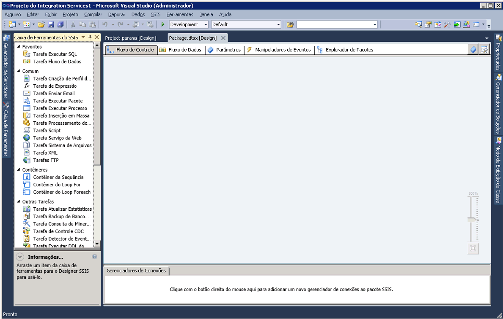

# Designer SSIS

[!INCLUDE[ssis-appliesto](../includes/ssis-appliesto-ssvrpluslinux-asdb-asdw-xxx.md)]

  [!INCLUDE[ssIS](../includes/ssis-md.md)] é uma ferramenta gráfica que pode ser usada para criar e manter pacotes do [!INCLUDE[ssISnoversion](../includes/ssisnoversion-md.md)] . [!INCLUDE[ssIS](../includes/ssis-md.md)] está disponível no [!INCLUDE[ssBIDevStudioFull](../includes/ssbidevstudiofull-md.md)] como parte de um projeto do [!INCLUDE[ssISnoversion](../includes/ssisnoversion-md.md)] .  
  
 Você pode utilizar o Designer [!INCLUDE[ssIS](../includes/ssis-md.md)] para executar as seguintes tarefas:  
  
-   Criar o fluxo de controle em um pacote.  
  
-   Criar o fluxo de dados em um pacote.  
  
-   Adicionar manipuladores de eventos ao pacote e a objetos do pacote.  
  
-   Exibir o conteúdo do pacote.  
  
-   Em tempo de execução, exibir o progresso da execução do pacote.  
  
 O diagrama a seguir exibe o [!INCLUDE[ssIS](../includes/ssis-md.md)] Designer e a janela **Caixa de Ferramentas** .  
  
   
  
 [!INCLUDE[ssISnoversion](../includes/ssisnoversion-md.md)] inclui caixas de diálogo e janelas adicionais para proporcionar maior funcionalidade aos pacotes e o [!INCLUDE[ssBIDevStudioFull](../includes/ssbidevstudiofull-md.md)] fornece janelas e caixas de diálogo para configurar o ambiente de desenvolvimento e trabalhar com pacotes. Para obter mais informações, consulte [Interface do usuário do Integration Services](../integration-services/integration-services-user-interface.md).  
  
 [!INCLUDE[ssIS](../includes/ssis-md.md)] Designer não tem dependência do serviço [!INCLUDE[ssISnoversion](../includes/ssisnoversion-md.md)] , o serviço que gerencia e monitora pacotes, e não é necessário que o serviço esteja sendo executado para criar ou modificar pacotes no [!INCLUDE[ssIS](../includes/ssis-md.md)] Designer. Entretanto, se você parar o serviço enquanto o [!INCLUDE[ssIS](../includes/ssis-md.md)] Designer estiver aberto, não poderá mais abrir as caixas de diálogo que o [!INCLUDE[ssIS](../includes/ssis-md.md)] Designer fornece e poderá receber a mensagem de erro "RPC server is unavailable". Para redefinir o [!INCLUDE[ssIS](../includes/ssis-md.md)] Designer e continuar a trabalhar com o pacote, você deve fechar o designer, sair do [!INCLUDE[ssBIDevStudioFull](../includes/ssbidevstudiofull-md.md)]e reabrir o [!INCLUDE[ssBIDevStudioFull](../includes/ssbidevstudiofull-md.md)], o projeto do [!INCLUDE[ssISnoversion](../includes/ssisnoversion-md.md)] e o pacote.  
  
## Desfazer e refazer  
 É possível desfazer e refazer até 20 ações no [!INCLUDE[ssIS](../includes/ssis-md.md)] Designer. Para um pacote, a opção desfazer/refazer está disponível nas guias **Fluxo de Controle**, **Fluxo de Dados**, **Manipuladores de Eventos**e **Parâmetros** , bem como na janela **Variáveis** . Para um projeto, a opção desfazer/refazer está disponível na janela **Parâmetros do Projeto** .  
  
 Não é possível desfazer/refazer alterações na nova **Caixa de Ferramentas do SSIS**.  
  
 Quando você fizer alterações em um componente usando o editor de componente, desfaz e refaz as alterações como um conjunto em vez de desfazer e refazer alterações individuais. O conjunto de alterações aparece como uma única ação na lista suspensa de desfazer e refazer.  
  
 Para desfazer uma ação, clique no botão desfazer de barra de ferramentas, item de menu **Editar/Desfazer** ou pressione CTRL+Z. Para refazer uma ação, clique no botão refazer da barra de ferramentas, item de menu **Editar/Refazer** ou pressione CTRL+Y. Você pode desfazer e refazer várias ações, clicando na seta ao lado do botão de barra de ferramentas, realçando várias ações na lista suspensa e clicando na lista.  
  
## Partes do Designer SSIS  
 [!INCLUDE[ssIS](../includes/ssis-md.md)] tem cinco guias permanentes: para a criação de fluxos de controle de pacotes, de fluxos de dados, de parâmetros e de manipuladores de eventos e uma guia para a exibição do conteúdo de um pacote. Em tempo de execução, será mostrada uma sexta guia que exibe o progresso da execução de um pacote enquanto ele é executado, bem como os resultados da execução após o término.  
  
 Além disso, o [!INCLUDE[ssIS](../includes/ssis-md.md)] Designer inclui a área Gerenciadores de Conexões para adicionar e configurar os gerenciadores de conexões usados por um pacote para se conectar com os dados.  
  
### Guia Fluxo de Controle  
 Você pode criar o fluxo de controle em um pacote na superfície de design da guia **Fluxo de Controle** . Arraste itens da **Caixa de Ferramentas** para a superfície de design e conecte-os em um fluxo de controle clicando no ícone do item e arrastando a seta de um item para outro.  
  
 Para obter mais informações, consulte [Control Flow](../integration-services/control-flow/control-flow.md).  
  
### Guia Fluxo de Dados  
 Se um pacote contém uma tarefa de fluxo de dados, você pode adicionar fluxos de dados a ele. Você pode criar fluxos de dados em um pacote na superfície de design da guia **Fluxo de Dados** . Arraste itens da **Caixa de Ferramentas** para a superfície de design e conecte-os em um fluxo de dados clicando no ícone do item e arrastando a seta de um item para outro.  
  
 Para obter mais informações, consulte [Data Flow](../integration-services/data-flow/data-flow.md).  
  
### Guia Parâmetros  
 Os parâmetros do Integration Services (SSIS) permitem atribuir valores às propriedades nos pacotes em tempo de execução do pacote. Você pode criar parâmetros de projeto em nível de projeto e parâmetros de pacote em nível de pacote. Os parâmetros do projeto são usados para fornecer uma entrada externa que o projeto recebe para um ou mais pacotes no projeto. Os parâmetros do pacote permitem modificar a execução do pacote sem a necessidade de editar e reimplantar o pacote. Esta guia permite gerenciar parâmetros de pacote.  
  
 Para obter mais informações sobre parâmetros, consulte [Parâmetros do SSIS (Integration Services)](integration-services-ssis-package-and-project-parameters.md).  
  
> **IMPORTANTE:**  Os parâmetros estão disponíveis apenas para projetos desenvolvidos para o modelo de implantação de projeto. Portanto, você só verá a guia Parâmetros para pacotes que fazem parte de um projeto configurado para usar o modelo de implantação de projeto.  
  
### Guia Manipuladores de Eventos  
 Você pode criar os eventos em um pacote na superfície de design da guia **Manipuladores de Eventos** . Na guia **Manipuladores de Eventos** , selecione o pacote ou o objeto do pacote para o qual deseja criar um manipulador de eventos e selecione o evento a ser associado ao manipulador de eventos. Um manipulador de eventos tem um fluxo de controle e fluxos de dados opcionais.  
  
 Para obter mais informações, consulte [Add an Event Handler to a Package](https://msdn.microsoft.com/library/5e56885d-8658-480a-bed9-3f2f8003fd78).  
  
### Guia Explorador de Pacotes  
 Os pacotes podem ser complexos, incluindo muitas tarefas, gerenciadores de conexões, variáveis e outros elementos. A exibição do explorador do pacote permite que você visualize uma lista completa de elementos de pacote.  
  
 Para obter mais informações, consulte [Exibir objetos do pacote](../integration-services/view-package-objects.md).  
  
### Guias Resultado da Execução/Progresso  
 Enquanto um pacote é executado, a guia **Progresso** exibe o progresso da execução do pacote. Depois que o pacote termina de ser executado, os resultados da execução continuam disponíveis na guia **Resultados da Execução** .  
  
> **OBSERVAÇÃO:** Para habilitar ou desabilitar a exibição de mensagens na guia **Progresso** , marque ou desmarque a opção **Depurar Relatório do Progresso** no menu **SSIS** .  
  
#### Área Gerenciadores de Conexões  
 Você adiciona e modifica os gerenciadores de conexões que um pacote usa na área **Gerenciadores de conexões** . [!INCLUDE[ssISnoversion](../includes/ssisnoversion-md.md)] inclui gerenciadores de conexões para conexão a várias fontes de dados, como arquivos de texto, bancos de dados OLE DB e provedores .NET.  
  
 Para obter mais informações, consulte [Conexões do Integration Services &#40;SSIS&#41;](../integration-services/connection-manager/integration-services-ssis-connections.md) e [Criar gerenciadores de conexões](https://msdn.microsoft.com/library/6ca317b8-0061-4d9d-b830-ee8c21268345).  
 
## Guia Fluxo de Controle
Use a guia **Fluxo de Controle** do Designer [!INCLUDE[ssIS](../includes/ssis-md.md)] para criar o fluxo de controle em um pacote [!INCLUDE[ssISnoversion](../includes/ssisnoversion-md.md)] .  
  
 Crie o fluxo de controle arrastando objetos gráficos que representam tarefas [!INCLUDE[ssIS](../includes/ssis-md.md)] e contêiners da **Caixa de Ferramentas** para a superfície de design da guia **Fluxo de Controle** e, em seguida, conectando os objetos arrastando o conector em um objeto para outro objeto. Cada linha de conexão representa uma restrição de precedência que especifica a ordem na qual as tarefas e os contêiners são executados  
  
 Além disso, você pode usar o Designer [!INCLUDE[ssIS](../includes/ssis-md.md)] para adicionar a seguinte funcionalidade da guia **Fluxo de Controle** :  
  
-   Implementar um registro  
  
-   Criar configurações do pacote  
  
-   Assinar o pacote com um certificado  
  
-   Gerenciar variáveis  
  
-   Adicionar anotações  
  
-   Configurar pontos de interrupção  
  
 Para adicionar essas funções a tarefas ou contêiners individuais no Designer [!INCLUDE[ssIS](../includes/ssis-md.md)] , clique com o botão direito do mouse no objeto na superfície do design e selecione a opção.  
 
## Guia Fluxo de Dados
Use a guia **Fluxo de Dados** do Designer [!INCLUDE[ssIS](../includes/ssis-md.md)] para criar fluxos de dados em um pacote [!INCLUDE[ssISnoversion](../includes/ssisnoversion-md.md)] .  
  
 Crie o fluxo de dados arrastando objetos gráficos que representam origens, transformações e destinos da **Caixa de Ferramentas** para a superfície de design da guia **Fluxo de Dados** e, em seguida, conectando os objetos para criar os caminhos que determinam a sequência na qual as transformações serão executadas.  
  
 Clique com o botão direito do mouse em um caminho e clique em **Visualizadores de Dados,** para adicionar visualizadores de dados para exibir os dados antes e depois de cada objeto do fluxo de dados.  
  
 Você também pode usar o Designer [!INCLUDE[ssIS](../includes/ssis-md.md)] para adicionar a seguinte funcionalidade da guia **Fluxo de Controle** :  
  
-   Gerenciar variáveis  
  
-   Adicionar anotações  
  
 Para adicionar essas funções no Designer [!INCLUDE[ssIS](../includes/ssis-md.md)] , clique com o botão direito do mouse na superfície do design e selecione a opção desejada.  
 
## Guia Manipuladores de Eventos
  Use a guia **Manipuladores de Eventos** do Designer [!INCLUDE[ssIS](../includes/ssis-md.md)] para criar um fluxo de controle em um pacote [!INCLUDE[ssISnoversion](../includes/ssisnoversion-md.md)] . Um manipulador de eventos é executado em resposta a um evento criado pelo pacote ou por uma tarefa ou contêiner no pacote.  
  
## Opções  
 **Executável**  
 Selecione o executável para o qual deseja criar um manipulador de eventos. O executável pode ser o pacote ou uma tarefa ou contêineres no pacote.  
  
 **Manipulador de eventos**  
 Selecione um tipo de manipulador de eventos. Crie o manipulador de eventos, arrastando os itens da **Caixa de Ferramentas**.  
  
 **Delete (excluir)**  
 Selecione um manipulador de eventos e remova-o do pacote, clicando em **Excluir**.  
  
 **Clique aqui para criar um \<nome do manipulador de eventos\> para o executável \<nome do executável\>**  
 Clique para criar o manipulador de eventos.  
  
 Crie o fluxo de controle arrastando os objetos gráficos que representam as tarefas e os contêiners [!INCLUDE[ssIS](../includes/ssis-md.md)] da **Caixa de Ferramentas** para a superfície de design da guia **Manipuladores de Eventos** e, em seguida, conectando os objetos usando as restrições de precedência para definir a sequência na qual eles serão executados.  
  
 Além disso, para adicionar anotações, clique com o botão direito do mouse na superfície de design e, em seguida, no menu, clique em **Adicionar Anotação**.  
 
## Guia Explorador de Pacotes
Use a guia **Explorador de Pacotes** do Designer [!INCLUDE[ssIS](../includes/ssis-md.md)] para obter uma exibição hierárquica de todos os elementos em um pacote: configurações, conexões, manipuladores de eventos, objetos executáveis como tarefas e contêiners, provedores de log, restrições de precedência e variáveis. Se um pacote contém uma tarefa de fluxo de dados, a guia **Explorador de Pacotes** incluirá um nó que contém uma exibição hierárquica dos componentes do fluxo de dados.  
  
 Clique com o botão direito do mouse em um elemento do pacote e clique em **Propriedades** para mostrar as propriedades do elemento na janela **Propriedades** ou clique em **Excluir** para excluir o elemento. 
 
## Guia Progresso
Use a guia **Progresso** do Designer [!INCLUDE[ssIS](../includes/ssis-md.md)] para exibir o andamento da execução de um pacote do [!INCLUDE[ssISnoversion](../includes/ssisnoversion-md.md)] quando for executá-lo no [!INCLUDE[ssBIDevStudioFull](../includes/ssbidevstudiofull-md.md)]. A guia **Progresso** lista a hora de início, a hora de conclusão e o tempo decorrido da validação e execução do pacote e seus executáveis, as informações ou avisos sobre o pacote, as notificações de andamento, o sucesso ou a falha do pacote e todas as mensagens de erro geradas durante a execução do pacote.  
  
 Para habilitar ou desabilitar a exibição de mensagens na guia **Progresso** , marque ou desmarque a opção **Depurar Relatório do Progresso** no menu **SSIS** . Desabilitar o relatório do progresso pode ajudar a melhorar o desempenho durante a execução de um pacote complexo no [!INCLUDE[ssBIDevStudio](../includes/ssbidevstudio-md.md)].  
  
 Após o término da execução do pacote, a guia **Progresso** se transforma na guia **Resultados da Execução** .  
 
## Área Gerenciadores de Conexões
Os pacotes usam gerenciadores de conexões para se conectarem a fontes de dados, como arquivos, bancos de dados relacionais e servidores.  
  
 Use a área **Gerenciador de Conexões** do Designer [!INCLUDE[ssIS](../includes/ssis-md.md)] para adicionar, excluir, modificar, renomear e copiar e colar os gerenciadores de conexões.  
  
 Clique com o botão direito do mouse nesta área e, depois, clique na opção da tarefa que deseja executar.
 
## Related Tasks  
  
-   [Copiar pacotes nas Ferramentas de Dados do SQL Server](../integration-services/create-packages-in-sql-server-data-tools.md)  
  
## Consulte Também  
 [Interface do usuário do Integration Services](../integration-services/integration-services-user-interface.md)  
  
  
