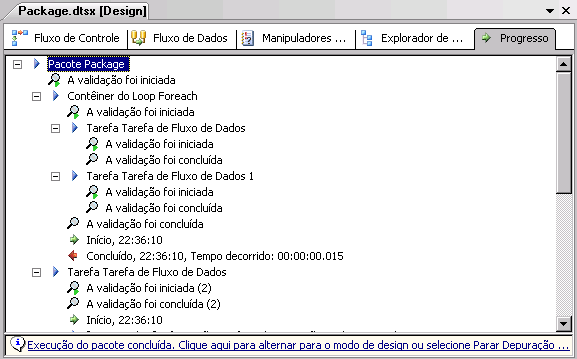

# Depurando o fluxo de controle

[!INCLUDE[ssis-appliesto](../../includes/ssis-appliesto-ssvrpluslinux-asdb-asdw-xxx.md)]

  [!INCLUDE[ssBIDevStudioFull](../../includes/ssbidevstudiofull-md.md)] e o [!INCLUDE[msCoName](../../includes/msconame-md.md)] [!INCLUDE[ssISnoversion](../../includes/ssisnoversion-md.md)] include features e o tools that you can use to troubleshoot the control flow in an [!INCLUDE[ssISnoversion](../../includes/ssisnoversion-md.md)] .  
  
-   [!INCLUDE[ssISnoversion](../../includes/ssisnoversion-md.md)] oferece suporte a pontos de interrupção em contêineres e tarefas.  
  
-   [!INCLUDE[ssIS](../../includes/ssis-md.md)] fornece relatórios de progresso em tempo de execução.  
  
-   [!INCLUDE[ssBIDevStudioFull](../../includes/ssbidevstudiofull-md.md)] fornece janelas de depuração.  
  
## Pontos de interrupção  
 [!INCLUDE[ssIS](../../includes/ssis-md.md)] fornece a caixa de diálogo **Definir Pontos de Interrupção** , na qual você pode definir pontos de interrupção ao habilitar as condições de interrupção e especificando o número de vezes que um ponto de interrupção pode ocorrer antes que a execução do pacote seja anulada. Os pontos de interrupção podem ser habilitados no nível do pacote ou no nível do componente individual. Se as condições da interrupção estiverem habilitadas no nível da tarefa ou contêiner, o ícone do ponto de interrupção aparecerá próximo à tarefa ou contêiner sobre a superfície de design da guia **Fluxo de Controle** . Se as condições de interrupção estiverem habilitadas no pacote, o ícone de ponto de interrupção aparecerá no rótulo da guia **Fluxo de Controle** .  
  
 Quando um ponto de interrupção é atingido, o ícone de ponto de interrupção muda para ajudá-lo a identificar a fonte do ponto de interrupção. Você pode adicionar, excluir e alterar pontos de interrupção quando o pacote estiver executando.  
  
 [!INCLUDE[ssISnoversion](../../includes/ssisnoversion-md.md)] fornece dez pontos de interrupção que você pode habilitar em todas as tarefas e contêineres. Na caixa de diálogo **Definir Pontos de Interrupção** , você pode habilitar os pontos de interrupção das seguintes condições:  
  
|Condição de interrupção|Descrição|  
|---------------------|-----------------|  
|Quando a tarefa ou o contêiner recebe o evento **OnPreExecute** .|Chamado quando uma tarefa está prestes a ser executada. Este evento é criado por uma tarefa ou contêiner imediatamente antes da sua execução.|  
|Quando a tarefa ou o contêiner recebe o evento **OnPostExecute** .|Chamado imediatamente após a execução lógica do término da tarefa. Este evento é criado por uma tarefa ou contêiner imediatamente após sua execução.|  
|Quando a tarefa ou o contêiner recebe o evento **OnError** .|Chamado por uma tarefa ou contêiner quando ocorre um erro.|  
|Quando a tarefa ou o contêiner recebe o evento **OnWarning** .|Chamado quando a tarefa está em um estado que não justifica um erro, mas autoriza uma advertência.|  
|Quando a tarefa ou o contêiner recebe o evento **OnInformation** .|Chamado quando a tarefa é exigida a fornecer informações.|  
|Quando a tarefa ou o contêiner recebe o evento **OnTaskFailed** .|Chamado pelo host de tarefa quando ele falha.|  
|Quando a tarefa ou o contêiner recebe o evento **OnProgress** .|Chamado para atualizar o progresso da execução de tarefa.|  
|Quando a tarefa ou o contêiner recebe o evento **OnQueryCancel** .|Chamado a qualquer momento do processamento da tarefa quando você pode cancelar execução.|  
|Quando a tarefa ou o contêiner recebe o evento **OnVariableValueChanged** .|Chamado pelo tempo de execução [!INCLUDE[ssISnoversion](../../includes/ssisnoversion-md.md)] quando o valor de uma variável muda. O RaiseChangeEvent da variável deve ser definido como **true** para gerar este evento.   **&#42;&#42; Aviso &#42;&#42;** A variável associada a esse ponto de interrupção deve ser definida no escopo de **Contêiner**. Se a variável for definida ao escopo de pacote, o ponto de interrupção não será atingido.|  
|Quando a tarefa ou o contêiner recebe o evento **OnCustomEvent** .|Chamado por tarefas para gerar eventos personalizados definidos por tarefa.|  
  
 Além das condições dos pontos de interrupção disponíveis a todas as tarefas e contêineres, algumas tarefas e contêineres incluem condições especiais de interrupção para definir os pontos de interrupção. Por exemplo, você pode habilitar uma condição de interrupção no contêiner Loop For que defina um ponto de interrupção que suspenda a execução no início de cada iteração do loop.  
  
 Para adicionar flexibilidade e força ao ponto de interrupção, você pode modificar o comportamento de um ponto de interrupção especificando as seguintes condições:  
  
-   A contagem de ocorrência ou o número máximo de vezes que uma condição de interrupção ocorre antes de a execução ser suspensa.  
  
-   O tipo de contagem de ocorrência ou a regra que especifica o momento em que a condição de interrupção aciona o ponto de interrupção.  
  
 Os tipos de contagem de ocorrência, com exceção do tipo Sempre, são sempre qualificados pela contagem de ocorrência. Por exemplo, se o tipo for "Contagem de ocorrências igual a" e a contagem de ocorrência for 5, a execução é suspensa na sexta ocorrência da condição da interrupção.  
  
 A tabela a seguir descreve os tipos de contagem de ocorrência.  
  
|Tipo de contagem de ocorrências|Descrição|  
|--------------------|-----------------|  
|Always|A execução será sempre suspensa quando ocorrer o ponto de interrupção.|  
|Contagem de ocorrências igual a|A execução será suspensa quando o número de vezes que o ponto de interrupção ocorreu for igual à contagem de ocorrências.|  
|Contagem de ocorrências maior que ou igual a|A execução será suspensa quando o número de vezes que o ponto de interrupção ocorreu for igual ou maior que a contagem de ocorrências.|  
|Várias contagens de ocorrências|A execução será suspensa quando ocorrerem várias contagens de ocorrências. Por exemplo, se você definir esta opção como 5, a execução será suspensa a cada quinta vez.|  
  
#### Para definir pontos de interrupção  
  
-   [Depurar um pacote por meio da definição de pontos de interrupção em uma tarefa ou contêiner](#debug)  
  
## Relatório de progresso  
 [!INCLUDE[ssIS](../../includes/ssis-md.md)] O Designer inclui dois tipos de relatórios de progresso: codificação de cores na superfície de design da guia **Fluxo de Controle** e mensagens de progresso na guia **Progresso** .  
  
 Quando você executa um pacote, o Designer [!INCLUDE[ssIS](../../includes/ssis-md.md)] descreve o progresso da execução exibindo cada tarefa ou contêiner usando uma cor que indica o seu status. Você pode identificar pela cor se o elemento está esperando para ser executado, está em execução, terminou com sucesso ou terminou sem-sucesso. Depois que você parar a execução de pacote, a codificação de cor desaparece.  
  
 A tabela a seguir descreve as cores usadas para indicar o estado de execução.  
  
|Color|Status de execução|  
|-----------|----------------------|  
|Cinza|Esperando para executar|  
|Amarelo|Executando|  
|Verde|Executado com sucesso|  
|realçado|Executado com erros|  
  
 A guia **Progresso** exibe as tarefas e contêineres na ordem de execução e inclui os tempos de início e fim, avisos e mensagens de erro. Depois que você parar a execução do pacote, as informações de progresso continuarão disponíveis na guia **Resultados da Execução** .  
  
> [!NOTE]  
>  Para habilitar ou desabilitar a exibição de mensagens na guia **Progresso** , marque ou desmarque a opção **Depurar Relatório do Progresso** no menu **SSIS** .  
  
 O diagrama a seguir mostra a guia **Progresso** .  
  
   
  
## Janelas de depuração  
 [!INCLUDE[ssBIDevStudioFull](../../includes/ssbidevstudiofull-md.md)] inclui muitas janelas que você pode usar para trabalhar com pontos de interrupção e para depurar pacotes contendo pontos de interrupção. Para aprender mais sobre cada janela, abra a janela e, então, pressione F1 para exibir a Ajuda da janela.  
  
 Para abrir essas janelas no [!INCLUDE[ssBIDevStudioFull](../../includes/ssbidevstudiofull-md.md)], clique no menu **Depurar** , aponte para **Janelas**, e, então, clique em **Pontos de Interrupção**, **Saída**ou **Imediato**.  
  
 A tabela a seguir descreve as janelas.  
  
|Janela|Descrição|  
|------------|-----------------|  
|Pontos de interrupção|Exibe os pontos de interrupção em um pacote e fornece opções para habilitar e excluir pontos de interrupção.|  
|Saída|Exibe mensagens de status dos recursos no [!INCLUDE[ssBIDevStudioFull](../../includes/ssbidevstudiofull-md.md)].|  
|Imediato|Usado para depurar e avaliar expressões e imprimir valores variáveis.|  

##  Depurar um pacote por meio da definição de pontos de interrupção em uma tarefa ou contêiner
  Este procedimento descreve como definir pontos de interrupção em um pacote, uma tarefa, um contêiner Loop For, um contêiner Loop Foreach ou um contêiner Sequência.  
  
### Para definir pontos de interrupção em um pacote, uma tarefa ou um contêiner  
  
1.  No [!INCLUDE[ssBIDevStudioFull](../../includes/ssbidevstudiofull-md.md)], abra o projeto do [!INCLUDE[ssISnoversion](../../includes/ssisnoversion-md.md)] que contém o pacote desejado.  
  
2.  Clique duas vezes no pacote em que você deseja definir pontos de interrupção.  
  
3.  No SSIS Designer, siga este procedimento:  
  
    -   Para definir pontos de interrupção no objeto de pacote, clique na guia **Fluxo de Controle** , coloque o cursor em qualquer lugar na tela de fundo da superfície de design e clique com o botão direito do mouse e clique em **Editar Pontos de Interrupção**.  
  
    -   Para definir pontos de interrupção em um fluxo de controle de pacote, clique na guia **Fluxo de Controle** , clique com o botão direito do mouse em uma tarefa, um contêiner Loop For, um contêiner Loop Foreach ou um contêiner Sequência, e clique em **Editar Pontos de Interrupção**.  
  
    -   Para definir pontos de interrupção em um manipulador de eventos, clique na guia **Manipulador de Eventos** , clique com o botão direito do mouse em uma tarefa, um contêiner Loop For, um contêiner Loop Foreach ou um contêiner Sequência e clique em **Editar Pontos de Interrupção**.  
  
4.  Na caixa de diálogo **Definir Pontos de Interrupção de \<container name>**, selecione os pontos de interrupção a serem habilitados.  
  
5.  Opcionalmente, modifique o tipo de contagem de ocorrências e o número de contagem de ocorrências para cada ponto de interrupção.  
  
6.  Para salvar o pacote, clique em **Salvar Itens Selecionados** no menu **Arquivo** .  

## Definir Pontos de Interrupção
  Use a caixa de diálogo **Definir Pontos de Interrupção** para especificar os eventos nos quais habilitar pontos de interrupção e para controlar o comportamento do ponto de interrupção.  
  
### Opções  
 **Enabled**  
 Selecione para habilitar um ponto de interrupção em um evento.  
  
 **Condição de Interrupção**  
 Exiba uma lista de eventos disponíveis nos quais definir pontos de interrupção.  
  
 **Tipo de Contagem de Ocorrências**  
 Especifique quando o ponto de interrupção entra em vigor.  
  
|Valor|Descrição|  
|-----------|-----------------|  
|**Always**|A execução será sempre suspensa quando ocorrer o ponto de interrupção.|  
|**Contagem de ocorrências igual a**|A execução será suspensa quando o número de vezes que o ponto de interrupção ocorreu for igual à contagem de ocorrências.|  
|**Ocorrência maior ou igual**|A execução será suspensa quando o número de vezes que o ponto de interrupção ocorreu for igual ou maior que a contagem de ocorrências.|  
|**Várias contagens de ocorrências**|A execução será suspensa quando ocorrerem várias contagens de ocorrências. Por exemplo, se você definir esta opção como 5, a execução será suspensa a cada quinta vez.|  
  
 **Contagem de Ocorrências**  
 Especifique o número de ocorrências no qual engatilhe uma interrupção. Esta opção não estará disponível se o ponto de interrupção estiver sempre ativado.  
  
## Consulte Também  
 [Ferramentas de solução de problemas para desenvolvimento de pacotes](../../integration-services/troubleshooting/troubleshooting-tools-for-package-development.md)  
 [Depurar um script definindo pontos de interrupção em uma tarefa Script e um componente de Script](../../integration-services/extending-packages-scripting/debug-a-script-by-setting-breakpoints-in-a-script-task-and-script-component.md)   
