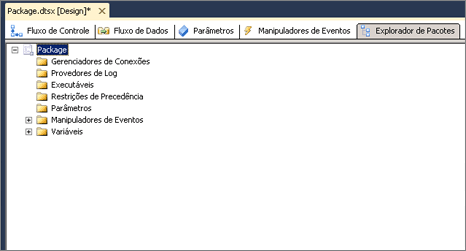

# Exibir objetos do pacote

[!INCLUDE[sqlserver-ssis](../includes/applies-to-version/sqlserver-ssis.md)]

  No Designer do [!INCLUDE[ssIS](../includes/ssis-md.md)] , a guia **Explorador de Pacotes** fornece uma exibição de explorer do pacote. A exibição reflete a hierarquia de contêiner da arquitetura [!INCLUDE[ssISnoversion](../includes/ssisnoversion-md.md)] . O contêiner de pacote está no topo da hierarquia e você expande o pacote para exibir as conexões, executáveis, manipuladores de eventos, provedores de log, restrições de precedência e variáveis no pacote.  
  
 Os executáveis, que são contêineres e tarefas do pacote, podem incluir manipuladores de eventos, restrições de precedência e variáveis. [!INCLUDE[ssISnoversion](../includes/ssisnoversion-md.md)] dá suporte a uma hierarquia de contêineres aninhada, e os contêineres Loop For, Loop Foreach e Sequência podem incluir outros executáveis.  
  
 Se um pacote incluir um fluxo de dados, o **Explorador de Pacotes** listará a tarefa de Fluxo de Dados e incluirá uma pasta **Componentes** que lista os componentes de fluxo de dados.  
  
 Na guia **Explorador de Pacotes** , você pode excluir objetos em um pacote e acessar a janela **Propriedades** para exibir as propriedades do objeto.  
  
 O diagrama a seguir mostra uma exibição de árvore de um pacote simples.  
  
   
  
## Exibir a estrutura e conteúdo do pacote  
  
1.  No [!INCLUDE[ssBIDevStudioFull](../includes/ssbidevstudiofull-md.md)], abra o projeto [!INCLUDE[ssISnoversion](../includes/ssisnoversion-md.md)] que contém o pacote que deseja exibir no **Explorador de Pacotes**.  
  
2.  Clique na guia **Explorador de Pacotes** .  
  
3.  Para exibir o conteúdo de pastas de **Variáveis**, **Restrições de Precedência**, **Manipuladores de Eventos**, **Gerenciadores de Conexões**, **Provedores de Log**, ou **Executáveis** , expanda cada pasta.  
  
4.  Dependendo da estrutura do pacote, expanda as pastas dos níveis seguintes.  
  
## Exibir as propriedades de um objeto de pacote
  
-   Clique com o botão direito do mouse em um objeto e clique em **Propriedades** para abrir a janela **Propriedades** .  
  
## Excluir um objeto em um pacote  
  
-   Clique com o botão direito do mouse em um objeto e clique em **Excluir**. 
 
## Consulte Também  
 [Tarefas do Integration Services](../integration-services/control-flow/integration-services-tasks.md)   
 [Contêineres do Integration Services](../integration-services/control-flow/integration-services-containers.md)   
 [Restrições de precedência](../integration-services/control-flow/precedence-constraints.md)   
 [Variáveis do SSIS &#40;Integration Services&#41;](../integration-services/integration-services-ssis-variables.md)   
 [Manipuladores de eventos do SSIS &#40;Integration Services&#41;](../integration-services/integration-services-ssis-event-handlers.md)   
 [Registro em Log do SSIS &#40;Integration Services&#41;](../integration-services/performance/integration-services-ssis-logging.md)  
  
  
