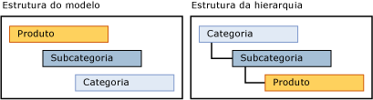

# Hierarquias derivadas (Master Data Services)

[!INCLUDE[appliesto-ss-xxxx-xxxx-xxx-md-winonly](../includes/appliesto-ss-xxxx-xxxx-xxx-md-winonly.md)]

  Uma hierarquia derivada do [!INCLUDE[ssMDSshort](../includes/ssmdsshort-md.md)] é derivada de relações de atributos baseados em domínio que já existem entre entidades em um modelo.  
  
 Você pode criar uma hierarquia derivada para destacar qualquer relação de atributo baseado em domínio existente no modelo.  
  
## Membros folha agrupam outros membros folha  
 Em uma hierarquia derivada, os membros folha de uma entidade são usados para agrupar os membros folha de outra entidade. Uma hierarquia derivada é baseada na relação entre essas entidades. Uma hierarquia explícita, ao contrário, é baseada apenas em membros de uma única entidade e é estruturada de qualquer maneira que você especificar.  
  
 Você pode alterar a estrutura de uma hierarquia derivada sem afetar os dados subjacentes. Contanto que as relações ainda existam no modelo, a exclusão de uma hierarquia derivada não afetará seus dados mestre.  
  
## Hierarquias explícitas versus hierarquias derivadas  
 A tabela a seguir mostra algumas das diferenças entre hierarquias explícitas e derivadas.  
  
> [!NOTE]  
>  As hierarquias explícitas são preteridas nesta versão do [!INCLUDE[ssMDSshort](../includes/ssmdsshort-md.md)].  
  
|Hierarquias explícitas|Hierarquias derivadas|  
|--------------------------|-------------------------|  
|A estrutura é definida pelo usuário|A estrutura é derivada das relações entre atributos baseados em domínio|  
|Contém os membros de uma única entidade|Contém os membros de várias entidades|  
|Usa membros consolidados para agrupar outros membros|Usa membros folha de uma entidade para agrupar membros folha de outra entidade|  
  
## Criando uma hierarquia de profundidade de variável  
 Há duas maneiras recomendadas de criar uma hierarquia de profundidade de variável:  
  
-   Se você precisar que todos os níveis tenham os mesmos atributos, crie uma única entidade e, em seguida, uma hierarquia recursiva nessa entidade usando um atributo de domínio que se baseie na entidade.  
  
-   Se você precisar de um conjunto de atributos para membros folha e outro conjunto de atributos nos níveis superiores, crie duas entidade para uma hierarquia derivada. Para a entidade folha, use um atributo de domínio que se baseie na entidade pai. Para a entidade pai, use um atributo de domínio que se baseie em si mesmo.  
  
## Exemplo de hierarquia derivada  
 No exemplo a seguir, os membros folha da entidade Product são agrupados por membros folha da entidade Subcategory, que são então agrupados por membros folha da entidade Category. Esta hierarquia é possível porque a entidade Product tem um atributo baseado em domínio denominado Subcategory, e a entidade Subcategory tem um atributo baseado em domínio denominado Category.  
  
 A estrutura de hierarquia mostra como os membros são agrupados. A entidade com a maioria dos membros está na parte inferior.  
  
   
  
 Em uma hierarquia derivada, você pode realçar a relação entre Product e Subcategory, e depois entre Subcategory e Category. Quando você exibir os membros desta hierarquia, cada nível da árvore conterá membros da mesma entidade.  
  
   
  
 Este tipo de hierarquia impede que você mova um membro para um nível que não é válido. Por exemplo, você pode mover a Road-650 bike de uma subcategoria, Road Bikes, para outra, Mountain Bikes. Você não pode mover Road-650 diretamente abaixo de uma categoria, como 1 {Bikes}. Cada vez que você move um membro na árvore hierárquica, o valor de atributo baseado em domínio do membro muda para refletir a mudança.  
  
## Observações  
 Todos os membros em uma árvore hierárquica derivada são classificados por ID. Você não pode alterar a ordem de classificação.  
  
 Se o atributo baseado em domínio de um membro estiver em branco e o atributo for usado para uma hierarquia derivada, o membro não será exibido na hierarquia. Crie regras de negócios para exigir o preenchimento de atributos. Para obter mais informações, consulte [Exigir valores de atributos &#40;Master Data Services&#41;](../master-data-services/require-attribute-values-master-data-services.md).  
  
## Related Tasks  
  
|Descrição da tarefa|Tópico|  
|----------------------|-----------|  
|Criar uma nova hierarquia derivada.|[Criar uma hierarquia derivada &#40;Master Data Services&#41;](../master-data-services/create-a-derived-hierarchy-master-data-services.md)|  
|Ocultar ou excluir níveis em uma hierarquia derivada existente.|[Ocultar ou excluir níveis em uma hierarquia derivada &#40;Master Data Services&#41;](../master-data-services/hide-or-delete-levels-in-a-derived-hierarchy-master-data-services.md)|  
|Alterar o nome de uma hierarquia derivada existente.|[Alterar o nome de uma hierarquia derivada &#40;Master Data Services&#41;](../master-data-services/change-a-derived-hierarchy-name-master-data-services.md)|  
|Excluir uma hierarquia derivada existente.|[Excluir uma hierarquia derivada &#40;Master Data Services&#41;](../master-data-services/delete-a-derived-hierarchy-master-data-services.md)|  
  
## Conteúdo relacionado  
  
-   [Atributos baseados em domínio &#40;Master Data Services&#41;](../master-data-services/domain-based-attributes-master-data-services.md)  
  
-   [Hierarquias explícitas &#40;Master Data Services&#41;](../master-data-services/explicit-hierarchies-master-data-services.md)  
  
-   [Hierarquias recursivas &#40;Master Data Services&#41;](../master-data-services/recursive-hierarchies-master-data-services.md)  
  
-   [Hierarquias derivadas com limites explícitos &#40;Master Data Services&#41;](../master-data-services/derived-hierarchies-with-explicit-caps-master-data-services.md)  
  
-   [Mostrar relações muitos para muitos em Hierarquias Derivadas &#40;Master Data Services&#41;](../master-data-services/show-many-to-many-relationships-in-derived-hierarchies-master-data-services.md)  
  
-   [Coleções &#40;Master Data Services&#41;](../master-data-services/collections-master-data-services.md)  
  
  
