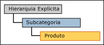
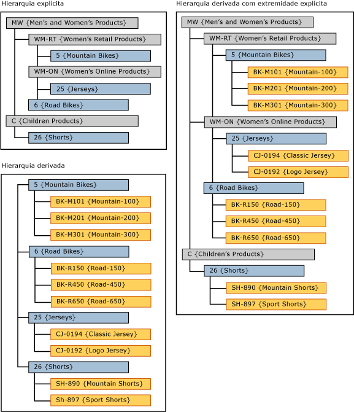

# Hierarquias derivadas com nível superior (Master Data Services)

[!INCLUDE[appliesto-ss-xxxx-xxxx-xxx-md-winonly](../includes/appliesto-ss-xxxx-xxxx-xxx-md-winonly.md)]

  No [!INCLUDE[ssMDSshort](../includes/ssmdsshort-md.md)], quando os níveis de uma hierarquia explícita são usados como os níveis mais altos de uma hierarquia derivada, isso é chamado de hierarquia derivada com níveis superiores.  
  
 A hierarquia explícita deve ser baseada na mesma entidade que a entidade do alto da hierarquia derivada.  
  
 Na interface do usuário do [!INCLUDE[ssMDSmdm](../includes/ssmdsmdm-md.md)] , é possível criar este tipo de hierarquia arrastando uma hierarquia explícita até a parte superior de uma hierarquia derivada.  
  
   
  
## Hierarquia derivada com exemplo de extremidade explícita  
 Neste exemplo, os membros na hierarquia explícita são da entidade Subcategoria. Na hierarquia derivada, os membros da hierarquia de nível superior também são da entidade Subcategoria.  
  
   
  
 Ao usar a hierarquia explícita na parte superior de uma hierarquia derivada, a hierarquia derivada torna-se irregular.  
  
## Regras  
  
-   Você não pode ter mais de uma hierarquia explícita em uma hierarquia derivada com nível superior.  
  
-   Você pode usar a mesma hierarquia explícita como um nível superior para várias hierarquias derivadas.  
  
-   Você não pode atribuir permissões de membro de hierarquia a hierarquias derivadas com níveis superiores. Se você atribuir permissões individualmente à hierarquia explícita ou à hierarquia derivada, as permissões afetarão ambas as hierarquias.  
  
## Tarefas relacionadas  
  
|Descrição da tarefa|Tópico|  
|----------------------|-----------|  
|Criar uma hierarquia derivada.|[Criar uma hierarquia derivada &#40;Master Data Services&#41;](../master-data-services/create-a-derived-hierarchy-master-data-services.md)|  
|Criar uma hierarquia explícita.|[Criar uma hierarquia explícita &#40;Master Data Services&#41;](../master-data-services/create-an-explicit-hierarchy-master-data-services.md)|  
|Excluir uma hierarquia derivada existente.|[Excluir uma hierarquia derivada &#40;Master Data Services&#41;](../master-data-services/delete-a-derived-hierarchy-master-data-services.md)|  
|||  
  
## Conteúdo relacionado  
  
-   [Hierarquias derivadas &#40;Master Data Services&#41;](../master-data-services/derived-hierarchies-master-data-services.md)  
  
-   [Hierarquias explícitas &#40;Master Data Services&#41;](../master-data-services/explicit-hierarchies-master-data-services.md)  
  
  
