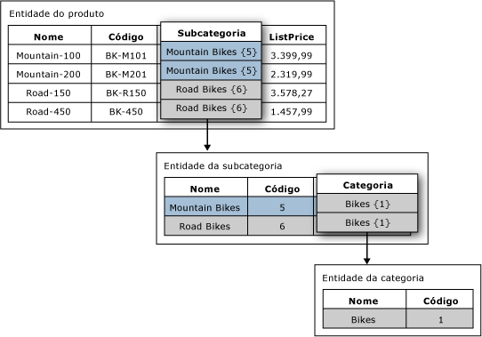

# Atributos baseados em domínio (Master Data Services)
  No [!INCLUDE[ssMDSshort](../includes/ssmdsshort-md.md)], um atributo baseado em domínio é um atributo com valores que são preenchidos por membros de outra entidade. Você pode pensar em um atributo baseado em domínio como uma lista restrita; atributos baseados em domínio impedem os usuários de inserir valores de atributo que não são válidos. Para selecionar um valor de atributo, o usuário deve escolher as opções de uma lista.  
  
## Exemplo de atributo baseado em domínio  
 Na imagem a seguir, a entidade Product possui um atributo baseado em domínio chamado Subcategory. O atributo Subcategory é preenchido com os valores da entidade Subcategory.  
  
 A entidade Subcategory possui um atributo baseado em domínio chamado Category. O atributo Category é preenchido com os valores da entidade Category.  
  
   
  
## Usar a mesma entidade para vários atributos baseados em domínio  
 Você pode usar a mesma entidade como um atributo baseado em domínio de várias entidades. Por exemplo, você pode criar uma entidade chamada YesNoIndicator com os membros Sim, Não e Talvez. Você pode criar um atributo baseado em domínio chamado InStock e usar a entidade YesNoIndicator como origem. Você também pode criar outro atributo baseado em domínio chamado Approved e usar a entidade YesNoIndicator como uma origem. Sempre que quiser que os usuários escolham as opções de uma lista dos membros da entidade YesNoIndicator, você pode usar a entidade como atributo com base em domínio.  
  
## Atributos baseados em domínio formam hierarquias derivadas  
 As relações de atributos baseados em domínio são a base das hierarquias derivadas. Para obter mais informações, consulte [Hierarquias derivadas &#40;Master Data Services&#41;](../master-data-services/derived-hierarchies-master-data-services.md).  
  
## Tarefas relacionadas  
  
|Descrição da tarefa|Tópico|  
|----------------------|-----------|  
|Criar um novo atributo baseado em domínio que é originado de uma entidade existente.|[Criar um atributo baseado em domínio &#40;Master Data Services&#41;](../master-data-services/create-a-domain-based-attribute-master-data-services.md)|  
|Criar uma nova entidade.|[Criar uma entidade &#40;Master Data Services&#41;](../master-data-services/create-an-entity-master-data-services.md)|  
  
## Conteúdo relacionado  
  
-   [Hierarquias derivadas &#40;Master Data Services&#41;](../master-data-services/derived-hierarchies-master-data-services.md)  
  
-   [Atributos &#40;Master Data Services&#41;](../master-data-services/attributes-master-data-services.md)  
  
-   [Entidades &#40;Master Data Services&#41;](../master-data-services/entities-master-data-services.md)  
  
  

