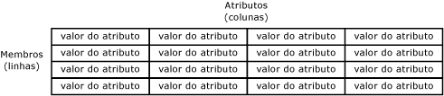
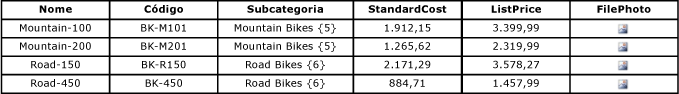
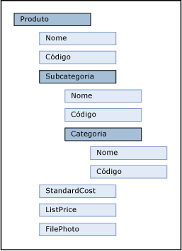

# Entidades (Master Data Services)

[!INCLUDE[appliesto-ss-xxxx-xxxx-xxx-md-winonly](../includes/appliesto-ss-xxxx-xxxx-xxx-md-winonly.md)]

  Entidades são objetos contidos em modelos do [!INCLUDE[ssMDSshort](../includes/ssmdsshort-md.md)] . Cada entidade contém membros, que são as linhas de dados mestre que você gerencia.  
  
## Quantas entidades são adequadas?  
 Os modelos podem conter tantas entidades quantas você deseja gerenciar. Cada entidade deve agrupar um tipo semelhante de dados. Por exemplo, você pode desejar uma entidade para todas as suas contas corporativas ou uma entidade para sua lista mestre de funcionários.  
  
 Normalmente, há uma ou mais entidades centrais que são importantes para seus negócios e para as quais outros objetos do modelo estão relacionados. Por exemplo, em um modelo Product, você pode ter uma entidade central chamada Product e entidades chamadas Subcategory e Category para a entidade Product. No entanto, você não precisa ter uma entidade central. Dependendo de suas necessidades, você pode ter várias entidades que você considera serem da mesma importância.  
  
## Como as entidades se relacionam com outros objetos modelo  
 Você pode pensar em uma entidade como uma tabela que contém dados mestre, onde as linhas representam os membros, e as colunas representam atributos.  
  
   
  
 Você popula a entidade com uma lista de dados mestre que você deseja gerenciar.  
  
 As entidades podem ser usadas para compilar hierarquias derivadas, que são hierarquias baseadas em níveis com base em várias entidades. Para obter mais informações, consulte [Hierarquias derivadas &#40;Master Data Services&#41;](../master-data-services/derived-hierarchies-master-data-services.md).  
  
 As entidades também podem ser habilitadas para conter hierarquias explícitas (estruturas irregulares baseadas em uma única entidade) e coleções (combinações exclusivas de subconjuntos de membros). Para obter mais informações, consulte [Hierarquias explícitas &#40;Master Data Services&#41;](../master-data-services/explicit-hierarchies-master-data-services.md) e [Coleções &#40;Master Data Services&#41;](../master-data-services/collections-master-data-services.md).  
  
## Usando entidades como listas restritas  
 Quando os usuários estiverem atribuindo atributos aos membros de uma entidade, você pode fazer com que eles escolham de uma lista de valores restrita. Para fazer isso, você usa uma entidade para popular a lista de valores do atributo. Isso é chamado de atributo baseado em domínio. Para obter mais informações, consulte [Atributos baseados em domínio &#40;Master Data Services&#41;](../master-data-services/domain-based-attributes-master-data-services.md).  
  
## Entidades base  
 Uma entidade base é um ponto de partida para usuários ao navegar objetos no modelo. Uma entidade base determina o layout da tela quando um usuário abre a área funcional **Gerenciador** e clica na barra de menus do **Gerenciador** . Para especificar uma entidade como uma entidade base, vá para a área funcional **Administração do Sistema** . Na página **Exibição de Modelo** , arraste a entidade do controle de árvore à direita até o nome do modelo no controle de árvore à esquerda.  
  
## Segurança de entidade  
 Você pode dar permissão para uma entidade a usuários, o que inclui objetos de modelo relacionados. Para obter mais informações, consulte [Permissões de entidade &#40;Master Data Services&#41;](../master-data-services/entity-permissions-master-data-services.md).  
  
## Exemplo de entidades  
 O exemplo a seguir, mostra uma entidade que tem estes atributos: Name, Code, Subcategory, StandardCost, ListPrice e FilePhoto. Esses atributos descrevem os membros, Cada membro é representado por uma única linha de valores de atributo.  
  
   
  
 No exemplo a seguir, a entidade Product é a entidade central. A entidade Subcategory é um atributo baseado em domínio da entidade Product. A entidade Category é um atributo baseado em domínio da entidade Subcategory. StandardCost e ListPrice são atributos de forma livre e FilePhoto é um atributo de arquivo da entidade Product.  
  
   
  
> [!NOTE]  
>  Esse é um exemplo baseado na interface do usuário do [!INCLUDE[ssMDSmdm](../includes/ssmdsmdm-md.md)] . A estrutura de árvore hierárquica mostra relações entre entidades e atributos baseados em domínio. O exemplo tem o objetivo de mostrar relações e não de representar níveis de importância.  
  
## Related Tasks  
  
|Descrição da tarefa|Tópico|  
|----------------------|-----------|  
|Criar uma nova entidade.|[Criar uma entidade &#40;Master Data Services&#41;](../master-data-services/create-an-entity-master-data-services.md)|  
|Alterar o nome de uma entidade existente.|[Editar uma entidade &#40;Master Data Services&#41;](../master-data-services/edit-an-entity-master-data-services.md)|  
|Excluir uma entidade existente.|[Excluir uma entidade &#40;Master Data Services&#41;](../master-data-services/delete-an-entity-master-data-services.md)|  
|Atribuir permissão para entidades.|[Atribuir permissões de objeto de modelo &#40;Master Data Services&#41;](../master-data-services/assign-model-object-permissions-master-data-services.md)|  
  
## Conteúdo relacionado  
  
-   [Modelos &#40;Master Data Services&#41;](../master-data-services/models-master-data-services.md)  
  
-   [Membros &#40;Master Data Services&#41;](../master-data-services/members-master-data-services.md)  
  
-   [Atributos &#40;Master Data Services&#41;](../master-data-services/attributes-master-data-services.md)  
  
  
