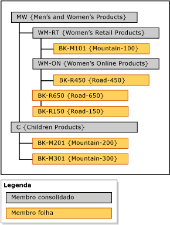

# Hierarquias expl&#237;citas (Master Data Services)
  No [!INCLUDE[ssMDSshort](../includes/ssmdsshort-md.md)], uma hierarquia explícita organiza os membros de uma única entidade de qualquer maneira que você especifique. A estrutura pode ser desbalanceada e, ao contrário de hierarquias derivadas, hierarquias explícitas não são baseadas em relações de atributos baseadas em domínio.  
  
> [!NOTE]  
>  A hierarquia explícita foi preterida.  
  
## Membros consolidados agrupam outros membros  
 Uma hierarquia explícita usa membros consolidados que você cria com o objetivo de agrupar outros membros. Esses membros consolidados podem pertencer somente a uma hierarquia explícita por vez. Uma hierarquia explícita também inclui todos os membros folha da entidade associada.  
  
 Uma hierarquia explícita pode ser imperfeita, o que significa que a hierarquia pode terminar simultaneamente em níveis diferentes. Cada membro consolidado pode ter um número ilimitado de membros consolidados e membros folha sob ele ou pode não ter nenhum. Os membros folha podem estar sob um único membro consolidado ou sob vários níveis de membros consolidados.  
  
> [!NOTE]  
>  Antes de você criar uma hierarquia explícita, a entidade deve estar habilitada para hierarquias explícitas.  
  
## Tipos de hierarquias explícitas  
 Há dois tipos de hierarquias explícitas: obrigatória e não obrigatória.  
  
### Hierarquia explícita obrigatória  
 Uma hierarquia explícita obrigatória é uma hierarquia na qual todos os membros folha devem ser incluídos na árvore hierárquica. Por padrão, todos os membros são incluídos na raiz da árvore. Você pode reorganizar os membros conforme o necessário.  
  
### Hierarquia explícita não obrigatória  
 Uma hierarquia explícita não obrigatória é uma hierarquia em que todos os membros folha se encontram em um nó **Não Utilizado** criado pelo sistema. Você pode mover os membros para fora desse nó, conforme necessário. O restante dos membros pode permanecer no nó **Não Utilizado**.  
  
 Quando você usar hierarquias explícitas não obrigatórias, qualquer relatório ou análise feita na hierarquia talvez não corresponda ao relatório ou à análise feita em hierarquias obrigatórias.  
  
## Regras  
 As regras a seguir se aplicam a hierarquias explícitas (obrigatórias e não obrigatórias).  
  
-   Cada membro folha só pode ser incluído uma vez na hierarquia.  
  
-   Todos os membros consolidados devem ser incluídos em uma hierarquia.  
  
-   Os membros consolidados não podem estar em mais de uma hierarquia explícita.  
  
-   Os membros consolidados na árvore hierárquica não têm de conter membros folha sob eles.  
  
-   Se você excluir uma hierarquia explícita, todos os membros consolidados que foram usados na hierarquia serão excluídos.  
  
-   Se você excluir um membro consolidado que estava em uma hierarquia explícita, todos os membros folha que foram agrupados por esse membro consolidado serão movidos para a raiz.  
  
## Hierarquias explícitas versus hierarquias derivadas  
 A tabela a seguir mostra algumas das diferenças entre hierarquias explícitas e derivadas.  
  
|Hierarquias explícitas|Hierarquias derivadas|  
|--------------------------|-------------------------|  
|A estrutura é definida pelo usuário|A estrutura é derivada das relações entre atributos baseados em domínio|  
|Contém os membros de uma única entidade|Contém os membros de várias entidades|  
|Usa membros consolidados para agrupar outros membros|Usa membros folha de uma entidade para agrupar membros folha de outra entidade|  
|Pode ser irregular|Sempre contém um número consistente de níveis|  
  
## Exemplo de hierarquia explícita  
 No exemplo a seguir, a entidade Produto contém estes membros folha: BK-M101 {Mountain-100}, BK-M201 {Mountain-200}, BK-M301 {Mountain-300}, BK-R150 {Road-150}, BK-R450 {Road-450} e BK-R650 {Road-650}.  
  
 Para resumir esses membros folha a pontos de consolidação específicos, você pode criar membros consolidados na entidade Produto. Insira os membros consolidados em níveis na árvore hierárquica em que você deseja resumir os membros folha. Não há nenhuma limitação em relação a onde você insere seus membros consolidados; no entanto, cada membro (folha ou consolidado) só pode ser usado uma vez.  
  
   
  
 Membros consolidados podem ser usados para agrupar membros em qualquer nível, e membros folha e membros consolidados são classificados na ordem que você determinar.  
  
## Tarefas relacionadas  
  
|Descrição da tarefa|Tópico|  
|----------------------|-----------|  
|Criar uma nova hierarquia.|[Criar uma hierarquia explícita &#40;Master Data Services&#41;](../master-data-services/create-an-explicit-hierarchy-master-data-services.md)|  
|Alterar o nome de uma hierarquia explícita existente.|[Alterar o nome de uma hierarquia explícita &#40;Master Data Services&#41;](../master-data-services/change-an-explicit-hierarchy-name-master-data-services.md)|  
|Excluir uma hierarquia explícita existente.|[Excluir uma hierarquia explícita &#40;Master Data Services&#41;](../master-data-services/delete-an-explicit-hierarchy-master-data-services.md)|  
|||  
  
## Conteúdo relacionado  
  
-   [Hierarquias derivadas &#40;Master Data Services&#41;](../master-data-services/derived-hierarchies-master-data-services.md)  
  
-   [Coleções &#40;Master Data Services&#41;](../master-data-services/collections-master-data-services.md)  
  
  