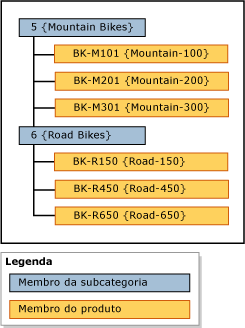

# Hierarquias (Master Data Services)

[!INCLUDE[appliesto-ss-xxxx-xxxx-xxx-md-winonly](../includes/appliesto-ss-xxxx-xxxx-xxx-md-winonly.md)]

  No [!INCLUDE[ssMDSshort](../includes/ssmdsshort-md.md)], uma hierarquia é uma estrutura de árvore que você pode usar para:  
  
-   Agrupar membros semelhantes para fins organizacionais.  
  
-   Consolidar e resumir membros para relatório e análise.  
  
## O que as hierarquias contêm  
 Cada hierarquia contém os membros de uma ou mais entidades. Quando um membro é adicionado, alterado ou excluído, todas as hierarquias são atualizadas. Isso assegura que os dados sejam precisos em todas as hierarquias. As hierarquias também ajudam a garantir que cada membro é contado apenas uma vez.  
  
 Se você quiser criar um agrupamento de um subconjunto de membros, use uma coleção. Para obter mais informações, consulte [Coleções &#40;Master Data Services&#41;](../master-data-services/collections-master-data-services.md).  
  
## Tipos de hierarquia  
 Você pode criar várias hierarquias para exibir e organizar seus membros de formas diferentes. Você pode criar:  
  
-   Hierarquias desbalanceadas de uma única entidade, que são chamadas de hierarquias explícitas. Para obter mais informações, consulte [Hierarquias explícitas &#40;Master Data Services&#41;](../master-data-services/explicit-hierarchies-master-data-services.md).  
  
-   Hierarquias baseadas em nível de várias entidades, com base nas relações existentes entre as entidades e seus atributos, que são chamadas de hierarquias derivadas. Para obter mais informações, consulte [Hierarquias derivadas &#40;Master Data Services&#41;](../master-data-services/derived-hierarchies-master-data-services.md).  
  
> [!NOTE]  
>  Todos os membros em uma hierarquia devem estar dentro do mesmo modelo.  
  
## Hierarquias não são taxonomias  
 Uma hierarquia é diferente de uma taxonomia. Uma taxonomia organiza os membros por vários atributos ao mesmo tempo, enquanto uma hierarquia organiza os membros por um atributo de cada vez. Uma taxonomia pode incluir o mesmo membro várias vezes, enquanto uma hierarquia inclui um membro somente uma vez.  
  
 Por exemplo, a mesma bicicleta pode ser incluída duas vezes em uma taxonomia: uma vez porque é vermelha e uma vez porque é tamanho 38. Em uma hierarquia, a bicicleta é incluída apenas uma vez, de modo que você deve decidir se deseja mostrá-la em relação à cor ou ao tamanho.  
  
## Exemplo de hierarquia  
 No exemplo a seguir, os membros de produto são agrupados por membros de subcategoria.  
  
   
  
## Related Tasks  
  
|Descrição da tarefa|Tópico|  
|----------------------|-----------|  
|Criar uma hierarquia explícita.|[Criar uma hierarquia explícita &#40;Master Data Services&#41;](../master-data-services/create-an-explicit-hierarchy-master-data-services.md)|  
|Criar uma hierarquia derivada.|[Criar uma hierarquia derivada &#40;Master Data Services&#41;](../master-data-services/create-a-derived-hierarchy-master-data-services.md)|  
|Ocultar ou excluir níveis em uma hierarquia derivada existente.|[Ocultar ou excluir níveis em uma hierarquia derivada &#40;Master Data Services&#41;](../master-data-services/hide-or-delete-levels-in-a-derived-hierarchy-master-data-services.md)|  
  
## Conteúdo relacionado  
  
-   [Hierarquias explícitas &#40;Master Data Services&#41;](../master-data-services/explicit-hierarchies-master-data-services.md)  
  
-   [Hierarquias derivadas &#40;Master Data Services&#41;](../master-data-services/derived-hierarchies-master-data-services.md)  
  
-   [Hierarquias recursivas &#40;Master Data Services&#41;](../master-data-services/recursive-hierarchies-master-data-services.md)  
  
-   [Hierarquias derivadas com limites explícitos &#40;Master Data Services&#41;](../master-data-services/derived-hierarchies-with-explicit-caps-master-data-services.md)  
  
-   [Coleções &#40;Master Data Services&#41;](../master-data-services/collections-master-data-services.md)  
  
  
