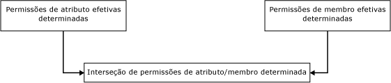
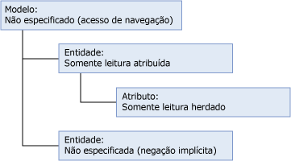
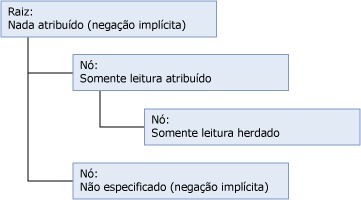
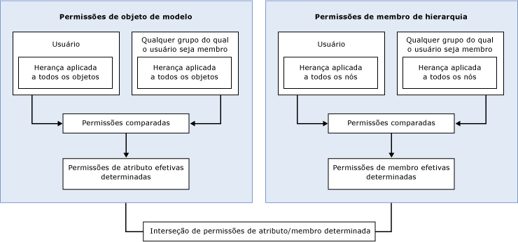

# Como as permissões são determinadas (Master Data Services)
  No [!INCLUDE[ssMDSshort](../includes/ssmdsshort-md.md)], a maneira mais simples de configurar a segurança é atribuir permissões de objeto modelo a um grupo do qual o usuário é membro.  
  
 A segurança se torna mais complexa quando:  
  
-   As permissões de objeto modelo e de membro da hierarquia são atribuídas.  
  
-   O usuário pertence a grupos e a permissão é atribuída ao usuário e aos grupos.  
  
-   O usuário pertence a grupos e a permissão é atribuída a vários grupos.  
  
## Permissões atribuídas a um único grupo ou usuário  
 Se você atribuir permissões a um único grupo ou usuário, as permissões serão determinadas com base no seguinte fluxo de trabalho.  
  
   
  
### Etapa 1: permissões de atributo efetivas são determinadas.  
 A lista a seguir descreve como as permissões de atributo efetivas são determinadas:  
  
-   As permissões atribuídas a objetos modelo determinam quais atributos um usuário pode acessar.  
  
-   Todos os objetos modelo herdam automaticamente a permissão do objeto mais próximo em um nível alto da estrutura do modelo.  
  
-   Qualquer objeto no mesmo nível da entidade é negado implicitamente.  
  
-   Quaisquer objetos em um nível superior recebem a Leitura Inferida. Para obter mais informações sobre a Leitura Inferida, consulte [Acesso de navegação &#40;Master Data Services&#41;](../master-data-services/navigational-access-master-data-services.md).  
  
 Neste exemplo, a permissão **Leitura** é atribuída a uma entidade e essa permissão é herdada por seu atributo, que está em um nível inferior na estrutura modelo. O modelo fornece a Leitura Inferida a essa entidade e seu atributo. A outra entidade no modelo não tem nenhuma permissão explícita atribuída e não herda nenhuma permissão, portanto, é negada implicitamente.  
  
   
  
### Etapa 2: se permissões de membro de hierarquia forem atribuídas, as permissões de membro efetivas serão determinadas.  
 A lista a seguir descreve como as permissões de membro da hierarquia efetivas são determinadas:  
  
-   As permissões atribuídas a nós da hierarquia determinam quais membros um usuário pode acessar.  
  
-   Todos os nós de uma hierarquia herdam automaticamente a permissão do objeto mais próximo em um nível alto da estrutura da hierarquia.  
  
-   Qualquer nó no mesmo nível é negado implicitamente.  
  
-   Qualquer nó em níveis mais altos que não tenha permissões atribuídas é negado implicitamente.  
  
 Neste exemplo, a permissão **Leitura** é atribuída a um nó da hierarquia e essa permissão é herdada por um nó em um nível mais baixo na estrutura da hierarquia. A raiz não tem nenhuma permissão atribuída, portanto é negada implicitamente. O outro nó na estrutura da hierarquia não tem nenhuma permissão explícita atribuída e não herda nenhuma permissão, portanto, é negado implicitamente.  
  
   
  
### Etapa 3: a interseção de permissões de atributo e de membro é determinada.  
 Se as permissões de atributo efetivas forem diferentes das permissões de membro efetivas, as permissões deverão ser determinadas para cada valor de atributo individual. Para obter mais informações, consulte [Sobrepondo permissões de modelo e membro &#40;Master Data Services&#41;](../master-data-services/overlapping-model-and-member-permissions-master-data-services.md).  
  
## Permissões atribuídas a vários grupos  
 Se um usuário pertencer a um ou mais grupos e as permissões forem atribuídas ao usuário e aos grupos, o fluxo de trabalho se tornará mais complexo.  
  
   
  
 Nesse caso, a sobreposição das permissões do usuário e do grupo deve ser resolvida antes das permissões do objeto modelo e do membro da hierarquia poderem ser comparadas. Para obter mais informações, consulte [Sobrepondo permissões de usuário e grupo &#40;Master Data Services&#41;](../master-data-services/overlapping-user-and-group-permissions-master-data-services.md).  
  
## Consulte também  
 [Sobrepondo permissões de usuário e grupo &#40;Master Data Services&#41;](../master-data-services/overlapping-user-and-group-permissions-master-data-services.md)   
 [Sobrepondo permissões de modelo e membro &#40;Master Data Services&#41;](../master-data-services/overlapping-model-and-member-permissions-master-data-services.md)  
  
  
