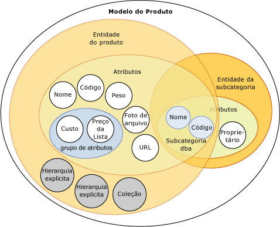
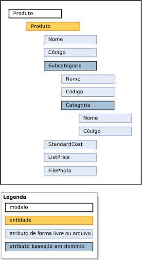

# Modelos (Master Data Services)

[!INCLUDE [SQL Server - Windows only ASDBMI  ](../includes/applies-to-version/sql-windows-only-asdbmi.md)]

  Modelos são o nível mais alto da organização de dados no [!INCLUDE[ssMDSshort](../includes/ssmdsshort-md.md)]. Um modelo define a estrutura de dados em sua solução de gerenciamento de dados mestre. Um modelo contém os seguintes objetos:  
  
-   Entidades  
  
-   Atributos e grupos de atributos  
  
-   Hierarquias derivadas e explícitas  
  
-   Coleções  
  
 Os modelos organizam a estrutura de seus dados mestre. Sua implementação [!INCLUDE[ssMDSshort](../includes/ssmdsshort-md.md)] pode ter um ou vários modelos nos quais cada um agrupa tipos semelhantes de dados. No geral, os dados mestres podem ser categorizados de uma das quatro maneiras: pessoas, locais, coisas ou conceitos. Por exemplo, você pode criar um modelo Product para conter dados relativos aos produtos ou um modelo Customer para conter dados relativos aos clientes.  
  
 Você pode atribuir aos usuários e grupos permissão para exibir e atualizar objetos dentro do modelo. Se você não der permissão ao modelo, ele não será exibido.  
  
 A qualquer momento, você pode criar cópias dos dados mestre dentro de um modelo. Essas cópias são chamadas de versões.  
  
 Quando você define um modelo em um ambiente de teste, pode implantá-lo, com ou sem os dados correspondentes, do ambiente de teste para um ambiente de produção. Isso elimina a necessidade de recriar seus modelos em seu ambiente de produção.  
  
## Como os modelos se relacionam com outros objetos  
 Um modelo contém entidades. Entidades contêm atributos, hierarquias explícitas e coleções. Atributos podem ser contidos em grupos de atributos. Atributos baseados em domínio existem quando uma entidade é usada como um atributo para outra entidade.  
  
 Esta imagem mostra as relações entre os objetos em um modelo.  
  
   
  
> [!NOTE]  
>  As hierarquias derivadas também são objetos de modelo, mas elas não são mostradas na imagem. As hierarquias derivadas são derivadas de relações de atributos baseados em domínio que existem entre entidades. Consulte [Hierarquias derivadas &#40;Master Data Services&#41;](../master-data-services/derived-hierarchies-master-data-services.md) para obter mais informações.  
  
 Os dados mestres são os dados contidos nos objetos de modelo. No [!INCLUDE[ssMDSshort](../includes/ssmdsshort-md.md)], os dados mestres são armazenados como membros em uma entidade.  
  
 Objetos de modelo são mantidos na área funcional **Administração do Sistema** da interface de usuário do [!INCLUDE[ssMDSmdm](../includes/ssmdsmdm-md.md)] .  
  
## Exemplo de modelo  
 No exemplo a seguir, os objetos no modelo Product agrupam logicamente os dados relativos aos produtos.  
  
   
  
 Outros modelos comuns são:  
  
-   Contas, que podem incluir entidades tais como contas de demonstração financeira, contas de demonstrativo de renda, estatísticas e tipo de conta.  
  
-   Cliente, que pode incluir entidades tais como gênero, educação, ocupação e estado civil.  
  
-   Geografia, que pode incluir entidades tais como códigos postais, cidades, municípios, estados, províncias, regiões, territórios, países e continentes.  
  
## Related Tasks  
  
|Descrição da tarefa|Tópico|  
|----------------------|-----------|  
|Criar um modelo para organizar seus dados mestre.|[Criar um modelo &#40;Master Data Services&#41;](../master-data-services/create-a-model-master-data-services.md)|  
|Alterar o nome de um modelo existente.|[Editar Modelo &#40;Master Data Services&#41;](../master-data-services/edit-model-master-data-services.md)|  
|Excluir um modelo existente.|[Excluir um modelo &#40;Master Data Services&#41;](../master-data-services/delete-a-model-master-data-services.md)|  
  
## Conteúdo relacionado  
  
-   [Visão geral do Master Data Services &#40;MDS&#41;](../master-data-services/master-data-services-overview-mds.md)  
  
-   [Entidades &#40;Master Data Services&#41;](../master-data-services/entities-master-data-services.md)  
  
-   [Atributos &#40;Master Data Services&#41;](../master-data-services/attributes-master-data-services.md)  
  
-   [Implantando modelos &#40;Master Data Services&#41;](../master-data-services/deploying-models-master-data-services.md)  
  
-   [Permissões de objeto de modelo &#40;Master Data Services&#41;](../master-data-services/model-object-permissions-master-data-services.md)  
  
  
