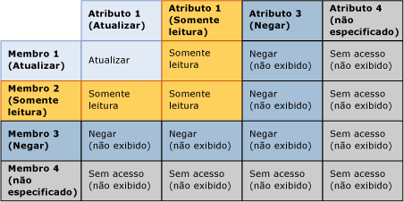
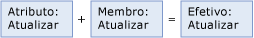
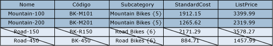
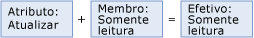
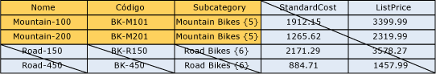
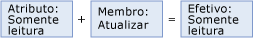

# Sobrepondo permiss&#245;es de modelo e membro (Servi&#231;os de Dados Mestre)
  A permissão atribuída a um membro pode sobrepor a permissão atribuída a um objeto de modelo. Quando ocorrem sobreposições, a permissão mais restritiva tem efeito.  
  
 Se um membro tiver uma permissão que seja diferente daquela correspondente ao objeto de modelo, as seguintes regras se aplicarão:  
  
-   **Negar** substitui todas as outras permissões.  
  
-   **Admin** permissão no nível do modelo substitui todas as outras permissões e é alterado para permissão de acesso de todos os (CRUD) nos níveis de sub.  
  
-   A permissão de acesso efetiva cruza as permissões dos membros e dos atributos.  
  
     Por exemplo, se as permissões do membro incluírem **Criar** e **Atualizar**, a permissão dos atributos será **Atualizar**. A permissão efetiva será **Atualizar**.  
  
 A imagem a seguir mostra quais permissões entram em vigor em um valor de atributo individual quando as permissões de atributo são diferentes das permissões de membro.  
  
   
  
## Exemplo 1  
   
  
 Na guia **Modelos** , a entidade Produto tem a permissão **Atualizar** atribuída. Todos os atributos da entidade herdam essa permissão.  
  
 Na guia **Membros da Hierarquia** , o nó da subcategoria Mountain Bikes em uma hierarquia derivada tem a permissão **Atualizar** atribuída.  
  
 Resultado: no **Explorer**, o usuário tem a permissão **Atualizar** para todos os valores do atributo para todos os membros do nó Mountain Bikes. Todos os outros membros e atributos estão ocultados.  
  
   
  
## Exemplo 2  
   
  
 Na guia **Modelos** , o atributo Subcategory tem a permissão **Atualizar** atribuída.  
  
 Na guia **Membros da Hierarquia** , o nó da subcategoria Mountain Bikes em uma hierarquia derivada recebe explicitamente a permissão **Leitura** .  
  
 Resultado: No **Explorer**, o usuário tem a permissão **Leitura** para os valores do atributo Subcategory para os membros no nó Mountain Bikes. Todos os outros membros e atributos estão ocultados.  
  
   
  
## Exemplo 3  
   
  
 Na guia **Modelos** , o atributo Subcategory tem a permissão **Leitura** atribuída.  
  
 Na guia **Membros da Hierarquia** , o nó da subcategoria Mountain Bikes em uma hierarquia derivada recebe explicitamente a permissão **Atualizar** .  
  
 Resultado: No **Explorer**, o usuário tem a permissão **Leitura** para os valores do atributo. Todos os outros membros e atributos estão ocultados.  
  
   
  
## Consulte também  
 [Como as permissões são determinadas & #40. Master Data Services & 41;](../master-data-services/how-permissions-are-determined-master-data-services.md)   
 [Sobreposição de usuário e permissões de grupo e 40; Master Data Services & 41;](../master-data-services/overlapping-user-and-group-permissions-master-data-services.md)  
  
  