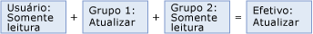
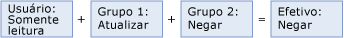

# Sobrepondo permissões de usuário e grupo (Serviços de Dados Mestre)

[!INCLUDE [SQL Server - Windows only ASDBMI  ](../includes/applies-to-version/sql-windows-only-asdbmi.md)]

  As permissões de um usuário são baseadas em:  
  
-   Permissões das associações a grupos.  
  
-   Permissões atribuídas explicitamente ao usuário.  
  
 Se um usuário for membro de vários grupos, e esses grupos tiverem acesso ao [!INCLUDE[ssMDSmdm](../includes/ssmdsmdm-md.md)], as seguinte regras serão aplicadas:  
  
-   **Negar** substitui todas as outras permissões. Se a permissão do objeto for **Negar** em um grupo, a permissão efetiva será Negar.  
  
-   A permissão de acesso é uma união de todas as permissões efetivas em um grupo. Se a permissão do objeto for **Criar** em um grupo e **Atualizar** em outro grupo, a permissão efetiva será **Criar** e **Atualizar**.  
  
 Essas regras se aplicam às guias **Modelos** e **Membros da Hierarquia** . As permissões são resolvidas para cada guia e, em seguida, combinadas. Para obter mais informações, consulte [Como as permissões são determinadas &#40;Master Data Services&#41;](../master-data-services/how-permissions-are-determined-master-data-services.md).  
  
> [!NOTE]  
>  Você pode visualizar a resolução do usuário e do grupo sobrepondo permissões na interface do usuário. As guias **Modelos** e **Membros da Hierarquia** têm uma lista suspensa na qual é possível escolher **Efetivo** para exibir as permissões efetivas.  
  
## Exemplo 1  
   
  
 O usuário pertence ao Grupo 1 e ao Grupo 2.  
  
 O usuário tem a permissão **Leitura** para a entidade Produto.  
  
 O Grupo 1 tem permissão **Atualizar** para a entidade Produto.  
  
 O Grupo 2 tem a permissão **Leitura** para a entidade Produto.  
  
 Resultado: a permissão efetiva do usuário é **Atualizar** para a entidade Produto.  
  
## Exemplo 2  
   
  
 O usuário pertence ao Grupo 1 e ao Grupo 2.  
  
 O usuário tem a permissão **Leitura** para a entidade Produto.  
  
 O Grupo 1 tem permissão **Atualizar** para a entidade Produto.  
  
 O Grupo 2 tem permissão **Negar** para a entidade Produto.  
  
 Resultado: a permissão efetiva do usuário é **Negar** para a entidade Produto.  
  
## Exemplo 3  
   
  
 O usuário pertence ao Grupo 1 e ao Grupo 2.  
  
 O usuário permissão **Atualizar** para um grupo de membros em um nó de hierarquia.  
  
 O Grupo 1 tem permissão **Leitura** para um grupo de membros em um nó de hierarquia.  
  
 O Grupo 2 tem permissão **Leitura** para um grupo de membros em um nó de hierarquia.  
  
 Resultado: a permissão efetiva do usuário é **Atualizar** para os membros.  
  
## Consulte Também  
 [Como as permissões são determinadas &#40;Master Data Services&#41;](../master-data-services/how-permissions-are-determined-master-data-services.md)   
 [Sobrepondo permissões de modelo e membro &#40;Master Data Services&#41;](../master-data-services/overlapping-model-and-member-permissions-master-data-services.md)  
  
  
