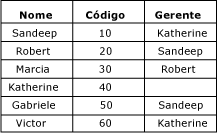
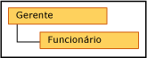

# Hierarquias recursivas (Master Data Services)

[!INCLUDE[appliesto-ss-xxxx-xxxx-xxx-md-winonly](../includes/appliesto-ss-xxxx-xxxx-xxx-md-winonly.md)]

  No [!INCLUDE[ssMDSshort](../includes/ssmdsshort-md.md)], uma hierarquia recursiva é uma hierarquia derivada que inclui uma relação recursiva. Uma relação recursiva existe quando uma entidade tem um atributo baseado em domínio com base na própria entidade.  
  
## Exemplo de hierarquia recursiva  
 Um exemplo típico de hierarquia recursiva é uma estrutura organizacional. No [!INCLUDE[ssMDSshort](../includes/ssmdsshort-md.md)], você pode fazer isso criando uma entidade Funcionário com um atributo baseado em domínio chamado Gerente. O atributo Gerente é populado da lista de funcionários. Nesta organização de exemplo, todos os funcionários podem ser gerentes.  
  
   
  
 Você pode criar uma hierarquia derivada que destaca a relação entre a entidade Funcionário e o atributo Gerente baseado em domínio.  
  
   
  
 Para incluir cada membro na hierarquia apenas uma vez, você pode ancorar relações nulas. Quando você fizer isso, os membros com valores de atributo baseado em domínio em branco serão exibidos no nível superior da hierarquia.  
  
   
  
 Se você não ancorar relações nulas, os membros serão incluídos várias vezes. Todos os membros são exibidos no nível superior. Eles também são exibidos sob membros dos quais eles são atributos.  
  
   
  
 Neste exemplo, Marcia está no nível superior. Ela não é gerente de nenhum funcionário porque não é usada como um valor de atributo baseado em domínio para qualquer outro Funcionário membro. Por outro lado, Robert tem um nível abaixo dele porque Marcia tem Robert como seu valor de atributo de Gerente.  
  
## Regras  
  
-   Uma hierarquia derivada não pode conter mais de uma relação recursiva. Entretanto, ela pode ter outras relações derivadas (por exemplo, uma hierarquia derivada que contém uma relação recursiva Gerenciador para Funcionário também pode ter relações País para Gerenciador e Funcionário para Repositório).  
  
-   Você não pode atribuir permissões (na guia **Membros da Hierarquia** ) a membros de uma hierarquia recursiva.  
  
-   Hierarquias recursivas não podem incluir relações circulares. Por exemplo, Katherine não poderá ser o gerente de Sandeep se Sandeep for o gerente dela. Katherine também não pode ser gerente de si mesma.  
  
## Related Tasks  
  
|Descrição da tarefa|Tópico|  
|----------------------|-----------|  
|Criar uma hierarquia derivada.|[Criar uma hierarquia derivada &#40;Master Data Services&#41;](../master-data-services/create-a-derived-hierarchy-master-data-services.md)|  
|Alterar o nome de uma hierarquia derivada existente.|[Alterar o nome de uma hierarquia derivada &#40;Master Data Services&#41;](../master-data-services/change-a-derived-hierarchy-name-master-data-services.md)|  
|Excluir uma hierarquia derivada existente.|[Excluir uma hierarquia derivada &#40;Master Data Services&#41;](../master-data-services/delete-a-derived-hierarchy-master-data-services.md)|  
  
## Conteúdo relacionado  
  
-   [Atributos baseados em domínio &#40;Master Data Services&#41;](../master-data-services/domain-based-attributes-master-data-services.md)  
  
-   [Hierarquias derivadas &#40;Master Data Services&#41;](../master-data-services/derived-hierarchies-master-data-services.md)  
  
  
