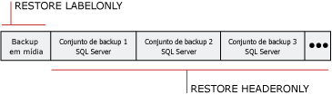

# Informações de histórico e cabeçalho de backup (SQL Server)
[!INCLUDE[appliesto-ss-xxxx-xxxx-xxx-md](../../includes/appliesto-ss-xxxx-xxxx-xxx-md.md)]
  Um histórico completo de todas as operações de backup e restauração do [!INCLUDE[ssNoVersion](../../includes/ssnoversion-md.md)] em uma instância do servidor é armazenado no banco de dados **msdb** . Este tópico apresenta as tabelas de histórico de backup e restauração e também as instruções [!INCLUDE[tsql](../../includes/tsql-md.md)] usadas para acessar o histórico de backup. O tópico também discute quando a listagem de banco de dados e de arquivos de log de transação é útil e quando usar informações do cabeçalho de mídia comparado a quando usar informações do cabeçalho de backup.  
  
> [!IMPORTANT]  
>  Para gerenciar o risco de perder alterações recentes no seu histórico de backup e restauração, faça backup do **msdb** com frequência. Para obter informações sobre de quais bancos de dados do sistema você deve fazer backup, veja [Fazer backup e restaurar bancos de dados do sistema &#40;SQL Server&#41;](../../relational-databases/backup-restore/back-up-and-restore-of-system-databases-sql-server.md).  
  
 **Neste tópico:**  
  
-   [Tabelas de histórico de backup e restauração](#BnRHistoryTables)  
  
-   [Instruções Transact-SQL por acessar histórico de backup](#TsqlStatementsForBackupHistory)  
  
-   [Arquivos de log de transações e de banco de dados](#ListDbTlogFiles)  
  
-   [Informações de cabeçalho de mídia](#MediaHeader)  
  
-   [Informações de cabeçalho de backup](#BackupHeader)  
  
-   [Comparação de informações do cabeçalho de mídia e do cabeçalho de backup](#CompareMediaHeaderBackupHeader)  
  
-   [Verificação de backup](#Verification)  
  
-   [Tarefas relacionadas](#RelatedTasks)  
  
##   Tabelas de histórico de backup e restauração  
 Esta seção apresenta as tabelas de histórico que armazenam backup e restauram metadados no banco de dados do sistema **msdb** .  
  
|Tabela de histórico|Descrição|  
|-------------------|-----------------|  
|[backupfile](../../relational-databases/system-tables/backupfile-transact-sql.md)|Contém uma linha para cada arquivo de dados ou arquivo de log para o qual é feito o backup.|  
|[backupfilegroup](../../relational-databases/system-tables/backupfilegroup-transact-sql.md)|Contém uma linha para cada grupo de arquivos em um conjunto de backup.|  
|[backupmediafamily](../../relational-databases/system-tables/backupmediafamily-transact-sql.md)|Contém uma linha para cada família de mídia. Se uma família de mídia residir em um conjunto de mídias espelhado, a família terá uma linha separada para cada espelho no conjunto de mídias.|  
|[backupmediaset](../../relational-databases/system-tables/backupmediaset-transact-sql.md)|Contém uma linha para cada conjunto de mídias de backup.|  
|[backupset](../../relational-databases/system-tables/backupset-transact-sql.md)|Contém uma linha para cada conjunto de backup.|  
|[restorefile](../../relational-databases/system-tables/restorefile-transact-sql.md)|Contém uma linha para cada arquivo restaurado. Isso inclui arquivos restaurados indiretamente por nome de grupo de arquivos.|  
|[restorefilegroup](../../relational-databases/system-tables/restorefilegroup-transact-sql.md)|Contém uma linha para cada grupo de arquivos restaurado.|  
|[restorehistory](../../relational-databases/system-tables/restorehistory-transact-sql.md)|Contém uma linha para cada operação de restauração.|  
  
> [!NOTE]  
>  Quando uma restauração é executada, as tabelas de histórico de backup e restauração são modificadas.  
  
##   Instruções Transact-SQL por acessar histórico de backup  
 As instruções de informações de restauração correspondem a informações armazenadas em certas tabelas de histórico de backup.  
  
> [!IMPORTANT]  
>  As instruções Transact-SQL RESTORE FILELISTONLY, RESTORE HEADERONLY, RESTORE LABELONLY e RESTORE VERIFYONLY exigem a permissão CREATE DATABASE. Com essa exigência, seus arquivos e suas informações de backup estão mais protegidos do que nas versões anteriores. Para obter informações sobre essa permissão, veja [Permissões de banco de dados GRANT &#40;Transact-SQL&#41;](../../t-sql/statements/grant-database-permissions-transact-sql.md).  
  
|Instrução de informações|Tabela de histórico de backup|Descrição|  
|---------------------------|--------------------------|-----------------|  
|[RESTORE FILELISTONLY](../../t-sql/statements/restore-statements-filelistonly-transact-sql.md)|[backupfile](../../relational-databases/system-tables/backupfile-transact-sql.md)|Retorna um conjunto de resultados que tem uma lista dos arquivos de log e de banco de dados contidos no backup especificado.   Para obter mais informações, consulte "Listando arquivos de log de transações e de banco de dados", mais adiante neste tópico.|  
|[RESTORE HEADERONLY](../../t-sql/statements/restore-statements-headeronly-transact-sql.md)|[backupset](../../relational-databases/system-tables/backupset-transact-sql.md)|Recupera todas as informações do cabeçalho de backup de todos os conjuntos de backup em um dispositivo de backup particular. O resultado de executar RESTORE HEADERONLY é um conjunto de resultados.   Para obter mais informações, consulte "Exibindo informações do cabeçalho de backup" mais adiante neste tópico.|  
|[RESTORE LABELONLY](../../t-sql/statements/restore-statements-labelonly-transact-sql.md)|[backupmediaset](../../relational-databases/system-tables/backupmediaset-transact-sql.md)|Retorna um conjunto de resultados que contém informações sobre a mídia de backup em um dispositivo de backup especificado.   Para obter mais informações, consulte "Exibindo informações do cabeçalho de mídia" mais adiante neste tópico.|  
  
##   Arquivos de log de transações e de banco de dados  
 Informações que são exibidas quando os arquivos de log de transações e de banco de dados são listados em um backup incluem o nome lógico, nome físico, tipo de arquivo (banco de dados ou log), associação de grupo de arquivos, tamanho de arquivo (em bytes), tamanho máximo de arquivo permitido e o tamanho de crescimento de arquivo predefinido (em bytes). Essas informações são úteis nas seguintes situações, para determinar os nomes dos arquivos em um backup de banco de dados antes de restaurar o backup de banco de dados:  
  
-   Você perdeu uma unidade de disco que contém um ou mais dos arquivos de um banco de dados.  
  
     Você pode listar os arquivos no backup de banco de dados para determinar quais arquivos foram afetados, e depois restaurar esses arquivos em uma unidade diferente quando restaurar todo o banco de dados; ou restaurar apenas esses arquivos e aplicar qualquer backup de log de transações criado desde o backup do banco de dados.  
  
-   Você está restaurando um banco de dados de um servidor em outro servidor, mas a estrutura de diretório e o mapeamento de unidade não existe no servidor.  
  
     Listar os arquivos no backup permite que você determine quais arquivos são afetados. Por exemplo, o backup contém um arquivo que tem deve ser restaurado na unidade E, mas o servidor de destino não tem uma unidade E. O arquivo deve ser realocado em outro local, por exemplo, na unidade Z, quando o arquivo for restaurado.  
  
##   Informações de cabeçalho de mídia  
 A exibição do cabeçalho de mídia exibe informações sobre a própria mídia, em vez de informações sobre os backups na mídia. As informações do cabeçalho de mídia exibidas incluem nome da mídia, descrição, nome do software que criou o cabeçalho e a data em que o cabeçalho de mídia foi escrito.  
  
> [!NOTE]  
>  É rápido exibir informações do cabeçalho de mídia.  
  
 Para obter mais informações, veja [Comparação de informações do cabeçalho de mídia e do cabeçalho de backup](#CompareMediaHeaderBackupHeader), mais adiante neste tópico.  
  
##   Informações de cabeçalho de backup  
 A exibição do cabeçalho de backup exibe informações sobre todos os conjuntos de backup do [!INCLUDE[ssNoVersion](../../includes/ssnoversion-md.md)] e não [!INCLUDE[ssNoVersion](../../includes/ssnoversion-md.md)] na mídia. As informações exibidas incluem os tipos de dispositivos de backup usados, os tipos de backup (por exemplo, banco de dados, transação, arquivo ou banco de dados diferencial) e informações de data/hora de início e término do backup. Essas informações são úteis quando é necessário determinar qual conjunto de backup deve ser restaurado na fita, ou os backups contidos na mídia.  
  
> [!NOTE]  
>  A exibição de informações do cabeçalho de backup pode demorar muito tempo para fitas de alta capacidade, porque a mídia toda deve ser percorrida para exibir informações sobre cada backup na mídia.  
  
 Para obter mais informações, veja [Comparação de informações do cabeçalho de mídia e do cabeçalho de backup](#CompareMediaHeaderBackupHeader), mais adiante neste tópico.  
  
### Conjunto de backup a ser restaurado  
 Você pode usar informações do cabeçalho de backup para identificar qual conjunto de backup deve ser restaurado. O Mecanismo de Banco de Dados numera cada conjunto de backup na mídia de backup. Isso permite a identificação do conjunto de backup que você deve restaurar usando sua posição na mídia. Por exemplo, a mídia a seguir contêm três conjuntos de backup.  
  
   
  
 Para restaurar um conjunto de backup específico, determine o número da posição do conjunto de backup a ser restaurado. Por exemplo, para restaurar o segundo conjunto de backup, especifique 2 como o conjunto de backup a ser restaurado.  
  
##   Comparação de informações do cabeçalho de mídia e do cabeçalho de backup  
 A ilustração a seguir exemplifica as diferenças entre exibir informações do cabeçalho de backup e do cabeçalho de mídia. A obtenção do cabeçalho de mídia requer a recuperação de informações somente do início da fita. A obtenção do cabeçalho de backup requer a varredura da fita toda para verificar o cabeçalho de todos os conjunto de backup.  
  
   
  
> [!NOTE]  
>  Quando você usa conjuntos de mídia de várias famílias de mídia, o cabeçalho de mídia e conjunto de backup são registrados em todas as famílias de mídia. Portanto, você só precisa fornecer uma única família de mídia para essas operações de relatório.  
  
 Para obter informações sobre como exibir o cabeçalho de mídia, consulte "Exibindo informações do cabeçalho de mídia", anteriormente neste tópico.  
  
 Para obter informações sobre como exibir informações do cabeçalho de backup para todos os conjuntos de backup em um dispositivo de backup, consulte "Exibindo informações do cabeçalho de backup", anteriormente neste tópico.  
  
##   Verificação de backup  
 Embora não exigido, verificar um backup é uma prática útil. A verificação de um backup constata se o backup está fisicamente intacto, para assegurar que todos os arquivos no backup estão legíveis e podem ser restaurados, e que você pode restaurar seu backup se precisar dele. É importante entender que verificando um backup a estrutura dos dados no backup não é verificada. Porém, se o backup foi criado usando WITH CHECKSUMS, verificar o backup usando WITH CHECKSUMS pode fornecer uma boa indicação da confiabilidade dos dados no backup.  
  
##   Tarefas relacionadas  
 **Para excluir linhas antigas das tabelas de histórico de backup e restauração**  
  
-   [sp_delete_backuphistory &#40;Transact-SQL&#41;](../../relational-databases/system-stored-procedures/sp-delete-backuphistory-transact-sql.md)  
  
 **Para excluir todas as linhas de um banco de dados específico das tabelas de histórico de backup e restauração**  
  
-   [sp_delete_database_backuphistory &#40;Transact-SQL&#41;](../../relational-databases/system-stored-procedures/sp-delete-database-backuphistory-transact-sql.md)  
  
 **Para exibir os dados e arquivos de log em um conjunto de backup**  
  
-   [RESTORE FILELISTONLY &#40;Transact-SQL&#41;](../../t-sql/statements/restore-statements-filelistonly-transact-sql.md)  
  
-   <xref:Microsoft.SqlServer.Management.Smo.Restore.ReadFileList%2A> (SMO)  
  
 **Para exibir informações do cabeçalho de mídia**  
  
-   [RESTORE LABELONLY &#40;Transact-SQL&#41;](../../t-sql/statements/restore-statements-labelonly-transact-sql.md)  
  
-   [Exibir as propriedades e o conteúdo de um dispositivo de backup lógico &#40;SQL Server&#41;](../../relational-databases/backup-restore/view-the-properties-and-contents-of-a-logical-backup-device-sql-server.md)  
  
-   [Exibir o conteúdo de um arquivo ou fita de backup &#40;SQL Server&#41;](../../relational-databases/backup-restore/view-the-contents-of-a-backup-tape-or-file-sql-server.md)  
  
-   <xref:Microsoft.SqlServer.Management.Smo.Restore.ReadMediaHeader%2A> (SMO)  
  
 **Para exibir informações do cabeçalho de backup**  
  
-   [RESTORE HEADERONLY &#40;Transact-SQL&#41;](../../t-sql/statements/restore-statements-headeronly-transact-sql.md)  
  
-   [Exibir o conteúdo de um arquivo ou fita de backup &#40;SQL Server&#41;](../../relational-databases/backup-restore/view-the-contents-of-a-backup-tape-or-file-sql-server.md)  
  
-   [Exibir as propriedades e o conteúdo de um dispositivo de backup lógico &#40;SQL Server&#41;](../../relational-databases/backup-restore/view-the-properties-and-contents-of-a-logical-backup-device-sql-server.md)  
  
-   <xref:Microsoft.SqlServer.Management.Smo.Restore.ReadBackupHeader%2A> (SMO)  
  
 **Para excluir linhas antigas das tabelas de histórico de backup e restauração**  
  
-   [sp_delete_backuphistory &#40;Transact-SQL&#41;](../../relational-databases/system-stored-procedures/sp-delete-backuphistory-transact-sql.md)  
  
 **Para excluir todas as linhas de um banco de dados específico das tabelas de histórico de backup e restauração**  
  
-   [sp_delete_database_backuphistory &#40;Transact-SQL&#41;](../../relational-databases/system-stored-procedures/sp-delete-database-backuphistory-transact-sql.md)  
  
 **Para exibir informações do cabeçalho de mídia**  
  
-   [RESTORE LABELONLY &#40;Transact-SQL&#41;](../../t-sql/statements/restore-statements-labelonly-transact-sql.md)  
  
-   [Exibir as propriedades e o conteúdo de um dispositivo de backup lógico &#40;SQL Server&#41;](../../relational-databases/backup-restore/view-the-properties-and-contents-of-a-logical-backup-device-sql-server.md)  
  
-   [Exibir o conteúdo de um arquivo ou fita de backup &#40;SQL Server&#41;](../../relational-databases/backup-restore/view-the-contents-of-a-backup-tape-or-file-sql-server.md)  
  
-   <xref:Microsoft.SqlServer.Management.Smo.Restore.ReadMediaHeader%2A> (SMO)  
  
 **Para exibir informações do cabeçalho de backup**  
  
-   [RESTORE HEADERONLY &#40;Transact-SQL&#41;](../../t-sql/statements/restore-statements-headeronly-transact-sql.md)  
  
-   [Exibir o conteúdo de um arquivo ou fita de backup &#40;SQL Server&#41;](../../relational-databases/backup-restore/view-the-contents-of-a-backup-tape-or-file-sql-server.md)  
  
-   [Exibir as propriedades e o conteúdo de um dispositivo de backup lógico &#40;SQL Server&#41;](../../relational-databases/backup-restore/view-the-properties-and-contents-of-a-logical-backup-device-sql-server.md)  
  
-   <xref:Microsoft.SqlServer.Management.Smo.Restore.ReadBackupHeader%2A> (SMO)  
  
 **Para exibir os arquivos em um conjunto de backup**  
  
-   [Exibir os dados e arquivos de log em um conjunto de backup &#40;SQL Server&#41;](../../relational-databases/backup-restore/view-the-data-and-log-files-in-a-backup-set-sql-server.md)  
  
-   [RESTORE HEADERONLY &#40;Transact-SQL&#41;](../../t-sql/statements/restore-statements-headeronly-transact-sql.md)  
  
 **Para verificar um backup**  
  
-   [RESTORE VERIFYONLY &#40;Transact-SQL&#41;](../../t-sql/statements/restore-statements-verifyonly-transact-sql.md)  
  
-   <xref:Microsoft.SqlServer.Management.Smo.Restore.SqlVerify%2A> (SMO)  
  
## Consulte Também  
 [BACKUP &#40;Transact-SQL&#41;](../../t-sql/statements/backup-transact-sql.md)   
 [Conjuntos de mídias, famílias de mídia e conjuntos de backup &#40;SQL Server&#41;](../../relational-databases/backup-restore/media-sets-media-families-and-backup-sets-sql-server.md)   
 [Dispositivos de backup &#40;SQL Server&#41;](../../relational-databases/backup-restore/backup-devices-sql-server.md)   
 [Conjuntos de mídias de backup espelhadas &#40;SQL Server&#41;](../../relational-databases/backup-restore/mirrored-backup-media-sets-sql-server.md)   
 [Erros de mídia possíveis durante backup e restauração &#40;SQL Server&#41;](../../relational-databases/backup-restore/possible-media-errors-during-backup-and-restore-sql-server.md)  
  
  
