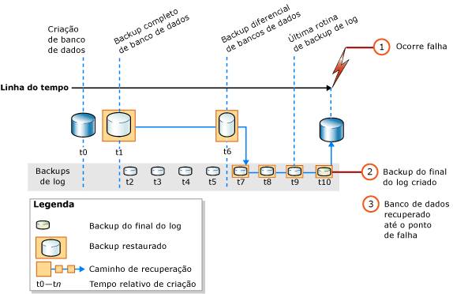

# <a name="complete-database-restores-full-recovery-model"></a>Restaurações completas de banco de dados (modelo de recuperação completa)
[!INCLUDE[appliesto-ss-xxxx-xxxx-xxx-md](../../includes/appliesto-ss-xxxx-xxxx-xxx-md.md)]

  Em uma restauração completa de banco de dados, a meta é restaurar todo o banco de dados. O banco de dados inteiro fica offline durante a restauração. Antes que qualquer parte do banco de dados possa ficar online, todos os dados são recuperados a um ponto consistente, no qual todas as partes do banco de dados estejam no mesmo momento determinado e não exista nenhuma transação não confirmada.  
  
 No modelo de recuperação completa, depois de restaurar seu backup ou backups de dados, você deve restaurar todos os backups de log de transações subsequentes e recuperar o banco de dados. Você pode restaurar um banco de dados a um *ponto de recuperação* específico dentro de um destes backups de log. O ponto de recuperação pode ser uma data e hora específica, uma transação marcada ou um LSN (número de sequência de log).  
  
 Ao restaurar um banco de dados, particularmente com o modelo de recuperação completa ou o modelo de recuperação bulk-logged, você deve usar uma única sequência de restauração. Uma *sequência de restauração* consiste em uma ou mais operações de restauração que movem dados por uma ou mais etapas da restauração.  
  
### <a name="untrusted-sources"></a>Fontes não confiáveis

_Não_ é recomendável anexar ou restaurar bancos de dados de origem desconhecida ou não confiável. Esses bancos de dados podem conter códigos mal-intencionados que podem executar códigos [!INCLUDE[tsql](../../includes/tsql-md.md)] inesperados ou causar erros que modifiquem o esquema ou a estrutura física do banco de dados. Antes de usar um banco de dados de uma origem desconhecida ou não confiável, execute o [DBCC CHECKDB](../../t-sql/database-console-commands/dbcc-checkdb-transact-sql.md) no banco de dados em um servidor que não seja de produção. Examine também o código escrito pelo usuário no banco de dados, como procedimentos armazenados ou outro código definido pelo usuário.

### <a name="backups-from-earlier-versions"></a>Backups de versões anteriores

Para obter informações sobre suporte para backups de versões anteriores do [!INCLUDE[ssNoVersion](../../includes/ssnoversion-md.md)], veja a seção “Suporte de compatibilidade” de [RESTORE &#40;Transact-SQL&#41;](../../t-sql/statements/restore-statements-transact-sql.md).
  
##  <a name="restoring-a-database-to-the-point-of-failure"></a><a name="PointOfFailure"></a> Restaurando um banco de dados até o ponto de falha  

 Normalmente, a recuperação de um banco de dados até o ponto da falha envolve as seguintes etapas básicas:  
  
1.  Faça um backup do log de transações ativas (conhecido como a parte final do log). Isso cria um backup do final do log. Se o log de transações ativas não estiver disponível, todas as transações naquela parte do log serão perdidas.  
  
    > [!IMPORTANT]  
    >  No modelo de recuperação bulk-logged, o backup de qualquer log que contenha operações em massa requer acesso a todos os arquivos de dados no banco de dados. Se os arquivos de dados não puderem ser acessados, não será possível fazer um backup do log de transações. Nesse caso, você tem de refazer manualmente todas as alterações feitas desde o backup de log mais recente.  
  
     Para obter mais informações, veja [Backups da parte final do log &#40;SQL Server&#41;](../../relational-databases/backup-restore/tail-log-backups-sql-server.md).  
  
2.  Restaure o backup de banco de dados completo mais recente sem recuperar o banco de dados (RESTORE DATABASE *database_name* FROM *backup_device* WITH NORECOVERY).  
  
3.  Se houver backups diferenciais, restaure o mais recente sem recuperar o banco de dados (RESTORE DATABASE *database_name* FROM *differential_backup_device* WITH NORECOVERY).  
  
     A restauração do backup mais recente diferencial reduz o número de backups de log que devem ser restaurados.  
  
4.  Iniciando com o primeiro backup de log de transações criado depois do backup que você acaba de restaurar, restaure os logs em sequência com NORECOVERY.  
  
5.  Recupere o banco de dados (RESTORE DATABASE *database_name* WITH RECOVERY). Alternativamente, essa etapa pode ser combinada com a restauração do último backup de log.  
  
 A ilustração a seguir mostra esta sequência de restauração. Depois de uma falha (1), um backup do final do log de final é criado (2). Em seguida, o banco de dados é restaurado ao ponto da falha. Isso envolve a restauração de um backup de banco de dados, de um backup diferencial subsequente e de todos os backups de log feitos depois do backup diferencial, inclusive o do backup do final do log.  
  
   
  
> [!NOTE]  
>  Ao restaurar um backup de banco de dados em uma instância de servidor diferente, veja [Copiar bancos de dados com Backup e Restauração](../../relational-databases/databases/copy-databases-with-backup-and-restore.md).  
  
###  <a name="basic-transact-sql-restore-syntax"></a><a name="TsqlSyntax"></a> Sintaxe básica de RESTORE do Transact-SQL  
 A sintaxe básica de [RESTORE](../../t-sql/statements/restore-statements-transact-sql.md)[!INCLUDE[tsql](../../includes/tsql-md.md)] para a sequência de restauração na ilustração anterior é a seguinte:  
  
1.  RESTORE DATABASE *database* FROM *full database backup* WITH NORECOVERY;  
  
2.  RESTORE DATABASE *database* FROM *full_differential_backup* WITH NORECOVERY;  
  
3.  RESTORE LOG *database* FROM *log_backup* WITH NORECOVERY;  
  
     Repita essa etapa de log de restauração para cada backup de log adicional.  
  
4.  RESTORE DATABASE *database* WITH RECOVERY;  
  
###  <a name="example-recovering-to-the-point-of-failure-transact-sql"></a><a name="ExampleToPoFTsql"></a> Exemplo: Recuperando até o ponto de falha (Transact-SQL)  
 O exemplo a seguir de [!INCLUDE[tsql](../../includes/tsql-md.md)] mostra as opções essenciais em uma sequência de restauração que restaura o banco de dados até o ponto de falha. O exemplo cria um backup do final do log do banco de dados. Em seguida, o exemplo restaura um backup de banco de dados completo e, depois, restaura o backup do final do log. O exemplo recupera o banco de dados em uma etapa final, separada.  
  
> [!NOTE]  
>  Esse exemplo usa um backup de banco de dados e um backup de log criados na seção “Usando backups de bancos de dados no modelo de recuperação completa” em [Backups de bancos de dados completos &#40;SQL Server&#41;](../../relational-databases/backup-restore/full-database-backups-sql-server.md). Antes do backup do banco de dados, o banco de dados de exemplo [!INCLUDE[ssSampleDBobject](../../includes/sssampledbobject-md.md)] foi definido para usar o modelo de recuperação completa.  
  
```  
USE master;  
--Create tail-log backup.  
BACKUP LOG AdventureWorks2012   
TO DISK = 'Z:\SQLServerBackups\AdventureWorksFullRM.bak'    
   WITH NORECOVERY;   
GO  
--Restore the full database backup (from backup set 1).  
RESTORE DATABASE AdventureWorks2012   
  FROM DISK = 'Z:\SQLServerBackups\AdventureWorksFullRM.bak'   
  WITH FILE=1,   
    NORECOVERY;  
  
--Restore the regular log backup (from backup set 2).  
RESTORE LOG AdventureWorks2012   
  FROM DISK = 'Z:\SQLServerBackups\AdventureWorksFullRM.bak'   
  WITH FILE=2,   
    NORECOVERY;  
  
--Restore the tail-log backup (from backup set 3).  
RESTORE LOG AdventureWorks2012   
  FROM DISK = 'Z:\SQLServerBackups\AdventureWorksFullRM.bak'  
  WITH FILE=3,   
    NORECOVERY;  
GO  
--recover the database:  
RESTORE DATABASE AdventureWorks2012 WITH RECOVERY;  
GO  
```  
  
##  <a name="restoring-a-database-to-a-point-within-a-log-backup"></a><a name="PointWithinBackup"></a> Restaurando um banco de dados em um ponto em um backup de log  
 No modelo de recuperação completa, uma restauração de banco de dados completa pode ser recuperada normalmente até um ponto de hora, uma transação marcada ou um LSN dentro de um backup de log. Porém, no modelo de recuperação bulk-logged, se o backup de log contiver alterações registradas em massa, a recuperação pontual não será possível.  
  
### <a name="sample-point-in-time-restore-scenarios"></a>Exemplos de cenários de restauração point-in-time  
 O exemplo a seguir pressupõe um sistema de banco de dados crucial para o qual um backup de banco de dados completo é criado diariamente à meia-noite, um backup de banco de dados diferencial é criado a cada hora, de segunda-feira a sábado, e os backups de log de transações são criados a cada 10 minutos ao longo do dia. Para restaurar o banco de dados ao estado em que estava às 5h19 da quarta-feira, siga um destes procedimentos:  
  
1.  Restaure o backup de banco de dados completo criado na terça-feira à meia-noite.  
  
2.  Restaure o backup de banco de dados diferencial criado às 5h na quarta-feira.  
  
3.  Aplique o backup de log de transações criado às 5h10 na quarta-feira.  
  
4.  Aplique o backup de log de transações criado às 5h20 na quarta-feira, especificando que o processo de recuperação só se aplica a transações que ocorreram antes das 5h19.  
  
 Ou então, se o banco de dados precisar ser restaurado ao estado em que estava às 3h04 da quinta-feira, mas o backup de banco de dados diferencial criado às 3h da quinta-feira não estiver disponível, faça o seguinte:  
  
1.  Restaure o backup de banco de dados criado na quarta-feira à meia-noite.  
  
2.  Restaure o backup de banco de dados diferencial criado às 2h na quinta-feira.  
  
3.  Aplique todos os backups de log de transações criados das 2h10 às 3h na quinta-feira.  
  
4.  Aplique o backup de log de transações criado às 3h10 na quinta-feira, parando o processo de recuperação às 3h04.  
  
> [!NOTE]  
>  Para obter um exemplo de uma restauração pontual, veja [Restaurar um banco de dados do SQL Server em um ponto específico &#40;Modelo de recuperação completa&#41;](../../relational-databases/backup-restore/restore-a-sql-server-database-to-a-point-in-time-full-recovery-model.md).  
  
##  <a name="related-tasks"></a><a name="RelatedTasks"></a> Tarefas relacionadas  
 **Para restaurar um backup de banco de dados completo**  
  
-   [Restore a Database Backup Using SSMS](../../relational-databases/backup-restore/restore-a-database-backup-using-ssms.md)  
  
-   [Restaurar um banco de dados em um novo local &#40;SQL Server&#41;](../../relational-databases/backup-restore/restore-a-database-to-a-new-location-sql-server.md)  
  
 **Para restaurar um backup de banco de dados diferencial**  
  
-   [Restaurar um backup de banco de dados diferencial &#40;SQL Server&#41;](../../relational-databases/backup-restore/restore-a-differential-database-backup-sql-server.md)  
  
 **Para restaurar um backup de log de transações**  
  
-   [Restaurar um backup de log de transações &#40;SQL Server&#41;](../../relational-databases/backup-restore/restore-a-transaction-log-backup-sql-server.md)  
  
 **Para restaurar um backup usando o SQL Server Management Objects (SMO)**  
  
-   <xref:Microsoft.SqlServer.Management.Smo.Restore.SqlRestore%2A>  
  
 **Para restaurar um banco de dados para um ponto em um backup de log**  
  
-   [Restaurar um banco de dados do SQL Server em um ponto específico &#40;Modelo de recuperação completa&#41;](../../relational-databases/backup-restore/restore-a-sql-server-database-to-a-point-in-time-full-recovery-model.md)  
  
-   [Recuperação de bancos de dados relacionados que contêm transação marcada](../../relational-databases/backup-restore/recovery-of-related-databases-that-contain-marked-transaction.md)  
  
-   [Recuperar para um número de sequência de log &#40;SQL Server&#41;](../../relational-databases/backup-restore/recover-to-a-log-sequence-number-sql-server.md)  
  
## <a name="see-also"></a>Consulte Também  
 [RESTORE &#40;Transact-SQL&#41;](../../t-sql/statements/restore-statements-transact-sql.md)   
 [BACKUP &#40;Transact-SQL&#41;](../../t-sql/statements/backup-transact-sql.md)   
 [Aplicar backups de log de transações &#40;SQL Server&#41;](../../relational-databases/backup-restore/apply-transaction-log-backups-sql-server.md)   
 [sp_addumpdevice &#40;Transact-SQL&#41;](../../relational-databases/system-stored-procedures/sp-addumpdevice-transact-sql.md)   
 [Backups de bancos de dados completos &#40;SQL Server&#41;](../../relational-databases/backup-restore/full-database-backups-sql-server.md)   
 [Backups diferenciais &#40;SQL Server&#41;](../../relational-databases/backup-restore/differential-backups-sql-server.md)   
 [Visão geral do backup &#40;SQL Server&#41;](../../relational-databases/backup-restore/backup-overview-sql-server.md)   
 [Visão geral de restauração e recuperação &#40;SQL Server&#41;](../../relational-databases/backup-restore/restore-and-recovery-overview-sql-server.md)  
  
  
