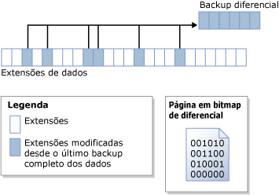

# Backups diferenciais (SQL Server)
[!INCLUDE[appliesto-ss-xxxx-xxxx-xxx-md](../../includes/appliesto-ss-xxxx-xxxx-xxx-md.md)]
  Este tópico de backup e restauração é relevante para todos os bancos de dados do [!INCLUDE[ssNoVersion](../../includes/ssnoversion-md.md)] .  
  
 Um backup diferencial baseia-se no backup de dados completo anterior mais recente. Um backup diferencial captura apenas os dados que foram alterados desde o backup completo. O backup completo no qual um backup diferencial se baseia é conhecido como a *base* do diferencial. Os backups completos, com exceção dos backups somente cópia, podem servir como base para uma série de backups diferenciais, inclusive backups de banco de dados, backups parciais e backups de arquivo. O backup de base para um backup diferencial de arquivo pode ser contido dentro de um backup completo, um backup de arquivo ou um backup parcial.  
  
  
##   Benefícios  
  
-   A criação de um backup diferencial pode ser muito rápida se comparada à criação de um backup completo. Um backup diferencial registra apenas os dados que mudaram desde o backup completo no qual se baseia o backup diferencial. Isso facilita os backups de dados frequentes, o que diminui o risco de perda de dados. No entanto, antes de restaurar um backup diferencial, é necessário restaurar sua base. Portanto, a restauração de um backup diferencial precisará, necessariamente, de mais etapas e mais tempo do que a restauração de um backup completo, pois serão necessários dois arquivos de backup.  
  
-   Backups de banco de dados de diferencial são especialmente úteis se um subconjunto de um banco de dados é modificado mais frequentemente do que o restante do banco de dados. Nesses casos, backups de banco de dados de diferencial lhe permitem fazer backup frequentemente sem a sobrecarga de backups de banco de dados completos.  
  
-   No modelo de recuperação completa, o uso de backups diferenciais pode reduzir o número de backups de log que você precisa restaurar.  
  
##   Visão geral dos backups diferenciais  
 Um backup diferencial captura o estado de qualquer *extensão* (coleções de oito páginas fisicamente contíguas) que foi alterada entre quando a base diferencial foi criada e quando o backup diferencial é criado. Isso significa que o tamanho de um backup diferencial depende da quantidade de dados alterada desde a base. Em geral, quanto mais antiga a base, maior será o novo backup diferencial. Em uma série de backups diferenciais, é provável que uma extensão atualizada com frequência contenha dados diferentes em cada backup diferencial.  
  
 A ilustração a seguir mostra como funciona um backup diferencial. A figura exibe 24 extensões de dados, dentre as quais 6 que foram alteradas. O backup diferencial contém somente estas 6 extensões de dados. A operação de backup diferencial baseia-se em uma página de bitmap que contém um bit para cada extensão. Para cada extensão atualizada desde a base, o bit é definido para 1 no bitmap.  
  
   
  
> [!NOTE]  
>  O bitmap diferencial não é atualizado por um backup do tipo somente cópia. Assim, um backup do tipo somente cópia não afeta os backups diferenciais subsequentes.  
  
 Um backup diferencial executado logo depois de sua base é, em geral, significativamente menor do que a base diferencial. Isto economiza espaço de armazenamento e tempo de backup. Porém, como o banco de dados é alterado com o passar do tempo, a diferença entre o banco de dados e uma base diferencial específica aumenta. Quanto maior o tempo entre um backup diferencial e sua base, maior será o tamanho do backup diferencial. Isto significa que os backups diferenciais podem por fim se aproximar do tamanho da base diferencial. Um backup diferencial grande perde as vantagens de um backup mais rápido e menor.  
  
 Como os backups diferenciais aumentam em tamanho, a restauração de um backup diferencial pode aumentar de forma significativa o tempo necessário para restaurar um banco de dados. Por isso, recomendamos que você use um backup completo novo em intervalos definidos para estabelecer uma nova base diferencial para os dados. Por exemplo, você poderia usar um backup completo semanal de todo o banco de dados (isto é, um backup completo do banco de dados) seguido de uma série regular de backups diferenciais do banco de dados durante a semana.  
  
 No momento da restauração, antes de você restaurar um backup diferencial, você deve restaurar sua base. Em seguida, restaure somente o backup diferencial mais recente para avançar o banco de dados até o momento em que foi criado esse backup diferencial. Normalmente, você restauraria o backup completo mais recente seguido pelo backup diferencial mais recente que é baseado nesse backup completo.  
  
## Backups diferenciais de bancos de dados com tabelas com otimização de memória  
 Para obter informações sobre backups diferenciais e bancos de dados com tabelas com otimização de memória, consulte [Fazendo backup de um banco de dados com tabelas com otimização de memória](../../relational-databases/in-memory-oltp/backing-up-a-database-with-memory-optimized-tables.md).  
  
##   Backups diferenciais de bancos de dados somente leitura  
 Para bancos de dados somente leitura, os backups completos usados isoladamente são mais fáceis de serem gerenciados do que os usados com backups diferenciais. Quando um banco de dados for somente de leitura, o backup e outras operações não podem alterar os metadados que estão contidos no arquivo. Portanto, os metadados exigidos por um backup diferencial, como o número de sequência de log no qual o backup diferencial começa (o LSN base diferencial), é armazenado no banco de dados **mestre** . Se a base diferencial for tomada quando o banco de dados for somente de leitura, o bitmap diferencial indicará mais alterações do que as ocorridas, de fato, desde o backup de base. Os dados extras são lidos pelo backup, mas não são gravados no backup, porque o **differential_base_lsn** armazenado na tabela do sistema [conjunto de backup](../../relational-databases/system-tables/backupset-transact-sql.md) é usado para determinar se os dados realmente foram alterados desde a base.  
  
 Quando um banco de dados somente leitura é recriado, restaurado ou desanexado e anexado, as informações básicas diferenciais são perdidas. Isso ocorre porque o banco de dados **mestre** não é sincronizado com o banco de dados de usuário. O [!INCLUDE[ssDEnoversion](../../includes/ssdenoversion-md.md)] não pode detectar nem prevenir esse problema. Nenhum backup diferencial posterior tem base no backup completo mais recente e pode fornecer resultados inesperados. Para estabelecer uma nova base diferencial, recomendamos que você crie um backup de banco de dados completo.  
  
### Práticas recomendadas para usar backups diferenciais com um banco de dados somente leitura.  
 Após criar o backup completo de um banco de dados somente leitura, se você pretende criar um backup diferencial subsequente, faça backup do banco de dados **mestre** .  
  
 Se o banco de dados **mestre** foi perdido, restaure-o antes de restaurar o backup diferencial de um banco de dados de usuário.  
  
 Se você desanexar e anexar um banco de dados somente leitura para o qual planeja fazer backups diferenciais para uso posterior, assim que for possível, faça um backup completo do banco de dados somente leitura e do banco de dados **mestre** .  
  
##   Tarefas relacionadas  
  
-   [Criar um backup diferencial de banco de dados &#40;SQL Server&#41;](../../relational-databases/backup-restore/create-a-differential-database-backup-sql-server.md)  
  
-   [Restaurar um backup de banco de dados diferencial &#40;SQL Server&#41;](../../relational-databases/backup-restore/restore-a-differential-database-backup-sql-server.md)  
  
  
## Consulte Também  
 [Visão geral do backup &#40;SQL Server&#41;](../../relational-databases/backup-restore/backup-overview-sql-server.md)   
 [Backups de bancos de dados completos &#40;SQL Server&#41;](../../relational-databases/backup-restore/full-database-backups-sql-server.md)   
 [Restaurações completas de banco de dados &#40;Modelo de recuperação completa&#41;](../../relational-databases/backup-restore/complete-database-restores-full-recovery-model.md)   
 [Restaurações completas de banco de dados &#40;Modelo de recuperação simples#41;](../../relational-databases/backup-restore/complete-database-restores-simple-recovery-model.md)   
 [Backups de log de transações &#40;SQL Server&#41;](../../relational-databases/backup-restore/transaction-log-backups-sql-server.md)  
  
  
